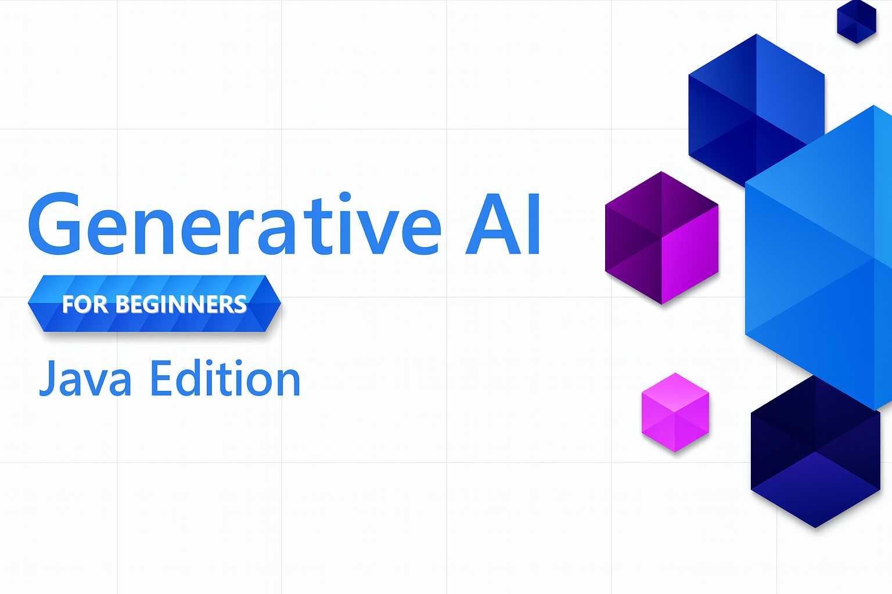

<!--
CO_OP_TRANSLATOR_METADATA:
{
  "original_hash": "a49b35508745c032a0033d914df7901b",
  "translation_date": "2025-07-25T10:13:33+00:00",
  "source_file": "README.md",
  "language_code": "sl"
}
-->
# Generativna umetna inteligenca za začetnike - Java izdaja

**Časovna zaveza**: Celotno delavnico lahko dokončate na spletu brez lokalne nastavitve. Če želite zagnati primere, nastavitev okolja traja 2 minuti, raziskovanje primerov pa zahteva 1-3 ure, odvisno od globine raziskovanja.

> **Hiter začetek**

1. Forkajte to repozitorij na svoj GitHub račun
2. Kliknite **Code** → zavihek **Codespaces** → **...** → **New with options...**
3. Uporabite privzete nastavitve – to bo izbralo razvojni vsebnik, ustvarjen za ta tečaj
4. Kliknite **Create codespace**
5. Počakajte približno 2 minuti, da je okolje pripravljeno
6. Takoj nadaljujte na [Ustvarjanje vašega GitHub Models žetona](./02-SetupDevEnvironment/README.md#step-2-create-a-github-personal-access-token)

## Podpora za več jezikov

### Podprto prek GitHub Action (Avtomatizirano in vedno posodobljeno)

[Francoščina](../fr/README.md) | [Španščina](../es/README.md) | [Nemščina](../de/README.md) | [Ruščina](../ru/README.md) | [Arabščina](../ar/README.md) | [Perzijščina (Farsi)](../fa/README.md) | [Urdu](../ur/README.md) | [Kitajščina (poenostavljena)](../zh/README.md) | [Kitajščina (tradicionalna, Macao)](../mo/README.md) | [Kitajščina (tradicionalna, Hong Kong)](../hk/README.md) | [Kitajščina (tradicionalna, Tajvan)](../tw/README.md) | [Japonščina](../ja/README.md) | [Korejščina](../ko/README.md) | [Hindijščina](../hi/README.md) | [Bengalščina](../bn/README.md) | [Maratščina](../mr/README.md) | [Nepalščina](../ne/README.md) | [Pandžabščina (Gurmukhi)](../pa/README.md) | [Portugalščina (Portugalska)](../pt/README.md) | [Portugalščina (Brazilija)](../br/README.md) | [Italijanščina](../it/README.md) | [Poljščina](../pl/README.md) | [Turščina](../tr/README.md) | [Grščina](../el/README.md) | [Tajščina](../th/README.md) | [Švedščina](../sv/README.md) | [Danščina](../da/README.md) | [Norveščina](../no/README.md) | [Finščina](../fi/README.md) | [Nizozemščina](../nl/README.md) | [Hebrejščina](../he/README.md) | [Vietnamščina](../vi/README.md) | [Indonezijščina](../id/README.md) | [Malajščina](../ms/README.md) | [Tagalog (Filipino)](../tl/README.md) | [Svahili](../sw/README.md) | [Madžarščina](../hu/README.md) | [Češčina](../cs/README.md) | [Slovaščina](../sk/README.md) | [Romunščina](../ro/README.md) | [Bolgarščina](../bg/README.md) | [Srbščina (cirilica)](../sr/README.md) | [Hrvaščina](../hr/README.md) | [Slovenščina](./README.md) | [Ukrajinščina](../uk/README.md) | [Burmanščina (Mjanmar)](../my/README.md)

## Struktura tečaja in učna pot

### **Poglavje 1: Uvod v generativno umetno inteligenco**
- **Osnovni koncepti**: Razumevanje velikih jezikovnih modelov, tokenov, vektorskih predstavitev in zmogljivosti umetne inteligence
- **Java AI ekosistem**: Pregled Spring AI in OpenAI SDK-jev
- **Protokol konteksta modela**: Uvod v MCP in njegovo vlogo v komunikaciji AI agentov
- **Praktične aplikacije**: Resnični scenariji, vključno s klepetalniki in generiranjem vsebin
- **[→ Začnite poglavje 1](./01-IntroToGenAI/README.md)**

### **Poglavje 2: Nastavitev razvojnega okolja**
- **Konfiguracija več ponudnikov**: Nastavitev GitHub Models, Azure OpenAI in OpenAI Java SDK integracij
- **Spring Boot + Spring AI**: Najboljše prakse za razvoj AI aplikacij v podjetjih
- **GitHub Models**: Brezplačen dostop do AI modelov za prototipiranje in učenje (brez kreditne kartice)
- **Razvojna orodja**: Konfiguracija Docker vsebnikov, VS Code in GitHub Codespaces
- **[→ Začnite poglavje 2](./02-SetupDevEnvironment/README.md)**

### **Poglavje 3: Osnovne tehnike generativne umetne inteligence**
- **Inženiring pozivov**: Tehnike za optimalne odgovore AI modelov
- **Vektorske predstavitve in operacije**: Implementacija semantičnega iskanja in ujemanja podobnosti
- **Generacija z obogatitvijo pridobivanja (RAG)**: Združevanje AI z lastnimi viri podatkov
- **Klicanje funkcij**: Razširitev zmogljivosti AI z orodji in vtičniki po meri
- **[→ Začnite poglavje 3](./03-CoreGenerativeAITechniques/README.md)**

### **Poglavje 4: Praktične aplikacije in projekti**
- **Generator zgodb o hišnih ljubljenčkih** (`petstory/`): Ustvarjanje kreativnih vsebin z GitHub Models
- **Foundry lokalna predstavitev** (`foundrylocal/`): Lokalna integracija AI modelov z OpenAI Java SDK
- **MCP kalkulatorska storitev** (`mcp/calculator/`): Osnovna implementacija protokola konteksta modela s Spring AI
- **[→ Začnite poglavje 4](./04-PracticalSamples/README.md)**

### **Poglavje 5: Odgovoren razvoj umetne inteligence**
- **Varnost GitHub Models**: Testiranje vgrajenega filtriranja vsebin in varnostnih mehanizmov
- **Predstavitev odgovorne AI**: Praktičen primer, ki prikazuje delovanje varnostnih filtrov AI
- **Najboljše prakse**: Ključne smernice za etični razvoj in uvajanje AI
- **[→ Začnite poglavje 5](./05-ResponsibleGenAI/README.md)**

## Dodatni viri

- [AI agenti za začetnike](https://github.com/microsoft/ai-agents-for-beginners)
- [Generativna umetna inteligenca za začetnike z uporabo .NET](https://github.com/microsoft/Generative-AI-for-beginners-dotnet)
- [Generativna umetna inteligenca za začetnike z uporabo JavaScript](https://github.com/microsoft/generative-ai-with-javascript)
- [Generativna umetna inteligenca za začetnike](https://github.com/microsoft/generative-ai-for-beginners)
- [Strojno učenje za začetnike](https://aka.ms/ml-beginners)
- [Podatkovna znanost za začetnike](https://aka.ms/datascience-beginners)
- [Umetna inteligenca za začetnike](https://aka.ms/ai-beginners)
- [Kibernetska varnost za začetnike](https://github.com/microsoft/Security-101)
- [Spletni razvoj za začetnike](https://aka.ms/webdev-beginners)
- [IoT za začetnike](https://aka.ms/iot-beginners)
- [XR razvoj za začetnike](https://github.com/microsoft/xr-development-for-beginners)
- [Obvladovanje GitHub Copilot za AI programiranje v paru](https://aka.ms/GitHubCopilotAI)
- [Obvladovanje GitHub Copilot za razvijalce C#/.NET](https://github.com/microsoft/mastering-github-copilot-for-dotnet-csharp-developers)
- [Izberite svojo Copilot pustolovščino](https://github.com/microsoft/CopilotAdventures)
- [RAG klepetalna aplikacija z Azure AI storitvami](https://github.com/Azure-Samples/azure-search-openai-demo-java)

**Omejitev odgovornosti**:  
Ta dokument je bil preveden z uporabo storitve AI za prevajanje [Co-op Translator](https://github.com/Azure/co-op-translator). Čeprav si prizadevamo za natančnost, vas prosimo, da upoštevate, da lahko avtomatizirani prevodi vsebujejo napake ali netočnosti. Izvirni dokument v njegovem maternem jeziku je treba obravnavati kot avtoritativni vir. Za ključne informacije priporočamo profesionalni človeški prevod. Ne prevzemamo odgovornosti za morebitne nesporazume ali napačne razlage, ki bi nastale zaradi uporabe tega prevoda.