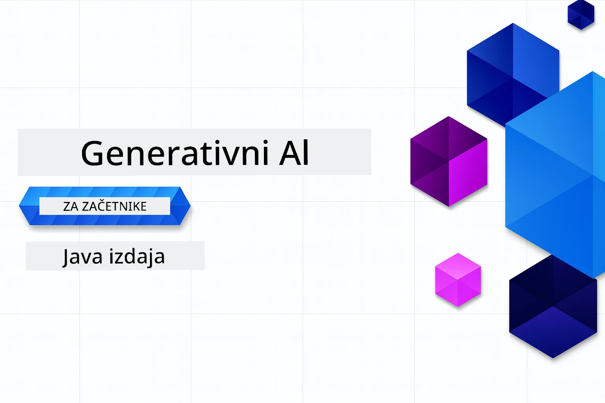

# Generativna AI za začetnike - Java izdaja
[](https://discord.gg/nTYy5BXMWG)



**Časovna obveza**: Cel delavnico lahko dokončate na daljavo brez lokalne namestitve. Nastavitev okolja traja 2 minuti, raziskovanje primerov pa od 1 do 3 ure, odvisno od globine raziskovanja.

> **Hiter začetek** 

1. Razvezi ta repozitorij na svoj GitHub račun
2. Klikni **Code** → zavihek **Codespaces** → **...** → **Novo z možnostmi...**
3. Uporabi privzete nastavitve – to bo izbralo razvojni kontejner, ustvarjen za ta tečaj
4. Klikni **Create codespace**
5. Počakaj približno 2 minuti, da bo okolje pripravljeno
6. Pojdi neposredno na [Prvi primer](./02-SetupDevEnvironment/README.md#step-2-create-a-github-personal-access-token)

## Podpora za več jezikov

### Podprto z GitHub Action (avtomatizirano in vedno posodobljeno)

<!-- CO-OP TRANSLATOR LANGUAGES TABLE START -->
[Arabščina](../ar/README.md) | [Bengalski](../bn/README.md) | [Bolgarščina](../bg/README.md) | [Burmanski (Mjanmar)](../my/README.md) | [Kitajščina (poenostavljena)](../zh-CN/README.md) | [Kitajščina (tradicionalna, Hong Kong)](../zh-HK/README.md) | [Kitajščina (tradicionalna, Macau)](../zh-MO/README.md) | [Kitajščina (tradicionalna, Tajvan)](../zh-TW/README.md) | [Hrvaščina](../hr/README.md) | [Češčina](../cs/README.md) | [Danščina](../da/README.md) | [Nizozemščina](../nl/README.md) | [Estonščina](../et/README.md) | [Finščina](../fi/README.md) | [Francoščina](../fr/README.md) | [Nemščina](../de/README.md) | [Grščina](../el/README.md) | [Hebrejščina](../he/README.md) | [Hindijščina](../hi/README.md) | [Madžarščina](../hu/README.md) | [Indonezijščina](../id/README.md) | [Italijanščina](../it/README.md) | [Japonščina](../ja/README.md) | [Kannada](../kn/README.md) | [Khmer](../km/README.md) | [Korejščina](../ko/README.md) | [Litvijščina](../lt/README.md) | [Malajščina](../ms/README.md) | [Malajalščina](../ml/README.md) | [Marathi](../mr/README.md) | [Nepalščina](../ne/README.md) | [Nigerijski pidžin](../pcm/README.md) | [Norveščina](../no/README.md) | [Perzijščina (Farsi)](../fa/README.md) | [Poljščina](../pl/README.md) | [Portugalščina (Brazilija)](../pt-BR/README.md) | [Portugalščina (Portugalska)](../pt-PT/README.md) | [Pandžabi (Gurmukhi)](../pa/README.md) | [Romunščina](../ro/README.md) | [Ruščina](../ru/README.md) | [Srbščina (cirilica)](../sr/README.md) | [Slovaščina](../sk/README.md) | [Slovenščina](./README.md) | [Španščina](../es/README.md) | [Svahelščina](../sw/README.md) | [Švedščina](../sv/README.md) | [Tagalog (Filipino)](../tl/README.md) | [Tamilščina](../ta/README.md) | [Telugu](../te/README.md) | [Tajščina](../th/README.md) | [Turščina](../tr/README.md) | [Ukrajinščina](../uk/README.md) | [Urdu](../ur/README.md) | [Vietnamščina](../vi/README.md)

> **Raje klonirati lokalno?**
>
> Ta repozitorij vključuje več kot 50 prevodov jezikov, kar znatno poveča velikost prenosa. Za kloniranje brez prevodov uporabite sparse checkout:
>
> **Bash / macOS / Linux:**
> ```bash
> git clone --filter=blob:none --sparse https://github.com/microsoft/Generative-AI-for-beginners-java.git
> cd Generative-AI-for-beginners-java
> git sparse-checkout set --no-cone '/*' '!translations' '!translated_images'
> ```
>
> **CMD (Windows):**
> ```cmd
> git clone --filter=blob:none --sparse https://github.com/microsoft/Generative-AI-for-beginners-java.git
> cd Generative-AI-for-beginners-java
> git sparse-checkout set --no-cone "/*" "!translations" "!translated_images"
> ```
>
> To vam omogoča, da imate vse potrebno za dokončanje tečaja s hitrejšim prenosom.
<!-- CO-OP TRANSLATOR LANGUAGES TABLE END -->

## Struktura tečaja in učna pot

### **1. poglavje: Uvod v generativno AI**
- **Osnovni koncepti**: Razumevanje velikih jezikovnih modelov, tokenov, vdelav in zmogljivosti AI
- **Java AI ekosistem**: Pregled Spring AI in OpenAI SDK
- **Protokol konteksta modela**: Uvod v MCP in njegova vloga pri komunikaciji AI agentov
- **Praktične uporabe**: Resnični scenariji, vključno z chatbot-i in generiranjem vsebin
- **[→ Začni 1. poglavje](./01-IntroToGenAI/README.md)**

### **2. poglavje: Nastavitev razvojnega okolja**
- **Konfiguracija več ponudnikov**: Nastavitev GitHub modelov, Azure OpenAI in OpenAI Java SDK integracij
- **Spring Boot + Spring AI**: Najboljše prakse za razvoj AI aplikacij na ravni podjetja
- **GitHub modeli**: Brezplačen dostop do AI modelov za prototipiranje in učenje (brez kreditne kartice)
- **Razvojna orodja**: Docker kontejnerji, VS Code in konfiguracija GitHub Codespaces
- **[→ Začni 2. poglavje](./02-SetupDevEnvironment/README.md)**

### **3. poglavje: Osnovne tehnike generativne AI**
- **Inženiring pozivov**: Tehnike za optimalne odzive AI modelov
- **Vdelave in vektorske operacije**: Implementacija semantičnega iskanja in ujemanja podobnosti
- **Retrieval-Augmented Generation (RAG)**: Združevanje AI z vašimi podatkovnimi viri
- **Klicanje funkcij**: Razširite zmožnosti AI s prilagojenimi orodji in vtičniki
- **[→ Začni 3. poglavje](./03-CoreGenerativeAITechniques/README.md)**

### **4. poglavje: Praktične uporabe in projekti**
- **Generator zgodb o hišnih ljubljenčkih** (`petstory/`): Kreativno generiranje vsebin z GitHub modeli
- **Foundry lokalni demo** (`foundrylocal/`): Lokalna integracija AI modelov z OpenAI Java SDK
- **Storitev za izračun MCP** (`calculator/`): Osnovna implementacija Model Context Protocol z Spring AI
- **[→ Začni 4. poglavje](./04-PracticalSamples/README.md)**

### **5. poglavje: Odgovoren razvoj AI**
- **Varnost GitHub modelov**: Testiranje vgrajenih mehanizmov za filtriranje vsebine in varnost (trdi bloki in mehki zavrnitve)
- **Demo odgovorne AI**: Praktičen primer, ki prikazuje delovanje sodobnih varnostnih sistemov AI
- **Najboljše prakse**: Osnovna navodila za etičen razvoj in uvajanje AI
- **[→ Začni 5. poglavje](./05-ResponsibleGenAI/README.md)**

## Dodatni viri

<!-- CO-OP TRANSLATOR OTHER COURSES START -->
### LangChain
[](https://aka.ms/langchain4j-for-beginners)
[](https://aka.ms/langchainjs-for-beginners?WT.mc_id=m365-94501-dwahlin)
[](https://github.com/microsoft/langchain-for-beginners?WT.mc_id=m365-94501-dwahlin)
---

### Azure / Edge / MCP / Agenti
[](https://github.com/microsoft/AZD-for-beginners?WT.mc_id=academic-105485-koreyst)
[](https://github.com/microsoft/edgeai-for-beginners?WT.mc_id=academic-105485-koreyst)
[](https://github.com/microsoft/mcp-for-beginners?WT.mc_id=academic-105485-koreyst)
[](https://github.com/microsoft/ai-agents-for-beginners?WT.mc_id=academic-105485-koreyst)

---
 
### Serija o generativni AI
[](https://github.com/microsoft/generative-ai-for-beginners?WT.mc_id=academic-105485-koreyst)
[-9333EA?style=for-the-badge&labelColor=E5E7EB&color=9333EA)](https://github.com/microsoft/Generative-AI-for-beginners-dotnet?WT.mc_id=academic-105485-koreyst)
[-C084FC?style=for-the-badge&labelColor=E5E7EB&color=C084FC)](https://github.com/microsoft/generative-ai-for-beginners-java?WT.mc_id=academic-105485-koreyst)
[-E879F9?style=for-the-badge&labelColor=E5E7EB&color=E879F9)](https://github.com/microsoft/generative-ai-with-javascript?WT.mc_id=academic-105485-koreyst)

---
 
### Osnovno učenje
[](https://aka.ms/ml-beginners?WT.mc_id=academic-105485-koreyst)
[](https://aka.ms/datascience-beginners?WT.mc_id=academic-105485-koreyst)
[](https://aka.ms/ai-beginners?WT.mc_id=academic-105485-koreyst)
[](https://github.com/microsoft/Security-101?WT.mc_id=academic-96948-sayoung)

[](https://aka.ms/webdev-beginners?WT.mc_id=academic-105485-koreyst)
[](https://aka.ms/iot-beginners?WT.mc_id=academic-105485-koreyst)
[](https://github.com/microsoft/xr-development-for-beginners?WT.mc_id=academic-105485-koreyst)

---
 
### Serija Copilot
[](https://aka.ms/GitHubCopilotAI?WT.mc_id=academic-105485-koreyst)
[](https://github.com/microsoft/mastering-github-copilot-for-dotnet-csharp-developers?WT.mc_id=academic-105485-koreyst)
[](https://github.com/microsoft/CopilotAdventures?WT.mc_id=academic-105485-koreyst)
<!-- CO-OP TRANSLATOR OTHER COURSES END -->

## Pridobivanje pomoči

Če se zataknete ali imate kakršnakoli vprašanja o gradnji AI aplikacij, se pridružite drugim učečim se in izkušenim razvijalcem v razpravah o MCP. To je podpirajoča skupnost, kjer so vprašanja dobrodošla in kjer se znanje prostovoljno deli.

[](https://discord.gg/nTYy5BXMWG)

Če imate povratne informacije o izdelku ali napake med gradnjo, obiščite:

[](https://aka.ms/foundry/forum)

---

<!-- CO-OP TRANSLATOR DISCLAIMER START -->
**Omejitev odgovornosti**:
Ta dokument je bil preveden z uporabo storitve za prevajanje z umetno inteligenco [Co-op Translator](https://github.com/Azure/co-op-translator). Čeprav si prizadevamo za natančnost, vas prosimo, da upoštevate, da lahko avtomatizirani prevodi vsebujejo napake ali netočnosti. Izvirni dokument v njegovem izvorno jeziku je treba upoštevati kot avtoritativni vir. Za kritične informacije je priporočljiv strokovni človeški prevod. Za kakršne koli nesporazume ali napačne razlage, ki izhajajo iz uporabe tega prevoda, ne odgovarjamo.
<!-- CO-OP TRANSLATOR DISCLAIMER END -->