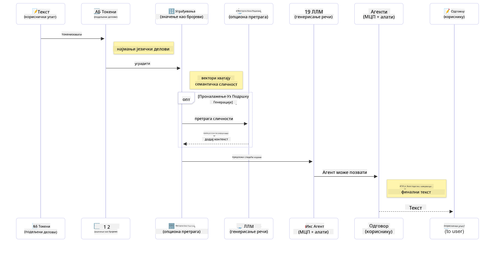

<!--
CO_OP_TRANSLATOR_METADATA:
{
  "original_hash": "6d8b4a0d774dc2a1e97c95859a6d6e4b",
  "translation_date": "2025-07-21T21:48:19+00:00",
  "source_file": "01-IntroToGenAI/README.md",
  "language_code": "sr"
}
-->
# Увод у Генеративну Вештачку Интелигенцију - Јава издање

## Шта ћете научити

- **Основе генеративне вештачке интелигенције**, укључујући LLM-ове, инжењеринг упита, токене, ембедингсе и векторске базе података  
- **Поређење алата за развој вештачке интелигенције у Јави**, укључујући Azure OpenAI SDK, Spring AI и OpenAI Java SDK  
- **Откривање Протокола Контекста Модела** и његове улоге у комуникацији AI агената  

## Садржај

- [Увод](../../../01-IntroToGenAI)  
- [Брзо освежавање концепата генеративне вештачке интелигенције](../../../01-IntroToGenAI)  
- [Преглед инжењеринга упита](../../../01-IntroToGenAI)  
- [Токени, ембедингси и агенти](../../../01-IntroToGenAI)  
- [Алатке и библиотеке за развој вештачке интелигенције у Јави](../../../01-IntroToGenAI)  
  - [OpenAI Java SDK](../../../01-IntroToGenAI)  
  - [Spring AI](../../../01-IntroToGenAI)  
  - [Azure OpenAI Java SDK](../../../01-IntroToGenAI)  
- [Резиме](../../../01-IntroToGenAI)  
- [Следећи кораци](../../../01-IntroToGenAI)  

## Увод

Добродошли у прво поглавље Генеративне Вештачке Интелигенције за почетнике - Јава издање! Ова основна лекција вас уводи у кључне концепте генеративне вештачке интелигенције и како да радите са њима користећи Јаву. Научићете о основним градивним елементима AI апликација, укључујући Велике Језичке Моделе (LLM-ове), токене, ембедингсе и AI агенте. Такође ћемо истражити примарне алате за Јаву које ћете користити током овог курса.

### Брзо освежавање концепата генеративне вештачке интелигенције

Генеративна вештачка интелигенција је врста вештачке интелигенције која ствара нови садржај, као што су текст, слике или код, на основу образаца и односа научених из података. Модели генеративне вештачке интелигенције могу генерисати одговоре сличне људским, разумети контекст и понекад чак креирати садржај који изгледа као да га је створио човек.

Док развијате своје Јава AI апликације, радићете са **моделима генеративне вештачке интелигенције** за креирање садржаја. Неке од могућности ових модела укључују:

- **Генерисање текста**: Креирање текста сличног људском за чет-ботове, садржај и довршавање текста.  
- **Генерисање и анализа слика**: Производња реалистичних слика, побољшање фотографија и препознавање објеката.  
- **Генерисање кода**: Писање делова кода или скрипти.  

Постоје специфични типови модела који су оптимизовани за различите задатке. На пример, и **Мали Језички Модели (SLM-ови)** и **Велики Језички Модели (LLM-ови)** могу обрађивати генерисање текста, при чему LLM-ови обично пружају боље перформансе за сложене задатке. За задатке везане за слике, користе се специјализовани модели за визију или мултимодални модели.

Наравно, одговори ових модела нису увек савршени. Вероватно сте чули за то да модели "халуцинирају" или генеришу нетачне информације на ауторитативан начин. Али можете помоћи моделу да генерише боље одговоре пружањем јасних инструкција и контекста. Овде долази до изражаја **инжењеринг упита**.

#### Преглед инжењеринга упита

Инжењеринг упита је пракса дизајнирања ефикасних уноса како би се AI модели усмерили ка жељеним излазима. То укључује:

- **Јасноћу**: Прављење инструкција јасним и недвосмисленим.  
- **Контекст**: Пружање неопходних информација у позадини.  
- **Ограничења**: Навођење било каквих ограничења или формата.  

Неки од најбољих приступа за инжењеринг упита укључују дизајн упита, јасне инструкције, разлагање задатака, учење из једног или неколико примера и подешавање упита. Тестирање различитих упита је кључно како бисте пронашли оно што најбоље функционише за ваш конкретан случај употребе.

Када развијате апликације, радићете са различитим типовима упита:  
- **Системски упити**: Постављају основна правила и контекст за понашање модела  
- **Кориснички упити**: Улазни подаци од корисника ваше апликације  
- **Асистентски упити**: Одговори модела засновани на системским и корисничким упитима  

> **Сазнајте више**: Сазнајте више о инжењерингу упита у [поглављу о инжењерингу упита курса GenAI за почетнике](https://github.com/microsoft/generative-ai-for-beginners/tree/main/04-prompt-engineering-fundamentals)

#### Токени, ембедингси и агенти

Када радите са моделима генеративне вештачке интелигенције, сусретаћете се са терминима као што су **токени**, **ембедингси**, **агенти** и **Протокол Контекста Модела (MCP)**. Ево детаљног прегледа ових концепата:

- **Токени**: Токени су најмање јединице текста у моделу. Они могу бити речи, карактери или делови речи. Токени се користе за представљање текстуалних података у формату који модел може разумети. На пример, реченица "The quick brown fox jumped over the lazy dog" може бити токенизована као ["The", " quick", " brown", " fox", " jumped", " over", " the", " lazy", " dog"] или ["The", " qu", "ick", " br", "own", " fox", " jump", "ed", " over", " the", " la", "zy", " dog"] у зависности од стратегије токенизације.

Токенизација је процес разбијања текста на ове мање јединице. Ово је кључно јер модели раде са токенима, а не са сировим текстом. Број токена у упиту утиче на дужину и квалитет одговора модела, јер модели имају ограничења у броју токена у контексту (нпр. 128К токена за укупни контекст GPT-4o, укључујући улаз и излаз).

  У Јави, можете користити библиотеке као што је OpenAI SDK за аутоматско руковање токенизацијом приликом слања захтева моделима вештачке интелигенције.

- **Ембедингси**: Ембедингси су векторске репрезентације токена које хватају семантичко значење. Они су нумеричке репрезентације (обично низови бројева са покретним зарезом) које омогућавају моделима да разумеју односе између речи и генеришу контекстуално релевантне одговоре. Сличне речи имају сличне ембедингсе, што омогућава моделу да разуме концепте као што су синоними и семантички односи.

  У Јави, можете генерисати ембедингсе користећи OpenAI SDK или друге библиотеке које подржавају генерисање ембедингса. Ови ембедингси су кључни за задатке као што је семантичка претрага, где желите да пронађете сличан садржај на основу значења, а не тачног подударања текста.

- **Векторске базе података**: Векторске базе података су специјализовани системи за складиштење оптимизовани за ембедингсе. Оне омогућавају ефикасну претрагу сличности и кључне су за обрасце Генерисања уз Помоћ Претраживања (RAG), где је потребно пронаћи релевантне информације из великих скупова података на основу семантичке сличности, а не тачних подударања.

> **Напомена**: У овом курсу нећемо покривати векторске базе података, али сматрамо да их вреди поменути јер се често користе у стварним апликацијама.

- **Агенти и MCP**: AI компоненте које аутономно комуницирају са моделима, алатима и спољним системима. Протокол Контекста Модела (MCP) пружа стандардизован начин за агенте да безбедно приступају спољним изворима података и алатима. Сазнајте више у нашем курсу [MCP за почетнике](https://github.com/microsoft/mcp-for-beginners).

У Јава AI апликацијама, користићете токене за обраду текста, ембедингсе за семантичку претрагу и RAG, векторске базе података за преузимање података и агенте са MCP-ом за изградњу интелигентних система који користе алате.

### Алатке и библиотеке за развој вештачке интелигенције у Јави

Јава нуди одличне алате за развој вештачке интелигенције. Постоје три главне библиотеке које ћемо истражити током овог курса - OpenAI Java SDK, Azure OpenAI SDK и Spring AI.

Ево брзе референтне табеле која показује који SDK се користи у примерима сваког поглавља:

| Поглавље | Пример | SDK |
|----------|--------|-----|
| 02-SetupDevEnvironment | src/github-models/ | OpenAI Java SDK |
| 02-SetupDevEnvironment | src/basic-chat-azure/ | Spring AI Azure OpenAI |
| 03-CoreGenerativeAITechniques | examples/ | Azure OpenAI SDK |
| 04-PracticalSamples | petstory/ | OpenAI Java SDK |
| 04-PracticalSamples | foundrylocal/ | OpenAI Java SDK |
| 04-PracticalSamples | mcp/calculator/ | Spring AI MCP SDK + LangChain4j |

**Линкови за документацију SDK-ова:**  
- [Azure OpenAI Java SDK](https://github.com/Azure/azure-sdk-for-java/tree/azure-ai-openai_1.0.0-beta.16/sdk/openai/azure-ai-openai)  
- [Spring AI](https://docs.spring.io/spring-ai/reference/)  
- [OpenAI Java SDK](https://github.com/openai/openai-java)  
- [LangChain4j](https://docs.langchain4j.dev/)  

#### OpenAI Java SDK

OpenAI SDK је званична Јава библиотека за OpenAI API. Пружа једноставан и конзистентан интерфејс за интеракцију са OpenAI моделима, што олакшава интеграцију AI могућности у Јава апликације. Пример GitHub модела из поглавља 2, апликација Pet Story из поглавља 4 и пример Foundry Local демонстрирају приступ OpenAI SDK-у.

#### Spring AI

Spring AI је свеобухватан оквир који доноси AI могућности у Spring апликације, пружајући конзистентан апстракциони слој преко различитих AI провајдера. Беспрекорно се интегрише са Spring екосистемом, што га чини идеалним избором за предузећа која користе Јава апликације са AI могућностима.

Снага Spring AI-а лежи у његовој беспрекорној интеграцији са Spring екосистемом, што олакшава изградњу продукцијски спремних AI апликација са познатим Spring обрасцима као што су убризгавање зависности, управљање конфигурацијом и оквири за тестирање. Користићете Spring AI у поглављима 2 и 4 за изградњу апликација које користе и OpenAI и библиотеке Spring AI за Протокол Контекста Модела (MCP).

##### Протокол Контекста Модела (MCP)

[Протокол Контекста Модела (MCP)](https://modelcontextprotocol.io/) је нови стандард који омогућава AI апликацијама да безбедно комуницирају са спољним изворима података и алатима. MCP пружа стандардизован начин за AI моделе да приступају контекстуалним информацијама и извршавају акције у вашим апликацијама.

У поглављу 4, изградићете једноставну MCP услугу калкулатора која демонстрира основе Протокола Контекста Модела са Spring AI-ом, показујући како да креирате основне интеграције алата и архитектуре услуга.

#### Azure OpenAI Java SDK

Azure OpenAI клијентска библиотека за Јаву је адаптација OpenAI REST API-ја која пружа идиоматски интерфејс и интеграцију са остатком Azure SDK екосистема. У поглављу 3, изградићете апликације користећи Azure OpenAI SDK, укључујући чет апликације, позивање функција и обрасце RAG (Генерисање уз Помоћ Претраживања).

> Напомена: Azure OpenAI SDK заостаје за OpenAI Java SDK-ом у погледу функција, па за будуће пројекте размотрите коришћење OpenAI Java SDK-а.

## Резиме

**Честитамо!** Успешно сте:  

- **Научили основе генеративне вештачке интелигенције**, укључујући LLM-ове, инжењеринг упита, токене, ембедингсе и векторске базе података  
- **Упоредили алате за развој вештачке интелигенције у Јави**, укључујући Azure OpenAI SDK, Spring AI и OpenAI Java SDK  
- **Открили Протокол Контекста Модела** и његову улогу у комуникацији AI агената  

## Следећи кораци

[Поглавље 2: Постављање развојног окружења](../02-SetupDevEnvironment/README.md)  

**Одрицање од одговорности**:  
Овај документ је преведен коришћењем услуге за превођење помоћу вештачке интелигенције [Co-op Translator](https://github.com/Azure/co-op-translator). Иако се трудимо да обезбедимо тачност, молимо вас да имате у виду да аутоматски преводи могу садржати грешке или нетачности. Оригинални документ на његовом изворном језику треба сматрати меродавним извором. За критичне информације препоручује се професионални превод од стране људи. Не преузимамо одговорност за било каква погрешна тумачења или неспоразуме који могу настати услед коришћења овог превода.