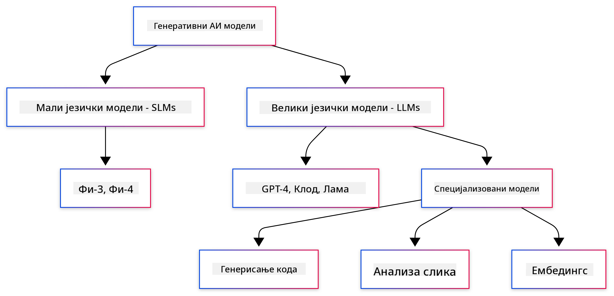
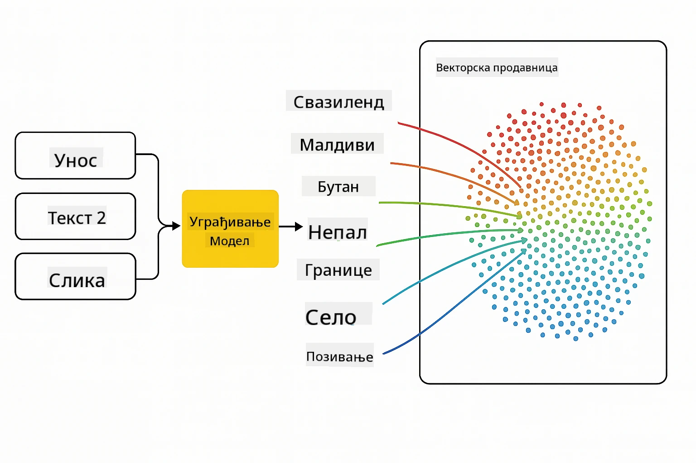
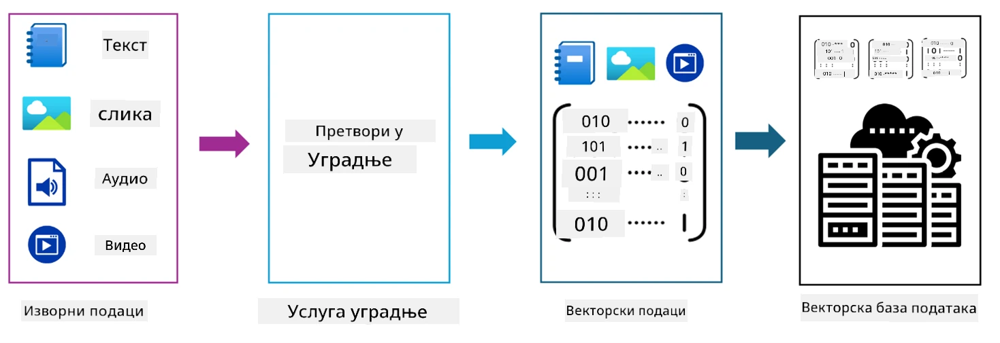
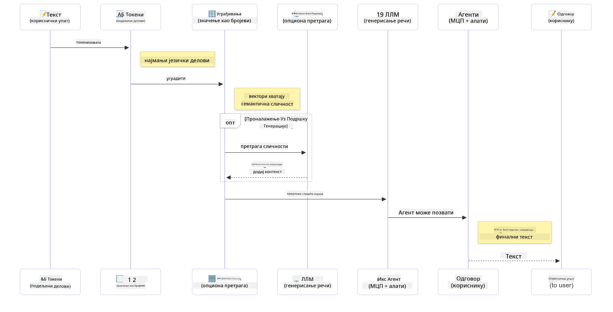

# Увод у генеративну вештачку интелигенцију - Java издање

> **Видео**: [Погледајте видео преглед ове лекције на YouTube-у.](https://www.youtube.com/watch?v=XH46tGp_eSw) Такође можете кликнути на сличицу изнад.

## Шта ћете научити

- **Основе генеративне вештачке интелигенције** укључујући LLM-ове, инжењеринг упита, токене, уградње, и векторске базе података
- **Поређење Java алата за развој вештачке интелигенције** укључујући Azure OpenAI SDK, Spring AI, и OpenAI Java SDK
- **Откријте протокол контекста модела** и његову улогу у комуникацији AI агената

## Садржај

- [Увод](#увод)
- [Кратак осврт на концепте генеративне вештачке интелигенције](#кратак-осврт-на-концепте-генеративне-вештачке-интелигенције)
- [Преглед инжењеринга упита](#преглед-инжењеринга-упита)
- [Токени, уградње и агенти](#токени-уградње-и-агенти)
- [Алати и библиотеке за развој AI у Јави](#алати-и-библиотеке-за-развој-ai-у-јави)
  - [OpenAI Java SDK](#openai-java-sdk)
  - [Spring AI](#spring-ai)
  - [Azure OpenAI Java SDK](#azure-openai-java-sdk)
- [Сажетак](#сажетак)
- [Следећи кораци](#следећи-корaци)

## Увод

Добродошли у прво поглавље генеративне вештачке интелигенције за почетнике - Java издање! Ова основна лекција уводи вас у кључне појмове генеративне вештачке интелигенције и како са њима радити користећи Јаву. Научићете о основним градивним блоковима AI апликација, укључујући велике језичке моделе (LLM-ове), токене, уградње и AI агенте. Такође ћемо истражити главне Java алате које ћете користити током овог курса.

### Кратак осврт на концепте генеративне вештачке интелигенције

Генеративна вештачка интелигенција је врста вештачке интелигенције која ствара нови садржај, као што су текст, слике или код, на основу образаца и односа научених из података. Генеративни AI модели могу генерисати одговоре сличне људским, разумети контекст и понекад чак створити садржај који делује људски.

Када развијате ваше Java AI апликације, радићете са **генеративним AI моделима** за креирање садржаја. Неке од могућности генеративних AI модела укључују:

- **Генерација текста**: Креирање текста сличног људском за четботове, садржај и допуну текста.
- **Генерација и анализа слика**: Производња реалистичних слика, побољшање фотографија и детекција објеката.
- **Генерација кода**: Писање исечака или скрипти кода.

Постоје специфичне врсте модела оптимизоване за различите задатке. На пример, и **мали језички модели (SLM-ови)** и **велики језички модели (LLM-ови)** могу обрадити генерисање текста, при чему LLM-ови обично пружају боље перформансе за сложене задатке. За задатке повезане са сликама користићете специјализоване визијске моделе или мултимодалне моделе.

Наравно, одговори ових модела нису увек савршени. Веројатно сте чули за моделе који "халуцинирају" или генеришу нетачне информације на ауторитетан начин. Али можете помоћи моделу да генерише боље одговоре дајући му јасна упутства и контекст. Овде улази у игру **инжењеринг упита**.

#### Преглед инжењеринга упита

Инжењеринг упита је пракса дизајнирања ефективних улазних података да би се AI модели усмерили ка жељеним резултатима. То обухвата:

- **Јасноћа**: Прављење упутстава јасним и недвосмисленим.
- **Контекст**: Пружање потребних позадинских информација.
- **Ограничења**: Налажење свих ограничења или формата.

Неколико најбољих пракси за инжењеринг упита укључују дизајн упита, јасна упутства, растављање задатка, учење са једним или неколико примера и подешавање упита. Испробавање различитих упита је кључно да бисте пронашли оно што најбоље ради за ваш конкретни случај.

При развоју апликација, радићете са различитим типовима упита:
- **Системски упити**: Постављају основна правила и контекст за понашање модела
- **Кориснички упити**: Улазни подаци од корисника ваше апликације
- **Помоћнички упити**: Одговори модела на основу системских и корисничких упита

> **Сазнајте више**: Сазнајте више о инжењерингу упита у [поглављу о инжењерингу упита у курсу Генеративна AI за почетнике](https://github.com/microsoft/generative-ai-for-beginners/tree/main/04-prompt-engineering-fundamentals)

#### Токени, уградње и агенти

Када радите са генеративним AI моделима, срећете термине као што су **токени**, **уградње**, **агенти** и **Протокол контекста модела (MCP)**. Ево детаљног прегледа ових појмова:

- **Токени**: Токени су најмања јединица текста у моделу. Могу бити речи, знакови или подсегменти речи. Токени се користе за представљање текстуалних података у формату који модел разуме. На пример, реченица "The quick brown fox jumped over the lazy dog" може бити токенизована као ["The", " quick", " brown", " fox", " jumped", " over", " the", " lazy", " dog"] или ["The", " qu", "ick", " br", "own", " fox", " jump", "ed", " over", " the", " la", "zy", " dog"] у зависности од стратегије токенизације.

Токенизација је процес раздвајања текста у ове мање јединице. Ово је веома важно јер модели раде са токенима, а не са сировим текстом. Број токена у упиту утиче на дужину и квалитет одговора модела, јер модели имају ограничења броја токена у рамцу контекста (нпр. 128К токена за укупни контекст GPT-4o, укључујући и улаз и излаз).

  У Јави можете користити библиотеке као што је OpenAI SDK за аутоматску обраду токенизације приликом слања захтева AI моделима.

- **Уградње (Embeddings)**: Уградње су векторске репрезентације токена које захватају семантичко значење. То су нумеричке репрезентације (обично низови бројева са покретним зарезом) које омогућавају моделу да разуме односе између речи и генерише контекстуално релевантне одговоре. Сличне речи имају сличне уградње, што омогућава моделу да разуме појмове као што су синоними и семантичке везе.

  У Јави можете генерисати уградње користећи OpenAI SDK или друге библиотеке које подржавају генерисање уградњи. Ове уградње су од суштинске важности за задатке као што је семантичко претраживање, где желите пронаћи сличан садржај на основу значења, а не тачног поклапања текста.

- **Векторске базе података**: Векторске базе података су специјализовани системи за чување оптимизовани за уградње. Омогућавају ефикасно претраживање по сличности и кључне су за патерне као што је Retrieval-Augmented Generation (RAG), где је потребно пронаћи релевантне информације из великих скуповa података на основу семантичке сличности, а не тачних поклапања.

> **Напомена**: У овом курсу нећемо покривати векторске базе података али сматрамо да их вреди поменути јер се често користе у стварним апликацијама.

- **Агенти и MCP**: AI компоненти који аутономно комуницирају са моделима, алатима и спољним системима. Протокол контекста модела (MCP) пружа стандардизован начин за агенте да безбедно приступају спољним изворима података и алатима. Сазнајте више у нашем курсу [MCP за почетнике](https://github.com/microsoft/mcp-for-beginners).

У Java AI апликацијама користићете токене за обраду текста, уградње за семантичко претраживање и RAG, векторске базе података за приступ подацима, и агенте са MCP за изградњу интелигентних система који користе алате.

### Алати и библиотеке за развој AI у Јави

Java нуди одличне алате за развој AI. Постоје три главне библиотеке које ћемо испитати током овог курса - OpenAI Java SDK, Azure OpenAI SDK, и Spring AI.

Ево брзе референтне табеле која показује који SDK се користи у примерима из сваког поглавља:

| Поглавље | Пример | SDK |
|---------|--------|-----|
| 02-SetupDevEnvironment | github-models | OpenAI Java SDK |
| 02-SetupDevEnvironment | basic-chat-azure | Spring AI Azure OpenAI |
| 03-CoreGenerativeAITechniques | examples | Azure OpenAI SDK |
| 04-PracticalSamples | petstory | OpenAI Java SDK |
| 04-PracticalSamples | foundrylocal | OpenAI Java SDK |
| 04-PracticalSamples | calculator | Spring AI MCP SDK + LangChain4j |

**Линкови до документације за SDK:**
- [Azure OpenAI Java SDK](https://github.com/Azure/azure-sdk-for-java/tree/azure-ai-openai_1.0.0-beta.16/sdk/openai/azure-ai-openai)
- [Spring AI](https://docs.spring.io/spring-ai/reference/)
- [OpenAI Java SDK](https://github.com/openai/openai-java)
- [LangChain4j](https://docs.langchain4j.dev/)

#### OpenAI Java SDK

OpenAI SDK је званична Java библиотека за OpenAI API. Пружа једноставан и доследан интерфејс за интеракцију са OpenAI моделима, олакшавајући интеграцију AI могућности у Java апликације. Пример GitHub модела из Поглавља 2, апликација Pet Story и пример Foundry Local из Поглавља 4 демонстрирају приступ OpenAI SDK-ја.

#### Spring AI

Spring AI је свеобухватан оквир који доноси AI могућности у Spring апликације, пружајући доследан слој апстракције преко различитих AI провајдера. Интегрише се беспрекорно у Spring екосистем, што га чини идеалним избором за пословне Java апликације којима су потребне AI могућности.

Снага Spring AI лежи у његовој беспрекорној интеграцији у Spring екосистем, омогућавајући вам лаку изградњу AI апликација спремних за производњу користећи познате Spring обрасце као што су dependency injection, управљање конфигурацијом, и тестирачки оквири. Користићете Spring AI у Поглављима 2 и 4 за изградњу апликација које користе OpenAI и Model Context Protocol (MCP) Spring AI библиотеке.

##### Протокол контекста модела (MCP)

[Протокол контекста модела (MCP)](https://modelcontextprotocol.io/) је нови стандард који омогућава AI апликацијама да безбедно комуницирају са спољним изворима података и алатима. MCP пружа стандардизован начин да AI модели приступају контекстуалним информацијама и извршавају акције у вашим апликацијама.

У Поглављу 4 направићете једноставну MCP услугу калкулатора која демонстрира основе протокола Model Context са Spring AI, показујући како направити основне интеграције алата и архитектуре сервиса.

#### Azure OpenAI Java SDK

Azure OpenAI клијент библиотека за Јаву је адаптација OpenAI REST API-ја која пружа идиоматски интерфејс и интеграцију са остатком Azure SDK екосистема. У Поглављу 3 правићете апликације користећи Azure OpenAI SDK, укључујући чет апликације, позив функција, и RAG (Retrieval-Augmented Generation) патерне.

> Напомена: Azure OpenAI SDK заостаје за OpenAI Java SDK-јем по питању функционалности, па за будуће пројекте размотрите коришћење OpenAI Java SDK.

## Сажетак

То би било то за основе! Сада разумете:

- Кључне појмове генеративне вештачке интелигенције - од LLM-ова и инжењеринга упита до токена, уградњи и векторских база података
- Опције вашег алатног скупа за Java AI развој: Azure OpenAI SDK, Spring AI и OpenAI Java SDK
- Шта је Протокол контекста модела и како омогућава AI агентима да раде са спољним алатима

## Следећи корaци

[Поглавље 2: Постављање окружења за развој](../02-SetupDevEnvironment/README.md)

---

<!-- CO-OP TRANSLATOR DISCLAIMER START -->
**Изјава о одрицању од одговорности**:  
Овај документ је преведен коришћењем AI услуге превођења [Co-op Translator](https://github.com/Azure/co-op-translator). Док тежимо прецизности, молимо имајте у виду да аутоматски преводи могу садржати грешке или нетачности. Оригинални документ на његовом изворном језику треба сматрати ауторитетним извором. За критичне информације препоручује се професионални људски превод. Не сносимо одговорност за било каква неспоразума или погрешне интерпретације које произлазе из коришћења овог превода.
<!-- CO-OP TRANSLATOR DISCLAIMER END -->