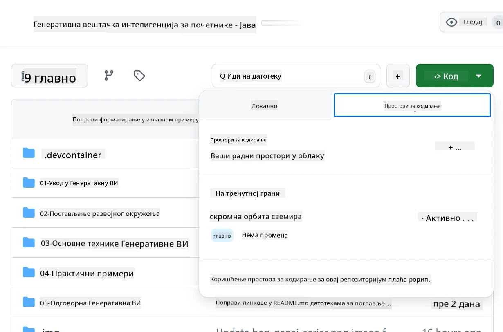
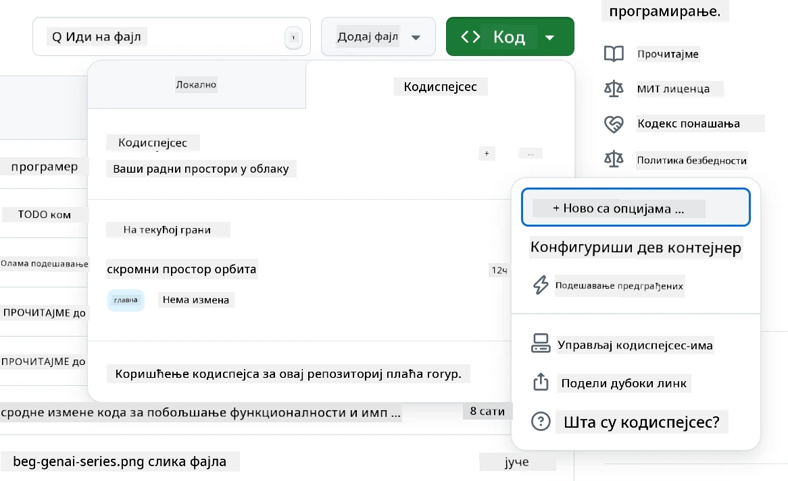
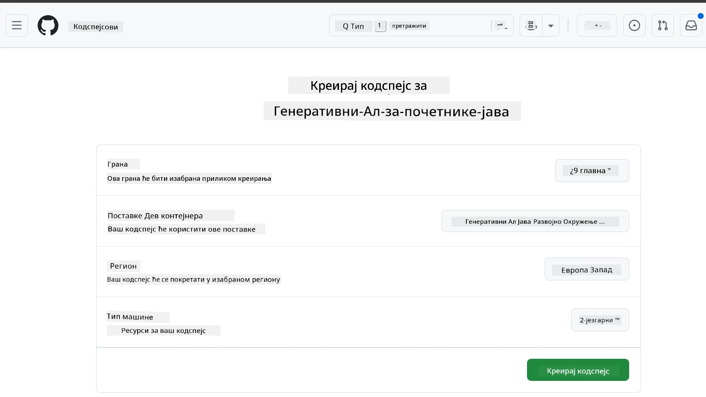
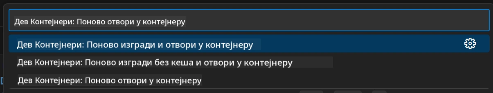
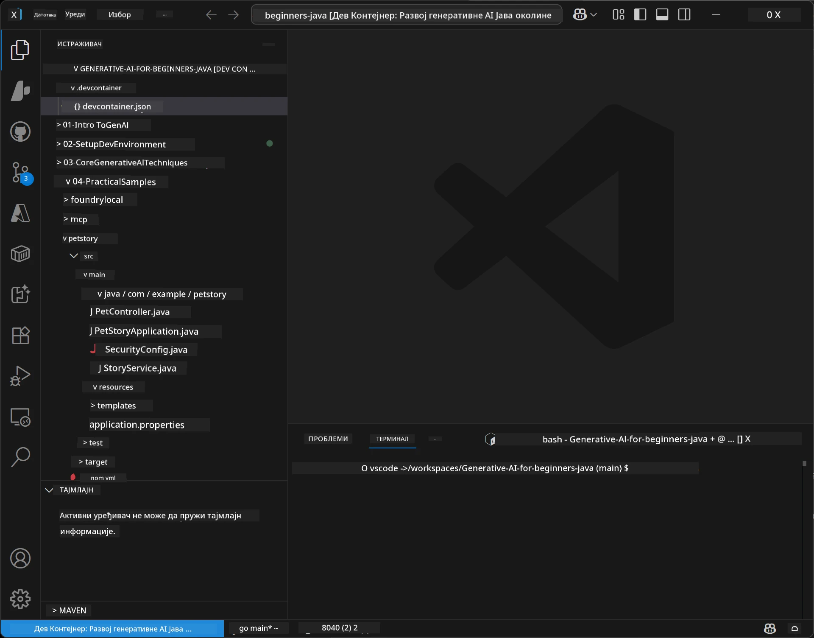
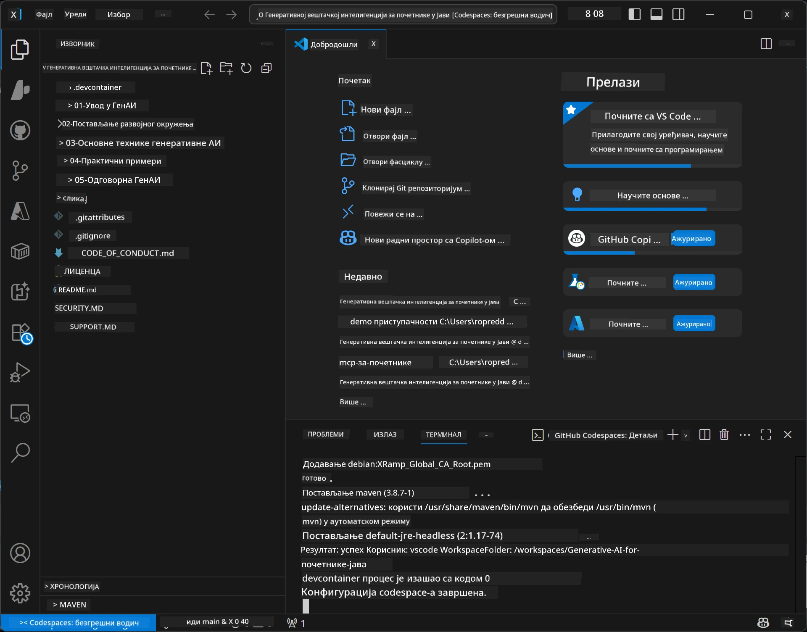

# Подешавање развојног окружења за Генеративни AI за Јава

> **Брзи почетак**: Кодирајте у облаку за 2 минута - Пређите на [GitHub Codespaces подешавање](../../../02-SetupDevEnvironment) - није потребна локална инсталација и користи github моделе!

> **Занимате се за Azure OpenAI?**, видите наш [Azure OpenAI водич за подешавање](getting-started-azure-openai.md) са корацима за креирање новог Azure OpenAI ресурса.

## Шта ћете научити

- Подешавање развојног окружења за Java AI апликације
- Избор и конфигурација омиљеног развојног окружења (cloud-first са Codespaces, локални дев контејнер или пуну локалну поставку)
- Тестирање окружења повезивањем са GitHub моделима

## Табела садржаја

- [Шта ћете научити](../../../02-SetupDevEnvironment)
- [Увод](../../../02-SetupDevEnvironment)
- [Корак 1: Подешавање развојног окружења](../../../02-SetupDevEnvironment)
  - [Опција A: GitHub Codespaces (препоручено)](../../../02-SetupDevEnvironment)
  - [Опција B: Локални дев контејнер](../../../02-SetupDevEnvironment)
  - [Опција C: Користите постојећу локалну инсталацију](../../../02-SetupDevEnvironment)
- [Корак 2: Креирање GitHub персоналног токена приступа](../../../02-SetupDevEnvironment)
- [Корак 3: Тестирање окружења](../../../02-SetupDevEnvironment)
- [Решавање проблема](../../../02-SetupDevEnvironment)
- [Резиме](../../../02-SetupDevEnvironment)
- [Следећи кораци](../../../02-SetupDevEnvironment)

## Увод

У овом поглављу водићемо вас кроз процес подешавања развојног окружења. Користићемо **GitHub Models** као примарни пример јер су бесплатни, лаки за подешавање само са GitHub налогом, нису потребне кредитне картице, и пружају приступ више модела за експериментисање.

**Није потребна локална инсталација!** Можете одмах почети са кодирањем користећи GitHub Codespaces, који пружа цело развојно окружење у вашем прегледачу.


Препоручујемо коришћење [**GitHub Models**](https://github.com/marketplace?type=models) за овај курс јер је:
- **Бесплатно** за почетак
- **Лако** за подешавање само са GitHub налогом
- **Није потребна кредитна картица**
- **Више модела** доступно за експериментисање

> **Напомена**: GitHub Models коришћени у овом тренингу имају следећа бесплатна ограничења:
> - 15 захтева по минути (150 дневно)
> - око 8,000 речи улазно, око 4,000 речи излазно по захтеву
> - 5 паралелних захтева
> 
> За продукциону употребу, надоградите на Azure AI Foundry Models са својим Azure налогом. Ваш код не мора да се мења. Погледајте [Azure AI Foundry документацију](https://learn.microsoft.com/azure/ai-foundry/foundry-models/how-to/quickstart-github-models).

## Корак 1: Подешавање развојног окружења

<a name="quick-start-cloud"></a>

Креирали смо претходно конфигурисан дев контејнер како бисмо минимизирали време поставке и осигурали да имате све неопходне алате за овај курс Генеративног AI за Јава. Изаберите жељени приступ развоју:

### Опције подешавања окружења:

#### Опција A: GitHub Codespaces (препоручено)

**Почните кодирање за 2 минута - није потребна локална инсталација!**

1. Форкујте овај репозиторијум на свој GitHub налог
   > **Напомена**: Ако желите да уредите основну конфигурацију, погледајте [Dev Container Configuration](../../../.devcontainer/devcontainer.json)
2. Кликните **Code** → таб **Codespaces** → **...** → **New with options...**
3. Користите подразумеване вредности – ово ће изабрати **Dev container configuration**: **Generative AI Java Development Environment** прилагођени дев контејнер креиран за овај курс
4. Кликните **Create codespace**
5. Сачекајте око 2 минута док се окружење не припреми
6. Наставите на [Корак 2: Креирање GitHub токена](../../../02-SetupDevEnvironment)







> **Предности Codespaces-а**:
> - Није потребна локална инсталација
> - Ради на било ком уређају са прегледачем
> - Предконфигурисан са свим алатима и зависностима
> - Бесплатно 60 сати месечно за личне налоге
> - Конзистентно окружење за све ученике

#### Опција B: Локални дев контејнер

**За програмере који преферирају локални развој са Docker-ом**

1. Форкујте и клонирајте овај репозиторијум на свој локални рачунар
   > **Напомена**: Ако желите да уредите основну конфигурацију, погледајте [Dev Container Configuration](../../../.devcontainer/devcontainer.json)
2. Инсталирајте [Docker Desktop](https://www.docker.com/products/docker-desktop/) и [VS Code](https://code.visualstudio.com/)
3. Инсталирајте [Dev Containers проширење](https://marketplace.visualstudio.com/items?itemName=ms-vscode-remote.remote-containers) у VS Code
4. Отворите фасциклу репозиторијума у VS Code
5. Када вам се понуди, кликните **Reopen in Container** (или користите `Ctrl+Shift+P` → "Dev Containers: Reopen in Container")
6. Сачекајте да контејнер изгради и покрене се
7. Наставите на [Корак 2: Креирање GitHub токена](../../../02-SetupDevEnvironment)





#### Опција C: Користите постојећу локалну инсталацију

**За програмере са постојећим Java окружењима**

Преуслови:
- [Java 21+](https://www.oracle.com/java/technologies/javase/jdk21-archive-downloads.html) 
- [Maven 3.9+](https://maven.apache.org/download.cgi)
- [VS Code](https://code.visualstudio.com) или омиљени IDE

Кораци:
1. Клонирајте овај репозиторијум на свој локални рачунар
2. Отворите пројекат у свом IDE-у
3. Наставите на [Корак 2: Креирање GitHub токена](../../../02-SetupDevEnvironment)

> **Трик за професионалце**: Ако имате рачунар са слабијим спецификацијама али желите VS Code локално, користите GitHub Codespaces! Можете повезати свој локални VS Code са cloud-hosted Codespace-ом за најбоље из оба света.



## Корак 2: Креирање GitHub персоналног токена приступа

1. Идите на [GitHub Settings](https://github.com/settings/profile) и одаберите **Settings** из свог профил менија.
2. У левом бочној траци кликните на **Developer settings** (обично на дну).
3. Под **Personal access tokens**, кликните на **Fine-grained tokens** (или пратите овај директни [линк](https://github.com/settings/personal-access-tokens)).
4. Кликните на **Generate new token**.
5. Под "Token name", унесите описно име (нпр. `GenAI-Java-Course-Token`).
6. Поставите датум истека (препоручено: 7 дана ради безбедности).
7. Под "Resource owner", изаберите свој кориснички налог.
8. Под "Repository access", изаберите репозиторијуме које желите користити са GitHub Models (или "All repositories" ако је потребно).
9. Под "Account permissions", пронађите **Models** и поставите га на **Read-only**.
10. Кликните **Generate token**.
11. **Сада копирајте и сачувајте свој токен** – нећете га поново видети!

> **Безбедносни савет**: Користите најмању потребну скалу и најкраћи практичан рок истека за ваше токене приступа.

## Корак 3: Тестирање окружења са примером GitHub Models

Када је ваше развојно окружење спремно, тестирајмо GitHub Models интеграцију са нашим примером апликације у [`02-SetupDevEnvironment/examples/github-models`](../../../02-SetupDevEnvironment/examples/github-models).

1. Отворите терминал у вашем развојном окружењу.
2. Идите у фасциклу са примером GitHub Models:
   ```bash
   cd 02-SetupDevEnvironment/examples/github-models
   ```
3. Поставите свој GitHub токен као променљиву окружења:
   ```bash
   # macOS/Linux
   export GITHUB_TOKEN=your_token_here
   
   # Windows (Командна линија)
   set GITHUB_TOKEN=your_token_here
   
   # Windows (PowerShell)
   $env:GITHUB_TOKEN="your_token_here"
   ```

4. Покрените апликацију:
   ```bash
   mvn compile exec:java -Dexec.mainClass="com.example.githubmodels.App"
   ```

Видећете сличан излаз као:
```text
Using model: gpt-4.1-nano
Sending request to GitHub Models...
Response: Hello World!
```

### Разумевање пример кода

Прво, разумимо шта смо управо покренули. Пример у `examples/github-models` користи OpenAI Java SDK за повезивање са GitHub Models:

**Шта овај код ради:**
- **Повезује се** са GitHub Models користећи ваш персонални токен приступа
- **Шаље** једноставну поруку "Say Hello World!" AI моделу
- **Прима** и приказује одговор AI-а
- **Валидација** да ваше окружење исправно ради

**Кључна зависност** (у `pom.xml`):
```xml
<dependency>
    <groupId>com.openai</groupId>
    <artifactId>openai-java</artifactId>
    <version>2.12.0</version>
</dependency>
```

**Главни код** (`App.java`):
```java
// Повежите се са GitHub моделима користећи OpenAI Java SDK
OpenAIClient client = OpenAIOkHttpClient.builder()
    .apiKey(pat)
    .baseUrl("https://models.inference.ai.azure.com")
    .build();

// Креирајте захтев за завршетак ћаскања
ChatCompletionCreateParams params = ChatCompletionCreateParams.builder()
    .model(modelId)
    .addSystemMessage("You are a concise assistant.")
    .addUserMessage("Say Hello World!")
    .build();

// Преузмите одговор вештачке интелигенције
ChatCompletion response = client.chat().completions().create(params);
System.out.println("Response: " + response.choices().get(0).message().content().orElse("No response content"));
```

## Резиме

Сјајно! Сада имате све постављено:

- Креирали сте GitHub персонални токен приступа са одговарајућим дозволама за приступ AI моделима
- Покренули сте Java развојно окружење (било да користите Codespaces, дев контејнере или локално окружење)
- Повезали сте се са GitHub Models користећи OpenAI Java SDK за бесплатни AI развој
- Тестирали сте да све ради са једноставним примером који комуницира са AI моделима

## Следећи кораци

[Поглавље 3: Основне технике генеративног AI-а](../03-CoreGenerativeAITechniques/README.md)

## Решавање проблема

Имате проблема? Ево уобичајених проблема и решења:

- **Токен не ради?** 
  - Проверите да ли сте у потпуности копирали токен без додатних размака
  - Проверите да ли је токен правилно постављен као променљива окружења
  - Проверите да токен има исправне дозволе (Models: Read-only)

- **Maven није пронађен?** 
  - Ако користите дев контејнере/Codespaces, Maven би требао бити претходно инсталиран
  - За локално подешавање, обезбедите да имате Java 21+ и Maven 3.9+ инсталиране
  - Покушајте `mvn --version` за верификацију инсталације

- **Проблеми са везом?** 
  - Проверите интернет конекцију
  - Проверите да ли вам је GitHub доступан са ваше мреже
  - Обезбедите да нисте иза заштитног зида који блокира крајњу тачку GitHub Models

- **Дев контејнер се не покреће?** 
  - Проверите да ли Docker Desktop ради (за локални развој)
  - Покушајте поново да изградите контејнер: `Ctrl+Shift+P` → "Dev Containers: Rebuild Container"

- **Грешке приликом компилације апликације?**
  - Проверите да ли сте у исправном директоријуму: `02-SetupDevEnvironment/examples/github-models`
  - Покушајте да очистите и поново изграђујете: `mvn clean compile`

> **Треба вам помоћ?**: Још увек имате проблема? Отворите issue у репозиторијуму и помоћи ћемо вам.

---

<!-- CO-OP TRANSLATOR DISCLAIMER START -->
**Одрицање одговорности**:  
Овај документ је преведен помоћу АИ сервиса за превођење [Co-op Translator](https://github.com/Azure/co-op-translator). Иако се трудимо да превод буде прецизан, молимо имајте у виду да аутоматски преводи могу садржати грешке или нетачности. Изворни документ на матерњем језику треба сматрати ауторитетним извором. За критичне информације препоручује се професионални превод од стране човека. Нисмо одговорни за било каква непоразумевања или погрешна тумачења настала коришћењем овог превода.
<!-- CO-OP TRANSLATOR DISCLAIMER END -->