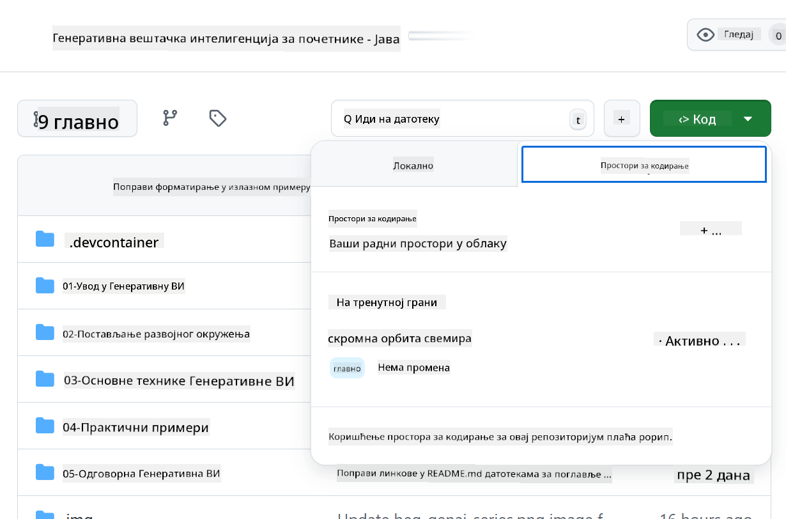

<!--
CO_OP_TRANSLATOR_METADATA:
{
  "original_hash": "bfdb4b4eadbee3a59ef742439f58326a",
  "translation_date": "2025-07-27T13:28:06+00:00",
  "source_file": "02-SetupDevEnvironment/getting-started-azure-openai.md",
  "language_code": "sr"
}
-->
# Подешавање Развојног Окружења за Azure OpenAI

> **Брзи почетак**: Овај водич је за подешавање Azure OpenAI. За тренутни почетак са бесплатним моделима, користите [GitHub Models with Codespaces](./README.md#quick-start-cloud).

Овај водич ће вам помоћи да подесите Azure AI Foundry моделе за ваше Java AI апликације у овом курсу.

## Садржај

- [Преглед брзог подешавања](../../../02-SetupDevEnvironment)
- [Корак 1: Креирајте Azure AI Foundry ресурсе](../../../02-SetupDevEnvironment)
  - [Креирајте Hub и пројекат](../../../02-SetupDevEnvironment)
  - [Деплојтујте GPT-4o-mini модел](../../../02-SetupDevEnvironment)
- [Корак 2: Креирајте свој Codespace](../../../02-SetupDevEnvironment)
- [Корак 3: Конфигуришите своје окружење](../../../02-SetupDevEnvironment)
- [Корак 4: Тестирајте своје подешавање](../../../02-SetupDevEnvironment)
- [Шта даље?](../../../02-SetupDevEnvironment)
- [Ресурси](../../../02-SetupDevEnvironment)
- [Додатни ресурси](../../../02-SetupDevEnvironment)

## Преглед брзог подешавања

1. Креирајте Azure AI Foundry ресурсе (Hub, пројекат, модел)
2. Креирајте Codespace са Java развојним окружењем
3. Конфигуришите своју .env датотеку са Azure OpenAI акредитивима
4. Тестирајте своје подешавање са примером пројекта

## Корак 1: Креирајте Azure AI Foundry ресурсе

### Креирајте Hub и пројекат

1. Идите на [Azure AI Foundry Portal](https://ai.azure.com/) и пријавите се
2. Кликните на **+ Create** → **New hub** (или идите на **Management** → **All hubs** → **+ New hub**)
3. Конфигуришите свој Hub:
   - **Hub name**: нпр. "MyAIHub"
   - **Subscription**: Изаберите своју Azure претплату
   - **Resource group**: Креирајте нову или изаберите постојећу
   - **Location**: Изаберите најближу локацију
   - **Storage account**: Користите подразумевану или конфигуришите прилагођену
   - **Key vault**: Користите подразумевану или конфигуришите прилагођену
   - Кликните на **Next** → **Review + create** → **Create**
4. Када је креирано, кликните на **+ New project** (или **Create project** из прегледа Hub-а)
   - **Project name**: нпр. "GenAIJava"
   - Кликните на **Create**

### Деплојтујте GPT-4o-mini модел

1. У свом пројекту, идите на **Model catalog** и потражите **gpt-4o-mini**
   - *Алтернатива: Идите на **Deployments** → **+ Create deployment***
2. Кликните на **Deploy** на картици модела gpt-4o-mini
3. Конфигуришите деплојмент:
   - **Deployment name**: "gpt-4o-mini"
   - **Model version**: Користите најновију
   - **Deployment type**: Standard
4. Кликните на **Deploy**
5. Када је деплојтовано, идите на картицу **Deployments** и копирајте следеће вредности:
   - **Deployment name** (нпр. "gpt-4o-mini")
   - **Target URI** (нпр. `https://your-hub-name.openai.azure.com/`) 
      > **Важно**: Копирајте само основни URL (нпр. `https://myhub.openai.azure.com/`), а не целу путању до ендпоинта.
   - **Key** (из секције Keys and Endpoint)

> **Имате проблема?** Посетите званичну [Azure AI Foundry документацију](https://learn.microsoft.com/azure/ai-foundry/how-to/create-projects?tabs=ai-foundry&pivots=hub-project)

## Корак 2: Креирајте свој Codespace

1. Fork-ујте овај репозиторијум на свој GitHub налог
   > **Напомена**: Ако желите да измените основну конфигурацију, погледајте [Dev Container Configuration](../../../.devcontainer/devcontainer.json)
2. У свом fork-ованом репозиторијуму, кликните на **Code** → картица **Codespaces**
3. Кликните на **...** → **New with options...**

4. Изаберите **Dev container configuration**: 
   - **Generative AI Java Development Environment**
5. Кликните на **Create codespace**

## Корак 3: Конфигуришите своје окружење

Када је ваш Codespace спреман, подесите своје Azure OpenAI акредитиве:

1. **Идите до пример пројекта из корена репозиторијума:**
   ```bash
   cd 02-SetupDevEnvironment/examples/basic-chat-azure
   ```

2. **Креирајте своју .env датотеку:**
   ```bash
   cp .env.example .env
   ```

3. **Измените .env датотеку са својим Azure OpenAI акредитивима:**
   ```bash
   # Your Azure OpenAI API key (from Azure AI Foundry portal)
   AZURE_AI_KEY=your-actual-api-key-here
   
   # Your Azure OpenAI endpoint URL (e.g., https://myhub.openai.azure.com/)
   AZURE_AI_ENDPOINT=https://your-hub-name.openai.azure.com/
   ```

   > **Безбедносна напомена**: 
   > - Никада не додајте своју `.env` датотеку у верзионисање
   > - `.env` датотека је већ укључена у `.gitignore`
   > - Чувајте своје API кључеве безбедно и редовно их ротирајте

## Корак 4: Тестирајте своје подешавање

Покрените пример апликације да тестирате своју Azure OpenAI везу:

```bash
mvn clean spring-boot:run
```

Требало би да видите одговор од GPT-4o-mini модела!

> **Корисници VS Code-а**: Такође можете притиснути `F5` у VS Code-у да покренете апликацију. Конфигурација за покретање је већ подешена да аутоматски учита вашу `.env` датотеку.

> **Цео пример**: Погледајте [End-to-End Azure OpenAI Example](./examples/basic-chat-azure/README.md) за детаљна упутства и решавање проблема.

## Шта даље?

**Подешавање је завршено!** Сада имате:
- Azure OpenAI са gpt-4o-mini деплојтованим
- Локалну конфигурацију `.env` датотеке
- Java развојно окружење спремно

**Наставите на** [Поглавље 3: Основне технике генеративне вештачке интелигенције](../03-CoreGenerativeAITechniques/README.md) да почнете са изградњом AI апликација!

## Ресурси

- [Azure AI Foundry документација](https://learn.microsoft.com/azure/ai-services/)
- [Spring AI Azure OpenAI документација](https://docs.spring.io/spring-ai/reference/api/clients/azure-openai-chat.html)
- [Azure OpenAI Java SDK](https://learn.microsoft.com/java/api/overview/azure/ai-openai-readme)

## Додатни ресурси

- [Преузмите VS Code](https://code.visualstudio.com/Download)
- [Преузмите Docker Desktop](https://www.docker.com/products/docker-desktop)
- [Dev Container Configuration](../../../.devcontainer/devcontainer.json)

**Одрицање од одговорности**:  
Овај документ је преведен коришћењем услуге за превођење помоћу вештачке интелигенције [Co-op Translator](https://github.com/Azure/co-op-translator). Иако се трудимо да обезбедимо тачност, молимо вас да имате у виду да аутоматски преводи могу садржати грешке или нетачности. Оригинални документ на његовом изворном језику треба сматрати меродавним извором. За критичне информације препоручује се професионални превод од стране људи. Не преузимамо одговорност за било каква погрешна тумачења или неспоразуме који могу настати услед коришћења овог превода.