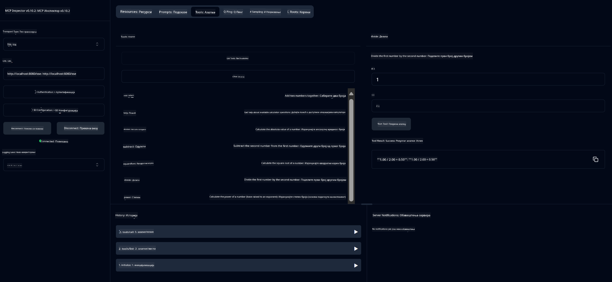

<!--
CO_OP_TRANSLATOR_METADATA:
{
  "original_hash": "7bf9a4a832911269a8bd0decb97ff36c",
  "translation_date": "2025-07-21T21:28:57+00:00",
  "source_file": "04-PracticalSamples/mcp/calculator/README.md",
  "language_code": "sr"
}
-->
# Основни Калкулатор MCP Сервис

>**Напомена**: Ово поглавље укључује [**Туторијал**](./TUTORIAL.md) који вас води кроз покретање готових примера.

Добродошли у ваше прво практично искуство са **Протоколом Контекста Модела (MCP)**! У претходним поглављима сте научили основе генеративне вештачке интелигенције и поставили своје развојно окружење. Сада је време да изградите нешто практично.

Овај калкулатор сервис демонстрира како AI модели могу безбедно да комуницирају са спољашњим алатима користећи MCP. Уместо да се ослањамо на понекад непоуздане математичке способности AI модела, показаћемо како да изградите робустан систем где AI може да позива специјализоване сервисе за тачне прорачуне.

## Садржај

- [Шта ћете научити](../../../../../04-PracticalSamples/mcp/calculator)
- [Предуслови](../../../../../04-PracticalSamples/mcp/calculator)
- [Кључни концепти](../../../../../04-PracticalSamples/mcp/calculator)
- [Брзи почетак](../../../../../04-PracticalSamples/mcp/calculator)
- [Доступне операције калкулатора](../../../../../04-PracticalSamples/mcp/calculator)
- [Тест клијенти](../../../../../04-PracticalSamples/mcp/calculator)
  - [1. Директни MCP Клијент (SDKClient)](../../../../../04-PracticalSamples/mcp/calculator)
  - [2. Клијент са AI подршком (LangChain4jClient)](../../../../../04-PracticalSamples/mcp/calculator)
- [MCP Инспектор (Веб интерфејс)](../../../../../04-PracticalSamples/mcp/calculator)
  - [Упутства корак по корак](../../../../../04-PracticalSamples/mcp/calculator)

## Шта ћете научити

Радећи кроз овај пример, разумећете:
- Како да креирате сервисе компатибилне са MCP користећи Spring Boot
- Разлику између директне комуникације протокола и интеракције са AI подршком
- Како AI модели одлучују када и како да користе спољашње алате
- Најбоље праксе за изградњу AI апликација са подршком за алате

Идеално за почетнике који уче MCP концепте и спремни су да изграде своју прву интеграцију AI алата!

## Предуслови

- Java 21+
- Maven 3.6+
- **GitHub Token**: Потребан за клијента са AI подршком. Ако га још нисте поставили, погледајте [Поглавље 2: Постављање развојног окружења](../../../02-SetupDevEnvironment/README.md) за упутства.

## Кључни концепти

**Протокол Контекста Модела (MCP)** је стандардизован начин за AI апликације да безбедно комуницирају са спољашњим алатима. Замислите га као "мост" који омогућава AI моделима да користе спољашње сервисе као што је наш калкулатор. Уместо да AI модел покушава сам да ради математику (што може бити непоуздано), он може да позове наш калкулатор сервис за тачне резултате. MCP осигурава да ова комуникација буде безбедна и конзистентна.

**Догађаји које шаље сервер (SSE)** омогућавају комуникацију у реалном времену између сервера и клијената. За разлику од традиционалних HTTP захтева где питате и чекате одговор, SSE омогућава серверу да континуирано шаље ажурирања клијенту. Ово је савршено за AI апликације где одговори могу бити стримовани или захтевати време за обраду.

**AI алати и позивање функција** омогућавају AI моделима да аутоматски бирају и користе спољашње функције (као што су операције калкулатора) на основу корисничких захтева. Када питате "Шта је 15 + 27?", AI модел разуме да желите сабирање, аутоматски позива наш `add` алат са одговарајућим параметрима (15, 27) и враћа резултат у природном језику. AI делује као интелигентни координатор који зна када и како да користи сваки алат.

## Брзи почетак

### 1. Идите у директоријум апликације калкулатора
```bash
cd Generative-AI-for-beginners-java/04-PracticalSamples/mcp/calculator
```

### 2. Изградите и покрените
```bash
mvn clean install -DskipTests
java -jar target/calculator-server-0.0.1-SNAPSHOT.jar
```

### 3. Тестирајте са клијентима
- **SDKClient**: Директна MCP протокол интеракција
- **LangChain4jClient**: Интеракција на природном језику са AI подршком (потребан GitHub token)

## Доступне операције калкулатора

- `add(a, b)`, `subtract(a, b)`, `multiply(a, b)`, `divide(a, b)`
- `power(base, exponent)`, `squareRoot(number)`, `absolute(number)`
- `modulus(a, b)`, `help()`

## Тест клијенти

### 1. Директни MCP Клијент (SDKClient)
Тестира сирову MCP протокол комуникацију. Покрените са:
```bash
mvn test-compile exec:java -Dexec.mainClass="com.microsoft.mcp.sample.client.SDKClient" -Dexec.classpathScope=test
```

### 2. Клијент са AI подршком (LangChain4jClient)
Демонстрира интеракцију на природном језику са GitHub моделима. Потребан GitHub token (погледајте [Предуслови](../../../../../04-PracticalSamples/mcp/calculator)).

**Покрените:**
```bash
mvn test-compile exec:java -Dexec.mainClass="com.microsoft.mcp.sample.client.LangChain4jClient" -Dexec.classpathScope=test
```

## MCP Инспектор (Веб интерфејс)

MCP Инспектор пружа визуелни веб интерфејс за тестирање вашег MCP сервиса без писања кода. Савршено за почетнике да разумеју како MCP функционише!

### Упутства корак по корак:

1. **Покрените сервер калкулатора** (ако већ није покренут):
   ```bash
   java -jar target/calculator-server-0.0.1-SNAPSHOT.jar
   ```

2. **Инсталирајте и покрените MCP Инспектор** у новом терминалу:
   ```bash
   npx @modelcontextprotocol/inspector
   ```

3. **Отворите веб интерфејс**:
   - Потражите поруку као што је "Inspector running at http://localhost:6274"
   - Отворите ту URL адресу у вашем веб прегледачу

4. **Повежите се са вашим калкулатор сервисом**:
   - У веб интерфејсу, поставите тип транспорта на "SSE"
   - Поставите URL на: `http://localhost:8080/sse`
   - Кликните на дугме "Connect"

5. **Истражите доступне алате**:
   - Кликните на "List Tools" да видите све операције калкулатора
   - Видећете функције као што су `add`, `subtract`, `multiply`, итд.

6. **Тестирајте операцију калкулатора**:
   - Изаберите алат (нпр. "add")
   - Унесите параметре (нпр. `a: 15`, `b: 27`)
   - Кликните на "Run Tool"
   - Погледајте резултат који враћа ваш MCP сервис!

Овај визуелни приступ вам помаже да тачно разумете како MCP комуникација функционише пре него што изградите своје клијенте.



---
**Референца:** [MCP Server Boot Starter Документација](https://docs.spring.io/spring-ai/reference/api/mcp/mcp-server-boot-starter-docs.html)

**Одрицање од одговорности**:  
Овај документ је преведен коришћењем услуге за превођење помоћу вештачке интелигенције [Co-op Translator](https://github.com/Azure/co-op-translator). Иако се трудимо да обезбедимо тачност, молимо вас да имате у виду да аутоматски преводи могу садржати грешке или нетачности. Оригинални документ на његовом изворном језику треба сматрати меродавним извором. За критичне информације, препоручује се професионални превод од стране људи. Не преузимамо одговорност за било каква погрешна тумачења или неспоразуме који могу настати услед коришћења овог превода.