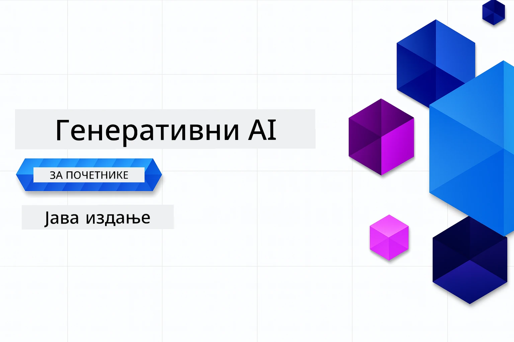

# Генеративна AI за почетнике - издање за Јаву
[](https://discord.gg/nTYy5BXMWG)



**Време потребно**: Цео радионички програм може се завршити онлајн без локалне инсталације. Постављање окружења траје 2 минута, док истраживање примера захтева 1-3 сата у зависности од дубине истраживања.

> **Брзи почетак** 

1. Форкујте овај репозиторијум на свој GitHub налог
2. Кликните **Code** → таб **Codespaces** → **...** → **New with options...**
3. Користите подразумеване опције – одабраће се Development контејнер креиран за овај курс
4. Кликните **Create codespace**
5. Сачекајте око 2 минута док окружење не буде спремно
6. Одмах пређите на [Први пример](./02-SetupDevEnvironment/README.md#step-2-create-a-github-personal-access-token)

> **Желите да клонирате локално?**
> 
> Овај репозиторијум садржи преко 50 превода на различите језике што значајно повећава величину преузимања. За клонирање без превода користите sparse checkout:
> ```bash
> git clone --filter=blob:none --sparse https://github.com/microsoft/Generative-AI-for-beginners-java.git
> cd Generative-AI-for-beginners-java
> git sparse-checkout set --no-cone '/*' '!translations' '!translated_images'
> ```
> Ово вам даје све што вам је потребно да завршите курс са много бржим преузимањем.


## Подршка за више језика

### Подржано путем GitHub Action (аутоматски и увек ажурирано)

<!-- CO-OP TRANSLATOR LANGUAGES TABLE START -->
[Arabic](../ar/README.md) | [Bengali](../bn/README.md) | [Bulgarian](../bg/README.md) | [Burmese (Myanmar)](../my/README.md) | [Chinese (Simplified)](../zh-CN/README.md) | [Chinese (Traditional, Hong Kong)](../zh-HK/README.md) | [Chinese (Traditional, Macau)](../zh-MO/README.md) | [Chinese (Traditional, Taiwan)](../zh-TW/README.md) | [Croatian](../hr/README.md) | [Czech](../cs/README.md) | [Danish](../da/README.md) | [Dutch](../nl/README.md) | [Estonian](../et/README.md) | [Finnish](../fi/README.md) | [French](../fr/README.md) | [German](../de/README.md) | [Greek](../el/README.md) | [Hebrew](../he/README.md) | [Hindi](../hi/README.md) | [Hungarian](../hu/README.md) | [Indonesian](../id/README.md) | [Italian](../it/README.md) | [Japanese](../ja/README.md) | [Kannada](../kn/README.md) | [Korean](../ko/README.md) | [Lithuanian](../lt/README.md) | [Malay](../ms/README.md) | [Malayalam](../ml/README.md) | [Marathi](../mr/README.md) | [Nepali](../ne/README.md) | [Nigerian Pidgin](../pcm/README.md) | [Norwegian](../no/README.md) | [Persian (Farsi)](../fa/README.md) | [Polish](../pl/README.md) | [Portuguese (Brazil)](../pt-BR/README.md) | [Portuguese (Portugal)](../pt-PT/README.md) | [Punjabi (Gurmukhi)](../pa/README.md) | [Romanian](../ro/README.md) | [Russian](../ru/README.md) | [Serbian (Cyrillic)](./README.md) | [Slovak](../sk/README.md) | [Slovenian](../sl/README.md) | [Spanish](../es/README.md) | [Swahili](../sw/README.md) | [Swedish](../sv/README.md) | [Tagalog (Filipino)](../tl/README.md) | [Tamil](../ta/README.md) | [Telugu](../te/README.md) | [Thai](../th/README.md) | [Turkish](../tr/README.md) | [Ukrainian](../uk/README.md) | [Urdu](../ur/README.md) | [Vietnamese](../vi/README.md)

## Структура курса и пут учења

### **Поглавље 1: Увод у генеративну AI**
- **Основни појмови**: Разумевање великих језичких модела, токена, уградњи и AI могућности
- **Java AI екосистем**: Преглед Spring AI и OpenAI SDK-ова
- **Протокол контекста модела**: Увод у MCP и његова улога у комуникацији AI агената
- **Практичне примене**: Сценарији из реалног света укључујући ћаскање са ботом и генерисање садржаја
- **[→ Почни Поглавље 1](./01-IntroToGenAI/README.md)**

### **Поглавље 2: Подешавање развојног окружења**
- **Конфигурација више провајдера**: Подешавање GitHub Models, Azure OpenAI, и OpenAI Java SDK интеграција
- **Spring Boot + Spring AI**: Најбоље праксе за развој ентерпрајс AI апликација
- **GitHub Models**: Бесплатан приступ AI моделима за прототиповање и учење (није потребна кредитна картица)
- **Алатке за развој**: Docker контејнери, VS Code и конфигурација GitHub Codespaces
- **[→ Почни Поглавље 2](./02-SetupDevEnvironment/README.md)**

### **Поглавље 3: Основне технике генеративне AI**
- **Промпт инжењеринг**: Технике за оптималне одговоре AI модела
- **Уградње и векторске операције**: Имплементација семантичке претраге и поређења сличности
- **Ретривал-Аугментед Генератион (RAG)**: Комбинација AI са вашим сопственим изворима података
- **Позив функција**: Проширујуће могућности AI помоћу прилагођених алата и додатака
- **[→ Почни Поглавље 3](./03-CoreGenerativeAITechniques/README.md)**

### **Поглавље 4: Практичне примене и пројекти**
- **Генератор прича о кућним љубимцима** (`petstory/`): Креативно генерисање садржаја са GitHub Models
- **Foundry локална демонстрација** (`foundrylocal/`): Локална интеграција AI модела са OpenAI Java SDK
- **MCP калкулатор услуга** (`calculator/`): Основна имплементација Протокола контекста модела са Spring AI
- **[→ Почни Поглавље 4](./04-PracticalSamples/README.md)**

### **Поглавље 5: Одговорни развој AI**
- **GitHub Models безбедност**: Тестирање уграђених механизама за филтрацију садржаја и безбедност (чврсте блокаде и меке одбијање)
- **Демо одговорног AI**: Практични пример приказује како савремени системи безбедности AI-а функционишу
- **Најбоље праксе**: Основне смернице за етички развој и имплементацију AI
- **[→ Почни Поглавље 5](./05-ResponsibleGenAI/README.md)**

## Додатни ресурси

<!-- CO-OP TRANSLATOR OTHER COURSES START -->
### LangChain
[](https://aka.ms/langchain4j-for-beginners)
[](https://aka.ms/langchainjs-for-beginners?WT.mc_id=m365-94501-dwahlin)

---

### Azure / Edge / MCP / Agents
[](https://github.com/microsoft/AZD-for-beginners?WT.mc_id=academic-105485-koreyst)
[](https://github.com/microsoft/edgeai-for-beginners?WT.mc_id=academic-105485-koreyst)
[](https://github.com/microsoft/mcp-for-beginners?WT.mc_id=academic-105485-koreyst)
[](https://github.com/microsoft/ai-agents-for-beginners?WT.mc_id=academic-105485-koreyst)

---
 
### Серија генеративна AI
[](https://github.com/microsoft/generative-ai-for-beginners?WT.mc_id=academic-105485-koreyst)
[-9333EA?style=for-the-badge&labelColor=E5E7EB&color=9333EA)](https://github.com/microsoft/Generative-AI-for-beginners-dotnet?WT.mc_id=academic-105485-koreyst)
[-C084FC?style=for-the-badge&labelColor=E5E7EB&color=C084FC)](https://github.com/microsoft/generative-ai-for-beginners-java?WT.mc_id=academic-105485-koreyst)
[-E879F9?style=for-the-badge&labelColor=E5E7EB&color=E879F9)](https://github.com/microsoft/generative-ai-with-javascript?WT.mc_id=academic-105485-koreyst)

---
 
### Основно учење
[](https://aka.ms/ml-beginners?WT.mc_id=academic-105485-koreyst)
[](https://aka.ms/datascience-beginners?WT.mc_id=academic-105485-koreyst)
[](https://aka.ms/ai-beginners?WT.mc_id=academic-105485-koreyst)
[](https://github.com/microsoft/Security-101?WT.mc_id=academic-96948-sayoung)
[](https://aka.ms/webdev-beginners?WT.mc_id=academic-105485-koreyst)
[](https://aka.ms/iot-beginners?WT.mc_id=academic-105485-koreyst)
[](https://github.com/microsoft/xr-development-for-beginners?WT.mc_id=academic-105485-koreyst)

---
 
### Copilot серија
[](https://aka.ms/GitHubCopilotAI?WT.mc_id=academic-105485-koreyst)
[](https://github.com/microsoft/mastering-github-copilot-for-dotnet-csharp-developers?WT.mc_id=academic-105485-koreyst)
[](https://github.com/microsoft/CopilotAdventures?WT.mc_id=academic-105485-koreyst)
<!-- CO-OP TRANSLATOR OTHER COURSES END -->

## Добијање помоћи

Ако запнете или имате било каквих питања о изградњи AI апликација. Придружите се другим учесницима и искусним програмерима у дискусијама о MCP-у. То је подржавајућа заједница где су питања добродошла и знање се слободно дели.

[](https://discord.gg/nTYy5BXMWG)

Ако имате повратне информације о производу или грешке приликом изградње посетите:

[](https://aka.ms/foundry/forum)

---

<!-- CO-OP TRANSLATOR DISCLAIMER START -->
**Ограничење одговорности**:
Овај документ је преведен помоћу AI преводилачке услуге [Co-op Translator](https://github.com/Azure/co-op-translator). Иако се трудимо да превод буде прецизан, молимо имајте у виду да аутоматски преводи могу да садрже грешке или нетачности. Оригинални документ на његовом изворном језику треба сматрати ауторитетним извором. За критичне информације препоруучује се професионални људски превод. Нисмо одговорни за било каква неслагања или погрешна тумачења која могу настати коришћењем овог превода.
<!-- CO-OP TRANSLATOR DISCLAIMER END -->