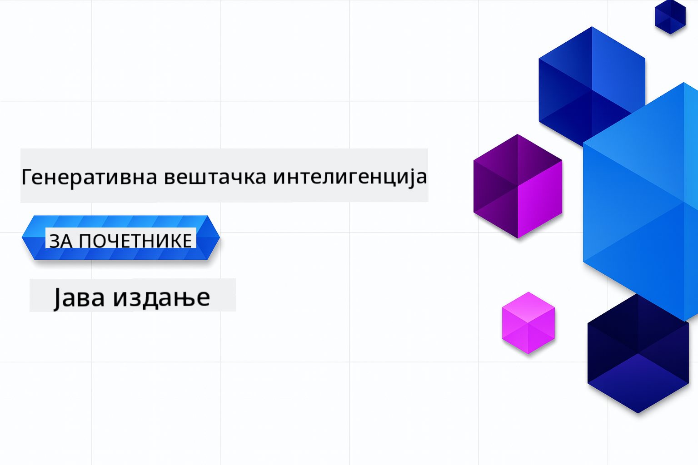

<!--
CO_OP_TRANSLATOR_METADATA:
{
  "original_hash": "a49b35508745c032a0033d914df7901b",
  "translation_date": "2025-07-25T10:09:21+00:00",
  "source_file": "README.md",
  "language_code": "sr"
}
-->
# Генеративна вештачка интелигенција за почетнике - Јава издање

**Време потребно**: Цео радионички курс може се завршити онлајн без локалног подешавања. Ако желите да покренете примере, подешавање окружења траје 2 минута, а истраживање примера захтева 1-3 сата у зависности од дубине истраживања.

> **Брзи почетак**

1. Форкујте овај репозиторијум на свој GitHub налог
2. Кликните **Code** → **Codespaces** таб → **...** → **New with options...**
3. Користите подразумеване опције – ово ће изабрати развојни контејнер креиран за овај курс
4. Кликните **Create codespace**
5. Сачекајте ~2 минута да окружење буде спремно
6. Пређите директно на [Креирање вашег GitHub Models токена](./02-SetupDevEnvironment/README.md#step-2-create-a-github-personal-access-token)

## Подршка за више језика

### Подржано преко GitHub Action (аутоматски и увек ажурирано)

[Француски](../fr/README.md) | [Шпански](../es/README.md) | [Немачки](../de/README.md) | [Руски](../ru/README.md) | [Арапски](../ar/README.md) | [Персијски (фарси)](../fa/README.md) | [Урду](../ur/README.md) | [Кинески (поједностављени)](../zh/README.md) | [Кинески (традиционални, Макао)](../mo/README.md) | [Кинески (традиционални, Хонг Конг)](../hk/README.md) | [Кинески (традиционални, Тајван)](../tw/README.md) | [Јапански](../ja/README.md) | [Корејски](../ko/README.md) | [Хинди](../hi/README.md) | [Бенгалски](../bn/README.md) | [Марати](../mr/README.md) | [Непалски](../ne/README.md) | [Пенџабски (Гурмуки)](../pa/README.md) | [Португалски (Португалија)](../pt/README.md) | [Португалски (Бразил)](../br/README.md) | [Италијански](../it/README.md) | [Пољски](../pl/README.md) | [Турски](../tr/README.md) | [Грчки](../el/README.md) | [Тајландски](../th/README.md) | [Шведски](../sv/README.md) | [Дански](../da/README.md) | [Норвешки](../no/README.md) | [Фински](../fi/README.md) | [Холандски](../nl/README.md) | [Хебрејски](../he/README.md) | [Вијетнамски](../vi/README.md) | [Индонежански](../id/README.md) | [Малајски](../ms/README.md) | [Тагалог (Филипински)](../tl/README.md) | [Свахили](../sw/README.md) | [Мађарски](../hu/README.md) | [Чешки](../cs/README.md) | [Словачки](../sk/README.md) | [Румунски](../ro/README.md) | [Бугарски](../bg/README.md) | [Српски (Ћирилица)](./README.md) | [Хрватски](../hr/README.md) | [Словеначки](../sl/README.md) | [Украјински](../uk/README.md) | [Бирмански (Мјанмар)](../my/README.md)

## Структура курса и пут учења

### **Поглавље 1: Увод у генеративну вештачку интелигенцију**
- **Основни концепти**: Разумевање великих језичких модела, токена, уградњи и могућности вештачке интелигенције
- **Јава AI екосистем**: Преглед Spring AI и OpenAI SDK-ова
- **Протокол контекста модела**: Увод у MCP и његову улогу у комуникацији AI агената
- **Практичне примене**: Сценарији из стварног света, укључујући чет-ботове и генерисање садржаја
- **[→ Почните Поглавље 1](./01-IntroToGenAI/README.md)**

### **Поглавље 2: Подешавање развојног окружења**
- **Конфигурација за више провајдера**: Подешавање GitHub Models, Azure OpenAI и OpenAI Java SDK интеграција
- **Spring Boot + Spring AI**: Најбоље праксе за развој AI апликација за предузећа
- **GitHub Models**: Бесплатан приступ AI моделима за прототипе и учење (без потребе за кредитном картицом)
- **Развојни алати**: Контејнери за Docker, VS Code и GitHub Codespaces конфигурација
- **[→ Почните Поглавље 2](./02-SetupDevEnvironment/README.md)**

### **Поглавље 3: Основне технике генеративне вештачке интелигенције**
- **Инжењеринг упита**: Технике за оптималне одговоре AI модела
- **Уградње и векторске операције**: Имплементација семантичке претраге и упоређивања сличности
- **Генерација уз помоћ претраживања (RAG)**: Комбинација AI са сопственим изворима података
- **Позивање функција**: Проширење могућности AI са прилагођеним алатима и додацима
- **[→ Почните Поглавље 3](./03-CoreGenerativeAITechniques/README.md)**

### **Поглавље 4: Практичне примене и пројекти**
- **Генератор прича о кућним љубимцима** (`petstory/`): Креативно генерисање садржаја уз GitHub Models
- **Foundry локална демонстрација** (`foundrylocal/`): Локална интеграција AI модела са OpenAI Java SDK
- **MCP услуга калкулатора** (`mcp/calculator/`): Основна имплементација Протокола контекста модела уз Spring AI
- **[→ Почните Поглавље 4](./04-PracticalSamples/README.md)**

### **Поглавље 5: Одговорни развој вештачке интелигенције**
- **Безбедност GitHub Models**: Тестирање уграђеног филтрирања садржаја и механизама безбедности
- **Демонстрација одговорне AI**: Практичан пример који показује како филтери безбедности AI функционишу у пракси
- **Најбоље праксе**: Основне смернице за етички развој и примену AI
- **[→ Почните Поглавље 5](./05-ResponsibleGenAI/README.md)**

## Додатни ресурси 

- [AI агенти за почетнике](https://github.com/microsoft/ai-agents-for-beginners)
- [Генеративна вештачка интелигенција за почетнике уз .NET](https://github.com/microsoft/Generative-AI-for-beginners-dotnet)
- [Генеративна вештачка интелигенција за почетнике уз JavaScript](https://github.com/microsoft/generative-ai-with-javascript)
- [Генеративна вештачка интелигенција за почетнике](https://github.com/microsoft/generative-ai-for-beginners)
- [Машинско учење за почетнике](https://aka.ms/ml-beginners)
- [Наука о подацима за почетнике](https://aka.ms/datascience-beginners)
- [Вештачка интелигенција за почетнике](https://aka.ms/ai-beginners)
- [Сајбер безбедност за почетнике](https://github.com/microsoft/Security-101)
- [Веб развој за почетнике](https://aka.ms/webdev-beginners)
- [IoT за почетнике](https://aka.ms/iot-beginners)
- [XR развој за почетнике](https://github.com/microsoft/xr-development-for-beginners)
- [Мастеринг GitHub Copilot за AI парно програмирање](https://aka.ms/GitHubCopilotAI)
- [Мастеринг GitHub Copilot за C#/.NET програмере](https://github.com/microsoft/mastering-github-copilot-for-dotnet-csharp-developers)
- [Изаберите своју Copilot авантуру](https://github.com/microsoft/CopilotAdventures)
- [RAG чет апликација са Azure AI услугама](https://github.com/Azure-Samples/azure-search-openai-demo-java)

**Одрицање од одговорности**:  
Овај документ је преведен коришћењем услуге за превођење помоћу вештачке интелигенције [Co-op Translator](https://github.com/Azure/co-op-translator). Иако се трудимо да обезбедимо тачност, молимо вас да имате у виду да аутоматски преводи могу садржати грешке или нетачности. Оригинални документ на његовом изворном језику треба сматрати ауторитативним извором. За критичне информације препоручује се професионални превод од стране људи. Не преузимамо одговорност за било каква погрешна тумачења или неспоразуме који могу произаћи из коришћења овог превода.