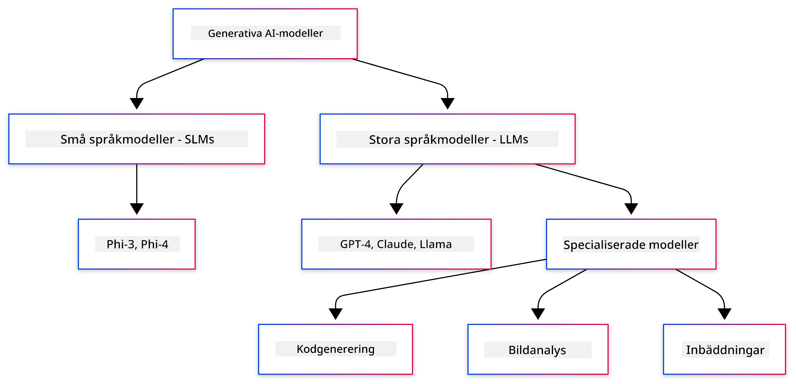
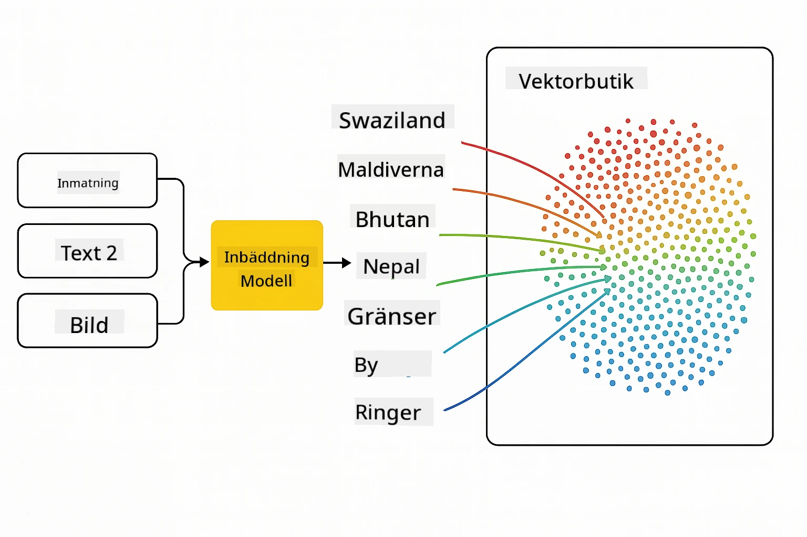
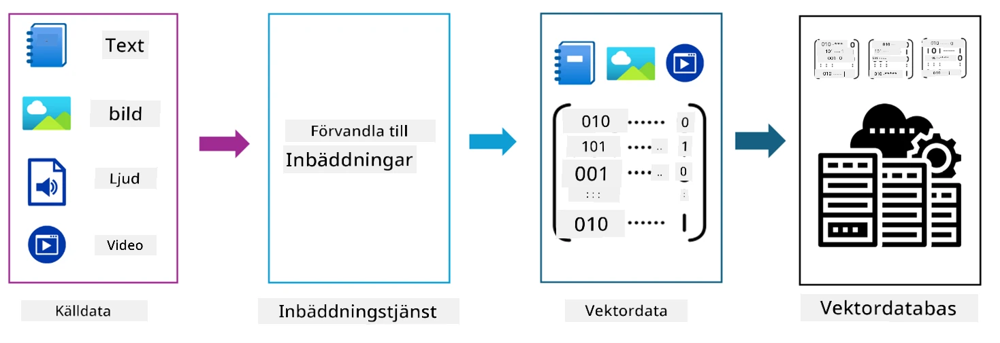
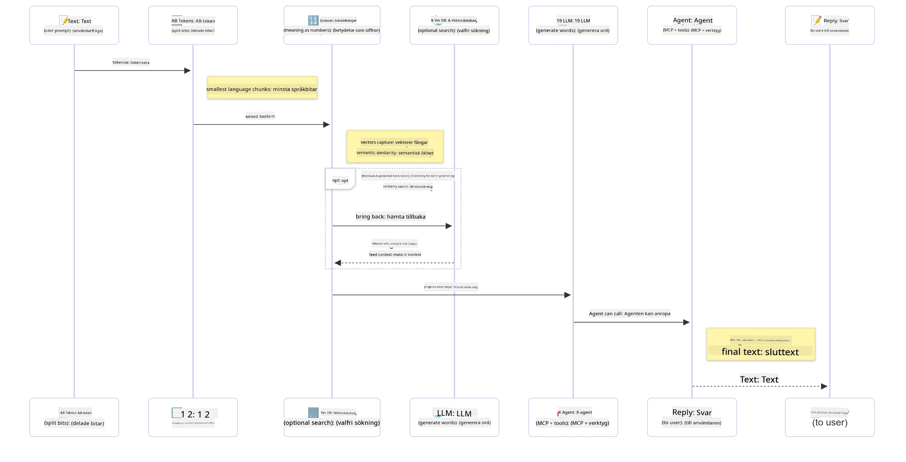

# Introduktion till Generativ AI - Java Edition

> **Video**: [Titta på videoöversikten för denna lektion på YouTube.](https://www.youtube.com/watch?v=XH46tGp_eSw) Du kan också klicka på miniatyrbilden ovan.

## Vad du kommer att lära dig

- **Grundläggande om generativ AI** inklusive LLMs, prompt-ingenjörskap, tokens, embeddings och vektordatabaser
- **Jämföra Java AI-utvecklingsverktyg** inklusive Azure OpenAI SDK, Spring AI och OpenAI Java SDK
- **Upptäck Model Context Protocol** och dess roll i AI-agenters kommunikation

## Innehållsförteckning

- [Introduktion](#introduktion)
- [En snabb repetition av generativa AI-koncept](#en-snabb-repetition-av-generativa-ai-koncept)
- [Genomgång av prompt-ingenjörskap](#genomgång-av-prompt-ingenjörskap)
- [Tokens, embeddings och agenter](#tokens-embeddings-och-agenter)
- [AI-utvecklingsverktyg och bibliotek för Java](#ai-utvecklingsverktyg-och-bibliotek-för-java)
  - [OpenAI Java SDK](#openai-java-sdk)
  - [Spring AI](#spring-ai)
  - [Azure OpenAI Java SDK](#azure-openai-java-sdk)
- [Sammanfattning](#sammanfattning)
- [Nästa steg](#nästa-steg)

## Introduktion

Välkommen till det första kapitlet i Generativ AI för nybörjare - Java Edition! Denna grundläggande lektion introducerar dig till kärnkoncepten inom generativ AI och hur du arbetar med dem med Java. Du kommer att lära dig om de viktiga byggstenarna i AI-applikationer, inklusive Large Language Models (LLMs), tokens, embeddings och AI-agenter. Vi kommer också att utforska de främsta Java-verktygen du kommer att använda under kursens gång.

### En snabb repetition av generativa AI-koncept

Generativ AI är en typ av artificiell intelligens som skapar nytt innehåll, såsom text, bilder eller kod, baserat på mönster och relationer som lärts in från data. Generativa AI-modeller kan generera mänskliga svar, förstå kontext och ibland till och med skapa innehåll som verkar mänskligt.

När du utvecklar dina Java AI-applikationer kommer du att arbeta med **generativa AI-modeller** för att skapa innehåll. Några av generativa AI-modellers möjligheter inkluderar:

- **Textgenerering**: Skapa människoliknande text för chatbots, innehåll och textkomplettering.
- **Bildgenerering och analys**: Producera realistiska bilder, förbättra foton och upptäcka objekt.
- **Kodgenerering**: Skriva kodsnuttar eller skript.

Det finns specifika typer av modeller som är optimerade för olika uppgifter. Till exempel kan både **Small Language Models (SLMs)** och **Large Language Models (LLMs)** hantera textgenerering, där LLMs oftast erbjuder bättre prestanda för komplexa uppgifter. För bildrelaterade uppgifter skulle du använda specialiserade vision-modeller eller multimodala modeller.

Naturligtvis är svaren från dessa modeller inte perfekta hela tiden. Du har förmodligen hört talas om att modeller "hallucinerar" eller genererar felaktig information på ett auktoritativt sätt. Men du kan hjälpa modellen att generera bättre svar genom att ge den tydliga instruktioner och kontext. Här kommer **prompt engineering** in i bilden.

#### Genomgång av prompt-ingenjörskap

Prompt engineering är praxis för att utforma effektiva ingångar för att styra AI-modeller mot önskade utdata. Det innebär:

- **Tydlighet**: Göra instruktionerna klara och entydiga.
- **Kontext**: Ge nödvändig bakgrundsinformation.
- **Begränsningar**: Specificera eventuella restriktioner eller format.

Några bästa praxis för prompt engineering inkluderar promptdesign, tydliga instruktioner, uppdelning av uppgifter, one-shot och few-shot learning samt prompt-tuning. Att testa olika prompts är avgörande för att hitta vad som fungerar bäst för ditt specifika användningsfall.

När du utvecklar applikationer kommer du att arbeta med olika typer av prompts:
- **System prompts**: Sätter basregler och kontext för modellens beteende
- **User prompts**: Indata från dina applikationsanvändare
- **Assistant prompts**: Modellens svar baserade på system- och user-prompts

> **Lär dig mer**: Läs mer om prompt engineering i [Prompt Engineering-kapitlet i GenAI for Beginners-kursen](https://github.com/microsoft/generative-ai-for-beginners/tree/main/04-prompt-engineering-fundamentals)

#### Tokens, embeddings och agenter

När du arbetar med generativa AI-modeller kommer du att stöta på termer som **tokens**, **embeddings**, **agenter** och **Model Context Protocol (MCP)**. Här är en detaljerad översikt av dessa begrepp:

- **Tokens**: Tokens är den minsta enheten av text i en modell. De kan vara ord, tecken eller delord. Tokens används för att representera textdata i ett format som modellen kan förstå. Till exempel kan meningen "The quick brown fox jumped over the lazy dog" tokeniseras som ["The", " quick", " brown", " fox", " jumped", " over", " the", " lazy", " dog"] eller ["The", " qu", "ick", " br", "own", " fox", " jump", "ed", " over", " the", " la", "zy", " dog"] beroende på tokeniseringsstrategin.

Tokenisering är processen att bryta ner text i dessa mindre enheter. Detta är avgörande eftersom modeller arbetar med tokens snarare än rå text. Antalet tokens i en prompt påverkar modellens svarslängd och kvalitet, eftersom modeller har tokenbegränsningar för sitt kontextfönster (t.ex. 128K tokens för GPT-4o:s totala kontext, inklusive både indata och utdata).

  I Java kan du använda bibliotek som OpenAI SDK för att automatiskt hantera tokenisering när du skickar förfrågningar till AI-modeller.

- **Embeddings**: Embeddings är vektorrepresentationer av tokens som fångar semantisk betydelse. De är numeriska representationer (vanligtvis arrayer av flyttal) som gör det möjligt för modeller att förstå relationer mellan ord och generera kontextuellt relevanta svar. Liknande ord har liknande embeddings, vilket gör att modellen kan förstå begrepp som synonymer och semantiska relationer.

  I Java kan du generera embeddings med hjälp av OpenAI SDK eller andra bibliotek som stödjer embeddinggenerering. Dessa embeddings är viktiga för uppgifter som semantisk sökning, där du vill hitta liknande innehåll baserat på betydelse snarare än exakta textmatchningar.

- **Vektordatabaser**: Vektordatabaser är specialiserade lagringssystem optimerade för embeddings. De möjliggör effektiv likhetssökning och är avgörande för mönster som Retrieval-Augmented Generation (RAG) där du behöver hitta relevant information från stora datamängder baserat på semantisk likhet snarare än exakta matchningar.

> **Notera**: I denna kurs kommer vi inte att täcka vektordatabaser men nämner dem eftersom de är vanliga i verkliga tillämpningar.

- **Agenter & MCP**: AI-komponenter som autonomt interagerar med modeller, verktyg och externa system. Model Context Protocol (MCP) erbjuder ett standardiserat sätt för agenter att säkert komma åt externa datakällor och verktyg. Läs mer i vår [MCP for Beginners](https://github.com/microsoft/mcp-for-beginners)-kurs.

I Java AI-applikationer använder du tokens för textbearbetning, embeddings för semantisk sökning och RAG, vektordatabaser för datahämtning och agenter med MCP för att bygga intelligenta system som använder verktyg.

### AI-utvecklingsverktyg och bibliotek för Java

Java erbjuder utmärkta verktyg för AI-utveckling. Det finns tre huvudsakliga bibliotek som vi kommer att utforska under hela kursen - OpenAI Java SDK, Azure OpenAI SDK och Spring AI.

Här är en snabb referenstabell som visar vilket SDK som används i exempel från varje kapitel:

| Kapitel | Exempel | SDK |
|---------|---------|-----|
| 02-SetupDevEnvironment | github-models | OpenAI Java SDK |
| 02-SetupDevEnvironment | basic-chat-azure | Spring AI Azure OpenAI |
| 03-CoreGenerativeAITechniques | examples | Azure OpenAI SDK |
| 04-PracticalSamples | petstory | OpenAI Java SDK |
| 04-PracticalSamples | foundrylocal | OpenAI Java SDK |
| 04-PracticalSamples | calculator | Spring AI MCP SDK + LangChain4j |

**SDK Dokumentationslänkar:**
- [Azure OpenAI Java SDK](https://github.com/Azure/azure-sdk-for-java/tree/azure-ai-openai_1.0.0-beta.16/sdk/openai/azure-ai-openai)
- [Spring AI](https://docs.spring.io/spring-ai/reference/)
- [OpenAI Java SDK](https://github.com/openai/openai-java)
- [LangChain4j](https://docs.langchain4j.dev/)

#### OpenAI Java SDK

OpenAI SDK är det officiella Java-biblioteket för OpenAI API. Det erbjuder ett enkelt och konsekvent gränssnitt för att interagera med OpenAIs modeller, vilket gör det enkelt att integrera AI-funktioner i Java-applikationer. Kapitel 2:s GitHub Models-exempel, Kapitel 4:s Pet Story-applikation och Foundry Local-exempel visar OpenAI SDK-metoden.

#### Spring AI

Spring AI är ett omfattande ramverk som bringar AI-funktioner till Spring-applikationer och erbjuder ett konsekvent abstraktionslager över olika AI-leverantörer. Det integreras sömlöst med Spring-ekosystemet och är det idealiska valet för företags-Java-applikationer som behöver AI-funktioner.

Spring AI:s styrka ligger i dess sömlösa integration med Spring-ekosystemet, vilket gör det enkelt att bygga produktionsfärdiga AI-applikationer med bekanta Spring-mönster som beroendeinjektion, konfigurationshantering och testverktyg. Du kommer att använda Spring AI i kapitel 2 och 4 för att bygga applikationer som använder både OpenAI och Model Context Protocol (MCP) Spring AI-biblioteken.

##### Model Context Protocol (MCP)

[Model Context Protocol (MCP)](https://modelcontextprotocol.io/) är en framväxande standard som möjliggör att AI-applikationer kan interagera säkert med externa datakällor och verktyg. MCP erbjuder ett standardiserat sätt för AI-modeller att få tillgång till kontextuell information och utföra åtgärder i dina applikationer.

I kapitel 4 kommer du att bygga en enkel MCP-kalkylatortjänst som demonstrerar grunderna i Model Context Protocol med Spring AI och visar hur man skapar grundläggande verktygsintegrationer och tjänstearkitekturer.

#### Azure OpenAI Java SDK

Azure OpenAI-klientbiblioteket för Java är en anpassning av OpenAIs REST API:er som erbjuder ett idiomatiskt gränssnitt och integration med resten av Azure SDK-ekosystemet. I kapitel 3 bygger du applikationer med Azure OpenAI SDK, inklusive chattapplikationer, funktionsanrop och RAG (Retrieval-Augmented Generation)-mönster.

> Notera: Azure OpenAI SDK släpar efter OpenAI Java SDK vad gäller funktioner, så för framtida projekt kan det vara värt att överväga att använda OpenAI Java SDK.

## Sammanfattning

Det avslutar grunderna! Nu förstår du:

- Kärnkoncepten bakom generativ AI - från LLMs och prompt-ingenjörskap till tokens, embeddings och vektordatabaser
- Dina verktygsval för Java AI-utveckling: Azure OpenAI SDK, Spring AI och OpenAI Java SDK
- Vad Model Context Protocol är och hur det gör att AI-agenter kan arbeta med externa verktyg

## Nästa steg

[Kapitel 2: Sätta upp utvecklingsmiljön](../02-SetupDevEnvironment/README.md)

---

<!-- CO-OP TRANSLATOR DISCLAIMER START -->
**Ansvarsfriskrivning**:
Detta dokument har översatts med hjälp av AI-översättningstjänsten [Co-op Translator](https://github.com/Azure/co-op-translator). Även om vi strävar efter noggrannhet, vänligen var medveten om att automatiska översättningar kan innehålla fel eller felaktigheter. Det ursprungliga dokumentet på dess modersmål bör betraktas som den auktoritativa källan. För viktig information rekommenderas professionell mänsklig översättning. Vi ansvarar inte för några missförstånd eller feltolkningar som uppstår från användningen av denna översättning.
<!-- CO-OP TRANSLATOR DISCLAIMER END -->