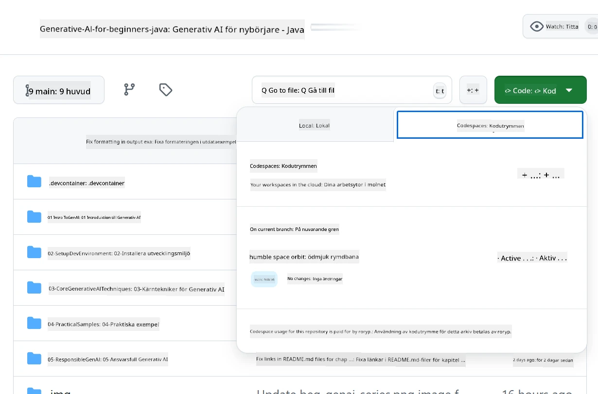
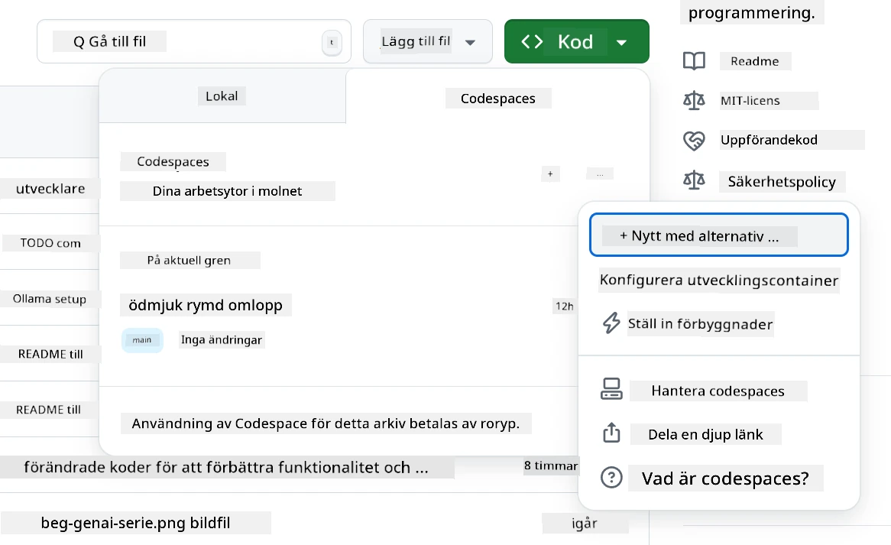
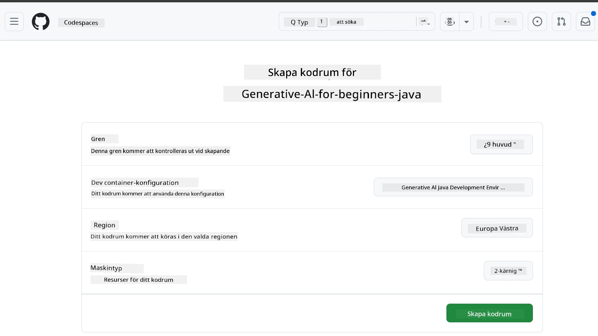
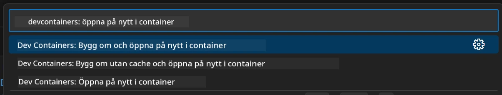
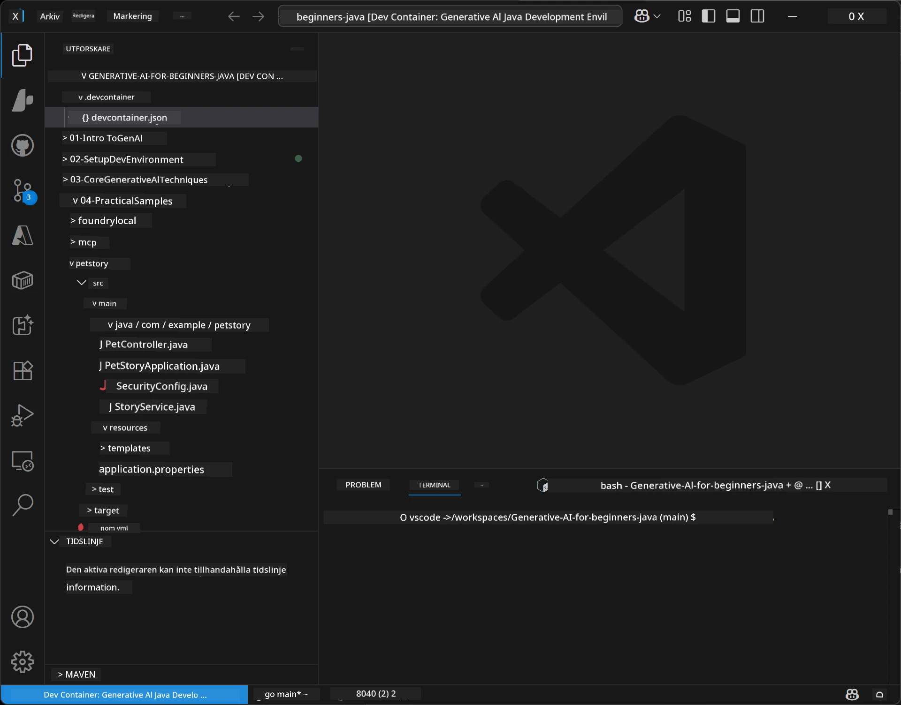
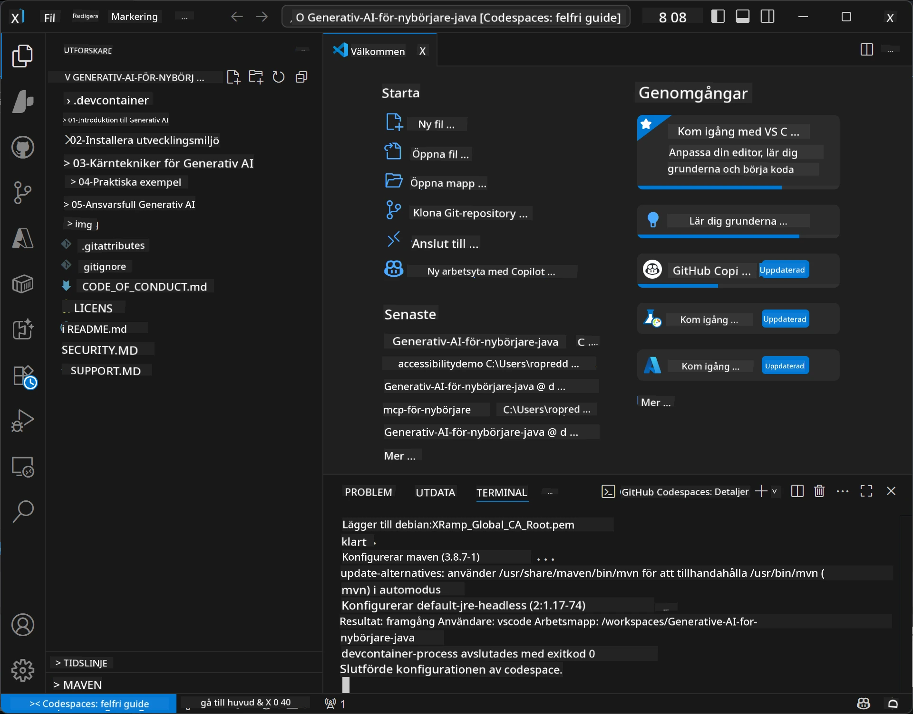

# Ställa in utvecklingsmiljön för Generative AI för Java

> **Snabbstart**: Koda i molnet på 2 minuter - Hoppa till [GitHub Codespaces Setup](../../../02-SetupDevEnvironment) - ingen lokal installation krävs och använder github-modeller!

> **Intresserad av Azure OpenAI?**, se vår [Azure OpenAI Setup Guide](getting-started-azure-openai.md) med steg för att skapa en ny Azure OpenAI-resurs.

## Vad du kommer att lära dig

- Ställa in en Java-utvecklingsmiljö för AI-applikationer
- Välja och konfigurera din föredragna utvecklingsmiljö (cloud-first med Codespaces, lokal dev container eller full lokal installation)
- Testa din installation genom att ansluta till GitHub Models

## Innehållsförteckning

- [Vad du kommer att lära dig](../../../02-SetupDevEnvironment)
- [Introduktion](../../../02-SetupDevEnvironment)
- [Steg 1: Ställ in din utvecklingsmiljö](../../../02-SetupDevEnvironment)
  - [Alternativ A: GitHub Codespaces (rekommenderas)](../../../02-SetupDevEnvironment)
  - [Alternativ B: Lokal Dev Container](../../../02-SetupDevEnvironment)
  - [Alternativ C: Använd din befintliga lokala installation](../../../02-SetupDevEnvironment)
- [Steg 2: Skapa GitHub-personligt åtkomsttoken](../../../02-SetupDevEnvironment)
- [Steg 3: Testa din installation](../../../02-SetupDevEnvironment)
- [Felsökning](../../../02-SetupDevEnvironment)
- [Sammanfattning](../../../02-SetupDevEnvironment)
- [Nästa steg](../../../02-SetupDevEnvironment)

## Introduktion

Det här kapitlet guidar dig genom att ställa in en utvecklingsmiljö. Vi använder **GitHub Models** som vårt huvudsakliga exempel eftersom det är gratis, enkelt att sätta upp med bara ett GitHub-konto, kräver inget kreditkort och ger tillgång till flera modeller för experimentering.

**Ingen lokal installation krävs!** Du kan börja koda direkt med GitHub Codespaces, som tillhandahåller en fullständig utvecklingsmiljö i din webbläsare.


Vi rekommenderar att använda [**GitHub Models**](https://github.com/marketplace?type=models) för den här kursen eftersom det är:
- **Gratis** att komma igång
- **Enkelt** att ställa in med bara ett GitHub-konto
- **Inget kreditkort** krävs
- **Flera modeller** tillgängliga för experimentering

> **Notera**: De GitHub Models som används i denna träning har dessa gratisgränser:
> - 15 förfrågningar per minut (150 per dag)
> - ~8 000 ord in, ~4 000 ord ut per förfrågan
> - 5 samtidiga förfrågningar
> 
> För produktionsanvändning, uppgradera till Azure AI Foundry Models med ditt Azure-konto. Din kod behöver inte ändras. Se dokumentationen för [Azure AI Foundry](https://learn.microsoft.com/azure/ai-foundry/foundry-models/how-to/quickstart-github-models).

## Steg 1: Ställ in din utvecklingsmiljö

<a name="quick-start-cloud"></a>

Vi har skapat en förkonfigurerad utvecklingscontainer för att minimera installationstid och säkerställa att du har alla nödvändiga verktyg för denna Generative AI för Java-kurs. Välj din föredragna utvecklingsmetod:

### Alternativ för miljöinställning:

#### Alternativ A: GitHub Codespaces (rekommenderas)

**Börja koda på 2 minuter – ingen lokal installation krävs!**

1. Forka detta repository till ditt GitHub-konto
   > **Notera**: Om du vill redigera den grundläggande konfigurationen, ta en titt på [Dev Container Configuration](../../../.devcontainer/devcontainer.json)
2. Klicka **Code** → fliken **Codespaces** → **...** → **New with options...**
3. Använd standardinställningarna – detta väljer **Dev container configuration**: **Generative AI Java Development Environment** anpassad devcontainer skapad för denna kurs
4. Klicka **Create codespace**
5. Vänta ~2 minuter tills miljön är redo
6. Fortsätt till [Steg 2: Skapa GitHub-token](../../../02-SetupDevEnvironment)







> **Fördelar med Codespaces**:
> - Ingen lokal installation krävs
> - Fungerar på vilken enhet som helst med en webbläsare
> - Förkonfigurerad med alla verktyg och beroenden
> - Gratis 60 timmar per månad för personliga konton
> - Enhetlig miljö för alla deltagare

#### Alternativ B: Lokal Dev Container

**För utvecklare som föredrar lokal utveckling med Docker**

1. Forka och klona detta repository till din lokala dator
   > **Notera**: Om du vill redigera den grundläggande konfigurationen, ta en titt på [Dev Container Configuration](../../../.devcontainer/devcontainer.json)
2. Installera [Docker Desktop](https://www.docker.com/products/docker-desktop/) och [VS Code](https://code.visualstudio.com/)
3. Installera [Dev Containers-tillägget](https://marketplace.visualstudio.com/items?itemName=ms-vscode-remote.remote-containers) i VS Code
4. Öppna repository-mappen i VS Code
5. När du uppmanas, klicka på **Reopen in Container** (eller använd `Ctrl+Shift+P` → "Dev Containers: Reopen in Container")
6. Vänta på att containern byggs och startas
7. Fortsätt till [Steg 2: Skapa GitHub-token](../../../02-SetupDevEnvironment)





#### Alternativ C: Använd din befintliga lokala installation

**För utvecklare med befintliga Java-miljöer**

Förutsättningar:
- [Java 21+](https://www.oracle.com/java/technologies/javase/jdk21-archive-downloads.html)
- [Maven 3.9+](https://maven.apache.org/download.cgi)
- [VS Code](https://code.visualstudio.com) eller din föredragna IDE

Steg:
1. Klona detta repository till din lokala maskin
2. Öppna projektet i din IDE
3. Fortsätt till [Steg 2: Skapa GitHub-token](../../../02-SetupDevEnvironment)

> **Proffstips**: Om du har en lågpresterande maskin men vill använda VS Code lokalt, använd GitHub Codespaces! Du kan ansluta din lokala VS Code till en molnhostad Codespace och få det bästa av två världar.



## Steg 2: Skapa GitHub-personligt åtkomsttoken

1. Navigera till [GitHub Settings](https://github.com/settings/profile) och välj **Settings** i din profilmeny.
2. Klicka på **Developer settings** i sidomenyn till vänster (vanligtvis längst ner).
3. Under **Personal access tokens**, klicka på **Fine-grained tokens** (eller följ denna direkta [länk](https://github.com/settings/personal-access-tokens)).
4. Klicka på **Generate new token**.
5. Under "Token name", ange ett beskrivande namn (t.ex. `GenAI-Java-Course-Token`).
6. Ange ett utgångsdatum (rekommenderat: 7 dagar för bästa säkerhetspraxis).
7. Under "Resource owner", välj ditt användarkonto.
8. Under "Repository access", välj de repositories du vill använda med GitHub Models (eller "All repositories" om det behövs).
9. Under "Account permissions", hitta **Models** och ställ in det på **Read-only**.
10. Klicka på **Generate token**.
11. **Kopiera och spara din token nu** – du kommer inte att se den igen!

> **Säkerhetstips**: Använd minsta nödvändiga behörigheter och kortast praktiska giltighetstid för dina access tokens.

## Steg 3: Testa din installation med GitHub Models-exemplet

När din utvecklingsmiljö är redo, låt oss testa GitHub Models-integrationen med vårt exempelprogram i [`02-SetupDevEnvironment/examples/github-models`](../../../02-SetupDevEnvironment/examples/github-models).

1. Öppna terminalen i din utvecklingsmiljö.
2. Navigera till GitHub Models-exemplet:
   ```bash
   cd 02-SetupDevEnvironment/examples/github-models
   ```
3. Sätt din GitHub-token som en miljövariabel:
   ```bash
   # macOS/Linux
   export GITHUB_TOKEN=your_token_here
   
   # Windows (Kommandoprompt)
   set GITHUB_TOKEN=your_token_here
   
   # Windows (PowerShell)
   $env:GITHUB_TOKEN="your_token_here"
   ```

4. Kör applikationen:
   ```bash
   mvn compile exec:java -Dexec.mainClass="com.example.githubmodels.App"
   ```

Du bör se en utdata som liknar:
```text
Using model: gpt-4.1-nano
Sending request to GitHub Models...
Response: Hello World!
```

### Förstå exempel-koden

Först, låt oss förstå vad vi just körde. Exemplet under `examples/github-models` använder OpenAI Java SDK för att ansluta till GitHub Models:

**Vad denna kod gör:**
- **Ansluter** till GitHub Models med din personliga åtkomsttoken
- **Skickar** ett enkelt meddelande "Say Hello World!" till AI-modellen
- **Tar emot** och visar AI:s svar
- **Verifierar** att din setup fungerar korrekt

**Viktig beroende** (i `pom.xml`):
```xml
<dependency>
    <groupId>com.openai</groupId>
    <artifactId>openai-java</artifactId>
    <version>2.12.0</version>
</dependency>
```

**Huvudkod** (`App.java`):
```java
// Anslut till GitHub-modeller med OpenAI Java SDK
OpenAIClient client = OpenAIOkHttpClient.builder()
    .apiKey(pat)
    .baseUrl("https://models.inference.ai.azure.com")
    .build();

// Skapa förfrågan om chattfullbordan
ChatCompletionCreateParams params = ChatCompletionCreateParams.builder()
    .model(modelId)
    .addSystemMessage("You are a concise assistant.")
    .addUserMessage("Say Hello World!")
    .build();

// Hämta AI-svar
ChatCompletion response = client.chat().completions().create(params);
System.out.println("Response: " + response.choices().get(0).message().content().orElse("No response content"));
```

## Sammanfattning

Bra jobbat! Du har nu allt på plats:

- Skapat en GitHub-personlig åtkomsttoken med rätt behörigheter för AI-modellåtkomst
- Fått din Java-utvecklingsmiljö att köras (oavsett om det är Codespaces, dev containers eller lokal)
- Anslutit till GitHub Models med OpenAI Java SDK för gratis AI-utveckling
- Testat att allt fungerar med ett enkelt exempel som kommunicerar med AI-modeller

## Nästa steg

[Kapitel 3: Kärntekniker för Generative AI](../03-CoreGenerativeAITechniques/README.md)

## Felsökning

Problem? Här är vanliga problem och lösningar:

- **Token fungerar inte?** 
  - Kontrollera att du kopierade hela token utan extra mellanslag
  - Verifiera att token är korrekt satt som en miljövariabel
  - Kontrollera att din token har rätt behörigheter (Models: Read-only)

- **Maven hittas inte?** 
  - Om du använder dev containers/Codespaces bör Maven vara förinstallerat
  - För lokal installation, se till att Java 21+ och Maven 3.9+ är installerade
  - Testa `mvn --version` för att verifiera installationen

- **Anslutningsproblem?** 
  - Kontrollera din internetanslutning
  - Verifiera att GitHub är åtkomligt från ditt nätverk
  - Säkerställ att du inte är bakom en brandvägg som blockerar GitHub Models-endpoint

- **Dev container startar inte?** 
  - Kontrollera att Docker Desktop körs (för lokal utveckling)
  - Försök bygga om containern: `Ctrl+Shift+P` → "Dev Containers: Rebuild Container"

- **Kompileringsfel i applikationen?**
  - Kontrollera att du är i rätt katalog: `02-SetupDevEnvironment/examples/github-models`
  - Försök rengöra och bygga igen: `mvn clean compile`

> **Behöver du hjälp?**: Har du fortfarande problem? Öppna ett issue i repositoryn så hjälper vi dig.

---

<!-- CO-OP TRANSLATOR DISCLAIMER START -->
**Ansvarsfriskrivning**:
Detta dokument har översatts med hjälp av AI-översättningstjänsten [Co-op Translator](https://github.com/Azure/co-op-translator). Vi strävar efter noggrannhet, men var vänlig observera att automatiska översättningar kan innehålla fel eller felaktigheter. Det ursprungliga dokumentet på dess ursprungsspråk ska betraktas som den auktoritativa källan. För kritisk information rekommenderas professionell manuell översättning. Vi ansvarar ej för eventuella missförstånd eller feltolkningar som uppstår genom användning av denna översättning.
<!-- CO-OP TRANSLATOR DISCLAIMER END -->