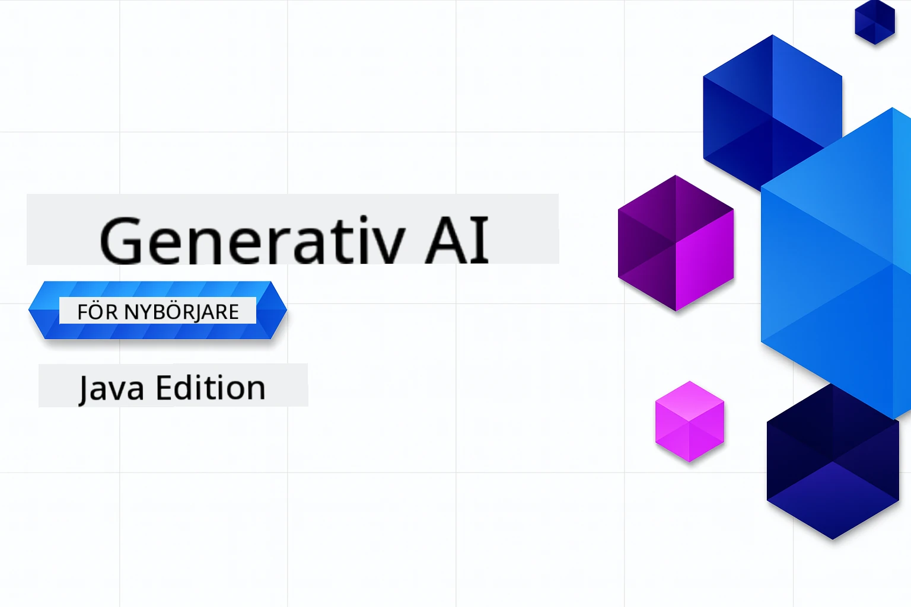

# Generativ AI för nybörjare - Java Edition
[](https://discord.gg/nTYy5BXMWG)



**Tidsåtgång**: Hela workshopen kan genomföras online utan lokal installation. Miljöinställningen tar 2 minuter, och att utforska exemplen kräver 1–3 timmar beroende på utforskningsdjup.

> **Snabbstart**

1. Forka detta arkiv till ditt GitHub-konto
2. Klicka på **Code** → fliken **Codespaces** → **...** → **New with options...**
3. Använd standardinställningarna – detta väljer utvecklingscontainern skapad för denna kurs
4. Klicka på **Create codespace**
5. Vänta cirka 2 minuter tills miljön är redo
6. Gå direkt till [Det första exemplet](./02-SetupDevEnvironment/README.md#step-2-create-a-github-personal-access-token)

> **Föredrar du att klona lokalt?**
>
> Detta arkiv innehåller över 50 språköversättningar vilket ökar nedladdningsstorleken avsevärt. För att klona utan översättningar, använd sparsamt utcheckning:
> ```bash
> git clone --filter=blob:none --sparse https://github.com/microsoft/Generative-AI-for-beginners-java.git
> cd Generative-AI-for-beginners-java
> git sparse-checkout set --no-cone '/*' '!translations' '!translated_images'
> ```
> Detta ger dig allt du behöver för att slutföra kursen med mycket snabbare nedladdning.


## Flerspråkigt stöd

### Stöds via GitHub Action (Automatiserat & Alltid uppdaterat)

<!-- CO-OP TRANSLATOR LANGUAGES TABLE START -->
[Arabiska](../ar/README.md) | [Bengali](../bn/README.md) | [Bulgarska](../bg/README.md) | [Burmese (Myanmar)](../my/README.md) | [Kinesiska (förenklad)](../zh-CN/README.md) | [Kinesiska (traditionell, Hongkong)](../zh-HK/README.md) | [Kinesiska (traditionell, Macau)](../zh-MO/README.md) | [Kinesiska (traditionell, Taiwan)](../zh-TW/README.md) | [Kroatiska](../hr/README.md) | [Tjeckiska](../cs/README.md) | [Danska](../da/README.md) | [Holländska](../nl/README.md) | [Estniska](../et/README.md) | [Finska](../fi/README.md) | [Franska](../fr/README.md) | [Tyska](../de/README.md) | [Grekiska](../el/README.md) | [Hebreiska](../he/README.md) | [Hindi](../hi/README.md) | [Ungerska](../hu/README.md) | [Indonesiska](../id/README.md) | [Italienska](../it/README.md) | [Japanska](../ja/README.md) | [Kannada](../kn/README.md) | [Koreanska](../ko/README.md) | [Litauiska](../lt/README.md) | [Malajiska](../ms/README.md) | [Malayalam](../ml/README.md) | [Marathi](../mr/README.md) | [Nepali](../ne/README.md) | [Nigeriansk pidgin](../pcm/README.md) | [Norska](../no/README.md) | [Persiska (Farsi)](../fa/README.md) | [Polska](../pl/README.md) | [Portugisiska (Brasilien)](../pt-BR/README.md) | [Portugisiska (Portugal)](../pt-PT/README.md) | [Punjabi (Gurmukhi)](../pa/README.md) | [Rumänska](../ro/README.md) | [Ryska](../ru/README.md) | [Serbiska (kyrilliska)](../sr/README.md) | [Slovakiska](../sk/README.md) | [Slovenska](../sl/README.md) | [Spanska](../es/README.md) | [Swahili](../sw/README.md) | [Svenska](./README.md) | [Tagalog (Filippinska)](../tl/README.md) | [Tamil](../ta/README.md) | [Telugu](../te/README.md) | [Thailändska](../th/README.md) | [Turkiska](../tr/README.md) | [Ukrainska](../uk/README.md) | [Urdu](../ur/README.md) | [Vietnamesiska](../vi/README.md)

## Kursstruktur & lärväg

### **Kapitel 1: Introduktion till Generativ AI**
- **Kärnkoncept**: Förståelse för stora språkmodeller, tokens, inbäddningar och AI-förmågor
- **Java AI-ekosystemet**: Översikt av Spring AI och OpenAI SDK:er
- **Model Context Protocol**: Introduktion till MCP och dess roll i AI-agenters kommunikation
- **Praktiska tillämpningar**: Verkliga scenarier inklusive chatbotar och innehållsgenerering
- **[→ Starta kapitel 1](./01-IntroToGenAI/README.md)**

### **Kapitel 2: Utvecklingsmiljösetup**
- **Multi-provider konfiguration**: Ställ in GitHub Models, Azure OpenAI och OpenAI Java SDK-integrationer
- **Spring Boot + Spring AI**: Bästa praxis för företags- AI-applikationsutveckling
- **GitHub Models**: Gratis AI-modellåtkomst för prototyper och lärande (ingen kreditkort krävs)
- **Utvecklingsverktyg**: Docker-containrar, VS Code och GitHub Codespaces-konfiguration
- **[→ Starta kapitel 2](./02-SetupDevEnvironment/README.md)**

### **Kapitel 3: Kärntekniker för Generativ AI**
- **Prompt engineering**: Tekniker för optimala AI-modellsvar
- **Inbäddningar & vektoroperationer**: Implementera semantisk sökning och likhetssökning
- **Retrieval-Augmented Generation (RAG)**: Kombinera AI med dina egna datakällor
- **Funktionsanrop**: Utöka AI-förmågor med egna verktyg och plugins
- **[→ Starta kapitel 3](./03-CoreGenerativeAITechniques/README.md)**

### **Kapitel 4: Praktiska tillämpningar & projekt**
- **Pet Story Generator** (`petstory/`): Kreativ innehållsgenerering med GitHub Models
- **Foundry Local Demo** (`foundrylocal/`): Lokal AI-modellsintegration med OpenAI Java SDK
- **MCP Calculator Service** (`calculator/`): Enkel Model Context Protocol-implementation med Spring AI
- **[→ Starta kapitel 4](./04-PracticalSamples/README.md)**

### **Kapitel 5: Ansvarsfull AI-utveckling**
- **GitHub Models säkerhet**: Testa inbyggda innehållsfilter och säkerhetsmekanismer (hårda blockeringar och mjuka avslag)
- **Demo för ansvarsfull AI**: Praktiskt exempel som visar hur moderna AI-säkerhetssystem fungerar i praktiken
- **Bästa praxis**: Viktiga riktlinjer för etisk AI-utveckling och -implementering
- **[→ Starta kapitel 5](./05-ResponsibleGenAI/README.md)**

## Ytterligare resurser

<!-- CO-OP TRANSLATOR OTHER COURSES START -->
### LangChain
[](https://aka.ms/langchain4j-for-beginners)
[](https://aka.ms/langchainjs-for-beginners?WT.mc_id=m365-94501-dwahlin)

---

### Azure / Edge / MCP / Agenter
[](https://github.com/microsoft/AZD-for-beginners?WT.mc_id=academic-105485-koreyst)
[](https://github.com/microsoft/edgeai-for-beginners?WT.mc_id=academic-105485-koreyst)
[](https://github.com/microsoft/mcp-for-beginners?WT.mc_id=academic-105485-koreyst)
[](https://github.com/microsoft/ai-agents-for-beginners?WT.mc_id=academic-105485-koreyst)

---
 
### Generative AI-serie
[](https://github.com/microsoft/generative-ai-for-beginners?WT.mc_id=academic-105485-koreyst)
[-9333EA?style=for-the-badge&labelColor=E5E7EB&color=9333EA)](https://github.com/microsoft/Generative-AI-for-beginners-dotnet?WT.mc_id=academic-105485-koreyst)
[-C084FC?style=for-the-badge&labelColor=E5E7EB&color=C084FC)](https://github.com/microsoft/generative-ai-for-beginners-java?WT.mc_id=academic-105485-koreyst)
[-E879F9?style=for-the-badge&labelColor=E5E7EB&color=E879F9)](https://github.com/microsoft/generative-ai-with-javascript?WT.mc_id=academic-105485-koreyst)

---
 
### Kärnkompetens
[](https://aka.ms/ml-beginners?WT.mc_id=academic-105485-koreyst)
[](https://aka.ms/datascience-beginners?WT.mc_id=academic-105485-koreyst)
[](https://aka.ms/ai-beginners?WT.mc_id=academic-105485-koreyst)
[](https://github.com/microsoft/Security-101?WT.mc_id=academic-96948-sayoung)
[](https://aka.ms/webdev-beginners?WT.mc_id=academic-105485-koreyst)
[](https://aka.ms/iot-beginners?WT.mc_id=academic-105485-koreyst)
[](https://github.com/microsoft/xr-development-for-beginners?WT.mc_id=academic-105485-koreyst)

---
 
### Copilot-serien
[](https://aka.ms/GitHubCopilotAI?WT.mc_id=academic-105485-koreyst)
[](https://github.com/microsoft/mastering-github-copilot-for-dotnet-csharp-developers?WT.mc_id=academic-105485-koreyst)
[](https://github.com/microsoft/CopilotAdventures?WT.mc_id=academic-105485-koreyst)
<!-- CO-OP TRANSLATOR OTHER COURSES END -->

## Få hjälp

Om du fastnar eller har några frågor om att bygga AI-appar. Gå med bland andra elever och erfarna utvecklare i diskussioner om MCP. Det är en stödjande gemenskap där frågor är välkomna och kunskap delas fritt.

[](https://discord.gg/nTYy5BXMWG)

Om du har produktfeedback eller fel under byggandet, besök:

[](https://aka.ms/foundry/forum)

---

<!-- CO-OP TRANSLATOR DISCLAIMER START -->
**Ansvarsfriskrivning**:
Detta dokument har översatts med hjälp av AI-översättningstjänsten [Co-op Translator](https://github.com/Azure/co-op-translator). Även om vi strävar efter noggrannhet, var vänlig notera att automatiska översättningar kan innehålla fel eller brister. Det ursprungliga dokumentet på dess ursprungsspråk bör betraktas som den auktoritativa källan. För kritisk information rekommenderas professionell mänsklig översättning. Vi ansvarar inte för eventuella missförstånd eller feltolkningar som uppstår från användningen av denna översättning.
<!-- CO-OP TRANSLATOR DISCLAIMER END -->