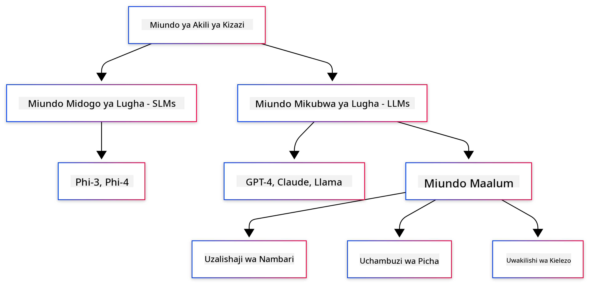
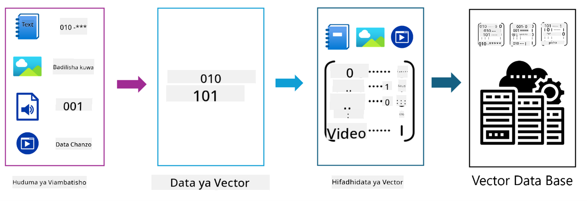
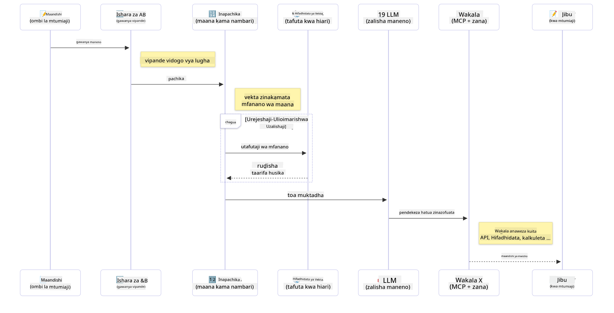

<!--
CO_OP_TRANSLATOR_METADATA:
{
  "original_hash": "75bfb080ca725e8a9aa9c80cae25fba1",
  "translation_date": "2025-07-29T09:55:48+00:00",
  "source_file": "01-IntroToGenAI/README.md",
  "language_code": "sw"
}
-->
# Utangulizi wa AI Jenereta - Toleo la Java

## Kile Utakachojifunza

- **Misingi ya AI Jenereta** ikijumuisha LLMs, uhandisi wa maelekezo (prompt engineering), tokeni, embeddings, na hifadhidata za vekta  
- **Kulinganisha zana za maendeleo ya AI kwa Java** ikijumuisha Azure OpenAI SDK, Spring AI, na OpenAI Java SDK  
- **Kugundua Itifaki ya Muktadha wa Mfano (Model Context Protocol)** na jukumu lake katika mawasiliano ya mawakala wa AI  

## Jedwali la Yaliyomo

- [Utangulizi](../../../01-IntroToGenAI)  
- [Mafunzo ya haraka kuhusu dhana za AI Jenereta](../../../01-IntroToGenAI)  
- [Mapitio ya uhandisi wa maelekezo](../../../01-IntroToGenAI)  
- [Tokeni, embeddings, na mawakala](../../../01-IntroToGenAI)  
- [Zana na Maktaba za Maendeleo ya AI kwa Java](../../../01-IntroToGenAI)  
  - [OpenAI Java SDK](../../../01-IntroToGenAI)  
  - [Spring AI](../../../01-IntroToGenAI)  
  - [Azure OpenAI Java SDK](../../../01-IntroToGenAI)  
- [Muhtasari](../../../01-IntroToGenAI)  
- [Hatua Zifuatazo](../../../01-IntroToGenAI)  

## Utangulizi

Karibu kwenye sura ya kwanza ya AI Jenereta kwa Kompyuta - Toleo la Java! Somo hili la msingi litakutambulisha kwenye dhana kuu za AI jenereta na jinsi ya kuzitumia kwa Java. Utajifunza kuhusu vipengele vya msingi vya programu za AI, ikijumuisha Miundo Mikubwa ya Lugha (LLMs), tokeni, embeddings, na mawakala wa AI. Pia tutachunguza zana kuu za Java utakazotumia katika kozi hii.

### Mafunzo ya haraka kuhusu dhana za AI Jenereta

AI jenereta ni aina ya akili bandia inayounda maudhui mapya, kama vile maandishi, picha, au msimbo, kulingana na mifumo na uhusiano uliyojifunza kutoka kwa data. Miundo ya AI jenereta inaweza kutoa majibu yanayofanana na ya binadamu, kuelewa muktadha, na wakati mwingine hata kuunda maudhui yanayoonekana kama ya binadamu.

Unapounda programu zako za AI kwa Java, utatumia **miundo ya AI jenereta** kuunda maudhui. Baadhi ya uwezo wa miundo ya AI jenereta ni pamoja na:

- **Uundaji wa Maandishi**: Kuandika maandishi yanayofanana na ya binadamu kwa ajili ya roboti za mazungumzo, maudhui, na ukamilishaji wa maandishi.  
- **Uundaji na Uchambuzi wa Picha**: Kutengeneza picha halisi, kuboresha picha, na kugundua vitu.  
- **Uundaji wa Msimbo**: Kuandika vipande vya msimbo au hati.  

Kuna aina maalum za miundo iliyoboreshwa kwa kazi tofauti. Kwa mfano, **Miundo Midogo ya Lugha (SLMs)** na **Miundo Mikubwa ya Lugha (LLMs)** zote zinaweza kushughulikia uundaji wa maandishi, huku LLMs zikitoa utendaji bora zaidi kwa kazi ngumu. Kwa kazi zinazohusiana na picha, ungetumia miundo maalum ya kuona au miundo ya njia nyingi.

Bila shaka, majibu kutoka kwa miundo hii si kamilifu kila wakati. Huenda umesikia kuhusu miundo "ikihalusi" au kutoa taarifa zisizo sahihi kwa njia ya mamlaka. Lakini unaweza kusaidia kuongoza mfano kutoa majibu bora kwa kuwapa maelekezo na muktadha wazi. Hapa ndipo **uhandisi wa maelekezo** unapoingia.

#### Mapitio ya uhandisi wa maelekezo

Uhandisi wa maelekezo ni mazoezi ya kubuni pembejeo bora ili kuongoza miundo ya AI kuelekea matokeo yanayotakiwa. Inahusisha:

- **Uwazi**: Kufanya maelekezo yawe wazi na yasiyo na utata.  
- **Muktadha**: Kutoa taarifa muhimu za msingi.  
- **Vikwazo**: Kubainisha mapungufu au miundo yoyote.  

Baadhi ya mbinu bora za uhandisi wa maelekezo ni pamoja na kubuni maelekezo, maelekezo wazi, kuvunja kazi, kujifunza kwa mfano mmoja na mifano michache, na kurekebisha maelekezo. Kupima maelekezo tofauti ni muhimu ili kupata kile kinachofanya kazi vyema kwa matumizi yako maalum.

Unapounda programu, utatumia aina tofauti za maelekezo:  
- **Maelekezo ya Mfumo**: Weka sheria za msingi na muktadha wa tabia ya mfano  
- **Maelekezo ya Mtumiaji**: Data ya pembejeo kutoka kwa watumiaji wa programu yako  
- **Maelekezo ya Msaidizi**: Majibu ya mfano kulingana na maelekezo ya mfumo na mtumiaji  

> **Jifunze zaidi**: Jifunze zaidi kuhusu uhandisi wa maelekezo katika [Sura ya Uhandisi wa Maelekezo ya kozi ya GenAI kwa Kompyuta](https://github.com/microsoft/generative-ai-for-beginners/tree/main/04-prompt-engineering-fundamentals)

#### Tokeni, embeddings, na mawakala

Unapofanya kazi na miundo ya AI jenereta, utakutana na maneno kama **tokeni**, **embeddings**, **mawakala**, na **Itifaki ya Muktadha wa Mfano (MCP)**. Hapa kuna muhtasari wa kina wa dhana hizi:

- **Tokeni**: Tokeni ni kipande kidogo zaidi cha maandishi katika mfano. Inaweza kuwa maneno, herufi, au sehemu za maneno. Tokeni hutumika kuwakilisha data ya maandishi kwa muundo ambao mfano unaweza kuelewa. Kwa mfano, sentensi "The quick brown fox jumped over the lazy dog" inaweza kugawanywa kama ["The", " quick", " brown", " fox", " jumped", " over", " the", " lazy", " dog"] au ["The", " qu", "ick", " br", "own", " fox", " jump", "ed", " over", " the", " la", "zy", " dog"] kulingana na mkakati wa kugawanya.

Mchakato wa kugawanya maandishi kuwa vipande vidogo hivi huitwa tokenization. Hii ni muhimu kwa sababu miundo hufanya kazi na tokeni badala ya maandishi ghafi. Idadi ya tokeni katika maelekezo huathiri urefu na ubora wa majibu ya mfano, kwani miundo ina mipaka ya tokeni kwa dirisha lake la muktadha (mfano, tokeni 128K kwa muktadha wa jumla wa GPT-4o, ikijumuisha pembejeo na pato).

  Katika Java, unaweza kutumia maktaba kama OpenAI SDK kushughulikia tokenization kiotomatiki unapowasilisha maombi kwa miundo ya AI.

- **Embeddings**: Embeddings ni uwakilishi wa vekta wa tokeni unaokamata maana ya kisemantiki. Ni uwakilishi wa nambari (kawaida safu za nambari za nukta ya kuelea) unaoruhusu miundo kuelewa uhusiano kati ya maneno na kutoa majibu yanayofaa kwa muktadha. Maneno yanayofanana yana embeddings zinazofanana, kuwezesha mfano kuelewa dhana kama visawe na uhusiano wa kisemantiki.

  Katika Java, unaweza kuunda embeddings ukitumia OpenAI SDK au maktaba nyingine zinazounga mkono uundaji wa embeddings. Embeddings hizi ni muhimu kwa kazi kama utafutaji wa kisemantiki, ambapo unataka kupata maudhui yanayofanana kulingana na maana badala ya mechi halisi ya maandishi.

- **Hifadhidata za vekta**: Hifadhidata za vekta ni mifumo maalum ya kuhifadhi iliyoboreshwa kwa embeddings. Zinawawezesha utafutaji wa kufanana kwa ufanisi na ni muhimu kwa mifumo ya RAG (Retrieval-Augmented Generation) ambapo unahitaji kupata taarifa muhimu kutoka kwa seti kubwa za data kulingana na kufanana kwa kisemantiki badala ya mechi halisi.

> **Kumbuka**: Katika kozi hii, hatutashughulikia hifadhidata za vekta lakini tunadhani ni muhimu kuzitaja kwani zinatumiwa sana katika programu za ulimwengu halisi.

- **Mawakala & MCP**: Vipengele vya AI vinavyoshirikiana kwa uhuru na miundo, zana, na mifumo ya nje. Itifaki ya Muktadha wa Mfano (MCP) hutoa njia sanifu kwa mawakala kufikia vyanzo vya data vya nje na zana kwa usalama. Jifunze zaidi katika kozi yetu ya [MCP kwa Kompyuta](https://github.com/microsoft/mcp-for-beginners).

Katika programu za AI za Java, utatumia tokeni kwa usindikaji wa maandishi, embeddings kwa utafutaji wa kisemantiki na RAG, hifadhidata za vekta kwa upatikanaji wa data, na mawakala na MCP kwa kujenga mifumo ya akili inayotumia zana.

### Zana na Maktaba za Maendeleo ya AI kwa Java

Java inatoa zana bora kwa maendeleo ya AI. Kuna maktaba tatu kuu ambazo tutachunguza katika kozi hii - OpenAI Java SDK, Azure OpenAI SDK, na Spring AI.

Hapa kuna jedwali la kumbukumbu ya haraka linaloonyesha ni SDK gani inatumiwa katika mifano ya kila sura:

| Sura | Mfano | SDK |  
|---------|--------|-----|  
| 02-SetupDevEnvironment | github-models | OpenAI Java SDK |  
| 02-SetupDevEnvironment | basic-chat-azure | Spring AI Azure OpenAI |  
| 03-CoreGenerativeAITechniques | examples | Azure OpenAI SDK |  
| 04-PracticalSamples | petstory | OpenAI Java SDK |  
| 04-PracticalSamples | foundrylocal | OpenAI Java SDK |  
| 04-PracticalSamples | calculator | Spring AI MCP SDK + LangChain4j |  

**Viungo vya Nyaraka za SDK:**  
- [Azure OpenAI Java SDK](https://github.com/Azure/azure-sdk-for-java/tree/azure-ai-openai_1.0.0-beta.16/sdk/openai/azure-ai-openai)  
- [Spring AI](https://docs.spring.io/spring-ai/reference/)  
- [OpenAI Java SDK](https://github.com/openai/openai-java)  
- [LangChain4j](https://docs.langchain4j.dev/)  

#### OpenAI Java SDK

OpenAI SDK ni maktaba rasmi ya Java kwa API ya OpenAI. Inatoa kiolesura rahisi na thabiti cha kuingiliana na miundo ya OpenAI, na kuifanya iwe rahisi kuingiza uwezo wa AI katika programu za Java. Mfano wa GitHub Models wa Sura ya 2, programu ya Pet Story ya Sura ya 4, na mfano wa Foundry Local zinaonyesha mbinu ya OpenAI SDK.

#### Spring AI

Spring AI ni mfumo wa kina unaoleta uwezo wa AI kwa programu za Spring, ukitoa safu thabiti ya unyumbufu kwa watoa huduma tofauti wa AI. Inaunganishwa bila mshono na mfumo wa Spring, na kuifanya kuwa chaguo bora kwa programu za Java za biashara zinazohitaji uwezo wa AI.

Nguvu ya Spring AI iko katika ujumuishaji wake wa bila mshono na mfumo wa Spring, na kuifanya iwe rahisi kujenga programu za AI tayari kwa uzalishaji kwa kutumia mifumo ya kawaida ya Spring kama sindano ya utegemezi, usimamizi wa usanidi, na mifumo ya majaribio. Utatumia Spring AI katika Sura ya 2 na 4 kujenga programu zinazotumia maktaba za OpenAI na Model Context Protocol (MCP) za Spring AI.

##### Itifaki ya Muktadha wa Mfano (MCP)

[Itifaki ya Muktadha wa Mfano (MCP)](https://modelcontextprotocol.io/) ni kiwango kinachojitokeza kinachowezesha programu za AI kuingiliana kwa usalama na vyanzo vya data vya nje na zana. MCP hutoa njia sanifu kwa miundo ya AI kufikia taarifa za muktadha na kutekeleza vitendo katika programu zako.

Katika Sura ya 4, utajenga huduma rahisi ya kikokotoo cha MCP inayoonyesha misingi ya Itifaki ya Muktadha wa Mfano kwa kutumia Spring AI, ikionyesha jinsi ya kuunda ujumuishaji wa zana za msingi na usanifu wa huduma.

#### Azure OpenAI Java SDK

Maktaba ya mteja ya Azure OpenAI kwa Java ni marekebisho ya API za REST za OpenAI zinazotoa kiolesura cha kawaida na ujumuishaji na mfumo wa SDK wa Azure. Katika Sura ya 3, utajenga programu kwa kutumia Azure OpenAI SDK, ikijumuisha programu za mazungumzo, kupiga kazi, na mifumo ya RAG (Retrieval-Augmented Generation).

> Kumbuka: Azure OpenAI SDK iko nyuma ya OpenAI Java SDK kwa suala la vipengele, hivyo kwa miradi ya baadaye, zingatia kutumia OpenAI Java SDK.

## Muhtasari

Hiyo inahitimisha misingi! Sasa unaelewa:

- Dhana kuu nyuma ya AI jenereta - kutoka LLMs na uhandisi wa maelekezo hadi tokeni, embeddings, na hifadhidata za vekta  
- Chaguo zako za zana kwa maendeleo ya AI kwa Java: Azure OpenAI SDK, Spring AI, na OpenAI Java SDK  
- Itifaki ya Muktadha wa Mfano ni nini na jinsi inavyowezesha mawakala wa AI kufanya kazi na zana za nje  

## Hatua Zifuatazo

[Sura ya 2: Kuweka Mazingira ya Maendeleo](../02-SetupDevEnvironment/README.md)  

**Kanusho**:  
Hati hii imetafsiriwa kwa kutumia huduma ya tafsiri ya AI [Co-op Translator](https://github.com/Azure/co-op-translator). Ingawa tunajitahidi kwa usahihi, tafadhali fahamu kuwa tafsiri za kiotomatiki zinaweza kuwa na makosa au kutokuwa sahihi. Hati ya asili katika lugha yake ya awali inapaswa kuzingatiwa kama chanzo cha mamlaka. Kwa taarifa muhimu, inashauriwa kutumia huduma ya tafsiri ya kitaalamu ya binadamu. Hatutawajibika kwa maelewano mabaya au tafsiri zisizo sahihi zinazotokana na matumizi ya tafsiri hii.