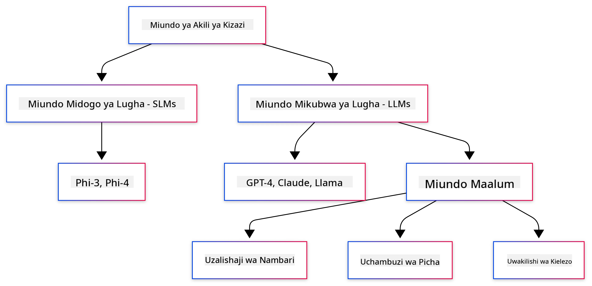
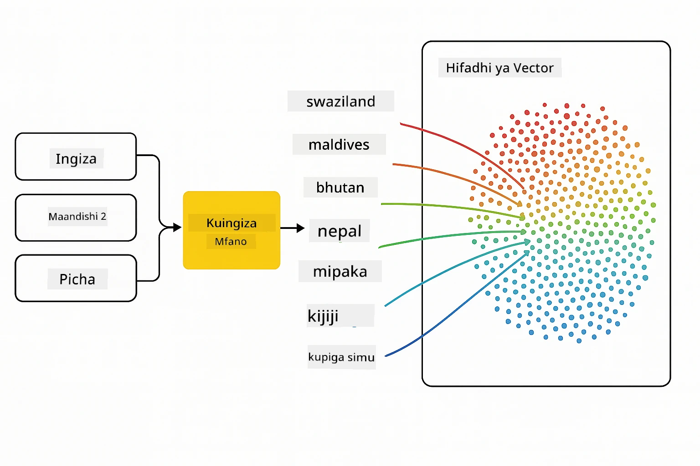
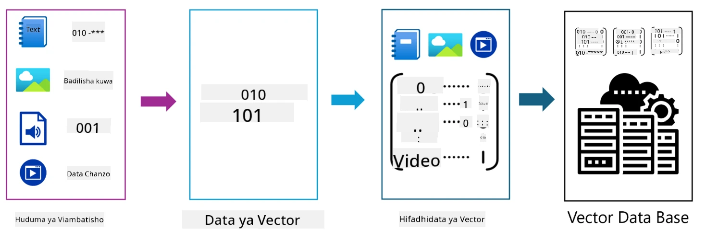
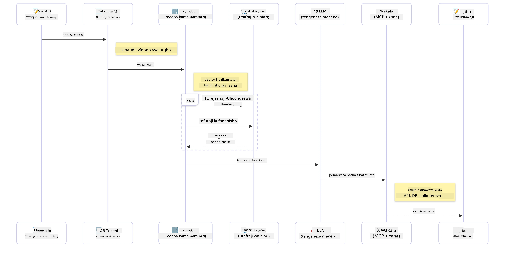

# Utangulizi wa AI Inayozalisha - Toleo la Java

> **Video**: [Tazama muhtasari wa video kwa somo hili kwenye YouTube.](https://www.youtube.com/watch?v=XH46tGp_eSw) Unaweza pia kubofya picha ya kichwa cha habari hapo juu.

## Utakuwa Unajifunza Nini

- **Misingi ya AI Inayozalisha** ikiwa ni pamoja na LLMs, uhandisi wa prompt, tokens, embeddings, na hifadhidata za vector
- **Linganisho la zana za maendeleo ya AI za Java** ikiwa ni pamoja na Azure OpenAI SDK, Spring AI, na OpenAI Java SDK
- **Gundua Itifaki ya Muktadha wa Mfano (Model Context Protocol)** na jukumu lake katika mawasiliano ya mawakala wa AI

## Jedwali la Maudhui

- [Utangulizi](#utangulizi)
- [Kumbukumbu haraka juu ya dhana za AI Inayozalisha](#kumbukumbu-haraka-juu-ya-dhana-za-ai-inayozalisha)
- [Mapitio ya uhandisi wa prompt](#mapitio-ya-uhandisi-wa-prompt)
- [Tokens, embeddings, na mawakala](#tokens-embeddings-na-mawakala)
- [Zana na Maktaba za Maendeleo ya AI kwa Java](#zana-na-maktaba-za-maendeleo-ya-ai-kwa-java)
  - [OpenAI Java SDK](#openai-java-sdk)
  - [Spring AI](#spring-ai)
  - [Azure OpenAI Java SDK](#azure-openai-java-sdk)
- [Muhtasari](#muhtasari)
- [Hatua Zifuatazo](#hatua-zifuatazo)

## Utangulizi

Karibu kwenye sura ya kwanza ya AI Inayozalisha kwa Waanzilishi - Toleo la Java! Somo hili la msingi linakuanzisha kwa dhana kuu za AI inayozalisha na jinsi ya kufanya kazi nazo kwa kutumia Java. Utajifunza kuhusu vipengele muhimu vya programu za AI, ikiwa ni pamoja na Mifano Mikubwa ya Lugha (LLMs), tokens, embeddings, na mawakala wa AI. Pia tutaangazia zana kuu za Java ambazo utazitumia katika kozi hii yote.

### Kumbukumbu haraka juu ya dhana za AI Inayozalisha

AI inayozalisha ni aina ya akili bandia ambayo huunda maudhui mapya, kama vile maandishi, picha, au msimbo, kutokana na mifumo na uhusiano uliyojifunza kutoka kwa data. Mifano ya AI inayozalisha inaweza kutoa majibu yanayofanana na ya binadamu, kuelewa muktadha, na wakati mwingine hata kuunda maudhui yanayoonekana kama ya binadamu.

Unapotengeneza programu zako za AI za Java, utatumia **mifano ya AI inayozalisha** kuunda maudhui. Baadhi ya uwezo wa mifano ya AI inayozalisha ni pamoja na:

- **Uundaji wa Maandishi**: Kutengeneza maandishi yanayofanana na ya binadamu kwa chatbots, maudhui, na kukamilisha maandishi.
- **Uundaji na Uchambuzi wa Picha**: Kutengeneza picha halisi, kuboresha picha, na kugundua vitu.
- **Uundaji wa Msimbo**: Kuandika vipande vya msimbo au scripti.

Kuna aina maalum za mifano ambayo imetengenezwa kwa kazi tofauti. Kwa mfano, **Mifano Midogo ya Lugha (SLMs)** na **Mifano Mikubwa ya Lugha (LLMs)** zote zinaweza kushughulikia uundaji wa maandishi, ambapo LLMs kwa kawaida hutoa utendaji bora kwa kazi ngumu. Kwa kazi zinazohusiana na picha, utatumia mifano maalum ya kuona au mifano ya modal nyingi.

Bila shaka, majibu kutoka kwa mifano hii si kamili kila wakati. Labda umesikia kuhusu mifano "kuzalisha hadithi zisizo za kweli" au kutoa taarifa zisizo sahihi kwa namna ya mamlaka. Lakini unaweza kusaidia kuelekeza mfano kutoa majibu bora kwa kumpa maelekezo wazi na muktadha. Hapa ndipo **uhandisi wa prompt** unapoingia.

#### Mapitio ya uhandisi wa prompt

Uhandisi wa prompt ni mazoezi ya kubuni ingizo bora ili kuelekeza mifano ya AI kutoa matokeo yanayohitajika. Inahusisha:

- **Uwazi**: Kufanya maelekezo kuwa wazi na yasiyo na mkanganyiko.
- **Muktadha**: Kutoa taarifa muhimu za msingi.
- **Mipaka**: Kubainisha vizuizi au miundo yoyote.

Baadhi ya mbinu bora za uhandisi wa prompt ni pamoja na kubuni prompt, maelekezo wazi, kugawanya kazi, kujifunza kwa mara moja na mara chache, na kurekebisha prompt. Kupima prompt tofauti ni muhimu ili kupata kinachofaa zaidi kwa matumizi yako maalum.

Unapozalisha programu, utakuwa unafanya kazi na aina tofauti za prompt:
- **Prompt za mfumo**: Kuweka sheria za msingi na muktadha wa tabia ya mfano
- **Prompt za mtumiaji**: Data ya ingizo kutoka kwa watumiaji wa programu yako
- **Prompt za msaidizi**: Majibu ya mfano yanayotokana na prompt za mfumo na mtumiaji

> **Jifunze zaidi**: Jifunze zaidi kuhusu uhandisi wa prompt katika [Sura ya Uhandisi wa Prompt ya kozi ya GenAI kwa Waanzilishi](https://github.com/microsoft/generative-ai-for-beginners/tree/main/04-prompt-engineering-fundamentals)

#### Tokens, embeddings, na mawakala

Unapofanya kazi na mifano ya AI inayozalisha, utakutana na maneno kama **tokens**, **embeddings**, **mawakala**, na **Itifaki ya Muktadha wa Mfano (Model Context Protocol - MCP)**. Hapa kuna muhtasari wa kina wa dhana hizi:

- **Tokens**: Tokens ni kitengo kidogo kabisa cha maandishi kwenye mfano. Huweza kuwa maneno, herufi, au sehemu za maneno. Tokens hutumika kuwakilisha data za maandishi kwa njia ambayo mfano unaweza kuelewa. Kwa mfano, sentensi "The quick brown fox jumped over the lazy dog" inaweza kugawanywa tokens kama ["The", " quick", " brown", " fox", " jumped", " over", " the", " lazy", " dog"] au ["The", " qu", "ick", " br", "own", " fox", " jump", "ed", " over", " the", " la", "zy", " dog"] kulingana na mbinu ya tokenization.

Tokenization ni mchakato wa kugawanya maandishi kuwa vitengo vidogo hivi. Hii ni muhimu kwa sababu mifano hufanya kazi kwa tokens badala ya maandishi ghafi. Idadi ya tokens kwenye prompt inaathiri urefu na ubora wa jibu la mfano, kwani mifano ina mipaka ya tokens kwa dirisha la muktadha (mfano, tokens 128K kwa jumla ya muktadha wa GPT-4o, ikiwa ni pamoja na ingizo na matokeo).

  Katika Java, unaweza kutumia maktaba kama OpenAI SDK kushughulikia tokenization moja kwa moja wakati wa kutuma maombi kwa mifano ya AI.

- **Embeddings**: Embeddings ni uwakilishi wa vector wa tokens unaoshikilia maana ya kisemantiki. Ni uwakilishi wa nambari (kawaida ni safu za nambari zenye sehemu za desimali) zinazowezesha mifano kuelewa uhusiano kati ya maneno na kutoa majibu yanayohusiana na muktadha. Maneno yanayofanana yana embeddings zinazofanana, hivyo mfano unaweza kuelewa dhana kama wahasama na uhusiano wa ki-semantic.

  Katika Java, unaweza kuzalisha embeddings kwa kutumia OpenAI SDK au maktaba nyingine zinazounga mkono uzalishaji wa embeddings. Embeddings hizi ni muhimu kwa kazi kama utaftaji wa semantic, ambapo unataka kupata maudhui yanayofanana kulingana na maana badala ya maneno halisi.

- **Hifadhidata za vector**: Hifadhidata za vector ni mifumo maalum ya kuhifadhi inayobobea kwa embeddings. Zinawawezesha utafutaji wa ufanisi wa usawa na ni muhimu kwa mifumo ya Retrieval-Augmented Generation (RAG) ambapo unahitaji kupata taarifa inayohusiana kutoka kwa seti kubwa za data kulingana na usawa wa maana badala ya mlingano wa maneno halisi.

> **Kumbuka**: Katika kozi hii, hatutafunikia hifadhidata za vector lakini tunadhani ni muhimu kuzitaja kwa sababu hutumika sana katika programu halisi.

- **Mawakala & MCP**: Vipengele vya AI ambavyo huingiliana kwa uhuru na mifano, zana, na mifumo ya nje. Itifaki ya Muktadha wa Mfano (MCP) hutoa njia iliyopangwa kwa mawakala kupata salama vyanzo vya data na zana za nje. Jifunze zaidi katika [kozi yetu ya MCP kwa Waanzilishi](https://github.com/microsoft/mcp-for-beginners).

Katika programu za AI za Java, utatumia tokens kwa uchakataji wa maandishi, embeddings kwa utaftaji wa semantic na RAG, hifadhidata za vector kwa upatikanaji wa data, na mawakala na MCP kwa kujenga mifumo mahiri inayotumia zana. 

### Zana na Maktaba za Maendeleo ya AI kwa Java

Java inatoa zana bora za maendeleo ya AI. Kuna maktaba kuu tatu ambazo tutajifunza katika kozi hii - OpenAI Java SDK, Azure OpenAI SDK, na Spring AI.

Hapa kuna jedwali la kumbukumbu la haraka linaonyesha SDK inayotumika katika mifano ya kila sura:

| Sura | Mfano | SDK |
|---------|--------|-----|
| 02-SetupDevEnvironment | github-models | OpenAI Java SDK |
| 02-SetupDevEnvironment | basic-chat-azure | Spring AI Azure OpenAI |
| 03-CoreGenerativeAITechniques | examples | Azure OpenAI SDK |
| 04-PracticalSamples | petstory | OpenAI Java SDK |
| 04-PracticalSamples | foundrylocal | OpenAI Java SDK |
| 04-PracticalSamples | calculator | Spring AI MCP SDK + LangChain4j |

**Viungo vya Nyaraka za SDK:**
- [Azure OpenAI Java SDK](https://github.com/Azure/azure-sdk-for-java/tree/azure-ai-openai_1.0.0-beta.16/sdk/openai/azure-ai-openai)
- [Spring AI](https://docs.spring.io/spring-ai/reference/)
- [OpenAI Java SDK](https://github.com/openai/openai-java)
- [LangChain4j](https://docs.langchain4j.dev/)

#### OpenAI Java SDK

OpenAI SDK ni maktaba rasmi ya Java kwa API ya OpenAI. Inatoa interface rahisi na thabiti ya kuingiliana na mifano ya OpenAI, na kufanya iwe rahisi kuingiza uwezo wa AI katika programu za Java. Mfano wa GitHub Models wa Sura ya 2, programu ya Pet Story na mfano wa Foundry Local wa Sura ya 4 vinaonyesha njia ya OpenAI SDK.

#### Spring AI

Spring AI ni mfumo wa kina unaoleta uwezo wa AI kwenye programu za Spring, ukitoa tabaka la abstraction linalo thibiti kwa watoa huduma tofauti za AI. Inajumuisha vizuri na mazingira ya Spring, na kufanya kuwa chaguo bora kwa programu za ki-enterprise za Java zinazohitaji uwezo wa AI.

Nguvu ya Spring AI iko katika ujumuishaji wake mzuri na mazingira ya Spring, na kufanya iwe rahisi kujenga programu za AI tayari kwa utengenezaji kwa kutumia mifumo inayojulikana ya Spring kama vile dependency injection, usimamizi wa usanidi, na mifumo ya upimaji. Utatumia Spring AI katika Sura ya 2 na 4 kujenga programu zinazotumia OpenAI na maktaba za MCP za Spring AI.

##### Itifaki ya Muktadha wa Mfano (MCP)

[Itifaki ya Muktadha wa Mfano (MCP)](https://modelcontextprotocol.io/) ni kiwango kinachozidi kuibuka kinachowezesha programu za AI kuingiliana kwa usalama na vyanzo vya data na zana za nje. MCP hutoa njia iliyobainishwa kwa mifano ya AI kupata taarifa za muktadha na kutekeleza vitendo katika programu zako.

Katika Sura ya 4, utajenga huduma rahisi ya kalkuleta ya MCP inayoonyesha misingi ya Itifaki ya Muktadha wa Mfano kwa Spring AI, ikionyesha jinsi ya kutengeneza ujumuishaji wa zana za msingi na miundo ya huduma.

#### Azure OpenAI Java SDK

Maktaba ya mteja ya Azure OpenAI kwa Java ni marekebisho ya API za REST za OpenAI inayotoa interface ya kitaalamu na ujumuishaji na mazingira mengine ya SDK ya Azure. Katika Sura ya 3, utatengeneza programu kwa kutumia Azure OpenAI SDK, ikiwa ni pamoja na programu za mazungumzo, kuitisha kazi, na mifumo ya RAG (Retrieval-Augmented Generation).

> Kumbuka: Azure OpenAI SDK bado inatoweza sifa fulani ikilinganishwa na OpenAI Java SDK, kwa hivyo katika miradi ya baadaye, fikiria kutumia OpenAI Java SDK.

## Muhtasari

Hiyo ni msingi umeiweka! Sasa unaelewa:

- Dhana kuu nyuma ya AI inayozalisha - kutoka LLMs na uhandisi wa prompt hadi tokens, embeddings, na hifadhidata za vector
- Chaguzi zako za zana za maendeleo ya AI za Java: Azure OpenAI SDK, Spring AI, na OpenAI Java SDK
- Itifaki ya Muktadha wa Mfano ni nini na jinsi inavyowezesha mawakala wa AI kufanya kazi na zana za nje

## Hatua Zifuatazo

[Sura 2: Kufunga Mazingira ya Maendeleo](../02-SetupDevEnvironment/README.md)

---

<!-- CO-OP TRANSLATOR DISCLAIMER START -->
**Kiadhabu**:
Hati hii imetafsiriwa kwa kutumia huduma ya tafsiri ya AI [Co-op Translator](https://github.com/Azure/co-op-translator). Ingawa tunajitahidi kwa usahihi, tafadhali fahamu kwamba tafsiri za kiotomatiki zinaweza kuwa na makosa au kasoro. Hati asili katika lugha yake ya asili inapaswa kuchukuliwa kama chanzo kinachoaminika. Kwa taarifa muhimu, tafsiri ya kitaalamu ya binadamu inashauriwa. Hatuwajibiki kwa kutokuelewana au tafsiri potofu zinazotokana na matumizi ya tafsiri hii.
<!-- CO-OP TRANSLATOR DISCLAIMER END -->