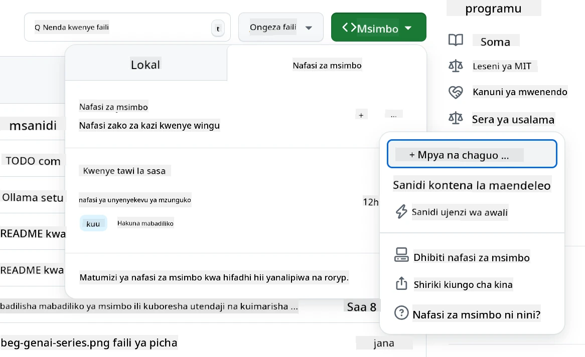
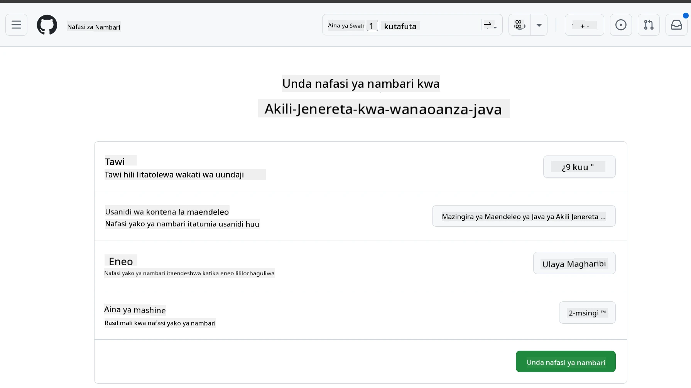
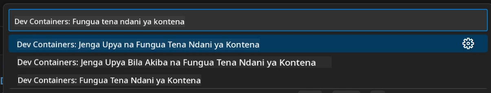
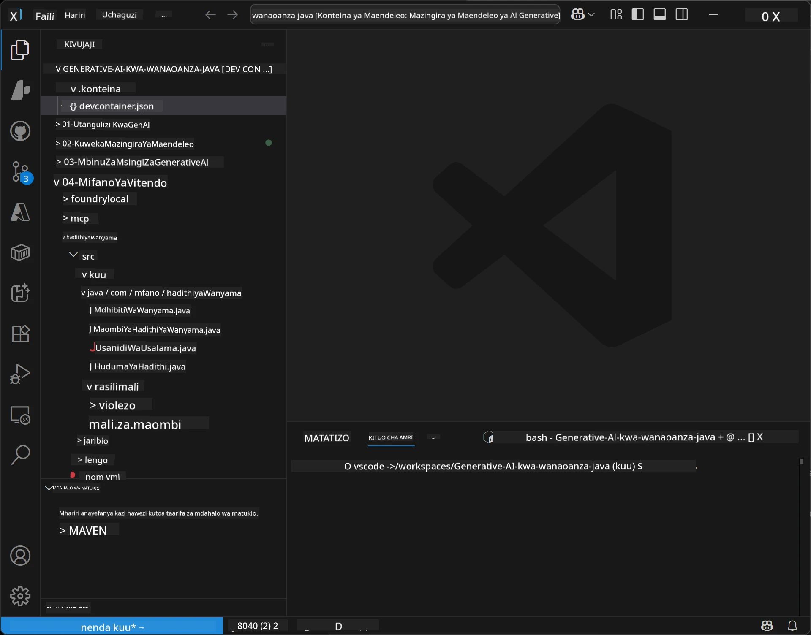

<!--
CO_OP_TRANSLATOR_METADATA:
{
  "original_hash": "96a30d42b9751a3d4e4b20e28d29d459",
  "translation_date": "2026-01-28T05:15:44+00:00",
  "source_file": "02-SetupDevEnvironment/README.md",
  "language_code": "sw"
}
-->
# Kuweka Mazingira ya Maendeleo kwa AI ya Kizazi kwa Java

> **Anza Haraka**: Andika Msimbo Katika Cloud kwa Dakika 2 - Ruka kwa [Mpangilio wa GitHub Codespaces](../../../02-SetupDevEnvironment) - hakuna usakinishaji wa ndani unahitajika na hutumia mifano ya github!

> **Una nia ya Azure OpenAI?**, ona [Mwongozo wetu wa Mpangilio wa Azure OpenAI](getting-started-azure-openai.md) na hatua za kuunda rasilimali mpya ya Azure OpenAI.

## Utajifunza Nini

- Weka mazingira ya maendeleo ya Java kwa programu za AI
- Chagua na sanifu mazingira yako ya maendeleo unayopendelea (cloud-first na Codespaces, kontena la maendeleo la ndani, au mpangilio kamili wa ndani)
- Jaribu mpangilio wako kwa kuunganishwa na Mifano ya GitHub

## Jedwali la Maudhui

- [Utajifunza Nini](../../../02-SetupDevEnvironment)
- [Utangulizi](../../../02-SetupDevEnvironment)
- [Hatua ya 1: Weka Mazingira Yako ya Maendeleo](../../../02-SetupDevEnvironment)
  - [Chaguo A: GitHub Codespaces (Inapendekezwa)](../../../02-SetupDevEnvironment)
  - [Chaguo B: Kontena la Maendeleo la Ndani](../../../02-SetupDevEnvironment)
  - [Chaguo C: Tumia Usakinishaji Wako wa Ndani Ulio Tayari](../../../02-SetupDevEnvironment)
- [Hatua ya 2: Tengeneza Token ya Ufikiaji wa Binafsi GitHub](../../../02-SetupDevEnvironment)
- [Hatua ya 3: Jaribu Mpangilio Wako](../../../02-SetupDevEnvironment)
- [Kutatua Matatizo](../../../02-SetupDevEnvironment)
- [Muhtasari](../../../02-SetupDevEnvironment)
- [Hatua Zifuatazo](../../../02-SetupDevEnvironment)

## Utangulizi

Sura hii itakuongoza kupitia kuanzisha mazingira ya maendeleo. Tutatumia **Mifano ya GitHub** kama mfano wetu kuu kwa sababu ni bure, rahisi kuanzisha kwa akaunti ya GitHub tu, haina haja ya kadi ya mkopo, na inatoa ufikiaji wa mifano mingi kwa majaribio.

**Hakuna usakinishaji wa ndani unahitajika!** Unaweza kuanza kuandika msimbo mara moja ukitumia GitHub Codespaces, inayotoa mazingira kamili ya maendeleo kwenye kivinjari chako.


Tunapendekeza kutumia [**Mifano ya GitHub**](https://github.com/marketplace?type=models) kwa kozi hii kwa sababu ni:
- **Bure** kuanza
- **Rahisi** kuanzisha kwa akaunti ya GitHub tu
- **Hakuna kadi ya mkopo** inahitajika
- **Mifano mingi** inapatikana kwa majaribio

> **Kumbuka**: Mifano ya GitHub inayotumiwa katika mafunzo haya ina mipaka hii ya bure:
> - Maombi 15 kwa dakika (150 kwa siku)
> - ~maneno 8,000 ya kuingiza, ~maneno 4,000 ya kutolewa kwa kila ombi
> - Maombi 5 yanayofanya kazi kwa wakati mmoja
> 
> Kwa matumizi ya uzalishaji, boresha hadi Azure AI Foundry Models kwa akaunti yako ya Azure. Msimbo wako hauhitaji kubadilika. Angalia [nyaraka za Azure AI Foundry](https://learn.microsoft.com/azure/ai-foundry/foundry-models/how-to/quickstart-github-models).

## Hatua ya 1: Weka Mazingira Yako ya Maendeleo

<a name="quick-start-cloud"></a>

Tumetengeneza kontena la maendeleo lililosanifiwa tayari kupunguza muda wa kuanzisha na kuhakikisha una vifaa vyote muhimu kwa kozi hii ya AI ya Kizazi kwa Java. Chagua njia ya maendeleo unayopendelea:

### Chaguzi za Mpangilio wa Mazingira:

#### Chaguo A: GitHub Codespaces (Inapendekezwa)

**Anza kuandika msimbo ndani ya dakika 2 - hakuna usakinishaji wa ndani unahitajika!**

1. Fanya fork ya hazina hii kwenye akaunti yako ya GitHub
   > **Kumbuka**: Ikiwa unataka kuhariri usanidi msingi tafadhali angalia [Mpangilio wa Kontena ya Maendeleo](../../../.devcontainer/devcontainer.json)
2. Bonyeza **Code** → kichupo cha **Codespaces** → **...** → **New with options...**
3. Tumia chaguo-msingi – hii itachagua **Mpangilio wa kontena la maendeleo**: **Maz環ira ya Maendeleo ya AI ya Java ya Kizazi** devcontainer maalum iliyotengenezwa kwa kozi hii
4. Bonyeza **Create codespace**
5. Subiri takriban dakika 2 mpaka mazingira yako yatakapokuwa tayari
6. Endelea kwa [Hatua ya 2: Tengeneza Token ya GitHub](../../../02-SetupDevEnvironment)






> **Manufaa ya Codespaces**:
> - Hakuna usakinishaji wa ndani unahitajika
> - Inafanya kazi kwenye kifaa chochote chenye kivinjari
> - Imesanifiwa kabla na zana na utegemezi zote
> - Saa 60 za bure kwa mwezi kwa akaunti binafsi
> - Mazingira thabiti kwa wanafunzi wote

#### Chaguo B: Kontena la Maendeleo la Ndani

**Kwa waendelezaji wanaopendelea maendeleo ya ndani kwa Docker**

1. Fanya fork na kloni hazina hii kwenye mashine yako ya ndani
   > **Kumbuka**: Ikiwa unataka kuhariri usanidi msingi tafadhali angalia [Mpangilio wa Kontena ya Maendeleo](../../../.devcontainer/devcontainer.json)
2. Sakinisha [Docker Desktop](https://www.docker.com/products/docker-desktop/) na [VS Code](https://code.visualstudio.com/)
3. Sakinisha kiendelezi cha [Dev Containers](https://marketplace.visualstudio.com/items?itemName=ms-vscode-remote.remote-containers) katika VS Code
4. Fungua folda ya hazina katika VS Code
5. Ukipata arifa, bonyeza **Reopen in Container** (au tumia `Ctrl+Shift+P` → "Dev Containers: Reopen in Container")
6. Subiri kontena lijenge na kuanza
7. Endelea kwa [Hatua ya 2: Tengeneza Token ya GitHub](../../../02-SetupDevEnvironment)





#### Chaguo C: Tumia Usakinishaji Wako wa Ndani Ulio Tayari

**Kwa waendelezaji wenye mazingira ya Java tayari**

Mahitaji:
- [Java 21+](https://www.oracle.com/java/technologies/javase/jdk21-archive-downloads.html) 
- [Maven 3.9+](https://maven.apache.org/download.cgi)
- [VS Code](https://code.visualstudio.com) au IDE unayopendelea

Hatua:
1. Kloni hazina hii kwenye mashine yako ya ndani
2. Fungua mradi kwenye IDE yako
3. Endelea kwa [Hatua ya 2: Tengeneza Token ya GitHub](../../../02-SetupDevEnvironment)

> **Ushauri wa Pro**: Kama una mashine yenye sifa za chini lakini unataka kutumia VS Code ndani ya ndani, tumia GitHub Codespaces! Unaweza kuunganisha VS Code yako ya ndani na Codespace iliyohifadhiwa kwenye wingu kwa ubora bora wa pande zote mbili.


## Hatua ya 2: Tengeneza Token ya Ufikiaji wa Binafsi wa GitHub

1. Nenda kwenye [Mipangilio ya GitHub](https://github.com/settings/profile) na chagua **Settings** kutoka kwenye menyu yako ya wasifu.
2. Kwenye upau wa kushoto, bonyeza **Developer settings** (kawaida iko chini).
3. Chini ya **Personal access tokens**, bonyeza **Fine-grained tokens** (au fuata hii kiungo moja kwa moja [link](https://github.com/settings/personal-access-tokens)).
4. Bonyeza **Generate new token**.
5. Chini ya "Token name", toa jina linaloelezea (mfano: `GenAI-Java-Course-Token`).
6. Weka tarehe ya kumalizika (inapendekezwa: siku 7 kwa mbinu bora za usalama).
7. Chini ya "Resource owner", chagua akaunti yako ya mtumiaji.
8. Chini ya "Repository access", chagua repositori unazotaka kutumia na Mifano ya GitHub (au "All repositories" ikiwa ni lazima).
9. Chini ya "Account permissions", tafuta **Models** na iweze kwa **Read-only**.
10. Bonyeza **Generate token**.
11. **Nakili na uhifadhi token yako sasa** – hautaiwona tena!

> **Ushauri wa Usalama**: Tumia wigo mdogo unaohitajika na muda mfupi wa kumalizika kwa token zako za ufikiaji.

## Hatua ya 3: Jaribu Mpangilio Wako kwa Mfano wa Mifano ya GitHub

Mara mazingira yako ya maendeleo yatakapokuwa tayari, hebu jaribu ushirikiano wa Mifano ya GitHub na mfano wetu wa programu katika [`02-SetupDevEnvironment/examples/github-models`](../../../02-SetupDevEnvironment/examples/github-models).

1. Fungua terminal katika mazingira yako ya maendeleo.
2. Nenda kwenye mfano wa Mifano ya GitHub:
   ```bash
   cd 02-SetupDevEnvironment/examples/github-models
   ```
3. Weka token yako ya GitHub kama mazingira ya mazingira:
   ```bash
   # macOS/Linux
   export GITHUB_TOKEN=your_token_here
   
   # Windows (Kiprompti cha Amri)
   set GITHUB_TOKEN=your_token_here
   
   # Windows (PowerShell)
   $env:GITHUB_TOKEN="your_token_here"
   ```

4. Endesha programu:
   ```bash
   mvn compile exec:java -Dexec.mainClass="com.example.githubmodels.App"
   ```

Unapaswa kuona matokeo yanayofanana na:
```text
Using model: gpt-4.1-nano
Sending request to GitHub Models...
Response: Hello World!
```

### Kuelewa Msimbo wa Mfano

Kwanza, tuelewe tulichofanya. Mfano chini ya `examples/github-models` unatumia OpenAI Java SDK kuungana na Mifano ya GitHub:

**Msimbo huu unafanya:**
- **Kuungana** na Mifano ya GitHub ukitumia token yako ya ufikiaji binafsi
- **Kutuma** ujumbe rahisi "Say Hello World!" kwa mfano wa AI
- **Kupokea** na kuonyeshea majibu ya AI
- **Kuhakikisha** mpangilio wako unafanya kazi vizuri

**Tegemezi Muhimu** (katika `pom.xml`):
```xml
<dependency>
    <groupId>com.openai</groupId>
    <artifactId>openai-java</artifactId>
    <version>2.12.0</version>
</dependency>
```

**Msimbo Mkuu** (`App.java`):
```java
// Unganisha na Modeli za GitHub kwa kutumia OpenAI Java SDK
OpenAIClient client = OpenAIOkHttpClient.builder()
    .apiKey(pat)
    .baseUrl("https://models.inference.ai.azure.com")
    .build();

// Unda ombi la kukamilisha mazungumzo
ChatCompletionCreateParams params = ChatCompletionCreateParams.builder()
    .model(modelId)
    .addSystemMessage("You are a concise assistant.")
    .addUserMessage("Say Hello World!")
    .build();

// Pata jibu la AI
ChatCompletion response = client.chat().completions().create(params);
System.out.println("Response: " + response.choices().get(0).message().content().orElse("No response content"));
```

## Muhtasari

Nzuri! Sasa una kila kitu kimewekwa:

- Umetengeneza Token ya Ufikiaji wa Binafsi wa GitHub yenye ruhusa sahihi kwa ufikiaji wa mfano wa AI
- Umeendesha mazingira yako ya maendeleo ya Java (iwe Codespaces, kontena la maendeleo, au ndani ya mashine)
- Umeungana na Mifano ya GitHub ukitumia OpenAI Java SDK kwa maendeleo ya bure ya AI
- Umejaribu kila kitu kinavyofanya kazi na mfano rahisi unaozungumza na mifano ya AI

## Hatua Zifuatazo

[Sura ya 3: Mbinu za Msingi za AI ya Kizazi](../03-CoreGenerativeAITechniques/README.md)

## Kutatua Matatizo

Una matatizo? Hapa kuna matatizo ya kawaida na suluhisho:

- **Token haifanyi kazi?** 
  - Hakikisha ume nakili token yote bila nafasi za ziada
  - Hakiki token ime wekwa vizuri kama mazingira ya mazingira
  - Hakikisha token yako ina ruhusa sahihi (Models: Read-only)

- **Maven haipatikani?** 
  - Ikiwa unatumia dev containers/Codespaces, Maven inapaswa kuwa imewekwa kabla
  - Kwa mpangilio wa ndani, hakikisha Java 21+ na Maven 3.9+ vimesakinishwa
  - Jaribu `mvn --version` kuthibitisha usakinishaji

- **Masuala ya muunganisho?** 
  - Hakiki muunganisho wako wa intaneti
  - Hakikisha GitHub inapatikana kutoka mtandao wako
  - Hakikisha hauko nyuma ya firewall inayozuia mhimili wa Mifano ya GitHub

- **Kontena la maendeleo halianzi?** 
  - Hakikisha Docker Desktop inaendesha (kwa maendeleo ya ndani)
  - Jaribu kujenga upya kontena: `Ctrl+Shift+P` → "Dev Containers: Rebuild Container"

- **Makosa ya uundaji wa programu?**
  - Hakikisha uko kwenye saraka sahihi: `02-SetupDevEnvironment/examples/github-models`
  - Jaribu safisha na uunde tena: `mvn clean compile`

> **Unahitaji msaada?**: Bado una matatizo? Fungua issue kwenye hazina na tutakusaidia.

---

<!-- CO-OP TRANSLATOR DISCLAIMER START -->
**Hati ya Kutolewa Majukumu**:
Hati hii imetafsiriwa kwa kutumia huduma ya tafsiri ya AI [Co-op Translator](https://github.com/Azure/co-op-translator). Ingawa tunajitahidi kupata usahihi, tafadhali fahamu kwamba tafsiri za kiotomatiki zinaweza kuwa na makosa au kutoeleweka kwa usahihi. Hati ya asili katika lugha yake halali inapaswa kuchukuliwa kama chanzo cha mamlaka. Kwa taarifa muhimu, tafsiri ya mtaalamu wa kibinadamu inapendekezwa. Hatuzuiliwi kwa kutoelewana au tafsiri potofu zitokanazo na matumizi ya tafsiri hii.
<!-- CO-OP TRANSLATOR DISCLAIMER END -->