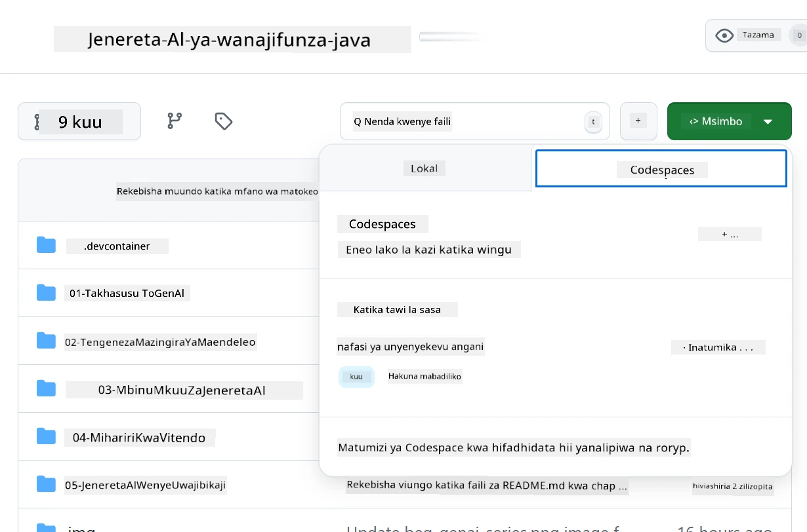

# Kuweka Mazingira ya Maendeleo kwa Azure OpenAI

> **Mwongozo wa Haraka**: Mwongozo huu ni kwa ajili ya usanidi wa Azure OpenAI. Kwa kuanza mara moja na mifano ya bure, tumia [GitHub Models with Codespaces](./README.md#quick-start-cloud).

Mwongozo huu utakusaidia kuweka mifano ya Azure AI Foundry kwa programu zako za Java AI katika kozi hii.

## Yaliyomo

- [Muhtasari wa Usanidi wa Haraka](../../../02-SetupDevEnvironment)
- [Hatua ya 1: Unda Rasilimali za Azure AI Foundry](../../../02-SetupDevEnvironment)
  - [Unda Hub na Mradi](../../../02-SetupDevEnvironment)
  - [Peleka Modeli ya GPT-4o-mini](../../../02-SetupDevEnvironment)
- [Hatua ya 2: Unda Codespace Yako](../../../02-SetupDevEnvironment)
- [Hatua ya 3: Sanidi Mazingira Yako](../../../02-SetupDevEnvironment)
- [Hatua ya 4: Jaribu Usanidi Wako](../../../02-SetupDevEnvironment)
- [Nini Kinachofuata?](../../../02-SetupDevEnvironment)
- [Rasilimali](../../../02-SetupDevEnvironment)
- [Rasilimali za Ziada](../../../02-SetupDevEnvironment)

## Muhtasari wa Usanidi wa Haraka

1. Unda rasilimali za Azure AI Foundry (Hub, Mradi, Modeli)
2. Unda Codespace na kontena la maendeleo ya Java
3. Sanidi faili yako ya .env na hati za Azure OpenAI
4. Jaribu usanidi wako na mradi wa mfano

## Hatua ya 1: Unda Rasilimali za Azure AI Foundry

### Unda Hub na Mradi

1. Nenda kwenye [Azure AI Foundry Portal](https://ai.azure.com/) na ingia
2. Bonyeza **+ Create** → **New hub** (au nenda kwenye **Management** → **All hubs** → **+ New hub**)
3. Sanidi hub yako:
   - **Hub name**: mfano, "MyAIHub"
   - **Subscription**: Chagua usajili wako wa Azure
   - **Resource group**: Unda mpya au chagua iliyopo
   - **Location**: Chagua iliyo karibu nawe
   - **Storage account**: Tumia chaguo-msingi au sanidi maalum
   - **Key vault**: Tumia chaguo-msingi au sanidi maalum
   - Bonyeza **Next** → **Review + create** → **Create**
4. Baada ya kuundwa, bonyeza **+ New project** (au **Create project** kutoka muhtasari wa hub)
   - **Project name**: mfano, "GenAIJava"
   - Bonyeza **Create**

### Peleka Modeli ya GPT-4o-mini

1. Katika mradi wako, nenda kwenye **Model catalog** na tafuta **gpt-4o-mini**
   - *Njia mbadala: Nenda kwenye **Deployments** → **+ Create deployment***
2. Bonyeza **Deploy** kwenye kadi ya modeli ya gpt-4o-mini
3. Sanidi upelekaji:
   - **Deployment name**: "gpt-4o-mini"
   - **Model version**: Tumia ya hivi karibuni
   - **Deployment type**: Standard
4. Bonyeza **Deploy**
5. Baada ya kupelekwa, nenda kwenye kichupo cha **Deployments** na nakili maadili haya:
   - **Deployment name** (mfano, "gpt-4o-mini")
   - **Target URI** (mfano, `https://your-hub-name.openai.azure.com/`) 
      > **Muhimu**: Nakili URL ya msingi tu (mfano, `https://myhub.openai.azure.com/`) sio njia kamili ya mwisho.
   - **Key** (kutoka sehemu ya Keys and Endpoint)

> **Bado una matatizo?** Tembelea [Azure AI Foundry Documentation](https://learn.microsoft.com/azure/ai-foundry/how-to/create-projects?tabs=ai-foundry&pivots=hub-project)

## Hatua ya 2: Unda Codespace Yako

1. Fork hifadhi hii kwenye akaunti yako ya GitHub
   > **Kumbuka**: Ikiwa unataka kuhariri usanidi wa msingi tafadhali angalia [Dev Container Configuration](../../../.devcontainer/devcontainer.json)
2. Katika hifadhi yako ya forked, bonyeza **Code** → kichupo cha **Codespaces**
3. Bonyeza **...** → **New with options...**

4. Chagua **Dev container configuration**: 
   - **Generative AI Java Development Environment**
5. Bonyeza **Create codespace**

## Hatua ya 3: Sanidi Mazingira Yako

Baada ya Codespace yako kuwa tayari, weka hati zako za Azure OpenAI:

1. **Nenda kwenye mradi wa mfano kutoka mzizi wa hifadhi:**
   ```bash
   cd 02-SetupDevEnvironment/examples/basic-chat-azure
   ```

2. **Unda faili yako ya .env:**
   ```bash
   cp .env.example .env
   ```

3. **Hariri faili ya .env na hati zako za Azure OpenAI:**
   ```bash
   # Your Azure OpenAI API key (from Azure AI Foundry portal)
   AZURE_AI_KEY=your-actual-api-key-here
   
   # Your Azure OpenAI endpoint URL (e.g., https://myhub.openai.azure.com/)
   AZURE_AI_ENDPOINT=https://your-hub-name.openai.azure.com/
   ```

   > **Kumbuka Usalama**: 
   > - Kamwe usiweke faili yako ya `.env` kwenye udhibiti wa toleo
   > - Faili ya `.env` tayari imejumuishwa kwenye `.gitignore`
   > - Weka funguo zako za API salama na uzibadilishe mara kwa mara

## Hatua ya 4: Jaribu Usanidi Wako

Endesha programu ya mfano ili kujaribu muunganisho wako wa Azure OpenAI:

```bash
mvn clean spring-boot:run
```

Unapaswa kuona majibu kutoka kwa modeli ya GPT-4o-mini!

> **Watumiaji wa VS Code**: Unaweza pia kubonyeza `F5` katika VS Code kuendesha programu. Usanidi wa uzinduzi tayari umewekwa ili kupakia faili yako ya `.env` moja kwa moja.

> **Mfano kamili**: Tazama [End-to-End Azure OpenAI Example](./examples/basic-chat-azure/README.md) kwa maelekezo ya kina na utatuzi wa matatizo.

## Nini Kinachofuata?

**Usanidi Umekamilika!** Sasa una:
- Azure OpenAI na gpt-4o-mini imepelekwa
- Usanidi wa faili ya .env ya ndani
- Mazingira ya maendeleo ya Java tayari

**Endelea na** [Sura ya 3: Mbinu za Msingi za Generative AI](../03-CoreGenerativeAITechniques/README.md) kuanza kujenga programu za AI!

## Rasilimali

- [Azure AI Foundry Documentation](https://learn.microsoft.com/azure/ai-services/)
- [Spring AI Azure OpenAI Documentation](https://docs.spring.io/spring-ai/reference/api/clients/azure-openai-chat.html)
- [Azure OpenAI Java SDK](https://learn.microsoft.com/java/api/overview/azure/ai-openai-readme)

## Rasilimali za Ziada

- [Pakua VS Code](https://code.visualstudio.com/Download)
- [Pata Docker Desktop](https://www.docker.com/products/docker-desktop)
- [Dev Container Configuration](../../../.devcontainer/devcontainer.json)

**Kanusho**:  
Hati hii imetafsiriwa kwa kutumia huduma ya tafsiri ya AI [Co-op Translator](https://github.com/Azure/co-op-translator). Ingawa tunajitahidi kwa usahihi, tafadhali fahamu kuwa tafsiri za kiotomatiki zinaweza kuwa na makosa au kutokuwa sahihi. Hati ya asili katika lugha yake ya awali inapaswa kuzingatiwa kama chanzo cha mamlaka. Kwa taarifa muhimu, inashauriwa kutumia huduma ya tafsiri ya kibinadamu ya kitaalamu. Hatutawajibika kwa kutoelewana au tafsiri zisizo sahihi zinazotokana na matumizi ya tafsiri hii.