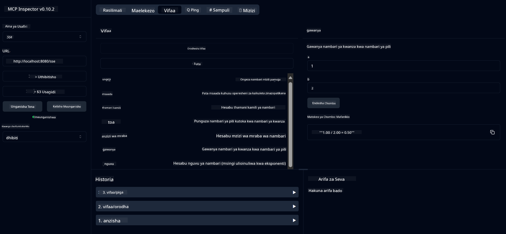

<!--
CO_OP_TRANSLATOR_METADATA:
{
  "original_hash": "7bf9a4a832911269a8bd0decb97ff36c",
  "translation_date": "2025-07-21T21:26:33+00:00",
  "source_file": "04-PracticalSamples/mcp/calculator/README.md",
  "language_code": "sw"
}
-->
# Huduma ya Msingi ya Calculator MCP

>**Note**: Sura hii inajumuisha [**Mafunzo**](./TUTORIAL.md) yanayokuongoza jinsi ya kuendesha mifano iliyokamilika.

Karibu kwenye uzoefu wako wa kwanza wa vitendo na **Model Context Protocol (MCP)**! Katika sura zilizopita, umejifunza misingi ya AI ya kizazi na kuandaa mazingira yako ya maendeleo. Sasa ni wakati wa kujenga kitu cha vitendo.

Huduma hii ya calculator inaonyesha jinsi mifano ya AI inaweza kuingiliana kwa usalama na zana za nje kwa kutumia MCP. Badala ya kutegemea uwezo wa hesabu wa AI ambao wakati mwingine si wa kuaminika, tutaonyesha jinsi ya kujenga mfumo thabiti ambapo AI inaweza kuita huduma maalum kwa mahesabu sahihi.

## Jedwali la Maudhui

- [Unachojifunza](../../../../../04-PracticalSamples/mcp/calculator)
- [Mahitaji ya Awali](../../../../../04-PracticalSamples/mcp/calculator)
- [Misingi Muhimu](../../../../../04-PracticalSamples/mcp/calculator)
- [Kuanza Haraka](../../../../../04-PracticalSamples/mcp/calculator)
- [Operesheni Zinazopatikana za Calculator](../../../../../04-PracticalSamples/mcp/calculator)
- [Wateja wa Kujaribu](../../../../../04-PracticalSamples/mcp/calculator)
  - [1. Mteja wa Moja kwa Moja wa MCP (SDKClient)](../../../../../04-PracticalSamples/mcp/calculator)
  - [2. Mteja Unaotumia AI (LangChain4jClient)](../../../../../04-PracticalSamples/mcp/calculator)
- [MCP Inspector (Web UI)](../../../../../04-PracticalSamples/mcp/calculator)
  - [Maelekezo Hatua kwa Hatua](../../../../../04-PracticalSamples/mcp/calculator)

## Unachojifunza

Kwa kufanya kazi kupitia mfano huu, utaelewa:
- Jinsi ya kuunda huduma zinazolingana na MCP kwa kutumia Spring Boot
- Tofauti kati ya mawasiliano ya moja kwa moja ya itifaki na mwingiliano unaotumia AI
- Jinsi mifano ya AI inavyoamua lini na jinsi ya kutumia zana za nje
- Mbinu bora za kujenga programu za AI zinazotumia zana

Inafaa kwa wanaoanza kujifunza dhana za MCP na walio tayari kujenga ujumuishaji wao wa kwanza wa zana za AI!

## Mahitaji ya Awali

- Java 21+
- Maven 3.6+
- **GitHub Token**: Inahitajika kwa mteja unaotumia AI. Ikiwa bado hujaweka hii, angalia [Sura ya 2: Kuandaa mazingira yako ya maendeleo](../../../02-SetupDevEnvironment/README.md) kwa maelekezo.

## Misingi Muhimu

**Model Context Protocol (MCP)** ni njia sanifu ya programu za AI kuunganishwa kwa usalama na zana za nje. Fikiria kama "daraja" linaloruhusu mifano ya AI kutumia huduma za nje kama calculator yetu. Badala ya mfano wa AI kujaribu kufanya hesabu yenyewe (ambayo inaweza kuwa si ya kuaminika), inaweza kuita huduma yetu ya calculator kupata matokeo sahihi. MCP inahakikisha mawasiliano haya yanatokea kwa usalama na uthabiti.

**Server-Sent Events (SSE)** huwezesha mawasiliano ya wakati halisi kati ya seva na wateja. Tofauti na maombi ya jadi ya HTTP ambapo unauliza na kusubiri jibu, SSE huruhusu seva kuendelea kutuma masasisho kwa mteja. Hii ni bora kwa programu za AI ambapo majibu yanaweza kutiririka au kuchukua muda kusindika.

**Zana za AI & Kuita Kazi** huruhusu mifano ya AI kuchagua na kutumia kazi za nje (kama operesheni za calculator) kiotomatiki kulingana na maombi ya mtumiaji. Unapouliza "Ni nini 15 + 27?", mfano wa AI unaelewa unataka kuongeza, unaita zana yetu ya `add` na vigezo sahihi (15, 27), na kurudisha matokeo kwa lugha ya kawaida. AI inafanya kazi kama mratibu mwenye akili anayejua lini na jinsi ya kutumia kila zana.

## Kuanza Haraka

### 1. Nenda kwenye saraka ya programu ya calculator
```bash
cd Generative-AI-for-beginners-java/04-PracticalSamples/mcp/calculator
```

### 2. Jenga & Endesha
```bash
mvn clean install -DskipTests
java -jar target/calculator-server-0.0.1-SNAPSHOT.jar
```

### 2. Jaribu na Wateja
- **SDKClient**: Mawasiliano ya moja kwa moja ya itifaki ya MCP
- **LangChain4jClient**: Mawasiliano ya lugha ya kawaida yanayotumia AI (inahitaji tokeni ya GitHub)

## Operesheni Zinazopatikana za Calculator

- `add(a, b)`, `subtract(a, b)`, `multiply(a, b)`, `divide(a, b)`
- `power(base, exponent)`, `squareRoot(number)`, `absolute(number)`
- `modulus(a, b)`, `help()`

## Wateja wa Kujaribu

### 1. Mteja wa Moja kwa Moja wa MCP (SDKClient)
Hujaribu mawasiliano ya itifaki ya MCP moja kwa moja. Endesha kwa:
```bash
mvn test-compile exec:java -Dexec.mainClass="com.microsoft.mcp.sample.client.SDKClient" -Dexec.classpathScope=test
```

### 2. Mteja Unaotumia AI (LangChain4jClient)
Inaonyesha mwingiliano wa lugha ya kawaida na mifano ya GitHub. Inahitaji tokeni ya GitHub (angalia [Mahitaji ya Awali](../../../../../04-PracticalSamples/mcp/calculator)).

**Endesha:**
```bash
mvn test-compile exec:java -Dexec.mainClass="com.microsoft.mcp.sample.client.LangChain4jClient" -Dexec.classpathScope=test
```

## MCP Inspector (Web UI)

MCP Inspector hutoa kiolesura cha kuona cha wavuti cha kujaribu huduma yako ya MCP bila kuandika msimbo. Inafaa kwa wanaoanza kuelewa jinsi MCP inavyofanya kazi!

### Maelekezo Hatua kwa Hatua:

1. **Anzisha seva ya calculator** (ikiwa bado haijaendeshwa):
   ```bash
   java -jar target/calculator-server-0.0.1-SNAPSHOT.jar
   ```

2. **Sakinisha na endesha MCP Inspector** kwenye terminal mpya:
   ```bash
   npx @modelcontextprotocol/inspector
   ```

3. **Fungua kiolesura cha wavuti**:
   - Tafuta ujumbe kama "Inspector running at http://localhost:6274"
   - Fungua URL hiyo kwenye kivinjari chako

4. **Unganisha na huduma yako ya calculator**:
   - Katika kiolesura cha wavuti, weka aina ya usafirishaji kuwa "SSE"
   - Weka URL kuwa: `http://localhost:8080/sse`
   - Bonyeza kitufe cha "Connect"

5. **Chunguza zana zinazopatikana**:
   - Bonyeza "List Tools" kuona operesheni zote za calculator
   - Utaona kazi kama `add`, `subtract`, `multiply`, nk.

6. **Jaribu operesheni ya calculator**:
   - Chagua zana (mfano, "add")
   - Ingiza vigezo (mfano, `a: 15`, `b: 27`)
   - Bonyeza "Run Tool"
   - Tazama matokeo yanayorudishwa na huduma yako ya MCP!

Njia hii ya kuona inakusaidia kuelewa jinsi mawasiliano ya MCP yanavyofanya kazi kabla ya kujenga wateja wako mwenyewe.



---
**Marejeleo:** [MCP Server Boot Starter Docs](https://docs.spring.io/spring-ai/reference/api/mcp/mcp-server-boot-starter-docs.html)

**Kanusho**:  
Hati hii imetafsiriwa kwa kutumia huduma ya kutafsiri ya AI [Co-op Translator](https://github.com/Azure/co-op-translator). Ingawa tunajitahidi kuhakikisha usahihi, tafadhali fahamu kuwa tafsiri za kiotomatiki zinaweza kuwa na makosa au kutokuwa sahihi. Hati ya asili katika lugha yake ya awali inapaswa kuzingatiwa kama chanzo cha mamlaka. Kwa taarifa muhimu, tafsiri ya kitaalamu ya binadamu inapendekezwa. Hatutawajibika kwa kutoelewana au tafsiri zisizo sahihi zinazotokana na matumizi ya tafsiri hii.