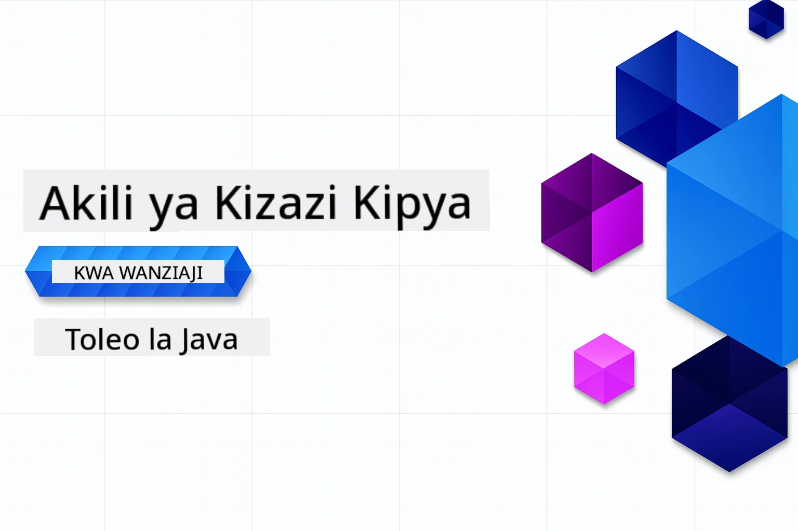

# AI Inayozalisha kwa Waanzilishi - Toleo la Java
[](https://discord.gg/nTYy5BXMWG)



**Muda wa Kujitolea**: Warsha nzima inaweza kukamilika mtandaoni bila hitaji la usanidi wa eneo la kompyuta. Usanidi wa mazingira unachukua dakika 2, huku kuchunguza mifano kunahitaji saa 1-3 kulingana na kina cha uchunguzi.

> **Anza Haraka** 

1. Fanya fork kwa hifadhi hii kwenye akaunti yako ya GitHub
2. Bonyeza **Code** → kichupo cha **Codespaces** → **...** → **Mpya na chaguzi...**
3. Tumia chaguo za msingi – hii itachagua mfuko wa Maendeleo uliotengenezwa kwa kozi hii
4. Bonyeza **Create codespace**
5. Subiri takribani dakika 2 kwa mazingira kuwa tayari
6. Ruka moja kwa moja kwa [Mfano wa kwanza](./02-SetupDevEnvironment/README.md#step-2-create-a-github-personal-access-token)

> **Unapendelea Kuipakua Kwenye Kompyuta?**
>
> Hifadhi hii ina utafsiri wa lugha 50+ ambao huongeza sana ukubwa wa kupakua. Kwa kloni bila utafsiri, tumia sparse checkout:
> ```bash
> git clone --filter=blob:none --sparse https://github.com/microsoft/Generative-AI-for-beginners-java.git
> cd Generative-AI-for-beginners-java
> git sparse-checkout set --no-cone '/*' '!translations' '!translated_images'
> ```
> Hii inakupa kila unachohitaji kumaliza kozi kwa upakuaji wa haraka zaidi.


## Usaidizi wa Lugha Nyingi

### Inasaidiwa Kupitia Hatua ya GitHub (Moja kwa moja & Daima Imeboreshwa)

<!-- CO-OP TRANSLATOR LANGUAGES TABLE START -->
[Kiarabu](../ar/README.md) | [Kibangla](../bn/README.md) | [Kibulgaria](../bg/README.md) | [Kiburma (Myanmar)](../my/README.md) | [Kichina (Rahisi)](../zh-CN/README.md) | [Kichina (Mila, Hong Kong)](../zh-HK/README.md) | [Kichina (Mila, Macau)](../zh-MO/README.md) | [Kichina (Mila, Taiwan)](../zh-TW/README.md) | [Kikroeshia](../hr/README.md) | [Kicheki](../cs/README.md) | [Kidenmaki](../da/README.md) | [Kiholanzi](../nl/README.md) | [Kiestonia](../et/README.md) | [Kifini](../fi/README.md) | [Kifaransa](../fr/README.md) | [Kijerumani](../de/README.md) | [Kigreki](../el/README.md) | [Kiebrania](../he/README.md) | [Kihindi](../hi/README.md) | [Kihungari](../hu/README.md) | [Kiindonesia](../id/README.md) | [Kiitaliano](../it/README.md) | [Kijapani](../ja/README.md) | [Kikannada](../kn/README.md) | [Kikorea](../ko/README.md) | [Kilitwania](../lt/README.md) | [Kimelayu](../ms/README.md) | [Kimalayalam](../ml/README.md) | [Kimarathi](../mr/README.md) | [Kinepali](../ne/README.md) | [Kipijini cha Nigeria](../pcm/README.md) | [Kinorwe](../no/README.md) | [Kiajemi (Farsi)](../fa/README.md) | [Kipolandi](../pl/README.md) | [Kireno (Brazil)](../pt-BR/README.md) | [Kireno (Portugal)](../pt-PT/README.md) | [Kipunja (Gurmukhi)](../pa/README.md) | [Kiromania](../ro/README.md) | [Kirusi](../ru/README.md) | [Kiserbia (Cyrillic)](../sr/README.md) | [Kislovakia](../sk/README.md) | [Kislovenia](../sl/README.md) | [Kihispania](../es/README.md) | [Kiswahili](./README.md) | [Kiswidi](../sv/README.md) | [Kitagalog (Filipino)](../tl/README.md) | [Kitamili](../ta/README.md) | [Kitelugu](../te/README.md) | [Kithai](../th/README.md) | [Kituruki](../tr/README.md) | [Kiukraini](../uk/README.md) | [Kiurdu](../ur/README.md) | [Kivietinamu](../vi/README.md)

## Muundo wa Kozi & Njia ya Kujifunza

### **Sura ya 1: Utangulizi kwa AI Inayozalisha**
- **Mawazo Muhimu**: Kuelewa Modeli Kubwa za Lugha, vitambulisho (tokens), embeddings, na uwezo wa AI
- **Mfumo wa AI wa Java**: Muhtasari wa Spring AI na SDK za OpenAI
- **Itifaki ya Muktadha wa Modeli**: Utangulizi wa MCP na nafasi yake katika mawasiliano ya mawakala wa AI
- **Matumizi ya Vitendo**: Mifano halisi ikijumuisha roboti za mazungumzo na uzalishaji wa yaliyomo
- **[→ Anza Sura ya 1](./01-IntroToGenAI/README.md)**

### **Sura ya 2: Usanidi wa Mazingira ya Maendeleo**
- **Usanidi wa Watoa Huduma Wengi**: Sanidi Moduli za GitHub, Azure OpenAI, na SDK ya OpenAI Java
- **Spring Boot + Spring AI**: Mbinu bora za maendeleo ya programu za AI katika biashara
- **GitHub Models**: Upatikanaji wa modeli za AI bure kwa ajili ya mradi na mafunzo (hakuna kadi ya mkopo inahitajika)
- **Zana za Maendeleo**: Mifuko ya Docker, VS Code, na usanidi wa GitHub Codespaces
- **[→ Anza Sura ya 2](./02-SetupDevEnvironment/README.md)**

### **Sura ya 3: Mbinu Muhimu za AI Inayozalisha**
- **Uhandisi wa Prompt**: Mbinu za kupata majibu bora kutoka kwa modeli za AI
- **Embeddings & Uendeshaji wa Vector**: Tekeleza utaftaji wa maana na ulinganifu wa vifaa
- **Uzazi Ulioboreshwa kwa RAG (Retrieval-Augmented Generation)**: Changanya AI na vyanzo vyako vya data
- **Kupiga Simu kwa Njia ya Function**: Panua uwezo wa AI kwa zana na virutubisho vya desturi
- **[→ Anza Sura ya 3](./03-CoreGenerativeAITechniques/README.md)**

### **Sura ya 4: Matumizi ya Vitendo & Miradi**
- **Mzalishaji wa Hadithi za Wanyama wa Nyumbani** (`petstory/`): Uzalishaji wa yaliyomo vya ubunifu kwa Moduli za GitHub
- **Demo ya Foundry Local** (`foundrylocal/`): Muunganiko wa modeli za AI za eneo na SDK ya OpenAI Java
- **Huduma ya Kikokotoo ya MCP** (`calculator/`): Utekelezaji wa msingi wa Itifaki ya Muktadha wa Modeli na Spring AI
- **[→ Anza Sura ya 4](./04-PracticalSamples/README.md)**

### **Sura ya 5: Maendeleo ya AI yenye Uwajibikaji**
- **Usalama wa Moduli za GitHub**: Jaribu vichujio vya maudhui vilivyojengwa na mifumo ya usalama (vizuizi ngumu na kukataa kwa upole)
- **Demo ya AI yenye Uwajibikaji**: Mfano wa vitendo unaoonyesha jinsi mifumo ya usalama ya AI ya kisasa inavyofanya kazi
- **Mbinu Bora**: Miongozo muhimu kwa maendeleo na uanzishaji wa AI kwa maadili
- **[→ Anza Sura ya 5](./05-ResponsibleGenAI/README.md)**

## Rasilimali Zaidi

<!-- CO-OP TRANSLATOR OTHER COURSES START -->
### LangChain
[](https://aka.ms/langchain4j-for-beginners)
[](https://aka.ms/langchainjs-for-beginners?WT.mc_id=m365-94501-dwahlin)

---

### Azure / Edge / MCP / Mawakala
[](https://github.com/microsoft/AZD-for-beginners?WT.mc_id=academic-105485-koreyst)
[](https://github.com/microsoft/edgeai-for-beginners?WT.mc_id=academic-105485-koreyst)
[](https://github.com/microsoft/mcp-for-beginners?WT.mc_id=academic-105485-koreyst)
[](https://github.com/microsoft/ai-agents-for-beginners?WT.mc_id=academic-105485-koreyst)

---
 
### Mfululizo wa AI Inayozalisha
[](https://github.com/microsoft/generative-ai-for-beginners?WT.mc_id=academic-105485-koreyst)
[-9333EA?style=for-the-badge&labelColor=E5E7EB&color=9333EA)](https://github.com/microsoft/Generative-AI-for-beginners-dotnet?WT.mc_id=academic-105485-koreyst)
[-C084FC?style=for-the-badge&labelColor=E5E7EB&color=C084FC)](https://github.com/microsoft/generative-ai-for-beginners-java?WT.mc_id=academic-105485-koreyst)
[-E879F9?style=for-the-badge&labelColor=E5E7EB&color=E879F9)](https://github.com/microsoft/generative-ai-with-javascript?WT.mc_id=academic-105485-koreyst)

---
 
### Mafunzo Muhimu
[](https://aka.ms/ml-beginners?WT.mc_id=academic-105485-koreyst)
[](https://aka.ms/datascience-beginners?WT.mc_id=academic-105485-koreyst)
[](https://aka.ms/ai-beginners?WT.mc_id=academic-105485-koreyst)
[](https://github.com/microsoft/Security-101?WT.mc_id=academic-96948-sayoung)
[](https://aka.ms/webdev-beginners?WT.mc_id=academic-105485-koreyst)
[](https://aka.ms/iot-beginners?WT.mc_id=academic-105485-koreyst)
[](https://github.com/microsoft/xr-development-for-beginners?WT.mc_id=academic-105485-koreyst)

---
 
### Mfululizo wa Copilot
[](https://aka.ms/GitHubCopilotAI?WT.mc_id=academic-105485-koreyst)
[](https://github.com/microsoft/mastering-github-copilot-for-dotnet-csharp-developers?WT.mc_id=academic-105485-koreyst)
[](https://github.com/microsoft/CopilotAdventures?WT.mc_id=academic-105485-koreyst)
<!-- CO-OP TRANSLATOR OTHER COURSES END -->

## Kupata Msaada

Ikiwa unatafuta au una maswali kuhusu kujenga programu za AI. Jiunge na watafiti wenza na waendelezaji wenye uzoefu katika mijadala kuhusu MCP. Ni jamii ya kuunga mkono ambapo maswali yanakubaliwa na maarifa yanashirikiwa kwa uhuru.

[](https://discord.gg/nTYy5BXMWG)

Ikiwa una maoni kuhusu bidhaa au makosa wakati wa kujenga tembelea:

[](https://aka.ms/foundry/forum)

---

<!-- CO-OP TRANSLATOR DISCLAIMER START -->
**Sehemu ya Kutolewa Dhima**:
Hati hii imetafsiriwa kwa kutumia huduma ya utafsiri ya AI [Co-op Translator](https://github.com/Azure/co-op-translator). Ingawa tunajitahidi usahihi, tafadhali fahamu kuwa tafsiri za moja kwa moja zinaweza kuwa na makosa au kutokamilika. Hati ya asili katika lugha yake ya asili inapaswa kuzingatiwa kama chanzo cha mamlaka. Kwa taarifa muhimu, tafsiri ya kitaalamu kutoka kwa mtafsiri binadamu inapendekezwa. Hatuwajibiki kwa kutoelewana au tafsiri potofu zinazotokana na matumizi ya tafsiri hii.
<!-- CO-OP TRANSLATOR DISCLAIMER END -->