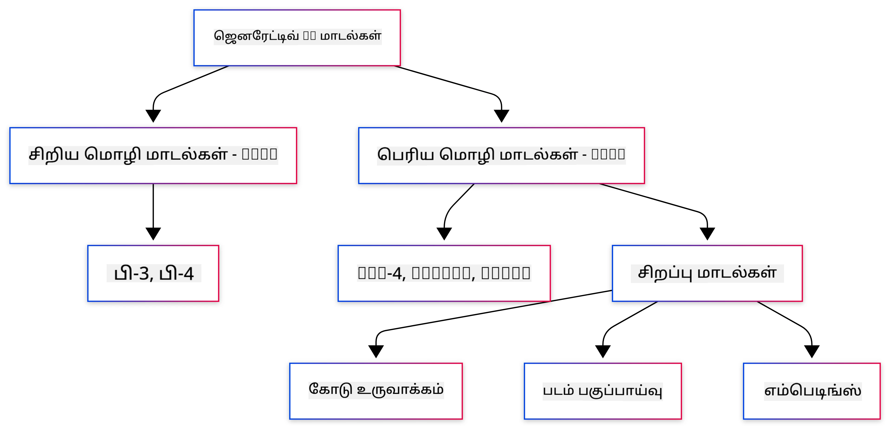
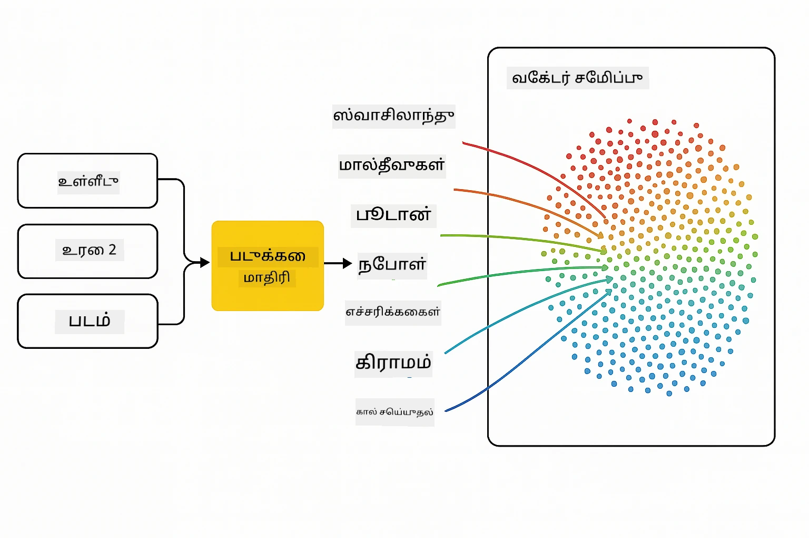
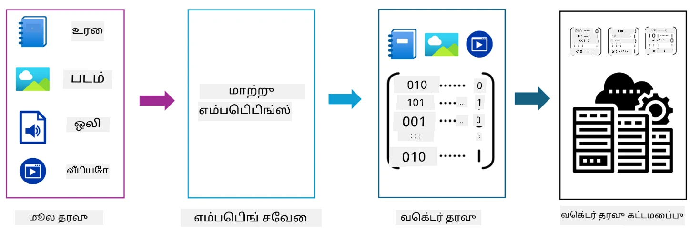
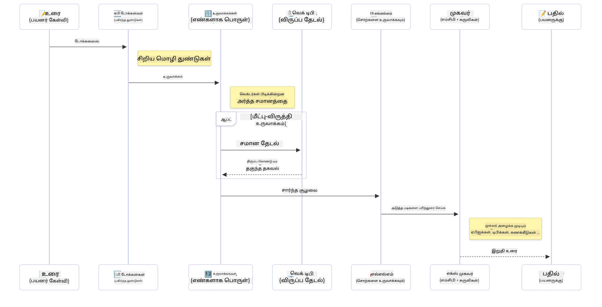

# ஜெனரேட்டிவ் AI அறிமுகம் - ஜாவா பதிப்பு

> **வீடியோ**: [இந்த பாடத்தின் வீடியோ முன்னோட்டத்தை YouTube இல்ப் பாருங்கள்.](https://www.youtube.com/watch?v=XH46tGp_eSw) மேலே உள்ள தம்நெயில் படத்தையும் கிளிக் செய்யலாம்.

## நீங்கள் கற்றுக்கொள்ளப்போகும் விஷயங்கள்

- **ஜெனரேட்டிவ் AI அடித்தளங்கள்** LLMகள், ப்ராம்ட் எஞ்சினியரிங், டோக்கன்கள், எம்பெடிங்குகள் மற்றும் வேக்டர் தரவுத்தளங்கள் உட்பட
- **ஜாவாவிற்கான AI மேம்பாட்டு கருவிகள்** Azure OpenAI SDK, Spring AI மற்றும் OpenAI Java SDK உட்பட ஒப்பீடு
- **மாடல் கன்டெக்ஸ்ட் ப்ரொட்டோகால்** மற்றும் அது AI ஏஜென்ட் தொடர்பாடலில் வகிக்கும் பங்கு

## உள்ளடக்க அட்டவணை

- [அறிமுகம்](#அறிமுகம்)
- [ஜெனரேட்டிவ் AI கருத்துக்களின் விரைவு மறுசீரமைப்பு](#ஜெனரேட்டிவ்-ai-கருத்துக்களின்-விரைவு-மறுசீரமைப்பு)
- [ப்ராம்ட் எஞ்சினியரிங் மதிப்பாய்வு](#ப்ராம்ட்-எஞ்சினியரிங்-மதிப்பாய்வு)
- [டோக்கன்கள், எம்பெடிங்குகள், மற்றும் ஏஜென்ட்கள்](#டோக்கன்கள்-எம்பெடிங்குகள்-மற்றும்-ஏஜென்ட்கள்)
- [ஜாவாவிற்கான AI மேம்பாட்டு கருவிகள் மற்றும் நூலகங்கள்](#ஜாவாவிற்கான-ai-மேம்பாட்டு-கருவிகள்-மற்றும்-நூலகங்கள்)
  - [OpenAI Java SDK](#openai-java-sdk)
  - [Spring AI](#spring-ai)
  - [Azure OpenAI Java SDK](#azure-openai-java-sdk)
- [சுருக்கம்](#சுருக்கம்)
- [அடுத்த படிகள்](#அடுத்த-படிகள்)

## அறிமுகம்

ஜெனரேட்டிவ் AI ஆரம்பக்காரர்களுக்கான முதல் அத்தியாயத்திற்கு வரவேற்கிறோம் - ஜாவா பதிப்பு! இந்த அடிப்படை பாடம், ஜெனரேட்டிவ் AI நுட்பங்கள் மற்றும் அவற்றை ஜாவா மூலம் 어떻게 பயன்படுத்துவது என்று அறிமுகப்படுத்துகிறது. நீங்கள் AI பயன்பாடுகளின் முக்கிய கட்டமைப்புகள், LLMகள், டோக்கன்கள், எம்பெடிங்குகள் மற்றும் AI ஏஜென்ட்கள் பற்றி கற்றுக்கொள்ளப்போகிறீர்கள். இதோடு, இந்த பாடநெறியில் முழுவதும் பயன்படுத்தவேண்டிய முக்கிய ஜாவா கருவிகளையும் ஆராய்வோம்.

### ஜெனரேட்டிவ் AI கருத்துக்களின் விரைவு மறுசீரமைப்பு

ஜெனரேட்டிவ் AI என்பது தரவிலிருந்து கற்றுக்கொள்ளப்பட்ட முறை மற்றும் உறவுகளின் அடிப்படையில் புதிய உள்ளடக்கங்களை உருவாக்கும் செயற்கை நுண்ணறிவு வகை ஆகும். இதன் மூலம் மனிதன் போன்ற பதில்கள், சூழல் புரிதல் மற்றும் சில நேரங்களில் மனிதன் போன்ற உள்ளடக்கங்களையும் உருவாக்க முடியும்.

நீங்கள் உங்கள் ஜாவா AI பயன்பாடுகளை உருவாக்கும்போது, **ஜெனரேட்டிவ் AI மாடல்களுடன்** உள்ளடக்கத்தை உருவாக்கப் பயன்படுத்துவீர்கள். சில திறன்கள்:

- **உரை உருவாக்கம்**: பேச்சுத்தொகுப்புக்கான, உள்ளடக்கம் மற்றும் உரை நிறைவு போன்ற மனிதன் போன்ற உரைகளை உருவாக்குதல்.
- **பட உருவாக்கம் மற்றும் பகுப்பாய்வு**: விரிவான படங்கள் உருவாக்குதல், புகைப்படங்களை மேம்படுத்துதல் மற்றும் பொருட்களை கண்டறிதல்.
- **குறியீடு உருவாக்கம்**: குறியீட்டு துண்டுகள் அல்லது ஸ்கிரிப்ட்களை எழுதுதல்.

விவிதப் பணிகளுக்கு சிறப்பு மாடல்கள் உள்ளன. உதாரணமாக, **சிறிய மொழி மாடல்கள் (SLMs)** மற்றும் **பெரிய மொழி மாடல்கள் (LLMs)** இரண்டு էլ உரை உருவாக்கத்திற்குத் தகைமையானவை. LLMகள் பெரும்பாலும் சிக்கலான பணிகளுக்கு சிறந்த செயல்திறனை வழங்குகின்றன. படம் தொடர்பான பணிகளுக்கு விசுவல் அல்லது பன்முறை மாடல்களைத் பயன்படுத்தலாம்.

இதுபோன்ற மாடல்களின் பதில்கள் எப்போதும் சரியானவை அல்ல. "ஹாலூசினேஷன்" அல்லது தவறான தகவல்கள் ஊடிய கேள்விகளை உருவாக்கும் மாடல்கள் போன்றவை பற்றிப் பயனர்கள் கேள்விப்பட்டிருக்கிறார்கள். ஆனால், தெளிவான வழிமுறைகள் மற்றும் சூழலை வழங்குவதன் மூலம் மாடலை சிறந்த பதில்கள் வழங்க வழிநடத்தலாம். இதுவே **ப்ராம்ட் எஞ்சினியரிங்** ஆகும்.

#### ப்ராம்ட் எஞ்சினியரிங் மதிப்பாய்வு

ப்ராம்ட் எஞ்சினியரிங் என்பது AI மாடல்களை விரும்பிய விளைவுகளுக்கு வழிநடத்தும் பொருத்தமான உள்ளீடுகளை வடிவமைப்பது ஆகும். இதில் பின்வருவன அடங்கும்:

- **தெளிவுத்தன்மை**: வழிமுறைகள் தெளிவும் தவறிழந்ததும் ஆக இருக்க வேண்டும்.
- **சூழல்**: தேவையான பின்னணி தகவலை வழங்குதல்.
- **கட்டுப்பாடுகள்**: எந்தவொரு வரையறைகள் மற்றும் வடிவங்களை குறிப்பது.

சிறந்த நடைமுறைகள் ப்ராம்ட் வடிவமைப்பு, தெளிவான வழிமுறைகள், பணி பிரிவுகள், ஒரே முயற்சி மற்றும் குறைந்த முயற்சி கற்றல், ப்ராம்ட் ட்யூனிங் ஆகியவற்றை உள்ளடக்கியவை. வெவ்வேறு ப்ராம்ட் பரிசோதித்தல் முக்கியம்.

விண்ணப்பங்களை உருவாக்கும்போது, வெவ்வேறு ப்ராம்ட் வகைகளுடன் பணியாற்றுவீர்கள்:
- **கணினி ப்ராம்ட்கள்**: மாடலின் நடத்தை அடிப்படையான விதிகள் மற்றும் சூழல்களை அமைக்கும்
- **பயனர் ப்ராம்ட்கள்**: உங்கள் பயன்பாட்டு பயனர்களிடமிருந்து உள்ளீட்டுத் தரவு
- **உதவியாளர் ப்ராம்ட்கள்**: மாடல் சிஸ்டம் மற்றும் பயனர் ப்ராம்ட்களின் அடிப்படையில் பதில்கள்

> **மேலும் அறிய**: [GenAI for Beginners பாடநெறியில் ப்ராம்ட் எஞ்சினியரிங் அத்தியாயம்](https://github.com/microsoft/generative-ai-for-beginners/tree/main/04-prompt-engineering-fundamentals)

#### டோக்கன்கள், எம்பெடிங்குகள், மற்றும் ஏஜென்ட்கள்

ஜெனரேட்டிவ் AI மாடல்களுடன் பணியாற்றும் போது, **டோக்கன்கள்**, **எம்பெடிங்குகள்**, **ஏஜென்ட்கள்** மற்றும் **Model Context Protocol (MCP)** போன்ற சொல்ல்களை நீங்கள் சந்திப்பீர்கள். இவை குறித்து விரிவாக:

- **டோக்கன்கள்**: டோக்கன்கள் என்பது மாடலில் உள்ள உரையின் மிகச் சிறிய அலகு. அவை வார்த்தைகள், எழுத்துக்கள் அல்லது துணை வார்த்தைகள் ஆக இருக்கலாம். டோக்கன்கள் மூலம் உரை தரவு மாடல் புரிந்து கொள்ளக் கூடிய வடிவில் மாற்றப்படுகிறது. உதாரணமாக "The quick brown fox jumped over the lazy dog" வாக்கியம் ["The", " quick", " brown", " fox", " jumped", " over", " the", " lazy", " dog"] அல்லது ["The", " qu", "ick", " br", "own", " fox", " jump", "ed", " over", " the", " la", "zy", " dog"] ஆகியவையாக டோக்கனாகும்.

டோக்கனாக்கம் என்னும் செயல்முறை உரையை இவ்வாறான சிறிய அலகுகளாகப் பிரிப்பதாகும். இது அவசியம் ஏனெனில் மாடல்கள் நேரடி உரை அல்ல, டோக்கன்களாக உழைக்கின்றன. ஒரு ப்ராம்டில் உள்ள டோக்கன்கள் எண்ணிக்கை முறையான பதிலின் நீளத்தையும் தரத்தையும் பாதிக்கின்றது, ஏனெனில் மாடல்களில் உள்ளடக்க விண்டோவுக்கான டோக்கன் வரம்புகள் உள்ளன (உதாரணமாக, GPT-4oக்கு மொத்த உள்ளடக்கத்தில் 128K டோக்கன்கள்).

  ஜாவாவில், OpenAI SDK போன்ற நூலகங்களைப் பயன்படுத்தி டோக்கனாக்கத்தை தானாக கையாளலாம்.

- **எம்பெடிங்குகள்**: எம்பெடிங்குகள் என்பது டோக்கன்களின் ரசனையாளரீதியான பிரதிநிதிகள் ஆகும். இவை பொதுவாக நிறFloating-point எண்கள் கொண்ட வரிசைகளாக இருக்கும், அவை மாடல்கள் வார்த்தைகளின் தொடர்புகளை புரிந்து கொள்ளவும், பொருத்தமான பதில்களை உருவாக்கவும் உதவுகின்றன. ஒத்த வார்த்தைகளுக்கு ஒத்த எம்பெடிங்குகள் இருப்பதால் மாடல் சமன்வயங்கள் மற்றும் பொருளியல் உறவுகளை புரிந்துகொள்ள முடியும்.

  ஜாவாவில் OpenAI SDK அல்லது பிற எம்பெடிங் உருவாக்கல் ஆதரவை கொண்ட நூலகங்கள் மூலம் எம்பெடிங்குகளை உருவாக்கலாம். இது பொருளியலை அடிப்படையாகக் கொண்டு உள்ளடக்கத்தை தேடுவதற்கான பணிகளில் அவசியம்.

- **வேக்டர் தரவுத்தளங்கள்**: வேக்டர் தரவுத்தளங்கள் எம்பெடிங்குகளுக்காக சிறப்பாக அமைக்கப்பட்ட சேமிப்பு அமைப்புகள் ஆகும். அவை பொருளியல் ஒத்திருப்பின்படி விளக்கம் தேட எளிமையானவை மற்றும் Retrieval-Augmented Generation (RAG) வடிவமைப்புகளுக்கு முக்கியமானவை, ஏனெனில் இது பெரிய தரவுத்தளங்களில் இருந்து பொருத்தமான தகவல்களை பெற உதவும்.

> **குறிப்பு**: இந்த பாடநெறியில் வேக்டர் தரவுத்தளங்களை விவரிக்கமாட்டோம், ஆனால் அவை நிஜ உலக பயன்பாடுகளிலிருந்து பெரிதாக பயன்படுத்தப்படுகின்றன என்பதால் குறிப்பிடத்தக்கவை.

- **ஏஜென்ட்கள் மற்றும் MCP**: மாடல்கள், கருவிகள் மற்றும் வெளி அமைப்புகளுடன் தானாக தொடர்பு கொள்ளும் AI கூறுகள். Model Context Protocol (MCP) என்பது ஏஜென்ட்களுக்கு வெளி தரவுத் தரவுகள் மற்றும் கருவிகளுக்கு பாதுகாப்பான அணுகலை வழங்கும் ஒரு முறை. மேலும் அறிய [MCP for Beginners](https://github.com/microsoft/mcp-for-beginners) பாடநெறியில்.

ஜாவா AI பயன்பாடுகளில், உரை செயலாக்கத்திற்கு டோக்கன்களை, பொருளியல் தேடல் மற்றும் RAGக்காக எம்பெடிங்குகளை, தரவு உடன்பிறப்பிற்காக வேக்டர் தரவுத்தளங்களை மற்றும் புத்திசாலித்தனமான கருவி பயன்பாடுகளுக்காக ஏஜென்ட்களுடன் MCPயை பயன்படுத்துவீர்கள்.

### ஜாவாவிற்கான AI மேம்பாட்டு கருவிகள் மற்றும் நூலகங்கள்

ஜாவா AI மேம்பாடிற்கான சிறந்த கருவிகளை வழங்குகிறது. இந்த பாடநெறியில் மூன்று முக்கிய நூலகங்களை ஆராய்வோம் - OpenAI Java SDK, Azure OpenAI SDK மற்றும் Spring AI.

கீழே உள்ள குறிப்பு அட்டவணையில் ஒவ்வொரு அத்தியாயத்தின் எடுத்துக்காட்டுகளில் எது ஏதேனும் SDK பயன்படுத்தப்பட்டுள்ளது:

| அத்தியாயம் | எடுத்துக்காட்டு | SDK |
|---------|--------|-----|
| 02-SetupDevEnvironment | github-models | OpenAI Java SDK |
| 02-SetupDevEnvironment | basic-chat-azure | Spring AI Azure OpenAI |
| 03-CoreGenerativeAITechniques | examples | Azure OpenAI SDK |
| 04-PracticalSamples | petstory | OpenAI Java SDK |
| 04-PracticalSamples | foundrylocal | OpenAI Java SDK |
| 04-PracticalSamples | calculator | Spring AI MCP SDK + LangChain4j |

**SDK ஆவணக் குறிச்சொற்கள்:**
- [Azure OpenAI Java SDK](https://github.com/Azure/azure-sdk-for-java/tree/azure-ai-openai_1.0.0-beta.16/sdk/openai/azure-ai-openai)
- [Spring AI](https://docs.spring.io/spring-ai/reference/)
- [OpenAI Java SDK](https://github.com/openai/openai-java)
- [LangChain4j](https://docs.langchain4j.dev/)

#### OpenAI Java SDK

OpenAI SDK என்பது OpenAI APIக்கு அதிகாரப்பூர்வமான ஜாவா நூலகமாகும். இது OpenAIமாடல்களுடன் செயல்பட எளிதான மற்றும் ஒரே மாதிரியாக அமைக்கப்பட்ட இடைமுகத்தை வழங்குகிறது, இதனால் ஜாவா பயன்பாடுகளில் AI திறன்களை ஒருங்கிணைக்க எளிதாகும். அத்தியாயம் 2 இல் GitHub Models எடுத்துக்காட்டு, அத்தியாயம் 4 இல் Pet Story மற்றும் Foundry Local எடுத்துக்காட்டுகள் OpenAI SDK பயன்பாட்டை காட்டுகின்றன.

#### Spring AI

Spring AI என்பது Spring பயன்பாடுகளில் AI திறன்களை கொண்டு வரும் ஒருங்கிணைந்த படிமுறை ஆகும், பன்முக AI வழங்குநர்களுக்கு ஒரே மாதிரியான அளவுகோலை வழங்குகிறது. இது Spring சூழலுடன் நன்கு இணைந்து, தொழில்துறை ஜாவா பயன்பாடுகளில் AI திறன்களை வழங்குவதற்கு சிறந்த தேர்வு ஆகும்.

Spring AI வலிமை, Spring சூழலுடன் கூடிய ஒருங்கிணைப்பில் உள்ளது, இது பரிச்சயமான Spring வடிவங்களைப் பயன்படுத்தி AI உற்பத்திப் பயன்பாடுகளை எளிதாக உருவாக்க உதவுகிறது. நீங்கள் அத்தியாயம் 2 மற்றும் 4 இல் Spring AIஐ பயன்படுத்தி OpenAI மற்றும் Model Context Protocol (MCP) Spring AI நூலகங்களில் உள்ள வசதிகளைப் பயன்படுத்தி பயன்பாடுகளை உருவாக்குவீர்கள்.

##### Model Context Protocol (MCP)

[Model Context Protocol (MCP)](https://modelcontextprotocol.io/) என்பது AI பயன்பாடுகள் வெளி தரவுத்தளங்கள் மற்றும் கருவிகளுடன் பாதுகாப்பாக தொடர்பு கொள்ள உதவும் ஒரு புதிய தரநிலை ஆகும். MCP AI மாடல்களுக்கு சூழலியல் தகவல்களை அணுக வசதியான வழியையும் செயல்களை இயக்கும் முறையையும் வழங்குகிறது.

அத்தியாயம் 4 இல், நீங்கள் Spring AI உடன் அடிப்படை MCP கனக்கு சேவை உருவாக்குவீர்கள், இது MCPவின் அடிப்படைகளை மற்றும் கருவி ஒருங்கிணைப்புகள் மற்றும் சேவை வடிவமைப்புகளை காட்டும்.

#### Azure OpenAI Java SDK

Azure OpenAI ஜாவா கிளையண்ட் நூலகம் OpenAIயின் REST APIsஐ மாற்றியேற்று Azure SDK சூழலோடு ஒருங்கிணைத்துள்ள idiomatic இடைமுகத்தை வழங்குகிறது. அத்தியாயம் 3 இல் நீங்கள் Azure OpenAI SDK பயன்படுத்தி உரையாடல் பயன்பாடுகள், செயல்பாடு அழைப்பு மற்றும் RAG (Retrieval-Augmented Generation) வடிவங்களை உருவாக்குவீர்கள்.

> குறிப்பு: Azure OpenAI SDK அம்சங்களிலும் OpenAI Java SDKவுக்கு பின்னடைவை காட்டுகிறது, எனவே எதிர்கால திட்டங்களில் OpenAI Java SDK பயன்படுத்த பரிந்துரைக்கப்படுகிறது.

## சுருக்கம்

இது அடித்தளங்களை முடிக்கிறது! நீங்கள் தற்போது புரிந்துகொண்டீர்கள்:

- ஜெனரேட்டிவ் AI இன் அடிப்படைகளான கருத்துக்கள் - LLMகள், ப்ராம்ட் எஞ்சினியரிங், டோக்கன்கள், எம்பெடிங்குகள் மற்றும் வேக்டர் தரவுத்தளங்கள்
- ஜாவா AI மேம்பாட்டிற்கான கருவிகள்: Azure OpenAI SDK, Spring AI, மற்றும் OpenAI Java SDK
- மாடல் கன்டெக்ஸ்ட் ப்ரொட்டோகால் என்றால் என்ன மற்றும் அது AI ஏஜென்ட்கள் வெளிப்புற கருவிகளுடன் இயங்க எப்படி உதவுகிறது

## அடுத்த படிகள்

[அத்தியாயம் 2: மேம்பாட்டு சூழலை அமைத்தல்](../02-SetupDevEnvironment/README.md)

---

<!-- CO-OP TRANSLATOR DISCLAIMER START -->
**தவறுபடுத்தல்**:  
இந்த ஆவணம் AI மொழிபெயர்ப்பு சேவை [Co-op Translator](https://github.com/Azure/co-op-translator) பயன்படுத்தி மொழிபெயர்க்கப்பட்டுள்ளது. நாங்கள் துல்லியத்திற்காக முயற்சித்தாலும், தானியங்கி மொழிபெயர்ப்புகள் பிழைகள் அல்லது தவறுகள் கொண்டிருக்கலாம் என்பதை தயவுசெய்து கவனிக்கவும். அசல் ஆவணம் அதன் சொந்த மொழியில் அதிகாரப்பூர்வமான ஆதாரமாகக் கருதப்பட வேண்டும். முக்கியமான தகவல்களுக்கு, தொழில்முறை மனித மொழிபெயர்ப்பு பரிந்துரைக்கப்படுகிறது. இந்த மொழிபெயர்ப்பின் பயன்பாட்டினால் ஏற்பட்ட எந்தவொரு தவறுபாடுகளுக்கும் அல்லது தவறான புரிதலுக்கும் நாங்கள் பொறுப்பற்றவராக இருக்கிறோம்.
<!-- CO-OP TRANSLATOR DISCLAIMER END -->