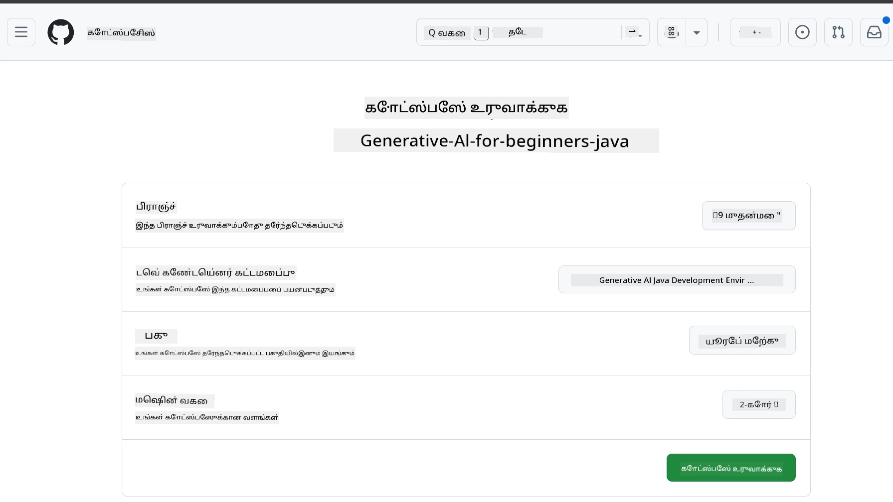
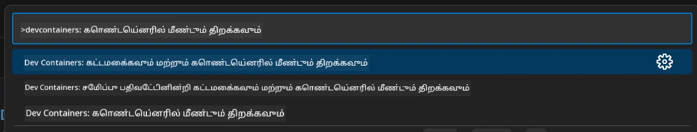
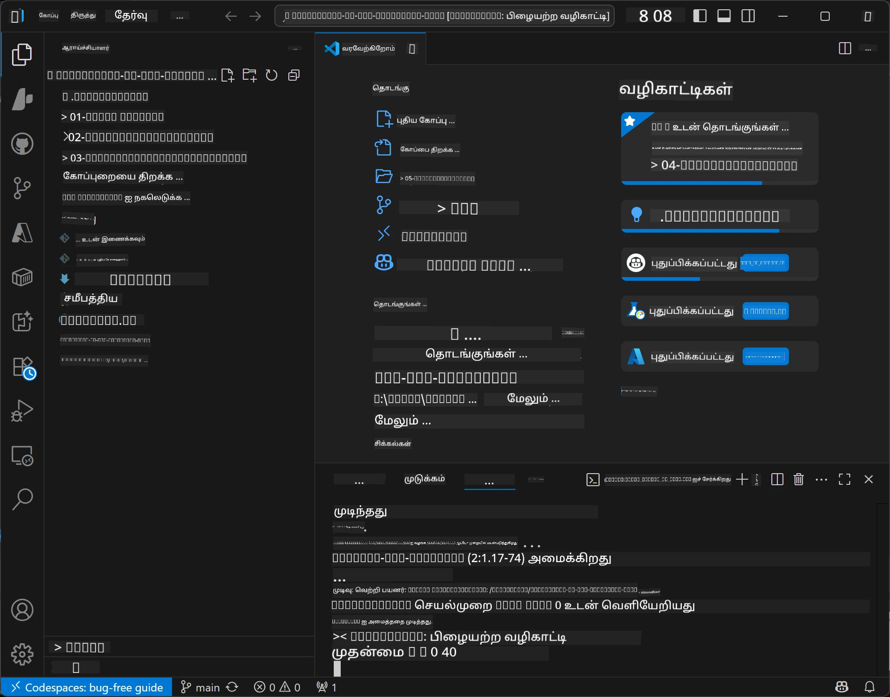

# Java க்கான ஜெனரேட்டிவ் AI வளர்ச்சிக்கான சூழலை அமைத்தல்

> **விரைவான துவக்கம்**: 2 நிமிடங்களில் கிளவுட்டில் குறியீடு - [GitHub Codespaces அமைப்பு](../../../02-SetupDevEnvironment) பார்க்கவும் - உள்ளூர் நிறுவல் தேவையில்லை மற்றும் github மாதிரிகள் பயன்படுத்தப்படும்!

> **Azure OpenAI இல் ஆர்வமா?**, புதிய Azure OpenAI வளத்தை உருவாக்கும் படிகள் உள்ள [Azure OpenAI Setup Guide](getting-started-azure-openai.md) ஐ பாருங்கள்.

## நீங்கள் அறிந்து கொள்வது

- AI பயன்பாடுகளுக்கான Java வளர்ச்சி சூழலை அமைப்பு செய்யல்
- உங்கள் விருப்பமான வளர்ச்சி சூழலை தேர்வு செய்து கட்டமைத்தல் (Codespaces உடன் கிளவுட் முதலில், உள்ளூர் dev container, அல்லது முழு உள்ளூர் அமைப்பு)
- GitHub மாதிரிகளுடன் இணைத்து உங்கள் அமைப்பை சோதனை செய்தல்

## உள்ளடக்கமேடு

- [நீங்கள் அறிந்து கொள்வது](../../../02-SetupDevEnvironment)
- [அறிமுகம்](../../../02-SetupDevEnvironment)
- [படி 1: உங்கள் வளர்ச்சி சூழலை அமைத்தல்](../../../02-SetupDevEnvironment)
  - [விருப்பம் A: GitHub Codespaces (பரிந்துரைக்கப்பட்டது)](../../../02-SetupDevEnvironment)
  - [விருப்பம் B: உள்ளூர் Dev Container](../../../02-SetupDevEnvironment)
  - [விருப்பம் C: உங்கள் தற்போதைய உள்ளூர் நிறுவலை பயன்படுத்துக](../../../02-SetupDevEnvironment)
- [படி 2: GitHub Personal Access Token உருவாக்குதல்](../../../02-SetupDevEnvironment)
- [படி 3: GitHub மாதிரிகளுடன் உங்கள் அமைப்பை சோதனை செய்தல்](../../../02-SetupDevEnvironment)
- [சிக்கல் தீர்க்கல்](../../../02-SetupDevEnvironment)
- [சுருக்கம்](../../../02-SetupDevEnvironment)
- [அடுத்த படிகள்](../../../02-SetupDevEnvironment)

## அறிமுகம்

இந்த அத்தியாயம் உங்கள் வளர்ச்சி சூழலை அமைக்கும் முறையில் உங்களுக்கு வழிகாட்டும். நாங்கள் **GitHub Models** ஐ முக்கிய உதாரணமாக பயன்படுத்துகிறோம் ஏனென்றால் இது இலவசமாக உள்ளது, GitHub கணக்குடன் எளிதாக அமைக்க முடியும், கிரெடிட் கார்டு தேவையில்லை மற்றும் பரிசோதனைக்கான பல மாதிரிகளுக்கு அணுகல் வழங்குகிறது.

**எந்த உள்ளூர் அமைப்பும் தேவையில்லை!** GitHub Codespaces ஐப் பயன்படுத்தி உடனடியாக துவக்கம் செய்யலாம், இது உலாவியில் முழுமையான வளர்ச்சி சூழலை வழங்குகிறது.


இந்த பாடத்திட்டத்துக்காக [**GitHub Models**](https://github.com/marketplace?type=models) பயன்படுத்த பரிந்துரைக்கப்படுகிறது:

- துவங்க இலவசம்
- GitHub கணக்குடன் எளிதாக அமைக்கக்கூடியது
- கிரெடிட் கார்டு தேவையில்லை
- பரிசோதனைகளுக்கு பல மாதிரிகள் கிடைக்கும்

> **குறிப்பு**: இந்த பயிற்சியில் பயன்படுத்தப்படும் GitHub Models இல் இலவச வரம்புகள்:
> - நிமிடத்திற்கு 15 கோரிக்கை (ஒரு நாளுக்கு 150)
> - கோரிக்கைக்கு சுமார் 8,000 வார்த்தைகள் உள்ளீடு, சுமார் 4,000 வார்த்தைகள் வெளியீடு
> - 5 இணை கோரிக்கைகள்
> 
> உற்பத்தி பயன்பாட்டிற்காக உங்கள் Azure கணக்குடன் Azure AI Foundry Models க்கு மேம்படுத்தவும். உங்கள் குறியீடு மாற்றம் தேவையில்லை. [Azure AI Foundry ஆவணங்கள்](https://learn.microsoft.com/azure/ai-foundry/foundry-models/how-to/quickstart-github-models) பார்க்கவும்.


## படி 1: உங்கள் வளர்ச்சி சூழலை அமைத்தல்

<a name="quick-start-cloud"></a>

இந்த ஜெனரேட்டிவ் AI Java பாடத்திட்டத்திற்கு தேவையான கருவிகள் அனைத்தும் உட்படுத்தப்பட்ட உருவாக்கப்பட்ட முன்கட்டமைவு dev container ஒன்று உருவாக்கியிருக்கிறோம். உங்கள் விருப்ப வளர்ச்சி முறையை தேர்வு செய்யவும்:

### சூழல் அமைப்பு விருப்பங்கள்:

#### விருப்பம் A: GitHub Codespaces (பரிந்துரைக்கப்பட்டது)

**2 நிமிடத்தில் குறியீடு துவங்குங்கள் - உள்ளூர் நிறுவல் தேவையில்லை!**

1. இந்த கோப்பகத்தை உங்கள் GitHub கணக்குக்கு fork செய்யவும்
   > **குறிப்பு**: அடிப்படையிலான கட்டமைப்பை மாற்ற விரும்பினால் [Dev Container Configuration](../../../.devcontainer/devcontainer.json) ஐ பார்வையிடவும்
2. **Code** → **Codespaces** டேப் → **...** → **New with options...** ஐ கிளிக் செய்க
3. இயல்புநிலைகளை பயன்படுத்தவும் – இது இந்த பாடத்திட்டத்திற்கு உருவாக்கப்பட்ட **Generative AI Java Development Environment** தனிப்பயன் devcontainer ஐத் தேர்வு செய்யும்
4. **Create codespace** கிளிக் செய்க
5. சூழல் தயார் ஆக ~2 நிமிடங்கள் காத்திருக்கவும்
6. [படி 2: GitHub Token உருவாக்குதல்](../../../02-SetupDevEnvironment)க்கு செல்லவும்





> **Codespaces நன்மைகள்**:
> - உள்ளூர் நிறுவல் தேவையில்லை
> - உலாவியுள்ள எந்த சாதனத்திலும் வேலை செய்கிறது
> - அனைத்து கருவிகளும் மற்றும் சார்ந்திருப்புக்கள் முன்கட்டமைக்கப்பட்டவை
> - 개인 கணக்குகளுக்கு மாதத்திற்கு 60 மணி இலவசம்
> - அனைத்து கற்றலாளர்களுக்கும் ஒரே மாதிரியான சூழல்

#### விருப்பம் B: உள்ளூர் Dev Container

**Docker உடன் உள்ளூர் வளர்ச்சிக்கு விருப்பம் உள்ளவர்களுக்கு**

1. இந்த கோப்பகத்தை உங்கள் உள்ளூர் இயந்திரத்தில் fork மற்றும் clone செய்யவும்
   > **குறிப்பு**: அடிப்படையிலான கட்டமைப்பை மாற்ற விரும்பினால் [Dev Container Configuration](../../../.devcontainer/devcontainer.json) ஒன்றை பார்வையிடவும்
2. [Docker Desktop](https://www.docker.com/products/docker-desktop/) மற்றும் [VS Code](https://code.visualstudio.com/) நிறுவவும்
3. VS Code இல் [Dev Containers விரிவுரையை](https://marketplace.visualstudio.com/items?itemName=ms-vscode-remote.remote-containers) நிறுவவும்
4. கோப்பகத்தையும் VS Code இல் திறக்கவும்
5. கேட்கப்பட்டால், **Reopen in Container** ஐ கிளிக் செய்க (அல்லது `Ctrl+Shift+P` → "Dev Containers: Reopen in Container" பயன்படுத்தவும்)
6. container உருவாக்கப்பட்டு துவங்கும் வரை காத்திருங்கள்
7. [படி 2: GitHub Token உருவாக்குதல்](../../../02-SetupDevEnvironment)க்கு செல்லவும்




#### விருப்பம் C: உங்கள் தற்போதைய உள்ளூர் நிறுவலை பயன்படுத்துக

**தற்போதைய Java சூழல்கள் உள்ளவர்களுக்கு**

முன் தேவைகள்:
- [Java 21+](https://www.oracle.com/java/technologies/javase/jdk21-archive-downloads.html)
- [Maven 3.9+](https://maven.apache.org/download.cgi)
- [VS Code](https://code.visualstudio.com) அல்லது உங்கள் விருப்ப IDE

படிகள்:
1. இந்த கோப்பகத்தை உள்ளூர் இயந்திரத்தில் clone செய்க
2. உங்கள் IDE இல் திட்டத்தை திறக்கவும்
3. [படி 2: GitHub Token உருவாக்குதல்](../../../02-SetupDevEnvironment)க்கு செல்லவும்

> **திறமை கூர்மை**: உங்கள் இயந்திரம் குறைந்த திறமை கொண்டிருந்தாலும் VS Code உள்ளூரில் விரும்பினால் GitHub Codespaces பயன்படுத்தவும்! உங்கள் உள்ளூர் VS Code ஐ கிளவுடில் இருக்கும் Codespace உடன் இணைக்கலாம், இரு உலகங்களின் சிறந்ததையும் பெறலாம்.




## படி 2: GitHub Personal Access Token உருவாக்குதல்

1. [GitHub Settings](https://github.com/settings/profile) சென்று உங்கள் சுயவிவர மெனுவில் இருந்து **Settings** தேர்ந்தெடுக்கவும்.
2. இடது பக்க பட்டியில் **Developer settings** இல் கிளிக் செய்க (பொதுவாக கீழே இருக்கும்).
3. **Personal access tokens** கீழ் **Fine-grained tokens** (அல்லது இந்த நேரடி [இணைப்பு](https://github.com/settings/personal-access-tokens)) கிளிக் செய்க.
4. **Generate new token** கிளிக் செய்க.
5. "Token name" கீழ் விளக்கமான பெயர் கொடுக்கவும் (எ.கா., `GenAI-Java-Course-Token`).
6. காலாவதியாகும் தேதி அமைக்கவும் (பாதுகாப்பு சிறந்த நடைமுறைக்காக 7 நாட்கள் பரிந்துரைக்கப்படுகிறது).
7. "Resource owner" கீழ் உங்கள் பயனர் கணக்கை தேர்ந்தெடுக்கவும்.
8. "Repository access" கீழ் GitHub மாதிரிகளுடன் பயன்படுத்த தேவையான கோப்பகங்களை தேர்வு செய்யவும் (அல்லது தேவையானால் "All repositories").
9. "Account permissions" கீழ் **Models** ஐ தேர்ந்து **Read-only** ஆக அமைக்கவும்.
10. **Generate token** கிளிக் செய்க.
11. **உங்கள் டோக்கனை இப்போது நகலெடுக்கவும் மற்றும் சேமிக்கவும்** – இது மீண்டும் தெரியாது!

> **பாதுகாப்பு குறிப்புரை**: உங்கள் அணுகல் டோக்கன்களுக்கு குறைந்தபட்ச தேவையான உரிமைகள் மற்றும் குறைந்த காலாவதியாகும் நேரத்தை பயன்படுத்தவும்.

## படி 3: GitHub மாதிரிகளுடன் உங்கள் அமைப்பை சோதனை செய்தல்

உங்கள் வளர்ச்சி சூழல் தயார் ஆனதும், [`02-SetupDevEnvironment/examples/github-models`](../../../02-SetupDevEnvironment/examples/github-models) உள்ள எங்கள் உதாரண செயலியுடன் GitHub Models ஒருங்கிணைப்பை சோதனை செய்யலாம்.

1. உங்கள் வளர்ச்சி சூழலில் டெர்மினலை திறக்கவும்.
2. GitHub Models உதாரணத்திற்கு செல்லவும்:
   ```bash
   cd 02-SetupDevEnvironment/examples/github-models
   ```
3. உங்கள் GitHub டோக்கனை சுற்றுச்சூழல் மாறிலியாக அமைக்கவும்:
   ```bash
   # macOS/லினக்ஸ்
   export GITHUB_TOKEN=your_token_here
   
   # விண்டோஸ் (கமாண்டு ப்ராம்ப்ட்)
   set GITHUB_TOKEN=your_token_here
   
   # விண்டோஸ் (பவர் ஷெல்)
   $env:GITHUB_TOKEN="your_token_here"
   ```

4. செயலியை இயக்கவும்:
   ```bash
   mvn compile exec:java -Dexec.mainClass="com.example.githubmodels.App"
   ```

அடுத்து இதுபோன்ற வெளியீடு காணப்பட வேண்டும்:
```text
Using model: gpt-4.1-nano
Sending request to GitHub Models...
Response: Hello World!
```

### உதாரணக் குறியீட்டை புரிந்துகொள்ளுதல்

முதலில், இப்போது நாம் இயக்கியதை புரிந்து கொள்வோம். `examples/github-models` கீழ் உள்ள உதாரணம் OpenAI Java SDK ஐப் பயன்படுத்தி GitHub Models இற்கு இணைகிறது:

**இந்த குறியீடு என்ன செய்கிறது:**
- உங்கள் தனிப்பட்ட அணுகல் டோக்கனைக் கொண்டு GitHub Models ஐ இணைக்கும்
- AI மாதிரிக்கு "Say Hello World!" என்ற எளிய செய்தியை அனுப்பும்
- AI பதிலை பெறும் மற்றும் காட்டும்
- உங்கள் அமைப்பு சரியாக செயல்படுகிறதா என்பதை சரிபார்க்கும்

**முக்கிய சார்புத் தொகுதி** (`pom.xml`ல்):
```xml
<dependency>
    <groupId>com.openai</groupId>
    <artifactId>openai-java</artifactId>
    <version>2.12.0</version>
</dependency>
```

**முதன்மை குறியீடு** (`App.java`):
```java
// OpenAI ஜாவா SDK பயன்படுத்தி GitHub மாடல்களுக்கு இணைக்கவும்
OpenAIClient client = OpenAIOkHttpClient.builder()
    .apiKey(pat)
    .baseUrl("https://models.inference.ai.azure.com")
    .build();

// கோரிக்கை உரையாடல் நிறைவு உருவாக்கவும்
ChatCompletionCreateParams params = ChatCompletionCreateParams.builder()
    .model(modelId)
    .addSystemMessage("You are a concise assistant.")
    .addUserMessage("Say Hello World!")
    .build();

// AI பதிலை பெறுக
ChatCompletion response = client.chat().completions().create(params);
System.out.println("Response: " + response.choices().get(0).message().content().orElse("No response content"));
```

## சுருக்கம்

நன்று! இப்போது நீங்கள் எல்லாவற்றையும் அமைத்துள்ளீர்கள்:

- AI மாதிரி அணுகலுக்கு GitHub Personal Access Token உரிய அனுமதிகளுடன் உருவாக்கியது
- உங்கள் Java வளர்ச்சி சூழல் (Codespaces, dev containers, அல்லது உள்ளூர்) இயங்க ஆரம்பித்தது
- OpenAI Java SDK மூலம் GitHub Models உடன் இலவச AI வளர்ச்சிக்கு இணைத்தல்
- AI மாதிரிகளுடன் பேசும் எளிய உதாரணத்துடன் தானும் சரிபார்த்தல்

## அடுத்த படிகள்

[அத்தியாயம் 3: முக்கிய ஜெனரேட்டிவ் AI தொழில்நுட்பங்கள்](../03-CoreGenerativeAITechniques/README.md)

## சிக்கல் தீர்க்கல்

சிக்கல்கள் உள்ளதா? பொதுவான பிரச்சனைகள் மற்றும் தீர்வுகள்:

- **டோக்கன் வேலை செய்யவில்லை?**  
  - முழு டோக்கனும் கூடுதலாக இடைவெளி இல்லாமல் நகலெடுக்கப்பட்டுள்ளதா உறுதிப்படுத்துக
  - டோக்கன் சரியாக சுற்றுச்சூழல் மாறிலியாக அமைக்கப்பட்டதா சரிபார்க்கவும்
  - டோக்கனுக்கு சரியான அனுமதிகள் உள்ளதா பாருங்கள் (Models: Read-only)

- **Maven காணாமல் போயிற்றா?**  
  - dev containers/Codespaces பயன்படுத்தினால் Maven முன்கட்டமைக்கப்பட்டுள்ளது
  - உள்ளூர் அமைப்புக்கு Java 21+ மற்றும் Maven 3.9+ இருக்கும் என்பதை உறுதிப்படுத்துக
  - நிறுவல் சரிபார்க்க `mvn --version` இயக்கு

- **தொடர்பு பிரச்சனை?**  
  - உங்கள் இணைய இணைப்பு சரியானதா என்பதை பார்க்கவும்
  - GitHub உங்கள் நெட்வொர்க்கில் அணுககூடியதா சரிபார்க்கவும்
  - GitHub Models கொடுத்துள்ள இடைமுகத்தின் பின்புறம் firewall தடையாக இல்லை என்பதைக் பாருங்கள்

- **Dev container துவங்கவில்லை?**  
  - Docker Desktop இயங்கி இருக்கிறதா உறுதிப்படுத்துக (உள்ளூர் வளர்ச்சிக்காக)
  - container ஐ மறுபடியும் கட்ட முயற்சி செய்க: `Ctrl+Shift+P` → "Dev Containers: Rebuild Container"

- **செயலி தொகுப்பு பிழைகள்?**  
  - நீங்கள் சரியான அடைவில் இருக்கிறீர்களா என்பதை உறுதிப்படுத்துக: `02-SetupDevEnvironment/examples/github-models`
  - தூய்மை செய்து மறுபடியும் கட்ட: `mvn clean compile`

> **உதவி தேவை?**: இன்னும் சிக்கல் இருந்தால், கோப்பகத்தில் ஒரு issue உடைத் திறந்து நாங்கள் உதவுகிறோம்.

---

<!-- CO-OP TRANSLATOR DISCLAIMER START -->
**மறுப்பு**:  
இந்த ஆவணம் AI மொழிபெயர்ப்பு சேவை [Co-op Translator](https://github.com/Azure/co-op-translator) பயன்படுத்தி மொழிபெயர்க்கப்பட்டுள்ளது. எங்களது துல்லியத்திற்கான முயற்சிகளை முன்னிட்டு, தானியங்கி மொழிபெயர்ப்புகளில் பிழைகள் அல்லது தவறுகள் இருக்கக்கூடும் என்பதை தயவுசெய்து கவனத்திற்கு எடுத்துகொள்ளவும். பூர்வ ஆவணம் அதன் இயல்புநிலையிலான மொழியில் அதிகாரப்பூர்வமான ஆதாரமாக கருதப்பட வேண்டும். முக்கிய தகவல்களுக்கு, தொழில்முறை மனித மொழிபெயர்ப்பு பரிந்துரைக்கப்படுகிறது. இந்த மொழிபெயர்ப்பின் பயன்பாட்டால் ஏற்படும் எந்தவொரு தவறான புரிதல்கள் அல்லது தவறான விளக்கங்களுக்கு நாங்கள் பொறுப்பேற்கவில்லை.
<!-- CO-OP TRANSLATOR DISCLAIMER END -->