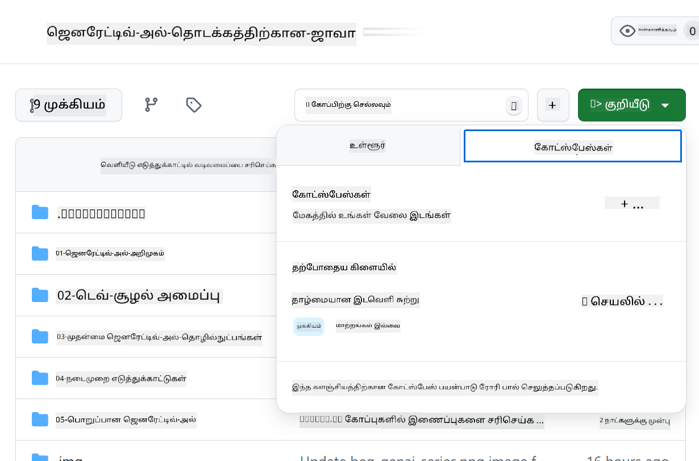
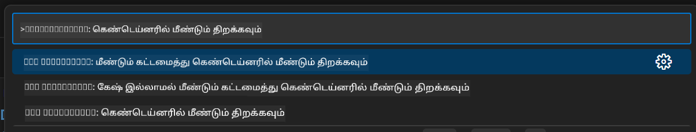
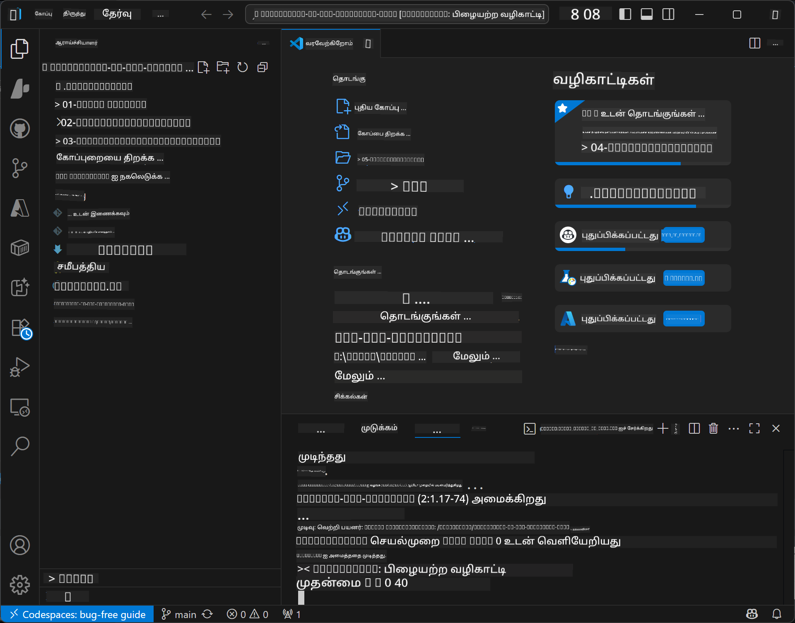

<!--
CO_OP_TRANSLATOR_METADATA:
{
  "original_hash": "4bdff5070d182c64143dfe5a581d0ec7",
  "translation_date": "2025-10-11T10:44:21+00:00",
  "source_file": "02-SetupDevEnvironment/README.md",
  "language_code": "ta"
}
-->
# ஜெனரேட்டிவ் AI க்கான ஜாவா டெவலப்மென்ட் சூழலை அமைத்தல்

> **விரைவான தொடக்கம்**: கிளவுடில் 2 நிமிடங்களில் கோட் செய்யுங்கள் - [GitHub Codespaces அமைப்பு](../../../02-SetupDevEnvironment) பகுதியை நோக்கி செல்லுங்கள் - உள்ளூர் நிறுவல் தேவையில்லை, மேலும் GitHub மாடல்களை பயன்படுத்துகிறது!

> **Azure OpenAI-ல் ஆர்வமா?**, புதிய Azure OpenAI வளத்தை உருவாக்குவதற்கான படிகள் கொண்ட [Azure OpenAI அமைப்பு வழிகாட்டி](getting-started-azure-openai.md) ஐ பார்க்கவும்.

## நீங்கள் கற்றுக்கொள்ளப்போகிறீர்கள்

- AI பயன்பாடுகளுக்கான ஜாவா டெவலப்மென்ட் சூழலை அமைத்தல்
- உங்கள் விருப்பமான டெவலப்மென்ட் சூழலை தேர்வு செய்து அமைத்தல் (Codespaces மூலம் கிளவுட்-முதலில், உள்ளூர் டெவ் கண்டெய்னர், அல்லது முழுமையான உள்ளூர் அமைப்பு)
- GitHub மாடல்களுடன் இணைந்து உங்கள் அமைப்பை சோதித்தல்

## உள்ளடக்க அட்டவணை

- [நீங்கள் கற்றுக்கொள்ளப்போகிறீர்கள்](../../../02-SetupDevEnvironment)
- [அறிமுகம்](../../../02-SetupDevEnvironment)
- [படி 1: உங்கள் டெவலப்மென்ட் சூழலை அமைத்தல்](../../../02-SetupDevEnvironment)
  - [விருப்பம் A: GitHub Codespaces (பிரிந்துரைக்கப்படுகிறது)](../../../02-SetupDevEnvironment)
  - [விருப்பம் B: உள்ளூர் டெவ் கண்டெய்னர்](../../../02-SetupDevEnvironment)
  - [விருப்பம் C: உங்கள் உள்ளூர் நிறுவலை பயன்படுத்துதல்](../../../02-SetupDevEnvironment)
- [படி 2: GitHub தனிப்பட்ட அணுகல் டோக்கனை உருவாக்குதல்](../../../02-SetupDevEnvironment)
- [படி 3: உங்கள் அமைப்பை சோதித்தல்](../../../02-SetupDevEnvironment)
- [சிக்கல்களை தீர்த்தல்](../../../02-SetupDevEnvironment)
- [சுருக்கம்](../../../02-SetupDevEnvironment)
- [அடுத்த படிகள்](../../../02-SetupDevEnvironment)

## அறிமுகம்

இந்த அத்தியாயம் உங்கள் டெவலப்மென்ட் சூழலை அமைப்பதற்கான வழிகாட்டுதலை வழங்கும். **GitHub மாடல்கள்** எளிதாக அமைக்க கூடியது, GitHub கணக்குடன் இலவசமாக பயன்படுத்தக்கூடியது, கிரெடிட் கார்டு தேவையில்லை, மேலும் பல மாடல்களை பரிசோதிக்க அனுமதிக்கிறது என்பதால், இதை முதன்மை எடுத்துக்காட்டாக பயன்படுத்துகிறோம்.

**உள்ளூர் அமைப்பு தேவையில்லை!** GitHub Codespaces ஐ பயன்படுத்தி, உங்கள் உலாவியில் முழுமையான டெவலப்மென்ட் சூழலை உடனடியாக தொடங்கலாம்.


இந்த பாடத்திற்காக [**GitHub மாடல்கள்**](https://github.com/marketplace?type=models) ஐ பயன்படுத்த பரிந்துரைக்கிறோம், ஏனெனில் இது:
- **இலவசம்** தொடங்க
- **எளிது** GitHub கணக்குடன் அமைக்க
- **கிரெடிட் கார்டு** தேவையில்லை
- **பல மாடல்கள்** பரிசோதிக்க கிடைக்கின்றன

> **குறிப்பு**: இந்த பயிற்சியில் பயன்படுத்தப்படும் GitHub மாடல்களுக்கு இலவச வரம்புகள் உள்ளன:
> - 15 கோரிக்கைகள் ஒரு நிமிடத்திற்கு (150 ஒரு நாளைக்கு)
> - ~8,000 வார்த்தைகள் உள்ளே, ~4,000 வார்த்தைகள் வெளியே ஒரு கோரிக்கைக்கு
> - 5 ஒரே நேர கோரிக்கைகள்
> 
> உற்பத்தி பயன்பாட்டிற்காக, உங்கள் Azure கணக்குடன் Azure AI Foundry மாடல்களுக்கு மேம்படுத்தவும். உங்கள் கோடு மாற்றம் தேவையில்லை. [Azure AI Foundry ஆவணங்களை](https://learn.microsoft.com/azure/ai-foundry/foundry-models/how-to/quickstart-github-models) பார்க்கவும்.

## படி 1: உங்கள் டெவலப்மென்ட் சூழலை அமைத்தல்

<a name="quick-start-cloud"></a>

இந்த ஜெனரேட்டிவ் AI ஜாவா பாடத்திற்கான தேவையான அனைத்து கருவிகளையும் கொண்ட ஒரு முன்கூட்டியமைக்கப்பட்ட டெவலப்மென்ட் கண்டெய்னரை உருவாக்கியுள்ளோம். உங்கள் விருப்பமான டெவலப்மென்ட் அணுகுமுறையை தேர்வு செய்யுங்கள்:

### சூழல் அமைப்பு விருப்பங்கள்:

#### விருப்பம் A: GitHub Codespaces (பிரிந்துரைக்கப்படுகிறது)

**2 நிமிடங்களில் கோட் செய்ய தொடங்குங்கள் - உள்ளூர் அமைப்பு தேவையில்லை!**

1. இந்த repository ஐ உங்கள் GitHub கணக்கிற்கு Fork செய்யுங்கள்
   > **குறிப்பு**: அடிப்படை config ஐ திருத்த விரும்பினால், [Dev Container Configuration](../../../.devcontainer/devcontainer.json) ஐ பார்க்கவும்
2. **Code** → **Codespaces** tab → **...** → **New with options...** ஐ கிளிக் செய்யுங்கள்
3. இயல்புகளை பயன்படுத்துங்கள் – இது **Dev container configuration** ஐ தேர்வு செய்யும்: **Generative AI Java Development Environment** இந்த பாடத்திற்காக உருவாக்கப்பட்ட தனிப்பயன் devcontainer
4. **Create codespace** ஐ கிளிக் செய்யுங்கள்
5. சூழல் தயாராக ~2 நிமிடங்கள் காத்திருக்கவும்
6. [படி 2: GitHub Token உருவாக்குதல்](../../../02-SetupDevEnvironment) பகுதியை நோக்கி செல்லுங்கள்




> **Codespaces இன் நன்மைகள்**:
> - உள்ளூர் நிறுவல் தேவையில்லை
> - உலாவியுடன் எந்த சாதனத்திலும் வேலை செய்கிறது
> - அனைத்து கருவிகளும் சார்புகளும் முன்கூட்டியே அமைக்கப்பட்டுள்ளன
> - தனிப்பட்ட கணக்குகளுக்கு மாதத்திற்கு 60 மணி இலவசம்
> - அனைத்து கற்றலாளர்களுக்கும் ஒரே மாதிரியான சூழல்

#### விருப்பம் B: உள்ளூர் டெவ் கண்டெய்னர்

**Docker உடன் உள்ளூர் டெவலப்மென்ட் விரும்பும் டெவலப்பர்களுக்கு**

1. இந்த repository ஐ உங்கள் உள்ளூர் கணினிக்கு Fork செய்து Clone செய்யுங்கள்
   > **குறிப்பு**: அடிப்படை config ஐ திருத்த விரும்பினால், [Dev Container Configuration](../../../.devcontainer/devcontainer.json) ஐ பார்க்கவும்
2. [Docker Desktop](https://www.docker.com/products/docker-desktop/) மற்றும் [VS Code](https://code.visualstudio.com/) ஐ நிறுவுங்கள்
3. VS Code இல் [Dev Containers extension](https://marketplace.visualstudio.com/items?itemName=ms-vscode-remote.remote-containers) ஐ நிறுவுங்கள்
4. Repository கோப்புறையை VS Code இல் திறக்கவும்
5. கேட்கப்பட்டால், **Reopen in Container** ஐ கிளிக் செய்யுங்கள் (அல்லது `Ctrl+Shift+P` → "Dev Containers: Reopen in Container" ஐ பயன்படுத்தவும்)
6. கண்டெய்னர் கட்டமைக்கவும் மற்றும் தொடங்கவும் காத்திருக்கவும்
7. [படி 2: GitHub Token உருவாக்குதல்](../../../02-SetupDevEnvironment) பகுதியை நோக்கி செல்லுங்கள்




#### விருப்பம் C: உங்கள் உள்ளூர் நிறுவலை பயன்படுத்துதல்

**ஏற்கனவே உள்ள ஜாவா சூழல்களுடன் உள்ள டெவலப்பர்களுக்கு**

முன்னோட்ட தேவைகள்:
- [Java 21+](https://www.oracle.com/java/technologies/javase/jdk21-archive-downloads.html) 
- [Maven 3.9+](https://maven.apache.org/download.cgi)
- [VS Code](https://code.visualstudio.com) அல்லது உங்கள் விருப்பமான IDE

படிகள்:
1. இந்த repository ஐ உங்கள் உள்ளூர் கணினிக்கு Clone செய்யுங்கள்
2. IDE இல் திட்டத்தை திறக்கவும்
3. [படி 2: GitHub Token உருவாக்குதல்](../../../02-SetupDevEnvironment) பகுதியை நோக்கி செல்லுங்கள்

> **சிறந்த ஆலோசனை**: உங்கள் கணினி குறைந்த அளவிலான திறனுடன் இருந்தால், ஆனால் உள்ளூர் VS Code ஐ விரும்பினால், GitHub Codespaces ஐ பயன்படுத்துங்கள்! உங்கள் உள்ளூர் VS Code ஐ கிளவுட்-ஹோஸ்டட் Codespace க்கு இணைக்கலாம், இரண்டின் சிறந்த அம்சங்களையும் பெற.




## படி 2: GitHub தனிப்பட்ட அணுகல் டோக்கனை உருவாக்குதல்

1. [GitHub Settings](https://github.com/settings/profile) ஐ நோக்கி செல்லுங்கள் மற்றும் உங்கள் ப்ரொஃபைல் மெனுவில் **Settings** ஐ தேர்வு செய்யுங்கள்.
2. இடது பக்க பட்டியில் **Developer settings** ஐ கிளிக் செய்யுங்கள் (சாதாரணமாக கீழே இருக்கும்).
3. **Personal access tokens** கீழ், **Fine-grained tokens** ஐ கிளிக் செய்யுங்கள் (அல்லது இந்த நேரடி [இணைப்பை](https://github.com/settings/personal-access-tokens) பின்பற்றவும்).
4. **Generate new token** ஐ கிளிக் செய்யுங்கள்.
5. "Token name" கீழ், விளக்கமான பெயரை வழங்குங்கள் (எ.கா., `GenAI-Java-Course-Token`).
6. காலாவதி தேதியை அமைக்கவும் (பாதுகாப்பு சிறந்த நடைமுறைகளுக்காக: 7 நாட்கள் பரிந்துரைக்கப்படுகிறது).
7. "Resource owner" கீழ், உங்கள் பயனர் கணக்கை தேர்வு செய்யுங்கள்.
8. "Repository access" கீழ், GitHub மாடல்களுடன் பயன்படுத்த வேண்டிய repositoryகளை தேர்வு செய்யுங்கள் (அல்லது "All repositories" தேவைப்பட்டால்).
9. "Account permissions" கீழ், **Models** ஐ கண்டுபிடித்து **Read-only** ஆக அமைக்கவும்.
10. **Generate token** ஐ கிளிக் செய்யுங்கள்.
11. **உங்கள் டோக்கனை இப்போது நகலெடுத்து சேமிக்கவும்** – அதை மீண்டும் பார்க்க முடியாது!

> **பாதுகாப்பு ஆலோசனை**: உங்கள் அணுகல் டோக்கன்களுக்கு தேவையான குறைந்த அளவிலான அளவீடு மற்றும் குறைந்த காலாவதி நேரத்தை பயன்படுத்தவும்.

## படி 3: GitHub மாடல்கள் எடுத்துக்காட்டுடன் உங்கள் அமைப்பை சோதித்தல்

உங்கள் டெவலப்மென்ட் சூழல் தயாராக இருந்தவுடன், [`02-SetupDevEnvironment/examples/github-models`](../../../02-SetupDevEnvironment/examples/github-models) இல் உள்ள எடுத்துக்காட்டுப் பயன்பாட்டுடன் GitHub மாடல்கள் ஒருங்கிணைப்பை சோதிக்கலாம்.

1. உங்கள் டெவலப்மென்ட் சூழலில் டெர்மினலை திறக்கவும்.
2. GitHub மாடல்கள் எடுத்துக்காட்டை நோக்கி செல்லுங்கள்:
   ```bash
   cd 02-SetupDevEnvironment/examples/github-models
   ```
3. உங்கள் GitHub டோக்கனை சூழல் மாறியாக அமைக்கவும்:
   ```bash
   # macOS/Linux
   export GITHUB_TOKEN=your_token_here
   
   # Windows (Command Prompt)
   set GITHUB_TOKEN=your_token_here
   
   # Windows (PowerShell)
   $env:GITHUB_TOKEN="your_token_here"
   ```

4. பயன்பாட்டை இயக்கவும்:
   ```bash
   mvn compile exec:java -Dexec.mainClass="com.example.githubmodels.App"
   ```

நீங்கள் இதற்கு ஒத்த வெளியீட்டை காண வேண்டும்:
```text
Using model: gpt-4.1-nano
Sending request to GitHub Models...
Response: Hello World!
```

### எடுத்துக்காட்டுக் கோடுகளை புரிந்துகொள்ளுதல்

முதலில், நாம் என்ன இயக்கினோம் என்பதை புரிந்துகொள்வோம். `examples/github-models` கீழ் உள்ள எடுத்துக்காட்டில் OpenAI Java SDK ஐ பயன்படுத்தி GitHub மாடல்களுடன் இணைக்கிறது:

**இந்த கோடு என்ன செய்கிறது:**
- **GitHub மாடல்களுடன்** உங்கள் தனிப்பட்ட அணுகல் டோக்கனைப் பயன்படுத்தி இணைக்கிறது
- AI மாடலுக்கு "Say Hello World!" என்ற எளிய செய்தியை **அனுப்புகிறது**
- AI இன் பதிலை **பெறுகிறது** மற்றும் காட்டுகிறது
- உங்கள் அமைப்பு சரியாக செயல்படுகிறது என்பதை **சரிபார்க்கிறது**

**முக்கிய சார்பு** (`pom.xml` இல்):
```xml
<dependency>
    <groupId>com.openai</groupId>
    <artifactId>openai-java</artifactId>
    <version>2.12.0</version>
</dependency>
```

**முக்கிய கோடு** (`App.java`):
```java
// Connect to GitHub Models using OpenAI Java SDK
OpenAIClient client = OpenAIOkHttpClient.builder()
    .apiKey(pat)
    .baseUrl("https://models.inference.ai.azure.com")
    .build();

// Create chat completion request
ChatCompletionCreateParams params = ChatCompletionCreateParams.builder()
    .model(modelId)
    .addSystemMessage("You are a concise assistant.")
    .addUserMessage("Say Hello World!")
    .build();

// Get AI response
ChatCompletion response = client.chat().completions().create(params);
System.out.println("Response: " + response.choices().get(0).message().content().orElse("No response content"));
```

## சுருக்கம்

அற்புதம்! நீங்கள் இப்போது அனைத்தையும் அமைத்துவிட்டீர்கள்:

- AI மாடல் அணுகலுக்கான சரியான அனுமதிகளுடன் GitHub தனிப்பட்ட அணுகல் டோக்கனை உருவாக்கியுள்ளீர்கள்
- உங்கள் ஜாவா டெவலப்மென்ட் சூழலை இயக்கியுள்ளீர்கள் (Codespaces, dev containers, அல்லது உள்ளூர்)
- OpenAI Java SDK ஐ பயன்படுத்தி GitHub மாடல்களுடன் இலவச AI டெவலப்மென்ட்டை இணைத்துள்ளீர்கள்
- AI மாடல்களுடன் பேசும் எளிய எடுத்துக்காட்டுடன் அனைத்தும் செயல்படுகிறது என்பதை சோதித்துள்ளீர்கள்

## அடுத்த படிகள்

[அத்தியாயம் 3: முக்கிய ஜெனரேட்டிவ் AI தொழில்நுட்பங்கள்](../03-CoreGenerativeAITechniques/README.md)

## சிக்கல்களை தீர்த்தல்

சிக்கல்களா? இங்கே பொதுவான பிரச்சினைகள் மற்றும் தீர்வுகள் உள்ளன:

- **டோக்கன் வேலை செய்யவில்லையா?** 
  - முழு டோக்கனை எந்த கூடுதல் இடைவெளிகளும் இல்லாமல் நகலெடுத்தீர்களா என்பதை உறுதிப்படுத்தவும்
  - டோக்கன் சரியாக சூழல் மாறியாக அமைக்கப்பட்டுள்ளதா என்பதை சரிபார்க்கவும்
  - உங்கள் டோக்கனுக்கு சரியான அனுமதிகள் உள்ளதா (Models: Read and write) என்பதை சரிபார்க்கவும்

- **Maven கிடைக்கவில்லையா?** 
  - dev containers/Codespaces ஐ பயன்படுத்தினால், Maven முன்கூட்டியே நிறுவப்பட்டிருக்கும்
  - உள்ளூர் அமைப்புக்கு, Java 21+ மற்றும் Maven 3.9+ நிறுவப்பட்டுள்ளதா என்பதை உறுதிப்படுத்தவும்
  - `mvn --version` ஐ முயற்சித்து நிறுவலை சரிபார்க்கவும்

- **இணைப்பு பிரச்சினைகள்?** 
  - உங்கள் இணைய இணைப்பை சரிபார்க்கவும்
  - GitHub உங்கள் நெட்வொர்க்கில் அணுகக்கூடியதா என்பதை உறுதிப்படுத்தவும்
  - GitHub மாடல்கள் இறுதிப்புள்ளியைத் தடை செய்யும் firewall பின்னால் நீங்கள் இல்லை என்பதை உறுதிப்படுத்தவும்

- **Dev container தொடங்கவில்லையா?** 
  - Docker Desktop இயங்குகிறதா என்பதை உறுதிப்படுத்தவும் (உள்ளூர் டெவலப்மென்ட்டுக்கு)
  - கண்டெய்னரை மீண்டும் கட்டமைக்க முயற்சிக்கவும்: `Ctrl+Shift+P` → "Dev Containers: Rebuild Container"

- **பயன்பாட்டு தொகுப்பு பிழைகள்?**
  - நீங்கள் சரியான கோப்புறையில் உள்ளீர்களா என்பதை உறுதிப்படுத்தவும்: `02-SetupDevEnvironment/examples/github-models`
  - சுத்தம் செய்து மீண்டும் கட்டமைக்க முயற்சிக்கவும்: `mvn clean compile`

> **உதவி தேவை?**: இன்னும் சிக்கல்களா? Repository இல் ஒரு issue ஐ திறக்கவும், நாங்கள் உங்களுக்கு உதவுவோம்.

---

**குறிப்பு**:  
இந்த ஆவணம் [Co-op Translator](https://github.com/Azure/co-op-translator) என்ற AI மொழிபெயர்ப்பு சேவையைப் பயன்படுத்தி மொழிபெயர்க்கப்பட்டுள்ளது. நாங்கள் துல்லியத்திற்காக முயற்சிக்கின்றோம், ஆனால் தானியக்க மொழிபெயர்ப்புகளில் பிழைகள் அல்லது தவறான தகவல்கள் இருக்கக்கூடும் என்பதை தயவுசெய்து கவனத்தில் கொள்ளவும். அதன் தாய்மொழியில் உள்ள மூல ஆவணம் அதிகாரப்பூர்வ ஆதாரமாக கருதப்பட வேண்டும். முக்கியமான தகவல்களுக்கு, தொழில்முறை மனித மொழிபெயர்ப்பு பரிந்துரைக்கப்படுகிறது. இந்த மொழிபெயர்ப்பைப் பயன்படுத்துவதால் ஏற்படும் எந்த தவறான புரிதல்கள் அல்லது தவறான விளக்கங்களுக்கு நாங்கள் பொறுப்பல்ல.