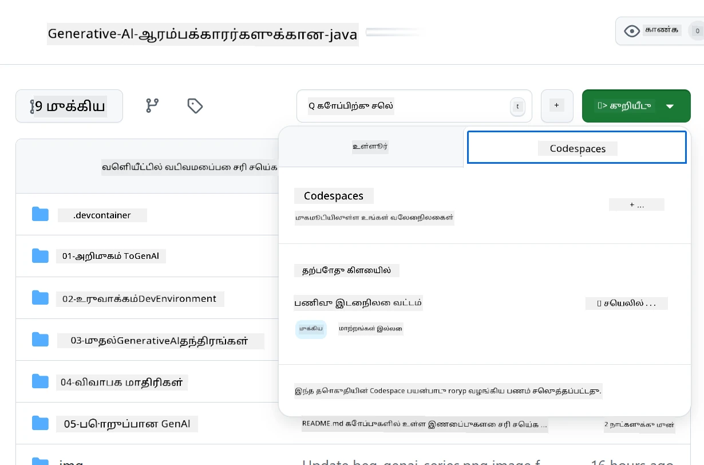

<!--
CO_OP_TRANSLATOR_METADATA:
{
  "original_hash": "bfdb4b4eadbee3a59ef742439f58326a",
  "translation_date": "2025-10-11T10:43:46+00:00",
  "source_file": "02-SetupDevEnvironment/getting-started-azure-openai.md",
  "language_code": "ta"
}
-->
# Azure OpenAI வளர்ச்சி சூழலை அமைத்தல்

> **விரைவான தொடக்கம்**: இந்த வழிகாட்டி Azure OpenAI அமைப்புக்காக. இலவச மாடல்களுடன் உடனடி தொடக்கத்திற்காக [GitHub Models with Codespaces](./README.md#quick-start-cloud) பயன்படுத்தவும்.

இந்த வழிகாட்டி, இந்த பாடத்தில் உங்கள் Java AI பயன்பாடுகளுக்கான Azure AI Foundry மாடல்களை அமைக்க உதவும்.

## உள்ளடக்க அட்டவணை

- [விரைவான அமைப்பு கண்ணோட்டம்](../../../02-SetupDevEnvironment)
- [படி 1: Azure AI Foundry வளங்களை உருவாக்குதல்](../../../02-SetupDevEnvironment)
  - [Hub மற்றும் Project உருவாக்குதல்](../../../02-SetupDevEnvironment)
  - [GPT-4o-mini மாடலை பிரசுரித்தல்](../../../02-SetupDevEnvironment)
- [படி 2: உங்கள் Codespace உருவாக்குதல்](../../../02-SetupDevEnvironment)
- [படி 3: உங்கள் சூழலை அமைத்தல்](../../../02-SetupDevEnvironment)
- [படி 4: உங்கள் அமைப்பை சோதித்தல்](../../../02-SetupDevEnvironment)
- [அடுத்தது என்ன?](../../../02-SetupDevEnvironment)
- [வளங்கள்](../../../02-SetupDevEnvironment)
- [கூடுதல் வளங்கள்](../../../02-SetupDevEnvironment)

## விரைவான அமைப்பு கண்ணோட்டம்

1. Azure AI Foundry வளங்களை உருவாக்கவும் (Hub, Project, Model)
2. Java வளர்ச்சி கெண்டெய்னருடன் Codespace உருவாக்கவும்
3. Azure OpenAI சான்றுகளை கொண்ட .env கோப்பை அமைக்கவும்
4. எடுத்துக்காட்டு திட்டத்துடன் உங்கள் அமைப்பை சோதிக்கவும்

## படி 1: Azure AI Foundry வளங்களை உருவாக்குதல்

### Hub மற்றும் Project உருவாக்குதல்

1. [Azure AI Foundry Portal](https://ai.azure.com/)க்கு சென்று உள்நுழைக
2. **+ Create** → **New hub** (அல்லது **Management** → **All hubs** → **+ New hub** வழியாக செல்லவும்)
3. உங்கள் hub-ஐ அமைக்கவும்:
   - **Hub name**: உதாரணமாக, "MyAIHub"
   - **Subscription**: உங்கள் Azure சந்தாவைத் தேர்ந்தெடுக்கவும்
   - **Resource group**: புதியது உருவாக்கவும் அல்லது ஏற்கனவே உள்ளதைத் தேர்ந்தெடுக்கவும்
   - **Location**: உங்களுக்கு அருகிலுள்ள இடத்தைத் தேர்ந்தெடுக்கவும்
   - **Storage account**: இயல்புநிலை அல்லது தனிப்பயனாக்கவும்
   - **Key vault**: இயல்புநிலை அல்லது தனிப்பயனாக்கவும்
   - **Next** → **Review + create** → **Create** கிளிக் செய்யவும்
4. உருவாக்கப்பட்ட பிறகு, **+ New project** (அல்லது hub கண்ணோட்டத்தில் **Create project**) கிளிக் செய்யவும்
   - **Project name**: உதாரணமாக, "GenAIJava"
   - **Create** கிளிக் செய்யவும்

### GPT-4o-mini மாடலை பிரசுரித்தல்

1. உங்கள் திட்டத்தில் **Model catalog**க்கு சென்று **gpt-4o-mini** தேடவும்
   - *மாற்று வழி: **Deployments** → **+ Create deployment** செல்லவும்*
2. gpt-4o-mini மாடல் கார்டில் **Deploy** கிளிக் செய்யவும்
3. பிரசுரத்தை அமைக்கவும்:
   - **Deployment name**: "gpt-4o-mini"
   - **Model version**: சமீபத்தியதைப் பயன்படுத்தவும்
   - **Deployment type**: Standard
4. **Deploy** கிளிக் செய்யவும்
5. பிரசுரிக்கப்பட்ட பிறகு, **Deployments** தாவலில் சென்று கீழே உள்ளவற்றை நகலெடுக்கவும்:
   - **Deployment name** (உதாரணமாக, "gpt-4o-mini")
   - **Target URI** (உதாரணமாக, `https://your-hub-name.openai.azure.com/`) 
      > **முக்கியம்**: முழு இறுதிப்பாதையை அல்லாமல், அடிப்படை URL-ஐ மட்டும் நகலெடுக்கவும் (உதாரணமாக, `https://myhub.openai.azure.com/`).
   - **Key** (Keys and Endpoint பிரிவில் இருந்து)

> **இன்னும் சிக்கலா?** அதிகாரப்பூர்வ [Azure AI Foundry Documentation](https://learn.microsoft.com/azure/ai-foundry/how-to/create-projects?tabs=ai-foundry&pivots=hub-project) பார்வையிடவும்

## படி 2: உங்கள் Codespace உருவாக்குதல்

1. இந்த repository-ஐ உங்கள் GitHub கணக்கிற்கு Fork செய்யவும்
   > **குறிப்பு**: அடிப்படை அமைப்பைத் திருத்த விரும்பினால் [Dev Container Configuration](../../../.devcontainer/devcontainer.json) பார்க்கவும்
2. Fork செய்யப்பட்ட repo-வில் **Code** → **Codespaces** தாவல் கிளிக் செய்யவும்
3. **...** → **New with options...** கிளிக் செய்யவும்

4. **Dev container configuration** தேர்ந்தெடுக்கவும்: 
   - **Generative AI Java Development Environment**
5. **Create codespace** கிளிக் செய்யவும்

## படி 3: உங்கள் சூழலை அமைத்தல்

உங்கள் Codespace தயாராக உள்ளபோது, Azure OpenAI சான்றுகளை அமைக்கவும்:

1. **Repository root-இல் இருந்து எடுத்துக்காட்டு திட்டத்திற்குச் செல்லவும்:**
   ```bash
   cd 02-SetupDevEnvironment/examples/basic-chat-azure
   ```

2. **உங்கள் .env கோப்பை உருவாக்கவும்:**
   ```bash
   cp .env.example .env
   ```

3. **Azure OpenAI சான்றுகளுடன் .env கோப்பைத் திருத்தவும்:**
   ```bash
   # Your Azure OpenAI API key (from Azure AI Foundry portal)
   AZURE_AI_KEY=your-actual-api-key-here
   
   # Your Azure OpenAI endpoint URL (e.g., https://myhub.openai.azure.com/)
   AZURE_AI_ENDPOINT=https://your-hub-name.openai.azure.com/
   ```

   > **பாதுகாப்பு குறிப்பு**: 
   > - உங்கள் `.env` கோப்பை version control-க்கு commit செய்ய வேண்டாம்
   > - `.env` கோப்பு ஏற்கனவே `.gitignore`-இல் சேர்க்கப்பட்டுள்ளது
   > - உங்கள் API கீகளை பாதுகாப்பாக வைத்திருங்கள் மற்றும் அவற்றை அடிக்கடி மாற்றுங்கள்

## படி 4: உங்கள் அமைப்பை சோதித்தல்

Azure OpenAI இணைப்பை சோதிக்க எடுத்துக்காட்டு பயன்பாட்டை இயக்கவும்:

```bash
mvn clean spring-boot:run
```

நீங்கள் GPT-4o-mini மாடலிலிருந்து பதிலைப் பெற வேண்டும்!

> **VS Code பயனர்கள்**: `F5` அழுத்தி பயன்பாட்டை இயக்கவும். `.env` கோப்பை தானாகவே ஏற்ற launch configuration ஏற்கனவே அமைக்கப்பட்டுள்ளது.

> **முழு எடுத்துக்காட்டு**: [End-to-End Azure OpenAI Example](./examples/basic-chat-azure/README.md) முழு வழிகாட்டி மற்றும் சிக்கல் தீர்வுகளுக்காக பார்க்கவும்.

## அடுத்தது என்ன?

**அமைப்பு முடிந்தது!** நீங்கள் இப்போது:
- gpt-4o-mini-யுடன் Azure OpenAI பிரசுரிக்கப்பட்டது
- உள்ளூர் .env கோப்பு அமைப்பு
- Java வளர்ச்சி சூழல் தயாராக உள்ளது

**தொடரவும்** [Chapter 3: Core Generative AI Techniques](../03-CoreGenerativeAITechniques/README.md) AI பயன்பாடுகளை உருவாக்கத் தொடங்க!

## வளங்கள்

- [Azure AI Foundry Documentation](https://learn.microsoft.com/azure/ai-services/)
- [Spring AI Azure OpenAI Documentation](https://docs.spring.io/spring-ai/reference/api/clients/azure-openai-chat.html)
- [Azure OpenAI Java SDK](https://learn.microsoft.com/java/api/overview/azure/ai-openai-readme)

## கூடுதல் வளங்கள்

- [VS Code பதிவிறக்கவும்](https://code.visualstudio.com/Download)
- [Docker Desktop பெறவும்](https://www.docker.com/products/docker-desktop)
- [Dev Container Configuration](../../../.devcontainer/devcontainer.json)

---

**குறிப்பு**:  
இந்த ஆவணம் [Co-op Translator](https://github.com/Azure/co-op-translator) என்ற AI மொழிபெயர்ப்பு சேவையைப் பயன்படுத்தி மொழிபெயர்க்கப்பட்டுள்ளது. நாங்கள் துல்லியத்திற்காக முயற்சிக்கின்றோம், ஆனால் தானியங்கி மொழிபெயர்ப்புகளில் பிழைகள் அல்லது தவறான தகவல்கள் இருக்கக்கூடும் என்பதை கவனத்தில் கொள்ளவும். அதன் தாய்மொழியில் உள்ள மூல ஆவணம் அதிகாரப்பூர்வ ஆதாரமாக கருதப்பட வேண்டும். முக்கியமான தகவல்களுக்கு, தொழில்முறை மனித மொழிபெயர்ப்பு பரிந்துரைக்கப்படுகிறது. இந்த மொழிபெயர்ப்பைப் பயன்படுத்துவதால் ஏற்படும் எந்த தவறான புரிதல்கள் அல்லது தவறான விளக்கங்களுக்கு நாங்கள் பொறுப்பல்ல.