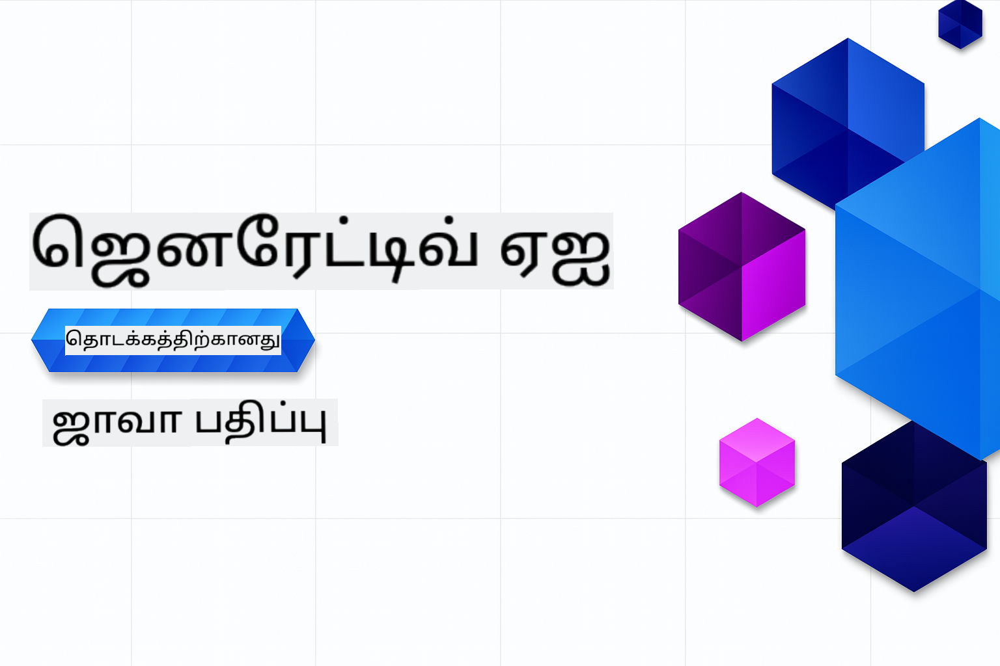

<!--
CO_OP_TRANSLATOR_METADATA:
{
  "original_hash": "b1a467efb7f8e13a19f961a587226f71",
  "translation_date": "2025-12-18T10:39:29+00:00",
  "source_file": "README.md",
  "language_code": "ta"
}
-->
# தொடக்கத்திற்கான உருவாக்கும் AI - ஜாவா பதிப்பு
[](https://discord.gg/nTYy5BXMWG)



**நேர ஒதுக்கீடு**: முழு பணிமனை உள்ளூர் அமைப்பின்றி ஆன்லைனில் முடிக்கலாம். சூழல் அமைப்பு 2 நிமிடங்கள் எடுக்கும், மாதிரிகளை ஆராய 1-3 மணி நேரம் தேவைப்படும், ஆராய்ச்சி ஆழத்தின்படி.

> **விரைவு தொடக்கம்**

1. இந்த சேமிப்பகத்தை உங்கள் GitHub கணக்கிற்கு Fork செய்யவும்
2. **Code** → **Codespaces** தாவலை கிளிக் செய்யவும் → **...** → **New with options...** தேர்வு செய்யவும்
3. இயல்புநிலைகளை பயன்படுத்தவும் – இது இந்த பாடத்துக்கான Development container ஐ தேர்ந்தெடுக்கும்
4. **Create codespace** கிளிக் செய்யவும்
5. சூழல் தயாராக ~2 நிமிடங்கள் காத்திருக்கவும்
6. நேரடியாக [முதல் எடுத்துக்காட்டு](./02-SetupDevEnvironment/README.md#step-2-create-a-github-personal-access-token) க்கு செல்லவும்

> **உள்ளூரில் கிளோன் செய்ய விரும்புகிறீர்களா?**
>
> இந்த சேமிப்பகம் 50+ மொழி மொழிபெயர்ப்புகளை கொண்டுள்ளது, இது பதிவிறக்க அளவை பெரிதாக்குகிறது. மொழிபெயர்ப்புகள் இல்லாமல் கிளோன் செய்ய sparse checkout பயன்படுத்தவும்:
> ```bash
> git clone --filter=blob:none --sparse https://github.com/microsoft/Generative-AI-for-beginners-java.git
> cd Generative-AI-for-beginners-java
> git sparse-checkout set --no-cone '/*' '!translations' '!translated_images'
> ```
> இது பாடத்தைக் முடிக்க தேவையான அனைத்தையும் மிக வேகமாக பதிவிறக்க உதவும்.


## பல்மொழி ஆதரவு

### GitHub Action மூலம் ஆதரவு (தானியங்கி மற்றும் எப்போதும் புதுப்பிக்கப்பட்டது)

<!-- CO-OP TRANSLATOR LANGUAGES TABLE START -->
[அரபு](../ar/README.md) | [பெங்காலி](../bn/README.md) | [பல்கேரியன்](../bg/README.md) | [பர்மீஸ் (மியான்மர்)](../my/README.md) | [சீன (எளிய)](../zh/README.md) | [சீன (பாரம்பரிய, ஹாங்காங்)](../hk/README.md) | [சீன (பாரம்பரிய, மாகாவ்)](../mo/README.md) | [சீன (பாரம்பரிய, தைவான்)](../tw/README.md) | [குரோஷியன்](../hr/README.md) | [செக்](../cs/README.md) | [டேனிஷ்](../da/README.md) | [டச்சு](../nl/README.md) | [எஸ்டோனியன்](../et/README.md) | [பின்னிஷ்](../fi/README.md) | [பிரெஞ்சு](../fr/README.md) | [ஜெர்மன்](../de/README.md) | [கிரேக்கம்](../el/README.md) | [ஹீப்ரூ](../he/README.md) | [இந்தி](../hi/README.md) | [ஹங்கேரியன்](../hu/README.md) | [இந்தோனேஷியன்](../id/README.md) | [இத்தாலியன்](../it/README.md) | [ஜப்பானீஸ்](../ja/README.md) | [கன்னடம்](../kn/README.md) | [கொரியன்](../ko/README.md) | [லிதுவேனியன்](../lt/README.md) | [மலாய்](../ms/README.md) | [மலையாளம்](../ml/README.md) | [மராத்தி](../mr/README.md) | [நேபாளி](../ne/README.md) | [நைஜீரியன் பிஜின்](../pcm/README.md) | [நார்வேஜியன்](../no/README.md) | [பெர்ஷியன் (பார்சி)](../fa/README.md) | [போலிஷ்](../pl/README.md) | [போர்ச்சுகீஸ் (பிரேசில்)](../br/README.md) | [போர்ச்சுகீஸ் (போர்ச்சுகல்)](../pt/README.md) | [பஞ்சாபி (குருமுகி)](../pa/README.md) | [ரோமானியன்](../ro/README.md) | [ரஷ்யன்](../ru/README.md) | [செர்பியன் (சிரிலிக்)](../sr/README.md) | [ஸ்லோவாக்](../sk/README.md) | [ஸ்லோவேனியன்](../sl/README.md) | [ஸ்பானிஷ்](../es/README.md) | [ஸ்வாஹிலி](../sw/README.md) | [ஸ்வீடிஷ்](../sv/README.md) | [டகாலோக் (பிலிப்பைனோ)](../tl/README.md) | [தமிழ்](./README.md) | [தெலுங்கு](../te/README.md) | [தை](../th/README.md) | [துருக்கி](../tr/README.md) | [உக்ரைனியன்](../uk/README.md) | [உருது](../ur/README.md) | [வியட்நாமீஸ்](../vi/README.md)
<!-- CO-OP TRANSLATOR LANGUAGES TABLE END -->

## பாடத்திட்ட அமைப்பு மற்றும் கற்றல் பாதை

### **அத்தியாயம் 1: உருவாக்கும் AI அறிமுகம்**
- **முக்கிய கருத்துக்கள்**: பெரிய மொழி மாதிரிகள், டோக்கன்கள், எம்பெட்டிங்ஸ் மற்றும் AI திறன்களை புரிதல்
- **ஜாவா AI சூழல்**: Spring AI மற்றும் OpenAI SDK களின் கண்ணோட்டம்
- **மாதிரி சூழல் நெறிமுறை**: MCP அறிமுகம் மற்றும் AI முகவர் தொடர்பில் அதன் பங்கு
- **பயன்பாட்டு செயல்பாடுகள்**: உரையாடல் பொறிகள் மற்றும் உள்ளடக்க உருவாக்கம் போன்ற உண்மையான சூழல்கள்
- **[→ அத்தியாயம் 1 தொடங்கு](./01-IntroToGenAI/README.md)**

### **அத்தியாயம் 2: மேம்பாட்டு சூழல் அமைப்பு**
- **பல வழங்குநர் கட்டமைப்பு**: GitHub Models, Azure OpenAI மற்றும் OpenAI Java SDK ஒருங்கிணைப்புகள் அமைத்தல்
- **Spring Boot + Spring AI**: நிறுவன AI பயன்பாட்டு மேம்பாட்டுக்கான சிறந்த நடைமுறைகள்
- **GitHub Models**: மாதிரிப்படுத்தல் மற்றும் கற்றலுக்கான இலவச AI மாதிரி அணுகல் (கடன் அட்டை தேவையில்லை)
- **மேம்பாட்டு கருவிகள்**: Docker கன்டெய்னர்கள், VS Code மற்றும் GitHub Codespaces கட்டமைப்பு
- **[→ அத்தியாயம் 2 தொடங்கு](./02-SetupDevEnvironment/README.md)**

### **அத்தியாயம் 3: முக்கிய உருவாக்கும் AI தொழில்நுட்பங்கள்**
- **ப்ராம்ட் பொறியியல்**: சிறந்த AI மாதிரி பதில்களுக்கு தொழில்நுட்பங்கள்
- **எம்பெட்டிங்ஸ் மற்றும் வெக்டர் செயல்பாடுகள்**: அர்த்தமுள்ள தேடல் மற்றும் ஒத்திசைவு பொருத்தல் செயல்படுத்தல்
- **திரும்ப பெறுதல்-வலுவூட்டப்பட்ட உருவாக்கம் (RAG)**: உங்கள் சொந்த தரவுத்தளங்களுடன் AI ஐ இணைத்தல்
- **செயல்பாட்டு அழைப்பு**: தனிப்பயன் கருவிகள் மற்றும் பிளக்கின்களுடன் AI திறன்களை விரிவாக்குதல்
- **[→ அத்தியாயம் 3 தொடங்கு](./03-CoreGenerativeAITechniques/README.md)**

### **அத்தியாயம் 4: நடைமுறை பயன்பாடுகள் மற்றும் திட்டங்கள்**
- **பேட் கதை உருவாக்கி** (`petstory/`): GitHub Models உடன் படைப்பாற்றல் உள்ளடக்க உருவாக்கம்
- **Foundry உள்ளூர் டெமோ** (`foundrylocal/`): OpenAI Java SDK உடன் உள்ளூர் AI மாதிரி ஒருங்கிணைப்பு
- **MCP கணக்கீட்டு சேவை** (`calculator/`): Spring AI உடன் அடிப்படை மாதிரி சூழல் நெறிமுறை செயல்பாடு
- **[→ அத்தியாயம் 4 தொடங்கு](./04-PracticalSamples/README.md)**

### **அத்தியாயம் 5: பொறுப்பான AI மேம்பாடு**
- **GitHub Models பாதுகாப்பு**: உள்ளடக்க வடிகட்டி மற்றும் பாதுகாப்பு முறைகள் (கடுமையான தடைகள் மற்றும் மென்மையான மறுப்பு) சோதனை
- **பொறுப்பான AI டெமோ**: நவீன AI பாதுகாப்பு அமைப்புகள் நடைமுறையில் எப்படி செயல்படுகின்றன என்பதைக் கையாளும் உதாரணம்
- **சிறந்த நடைமுறைகள்**: நெறிமுறை AI மேம்பாடு மற்றும் பயன்பாட்டுக்கான அவசியமான வழிகாட்டுதல்கள்
- **[→ அத்தியாயம் 5 தொடங்கு](./05-ResponsibleGenAI/README.md)**

## கூடுதல் வளங்கள்

<!-- CO-OP TRANSLATOR OTHER COURSES START -->
### லாங்செயின்
[](https://aka.ms/langchain4j-for-beginners)
[](https://aka.ms/langchainjs-for-beginners?WT.mc_id=m365-94501-dwahlin)

---

### அஜூர் / எட்ஜ் / MCP / முகவர்கள்
[](https://github.com/microsoft/AZD-for-beginners?WT.mc_id=academic-105485-koreyst)
[](https://github.com/microsoft/edgeai-for-beginners?WT.mc_id=academic-105485-koreyst)
[](https://github.com/microsoft/mcp-for-beginners?WT.mc_id=academic-105485-koreyst)
[](https://github.com/microsoft/ai-agents-for-beginners?WT.mc_id=academic-105485-koreyst)

---
 
### உருவாக்கும் AI தொடர்
[](https://github.com/microsoft/generative-ai-for-beginners?WT.mc_id=academic-105485-koreyst)
[-9333EA?style=for-the-badge&labelColor=E5E7EB&color=9333EA)](https://github.com/microsoft/Generative-AI-for-beginners-dotnet?WT.mc_id=academic-105485-koreyst)
[-C084FC?style=for-the-badge&labelColor=E5E7EB&color=C084FC)](https://github.com/microsoft/generative-ai-for-beginners-java?WT.mc_id=academic-105485-koreyst)
[-E879F9?style=for-the-badge&labelColor=E5E7EB&color=E879F9)](https://github.com/microsoft/generative-ai-with-javascript?WT.mc_id=academic-105485-koreyst)

---
 
### முக்கிய கற்றல்
[](https://aka.ms/ml-beginners?WT.mc_id=academic-105485-koreyst)
[](https://aka.ms/datascience-beginners?WT.mc_id=academic-105485-koreyst)
[](https://aka.ms/ai-beginners?WT.mc_id=academic-105485-koreyst)
[](https://github.com/microsoft/Security-101?WT.mc_id=academic-96948-sayoung)
[](https://aka.ms/webdev-beginners?WT.mc_id=academic-105485-koreyst)
[](https://aka.ms/iot-beginners?WT.mc_id=academic-105485-koreyst)
[](https://github.com/microsoft/xr-development-for-beginners?WT.mc_id=academic-105485-koreyst)

---
 
### கோபைலட் தொடர்
[](https://aka.ms/GitHubCopilotAI?WT.mc_id=academic-105485-koreyst)
[](https://github.com/microsoft/mastering-github-copilot-for-dotnet-csharp-developers?WT.mc_id=academic-105485-koreyst)
[](https://github.com/microsoft/CopilotAdventures?WT.mc_id=academic-105485-koreyst)
<!-- CO-OP TRANSLATOR OTHER COURSES END -->

## உதவி பெறுதல்

AI செயலிகளை உருவாக்குவதில் சிக்கல் ஏற்பட்டால் அல்லது ஏதேனும் கேள்விகள் இருந்தால், MCP பற்றி fellow learners மற்றும் அனுபவமிக்க டெவலப்பர்களுடன் கலந்துரையாடல்களில் சேரவும். கேள்விகள் வரவேற்கப்படுகின்றன மற்றும் அறிவு சுதந்திரமாக பகிரப்படுகிறது என்ற ஆதரவான சமூகமாக இது உள்ளது.

[](https://discord.gg/nTYy5BXMWG)

உற்பத்தி கருத்து அல்லது பிழைகள் இருந்தால், கட்டுமானத்தின் போது பார்வையிடவும்:

[](https://aka.ms/foundry/forum)

---

<!-- CO-OP TRANSLATOR DISCLAIMER START -->
**குறிப்பு**:  
இந்த ஆவணம் AI மொழிபெயர்ப்பு சேவை [Co-op Translator](https://github.com/Azure/co-op-translator) மூலம் மொழிபெயர்க்கப்பட்டுள்ளது. நாங்கள் துல்லியத்திற்காக முயற்சித்தாலும், தானியங்கி மொழிபெயர்ப்புகளில் பிழைகள் அல்லது தவறுகள் இருக்கக்கூடும் என்பதை தயவுசெய்து கவனிக்கவும். அசல் ஆவணம் அதன் சொந்த மொழியில் அதிகாரப்பூர்வ மூலமாக கருதப்பட வேண்டும். முக்கியமான தகவல்களுக்கு, தொழில்முறை மனித மொழிபெயர்ப்பை பரிந்துரைக்கிறோம். இந்த மொழிபெயர்ப்பின் பயன்பாட்டால் ஏற்படும் எந்தவொரு தவறான புரிதலுக்கும் அல்லது தவறான விளக்கங்களுக்கும் நாங்கள் பொறுப்பேற்கமாட்டோம்.
<!-- CO-OP TRANSLATOR DISCLAIMER END -->