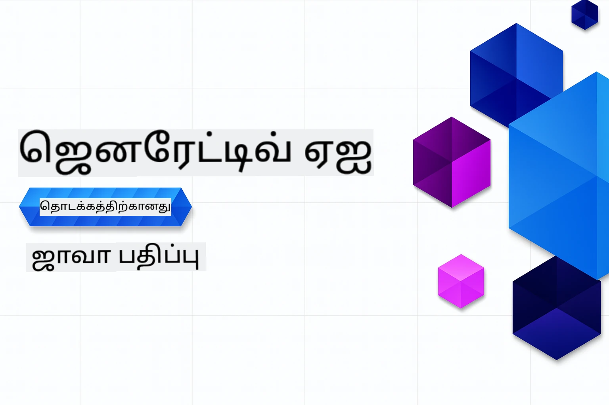

# துவக்கக் கற்க குழந்தைகளுக்கான உருவாக்கும் செயற்கை நுண்ணறிவு - ஜாவா பதிப்பு
[](https://discord.gg/nTYy5BXMWG)



**நேர ஒதுக்கீடு**: முழு பணிமனை ஆன்லைனில் உள்ளூர் அமைப்பின்றி முடிக்கலாம். சூழல் அமைப்பு 2 நிமிடங்கள், மாதிரிகளை ஆராய 1-3 மணி நேரம் ஆராய்ச்சி ஆழத்திற்கு பின் தேவைப்படும்.

> **விரைவு துவக்கம்** 

1. இந்த ஆதாரகோப்பை உங்கள் GitHub கணக்கிற்கு Fork செய்யவும்
2. **Code** → **Codespaces** டேப் → **...** → **பிரிமாண விருப்பத்துடன் புதியது...** கிளிக் செய்யவும்
3. இயல்புநிலைகளை பயன்படுத்தவும் – இது இந்த பாடத்துக்கான மேம்பாட்டு கன்டெய்னரை தேர்ந்தெடுக்கும்
4. **Create codespace** கிளிக் செய்யவும்
5. சூழல் தயாராக இருத்த ~2 நிமிடங்கள் காத்திருங்கள்
6. நேரடியாக [முதல் உதாரணத்திற்கு](./02-SetupDevEnvironment/README.md#step-2-create-a-github-personal-access-token) செல்லவும்

## பலமொழி ஆதரவு

### GitHub செயலியினால் ஆதரிக்கப்படுகிறது (தானாகவும் எப்போதும் புதுப்பிக்கப்பட்டதும்)

<!-- CO-OP TRANSLATOR LANGUAGES TABLE START -->
[அரபிக்](../ar/README.md) | [பெங்காலி](../bn/README.md) | [புல்கேரியன்](../bg/README.md) | [பர்மீஸ் (மயன்மார்)](../my/README.md) | [சீன (எளிமைப்படுத்தப்பட்டது)](../zh-CN/README.md) | [சீன (பாரம்பரிய, ஹොங்க் கொங்)](../zh-HK/README.md) | [சீன (பாரம்பரிய, மகாவ்)](../zh-MO/README.md) | [சீன (பாரம்பரிய, தாய்வான்)](../zh-TW/README.md) | [குரோயேஷியன்](../hr/README.md) | [செக்](../cs/README.md) | [டானிஷ்](../da/README.md) | [டட்ச்](../nl/README.md) | [எஸ்டோனியன்](../et/README.md) | [பினிஷ்](../fi/README.md) | [பிரெஞ்சு](../fr/README.md) | [ஜெர்மன்](../de/README.md) | [கிரேக்கம்](../el/README.md) | [ஹீப்ரூவ்](../he/README.md) | [இந்தி](../hi/README.md) | [ஹங்கேரியன்](../hu/README.md) | [இந்தோனேஷியன்](../id/README.md) | [இத்தாலியன்](../it/README.md) | [ஜப்பானீஸ்](../ja/README.md) | [கன்னடம்](../kn/README.md) | [க்மேர்](../km/README.md) | [கொரியன்](../ko/README.md) | [லிதுவேனியன்](../lt/README.md) | [மானிலி](../ms/README.md) | [மலையாளம்](../ml/README.md) | [மராத்தி](../mr/README.md) | [நேபாளி](../ne/README.md) | [நைஜீரியன் பிஜின்](../pcm/README.md) | [நார்வேஜியன்](../no/README.md) | [பெர்ஷியன் (ஃபார்சி)](../fa/README.md) | [போலிஷ்](../pl/README.md) | [பொர்ச்சுகீஸ் (பிரேசில்)](../pt-BR/README.md) | [பொர்ச்சுகீஸ் (போர்ச்சுகல்)](../pt-PT/README.md) | [பஞ்சாபி (குருமுகி)](../pa/README.md) | [ரூமேனியன்](../ro/README.md) | [ரஷ்யன்](../ru/README.md) | [செர்பியன் (சிரிலிக்)](../sr/README.md) | [ஸ்லோவாக்](../sk/README.md) | [ஸ்லோவேனியன்](../sl/README.md) | [ஸ்பானிஷ்](../es/README.md) | [சுவாஹிலி](../sw/README.md) | [சுவீடிஷ்](../sv/README.md) | [தாய்க் (பிலிப்பீனோ)](../tl/README.md) | [தமிழ்](./README.md) | [தெலுகு](../te/README.md) | [தை](../th/README.md) | [துருக்கிஷ்](../tr/README.md) | [உக்ரைனியன்](../uk/README.md) | [உருது](../ur/README.md) | [வியட்நாமீஸ்](../vi/README.md)

> **உள்ளூரில் கிளோன் செய்ய விரும்புகிறீர்களா?**
>
> இந்த ஆதாரக்கோப்பில் மொழிபெயர்ப்புகள் 50+ மொழிகள் அடக்கியுள்ளன, இது பதிவிறக்கும் அளவை கவனிக்க கூடிய அளவில் அதிகரிக்கிறது. மொழிபெயர்ப்பின்றி கிளோன் செய்ய, sparse checkout பயன்படுத்தவும்:
>
> **Bash / macOS / Linux:**
> ```bash
> git clone --filter=blob:none --sparse https://github.com/microsoft/Generative-AI-for-beginners-java.git
> cd Generative-AI-for-beginners-java
> git sparse-checkout set --no-cone '/*' '!translations' '!translated_images'
> ```
>
> **CMD (Windows):**
> ```cmd
> git clone --filter=blob:none --sparse https://github.com/microsoft/Generative-AI-for-beginners-java.git
> cd Generative-AI-for-beginners-java
> git sparse-checkout set --no-cone "/*" "!translations" "!translated_images"
> ```
>
> இதனால் பாடத்தைக் முடிய மிகவும் விரைவான பதிவிறக்கம் கிடைக்கும்.
<!-- CO-OP TRANSLATOR LANGUAGES TABLE END -->

## பாடத்திட்ட அமைப்பு மற்றும் கற்றல் பாதை

### **அதிகாசம் 1: உருவாக்கும் செயற்கை நுண்ணறிவில் அறிமுகம்**
- **முக்கிய கருத்துக்கள்**: பெரிய மொழி மாதிரிகள், டோக்கன்கள், எம்பெடிங்ஸ், மற்றும் AI திறன்களை புரிதல்
- **ஜாவா AI சூழல்**: Spring AI மற்றும் OpenAI SDKs ஓவர்வியூ
- **மாதிரி உரையாடல் ப்ரொட்டோக்கால்**: MCP அறிமுகம் மற்றும் AI முகவர்கள் தொடர்பில் அதன் பங்கு
- **நடைமுறை பயன்பாடுகள்**: உண்மை உலகில் உதாரணங்கள்- சொட்கு கோப்பிகள் மற்றும் உள்ளடக்கம் உருவாக்குதல்
- **[→ அதிகாரம் 1 தொடரவும்](./01-IntroToGenAI/README.md)**

### **அதிகாசம் 2: மேம்பாட்டு சூழல் அமைப்பு**
- **பன்முக நடைமுறை அமைப்பு**: GitHub மாதிரிகள், Azure OpenAI மற்றும் OpenAI Java SDK இணைப்புகள் அமைக்கும் முறை
- **Spring Boot + Spring AI**: நிறுவன மட்ட AI பயன்பாடுகளை உருவாக்க சிறந்த நடைமுறைகள்
- **GitHub மாதிரிகள்**: உருமாற்றங்கள் மற்றும் கற்க மாதிரிகள் இலவச AI மாதிரி அணுகல் (கடன் அட்டை தேவையில்லை)
- **மேம்பாட்டு கருவிகள்**: Docker கன்டெய்னர்கள், VS Code, மற்றும் GitHub Codespaces அமைப்புகள்
- **[→ அதிகாரம் 2 தொடங்கவும்](./02-SetupDevEnvironment/README.md)**

### **அதிகாசம் 3: உருவாக்கும் AI மையக் தொழில்நுட்பங்கள்**
- **வழிகாட்டி பொறியியல்**: சிறந்த AI மாதிரி பதில்களை பெறும் தொழில்நுட்பங்கள்
- **எம்பெடிங்ஸ் மற்றும் வெக்டர் செயற்பாடுகள்**: அர்த்தமுள்ள தேடல் மற்றும் ஒத்திசைவை பயன்படுத்தல்
- **பிரதிபலிப்பு-ஊக்குவிக்கப்பட்ட உருவாக்கம் (RAG)**: உங்கள் சொந்த தரவு மூலங்களுடன் AI ஐ இணைத்தல்
- **நிரல் அழைப்பு**: AI திறன்களை விரிவாக்க தனிப்பயன் கருவிகள் மற்றும் பிளக்கின்களுடன்
- **[→ அதிகாரம் 3 தொடரவும்](./03-CoreGenerativeAITechniques/README.md)**

### **அதிகாசம் 4: நடைமுறை பயன்பாடுகள் மற்றும் திட்டங்கள்**
- **பெட் கதை உருவாக்கி** (`petstory/`): GitHub மாதிரிகளுடன் படைப்பாற்றல் உள்ளடக்க உருவாக்கம்
- **Foundry உள்ளூர்த் தொகுப்பு** (`foundrylocal/`): OpenAI Java SDK உடன் உள்ளூர் AI மாதிரி இணைப்பு
- **MCP கணக்கிடும் சேவை** (`calculator/`): Spring AI உடன் அடிப்படை மாதிரி உரையாடல் ப்ரொட்டோக்கால் நடைமுறை
- **[→ அதிகாரம் 4 தொடரவும்](./04-PracticalSamples/README.md)**

### **அதிகாசம் 5: பொறுப்பான AI மேம்பாடு**
- **GitHub மாதிரிகள் பாதுகாப்பு**: உள்ளடக்க வடிகட்டி மற்றும் பாதுகாப்பு அமைப்புகளை சோதனைசெய்க (கடினத் தடுப்புகள் மற்றும் மென்மையான மறுப்பு)
- **பொறுப்பான AI டெமோ**: நவீன AI பாதுகாப்பு அமைப்புகள் நடைமுறையில் எப்படி செயல்படுகின்றன என்பதை கைக்கூலியுடன் காண்பித்து
- **சிறந்த நடைமுறைகள்**: நெறிமுறை மற்றும் பொறுப்பான AI மேம்பாடு மற்றும் பயன்பாட்டுக்கான வழிகாட்டிகள்
- **[→ அதிகாரம் 5 தொடரவும்](./05-ResponsibleGenAI/README.md)**

## கூடுதல் வளங்கள்

<!-- CO-OP TRANSLATOR OTHER COURSES START -->
### லாங் சேன்
[](https://aka.ms/langchain4j-for-beginners)
[](https://aka.ms/langchainjs-for-beginners?WT.mc_id=m365-94501-dwahlin)
[](https://github.com/microsoft/langchain-for-beginners?WT.mc_id=m365-94501-dwahlin)
---

### அசுரே / எட்ஜ் / MCP / முகவர்கள்
[](https://github.com/microsoft/AZD-for-beginners?WT.mc_id=academic-105485-koreyst)
[](https://github.com/microsoft/edgeai-for-beginners?WT.mc_id=academic-105485-koreyst)
[](https://github.com/microsoft/mcp-for-beginners?WT.mc_id=academic-105485-koreyst)
[](https://github.com/microsoft/ai-agents-for-beginners?WT.mc_id=academic-105485-koreyst)

---
 
### உருவாக்கும் AI தொடர்
[](https://github.com/microsoft/generative-ai-for-beginners?WT.mc_id=academic-105485-koreyst)
[-9333EA?style=for-the-badge&labelColor=E5E7EB&color=9333EA)](https://github.com/microsoft/Generative-AI-for-beginners-dotnet?WT.mc_id=academic-105485-koreyst)
[-C084FC?style=for-the-badge&labelColor=E5E7EB&color=C084FC)](https://github.com/microsoft/generative-ai-for-beginners-java?WT.mc_id=academic-105485-koreyst)
[-E879F9?style=for-the-badge&labelColor=E5E7EB&color=E879F9)](https://github.com/microsoft/generative-ai-with-javascript?WT.mc_id=academic-105485-koreyst)

---
 
### மையக் கற்றல்
[](https://aka.ms/ml-beginners?WT.mc_id=academic-105485-koreyst)
[](https://aka.ms/datascience-beginners?WT.mc_id=academic-105485-koreyst)
[](https://aka.ms/ai-beginners?WT.mc_id=academic-105485-koreyst)
[](https://github.com/microsoft/Security-101?WT.mc_id=academic-96948-sayoung)
[](https://aka.ms/webdev-beginners?WT.mc_id=academic-105485-koreyst)
[](https://aka.ms/iot-beginners?WT.mc_id=academic-105485-koreyst)
[](https://github.com/microsoft/xr-development-for-beginners?WT.mc_id=academic-105485-koreyst)

---
 
### Copilot தொடர்
[](https://aka.ms/GitHubCopilotAI?WT.mc_id=academic-105485-koreyst)
[](https://github.com/microsoft/mastering-github-copilot-for-dotnet-csharp-developers?WT.mc_id=academic-105485-koreyst)
[](https://github.com/microsoft/CopilotAdventures?WT.mc_id=academic-105485-koreyst)
<!-- CO-OP TRANSLATOR OTHER COURSES END -->

## உதவி பெறுதல்

நீங்கள் தடுத்துக்கொண்டிருந்தால் அல்லது AI செயலிகளை உருவாக்குவதற்கான எந்தவொரு கேள்விகளும் இருந்தால், MCP பற்றி கலந்துரையாடலில் பங்கெடுக்கும் மற்ற பயிலாளர்கள் மற்றும் அனுபவம் வாய்ந்த டெவலப்பர்களுடன் சேருங்கள். இது கேள்விகள் வரவேற்கப்படும் மற்றும் அறிவு சுதந்திரமாக பகிரப்படும் ஆதரவான சமூகமாகும்.

[](https://discord.gg/nTYy5BXMWG)

உங்கள் தயாரிப்பின் பின்னூட்டம் அல்லது பிழைகள் இருந்தால், பின்வரும் இடத்தில் சென்று காணவும்:

[](https://aka.ms/foundry/forum)

---

<!-- CO-OP TRANSLATOR DISCLAIMER START -->
**கவனிக்கை**:  
இந்த ஆவணம் AI மொழிபெயர்ப்பு சேவை [Co-op Translator](https://github.com/Azure/co-op-translator) பயன்படுத்தி மொழி பெயர்க்கப்பட்டுள்ளது. நாங்கள் துல்லியத்துக்கு முயற்சிப்பினும், தானியங்கி மொழிபெயர்ப்பில் பிழைகள் அல்லது தவறுகள் இருக்கலாம் என்பதை தயவுசெய்து கவனிக்கவும். அசல் ஆவணம் அதன் சொந்த மொழியில் அதிகாரப்பூர்வ முறைமாக கருதப்பட வேண்டும். முக்கியமான தகவல்களுக்கு, தொழில்முறை மனித மொழிபெயர்ப்பை பரிந்துரைக்கிறோம். இந்த மொழிபெயர்ப்பின் பயன்பாட்டால் ஏற்படக்கூடிய எந்த தவறான புரிதல்கள் அல்லது தவறான விளக்கங்களுக்கு நாங்கள் பொறுப்பேற்கவில்லை.
<!-- CO-OP TRANSLATOR DISCLAIMER END -->