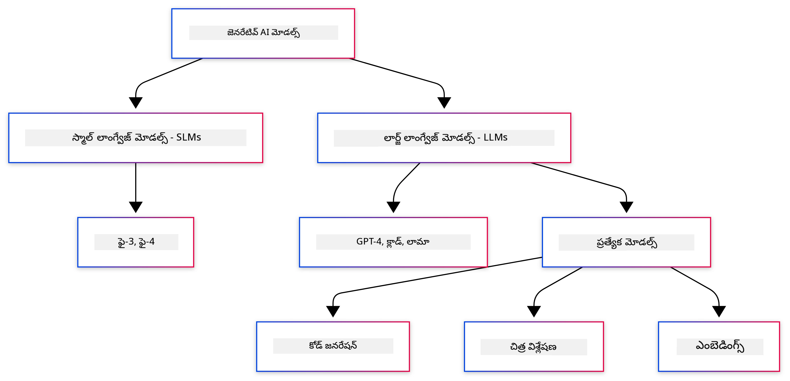
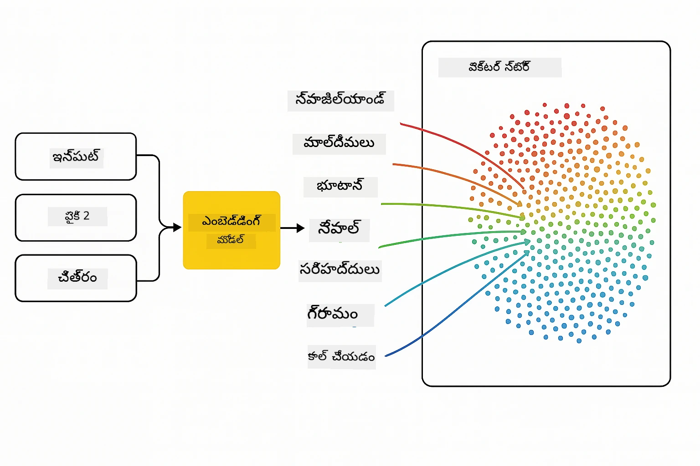
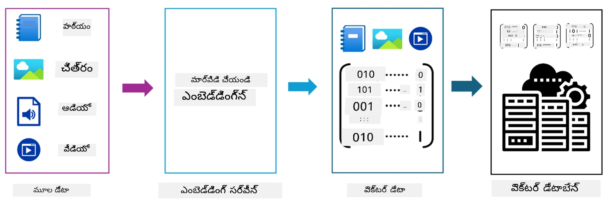
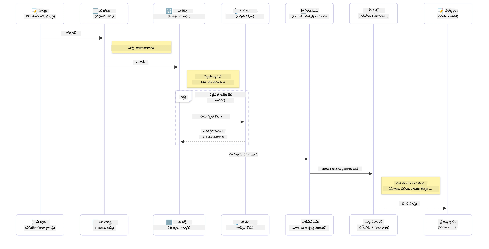

# జనరేటివ్ ఏఐకి పరిచయం - జావా ఎడిషన్

> **వీడియో**: [ఈ పాఠం గురించి వీడియో అవలోకనం YouTubeలో చూడండి.](https://www.youtube.com/watch?v=XH46tGp_eSw) మీరు పై థంబ్‌నెయిల్ చిత్రాన్నీ క్లీక్ చేయవచ్చు.

## మీరు నేర్చుకునేది

- **జనరేటివ్ ఏఐ ప్రాథమికాలు** LLMs, ప్రాంప్ట్ ఇంజినీరింగ్, టోకెన్లు, ఎంబెడ్డింగ్లు మరియు వెక్టర్ డేటాబేస్‌ల సహా
- **జావా ఏఐ అభివృద్ధి సాధనాలు** Azure OpenAI SDK, Spring AI, మరియు OpenAI Java SDK ని పోల్చడం
- **మోడల్ కాన్టెక్స్ట్ ప్రోటోకాల్** మరియు దాని ఎఐ ఏజెంట్ కమ్యూనికేషన్‌లో పాత్ర కనుగొనడం

## విషయ సూచిక

- [పరిచయం](#పరిచయం)
- [జనరేటివ్ ఏఐ భావనలపై సత్వర సమీక్ష](#జనరేటివ్-ఏఐ-భావనలపై-సత్వర-సమీక్ష)
- [ప్రాంప్ట్ ఇంజినీరింగ్ సమీక్ష](#ప్రాంప్ట్-ఇంజినీరింగ్-సమీక్ష)
- [టోకెన్లు, ఎంబెడ్డింగ్లు మరియు ఏజెంట్లు](#టోకెన్లు-ఎంబెడ్డింగ్లు-మరియు-ఏజెంట్లు)
- [జావా కోసం ఏఐ అభివృద్ధి సాధనాలు మరియు లైబ్రరీలు](#జావా-కోసం-ఏఐ-అభివృద్ధి-సాధనాలు-మరియు-లైబ్రరీలు)
  - [OpenAI Java SDK](#openai-java-sdk)
  - [Spring AI](#spring-ai)
  - [Azure OpenAI Java SDK](#azure-openai-java-sdk)
- [సారాంశం](#సారాంశం)
- [తదుపరి దశలు](#తదుపరి-దశలు)

## పరిచయం

జనరేటివ్ ఏఐ కోసం ప్రారంభ స్థాయి - జావా ఎడిషన్ మొదటి అధ్యాయానికి స్వాగతం! ఈ ప్రాథమిక పాఠం మీకు జనరేటివ్ ఏఐ యొక్క మూల భావనలు మరియు వాటిని జావా ఉపయోగించి ఎలా ఉపయోగించాలో పరిచయం చేయుతుంది. మీరు పెద్ద భాషా నమూనాలు (LLMs), టోకెన్లు, ఎంబెడ్డింగ్లు, మరియు ఏఐ ఏజెంట్లు వంటి ముఖ్యమైన ఏఐ అప్లికేషన్ నిర్మాణ భాగాల గురించి తెలుసుకుంటారు. ఈ కోర్సులో మీరు ఉపయోగించే ప్రధాన జావా సాధనాలను కూడా అన్వేషిస్తాము.

### జనరేటివ్ ఏఐ భావనలపై సత్వర సమీక్ష

జనరేటివ్ ఏఐ అనేది డేటా నుండి నేర్చుకున్న నమూనాలు మరియు సంబంధాల ఆధారంగా టెక్స్ట్, చిత్రం లేదా కోడ్ వంటి కొత్త కంటెంట్ సృష్టించే కృత్రిమ మేధస్సు ఒక రకం. జనరేటివ్ ఏఐ మోడళ్లూ మానవులరూపమైన ప్రతిస్పందనలను ఉత్పత్తి చేయగలవు, సందర్భాన్ని అర్ధం చేసుకుంటాయి, కొన్నిసార్లు మనిషిలా కంటెంట్ కూడా సృష్టిస్తాయి.

మీ జావా ఏఐ అప్లికేషన్లను అభివృద్ధి చేసే సమయంలో, మీరు **జనరేటివ్ ఏఐ మోడల్స్** తో కలిసి కంటెంట్ సృష్టిస్తారు. జనరేటివ్ ఏఐ మోడల్స్ కొన్ని ప్రతిభలు:

- **టెక్స్ట్ జనరేషన్**: చాట్‌బాట్‌లు, కంటెంట్, మరియు టెక్స్ట్ పూర్తిచేసే పనుల కోసం మానవుని లాంటి టెక్స్ట్ తయారు చేయడం.
- **ఇమేజ్ జనరేషన్ మరియు విశ్లేషణ**: వాస్తవిక చిత్రాలు తయారుచేయడం, ఫొటోలని మెరుగుపరచడం, మరియు వస్తువులను గుర్తించడం.
- **కోడ్ జనరేషన్**: కోడ్ స్నిపెట్లను లేదా స్క్రిప్ట్లను రాయడం.

విభిన్న పనుల కోసం ఆప్టిమైజ్ చేసిన నిర్దిష్ట రకాల మోడల్స్ ఉన్నారు. ఉదాహరణకు, **స్మాల్ లాంగ్వేజ్ మోడల్స్ (SLMs)** మరియు **లార్జ్ లాంగ్వేజ్ మోడల్స్ (LLMs)** రెండూ టెక్స్ట్ జనరేషన్‌ను నిర్వహించగలవు, అయితే LLMలు సాధారణంగా కఠినమైన పనుల కోసం మెరుగైన పనితీరును ఇస్తాయి. చిత్రాలు సంబంధించిన పనుల కోసం, మీరు ప్రత్యేకమైన విజన్ మోడల్స్ లేదా మల్టీ-మోడల్ మోడల్స్‌ను ఉపయోగిస్తారు.

కచ్చితంగా, ఈ మోడల్స్ యొక్క ప్రతిస్పందనలు అన్ని సమయంలో నైపుణ్యం గలవు కాదనే. మీరు మోడల్స్ "హల్యూసినేట్" అవుతాయని లేదా తప్పు సమాచారం అధిపత్యంతో తీసుకునే పరిస్థితులను విన్నారా. కానీ మీరు వారికి స్పష్టమైన సూచనలు మరియు సందర్భం ఇచ్చి మంచి ప్రతిస్పందనలు సృష్టించడానికి మార్గనిర్దేశం చేయవచ్చు. ఇక్కడ **ప్రాంప్ట్ ఇంజినీరింగ్** కీలకం.

#### ప్రాంప్ట్ ఇంజినీరింగ్ సమీక్ష

ప్రాంప్ట్ ఇంజినీరింగ్ అంటే AI మోడల్స్ కోరుకున్న అవుట్‌పుట్‌ల వైపు నడిపే ప్రభావవంతమైన ఇన్‌పుట్స్‌ను డిజైన్ చేయడమే. ఇది:

- **స్పష్టత**: సూచనలు స్పష్టమైనవి మరియు అపార్థ రహితంగా ఉండాలి.
- **సందర్భం**: అవసరమైన నేపధ్యం చెప్తుంది.
- **పరిమితులు**: ఏమైనా నియమాలు లేదా ఫార్మాట్లు పేర్కొంటుంది.

ప్రాంప్ట్ ఇంజినీరింగ్ కొంత ఉత్తమ ప్రాక్టీసులు ప్రాంప్ట్ డిజైన్, స్పష్టమైన సూచనలు, పనుల విభజన, వన్-షాట్ మరియు ఫ్యూ-షాట్ లెర్నింగ్, మరియు ప్రాంప్ట్ ట్యూనింగ్ ఉన్నాయి. వివిధ ప్రాంప్ట్‌లను పరీక్షించడం మీ ప్రత్యేక వినియోగ సందర్భానికి ఏది ఉత్తమమో కనుగొనటానికి అవసరం.

అప్లికేషన్లు అభివృద్ధి చేసినప్పుడు, మీరు వివిధ రకాల ప్రాంప్ట్‌లతో పనిచేయగలరు:
- **సిస్టమ్ ప్రాంప్ట్‌లు**: మోడల్ ప్రవర్తనకు ప్రాథమిక నియమాలు మరియు సందర్భాన్ని సెట్ చేస్తాయి
- **యూజర్ ప్రాంప్ట్‌లు**: మీ అప్లికేషన్ వినియోగదారుల నుండి వచ్చే ఇన్‌పుట్ డేటా
- **అసిస్టెంట్ ప్రాంప్ట్‌లు**: సిస్టమ్ మరియు యూజర్ ప్రాంప్ట్‌ల ఆధారంగా మోడల్ ప్రతిస్పందనలు

> **మరింత తెలుసుకోండి**: [Prompt Engineering chapter of GenAI for Beginners course](https://github.com/microsoft/generative-ai-for-beginners/tree/main/04-prompt-engineering-fundamentals) లో ప్రాంప్ట్ ఇంజినీరింగ్ గురించి మరింత తెలుసుకోండి.

#### టోకెన్లు, ఎంబెడ్డింగ్లు, మరియు ఏజెంట్లు

జనరేటివ్ ఏఐ మోడల్స్‌తో పనిచేసేటప్పుడు, మీరు **టోకెన్లు**, **ఎంబెడ్డింగ్లు**, **ఏజెంట్లు**, మరియు **మోడల్ కాన్టెక్స్ట్ ప్రోటోకాల్ (MCP)** వంటి పదాలను ఎదుర్కొంటారు. ఈ భావనలపై విస్తృత అవలోకనం:

- **టోకెన్లు**: టోకెన్లు అనేవి మోడల్‌లో టెక్స్ట్ యొక్క చిన్నత అశై కనబడి ఉంటాయి. అవి పదాలు, అక్షరాలు లేక ఉపపదాలు కావచ్చు. టోకెన్లు టెక్స్ట్ డేటాను మోడల్ అర్థం చేసుకునే ఫార్మాట్‌లో ప్రాతినిధ్యం చేయటానికి ఉపయోగిస్తారు. ఉదాహరణకి, "The quick brown fox jumped over the lazy dog" వాక్యాన్ని ["The", " quick", " brown", " fox", " jumped", " over", " the", " lazy", " dog"] లేదా ["The", " qu", "ick", " br", "own", " fox", " jump", "ed", " over", " the", " la", "zy", " dog"] గా టోకెనైజ్ చేయవచ్చు, ఇది టోకనైజేషన్ వ్యూహంపై ఆధారపడి ఉంటుంది.

టోకనైజేషన్ అనేది టెక్స్ట్‌ని ఈ చిన్న ఏకైకాల్లోకి విభజించే ప్రక్రియ. ఇది ముఖ్యమైనది ఎందుకంటే మోడల్స్ నేరుగా rå టెక్స్ట్ పై కాకుండా టోకెన్లపై ఆపరేట్ చేస్తాయి. ప్రాంప్ట్‌లో టోకెన్ల సంఖ్య మోడల్ ప్రతిస్పందన పొడవు మరియు నాణ్యతను ప్రభావితం చేస్తుంది, ఎందుకంటే మోడల్స్ తమ కాన్టెక్స్ట్ విండో కోసం టోకెన్ పరిమితులు కలిగి ఉంటాయి (ఉదా: GPT-4o యొక్క మొత్త కాన్టెక్స్ట్ కోసం 128K టోకెన్లు, ఇన్‌పుట్ మరియు అవుట్‌పుట్ రెండూ కలుపుకుని).

  జావాలో, మీరు AI మోడల్స్‌కు అభ్యర్థనలు పంపేటప్పుడు, టోకనైజేషన్ ఆటోమేటిక్‌గా నిర్వహించడానికి OpenAI SDK లాంటి లైబ్రరీలను ఉపయోగించవచ్చు.

- **ఎంబెడ్డింగ్లు**: ఎంబెడ్డింగ్లు టోకెన్ల వెక్టర్ ప్రాతినిధ్యాలు, ఇవి సեմాంటిక్ అర్ధాన్ని పట్టుకోవటానికి సహాయపడతాయి. అంకెల రూపాల్లో (సాధారణంగా ఫ్లోటింగ్-పాయింట్ సంఖ్యల శ్రేణులు) ఉంటాయి, ఇవి మోడల్‌కు పదాల మధ్య సంబంధాలను అర్థం చేసుకోవడానికి మరియు సందర్భానికి సంబంధించి సంబంధిత ప్రతిస్పందనలు తెలుగులో సృష్టించటానికి వీలు కల్పిస్తాయి. సాదృశ్య పదాలకు సాదృశ్య ఎంబెడ్డింగ్లు ఉంటాయి, దాంతో మోడల్ సమానార్థకాల వంటి అభిప్రాయాలను అర్థం చేసుకోగలదు.

  జావాలో, మీరు OpenAI SDK లేదా ఎంబెడ్డింగ్ జనరేషన్ మద్దతు ఉన్న ఇతర లైబ్రరీలు ద్వారా ఎంబెడ్డింగ్స్ సృష్టించవచ్చు. ఈ ఎంబెడ్డింగ్లు సేమాంటిక్ సెర్చ్ వంటి పనులకు అవసరం అవుతాయి, అంటే మీరు కచ్చితమైన టెక్స్ట్ మ్యాచ్‌ల పైన అర్థం ఆధారంగా సాదృశ్యమైన కంటెంట్‌ని కనుగొనాలనుకుంటారు.

- **వెక్టర్ డేటాబేసులు**: వెక్టర్ డేటాబేసులు ఎంబెడ్డింగ్ల కోసం ఆప్టిమైజ్ చేసిన ప్రత్యేక భద్రతా వ్యవస్థలు. ఇవి సమానత్వం ఆధారిత శోధనను సమర్థవంతంగా నిర్వహిస్తాయి మరియు Retrieval-Augmented Generation (RAG) నమూనాల్లో కీలకంగా ఉంటాయి, ఇక్కడ మీరు గణనీయమైన డేటా సెట్‌ల నుండి అర్థం ఆధారంగా సంబంధిత సమాచారం కనుగొనాలి.

> **గమనిక**: ఈ కోర్సులో, మనం వెక్టర్ డేటాబేస్‌లను కవర్ చేయము కానీ ఇవి నిజ జీవిత అనువర్తనాల్లో సాధారణంగా ఉపయోగించబడుతాయి కనుక చర్చించడం విలువైనది అని భావిస్తున్నాము.

- **ఏజెంట్లు & MCP**: మోడల్స్, సాధనాలు మరియు బాహ్య వ్యవస్థలతో స్వయంచాలకంగా ఇంటరాక్ట్ చేసే AI భాగాలు. మోడల్ కాన్టెక్స్ట్ ప్రోటోకాల్ (MCP) ఏజెంట్లు సురక్షితంగా బాహ్య డేటా మూలాల మరియు సాధనాలనూ యాక్సెస్ చేసే ప్రామాణిక పద్ధతి అందిస్తుంది. మరి వివరాలు కోసం మా [MCP for Beginners](https://github.com/microsoft/mcp-for-beginners) కోర్సును చూడండి.

జావా ఏఐ అప్లికేషన్లలో, మీరు టెక్స్ట్ ప్రాసెసింగ్ కోసం టోకెన్లను, సేమాంటిక్ సెర్చ్ మరియు RAG కోసం ఎంబెడ్డింగ్లను, డేటా రిట్రీవల్ కోసం వెక్టర్ డేటాబేస్‌లను మరియు తెలివైన, సాధనాలను ఉపయోగించే సిస్టమ్స్ బిల్డింగ్ కోసం ఏజెంట్లు మరియు MCPని ఉపయోగిస్తారు.

### జావా కోసం ఏఐ అభివృద్ధి సాధనాలు మరియు లైబ్రరీలు

జావా ఏఐ అభివృద్ధి కొరకు అద్భుతమైన సాధనాలను అందిస్తుంది. మనం ఈ కోర్సులో అన్వేషించబోతున్న మూడు ముఖ్యమైన లైబ్రరీలు ఉన్నాయి - OpenAI Java SDK, Azure OpenAI SDK, మరియు Spring AI.

ప్రతి అధ్యాయ ఉదాహరణల్లో ఉపయోగించిన SDKని సూచించే సమర్పణ పట్టిక ఇక్కడ:

| అధ్యాయం | నమూనా | SDK |
|---------|--------|-----|
| 02-SetupDevEnvironment | github-models | OpenAI Java SDK |
| 02-SetupDevEnvironment | basic-chat-azure | Spring AI Azure OpenAI |
| 03-CoreGenerativeAITechniques | examples | Azure OpenAI SDK |
| 04-PracticalSamples | petstory | OpenAI Java SDK |
| 04-PracticalSamples | foundrylocal | OpenAI Java SDK |
| 04-PracticalSamples | calculator | Spring AI MCP SDK + LangChain4j |

**SDK డాక్యుమెంటేషన్ లింకులు:**
- [Azure OpenAI Java SDK](https://github.com/Azure/azure-sdk-for-java/tree/azure-ai-openai_1.0.0-beta.16/sdk/openai/azure-ai-openai)
- [Spring AI](https://docs.spring.io/spring-ai/reference/)
- [OpenAI Java SDK](https://github.com/openai/openai-java)
- [LangChain4j](https://docs.langchain4j.dev/)

#### OpenAI Java SDK

OpenAI SDK అనేది OpenAI API కోసం అధికారిక జావా లైబ్రరీ. ఇది OpenAI మోడల్స్‌తో పనిచేయడానికి సులభం మరియు స్థిరమైన ఇంటర్‌ఫేస్‌ను అందిస్తుంది, జావా అప్లికేషన్లలో ఏఐ సామర్థ్యాలను సులభంగా చేర్చుకోవడానికి సహాయపడుతుంది. అధ్యాయం 2 లో గిట్‌హబ్ మోడల్స్ ఉదాహరణ, అధ్యాయం 4లో Pet Story అప్లికేషన్ మరియు Foundry Local ఉదాహరణ OpenAI SDK విధానాన్ని చూపిస్తాయి.

#### Spring AI

Spring AI అనేది Spring అప్లికేషన్లకు AI సామర్థ్యాలను తీసుకొచ్చే సమగ్ర ఫ్రేమ్‌వర్క్, వివిధ AI ప్రొవైడర్లకు ఒకే తరహా అభ్యాసం పొరచి ఇస్తుంది. ఇది Spring పరిసరంతో సజీవంగా ఏకీకృతమై ఉంటుంది, ఒక అవగాహనతో కూడిన, ఎంటర్ప్రైజ్ జావా అప్లికేషన్లు AI సామర్థ్యాలు అవసరమైన వాటి కొరకు ఇది ఉత్తమ ఎంపిక.

Spring AI శక్తి Spring పరిసరంతో సజీవ ఏకీకరణలో ఉంది, ఇది డిపెండెన్సీ ఇంజెక్షన్, కాన్ఫిగరేషన్ మేనేజ్‌మెంట్, మరియు టెస్టింగ్ ఫ్రేమ్‌వర్క్ లాంటి పర్యాయ దృక్పథాలతో తయారైన ప్రొడక్షన్-రేడీ AI అప్లికేషన్లు సృష్టించడం సులభం చేస్తుంది. అధ్యాయం 2 మరియు 4 లో మీరు OpenAI మరియు మోడల్ కాన్టెక్స్ట్ ప్రోటోకాల్ (MCP) Spring AI లైబ్రరీలను వినియోగించే అప్లికేషన్లను నిర్మిస్తారు.

##### మోడల్ కాన్టెక్స్ట్ ప్రోటోకాల్ (MCP)

[మోడల్ కాన్టెక్స్ట్ ప్రోటోకాల్ (MCP)](https://modelcontextprotocol.io/) అనేది AI అప్లికేషన్లు బాహ్య డేటా మూలాలు మరియు సాధనాలతో సురక్షితంగా ఇంటరాక్ట్ చేయగల emerging standard. MCP కంటెక్స్చువల్ సమాచారం యాక్సెస్ చేయడము మరియు మీ అప్లికేషన్లలో చర్యలు నిర్వర్తించే ప్రామాణిక మార్గాన్ని అందిస్తుంది.

అధ్యాయం 4 లో, మీరు సులభమైన MCP కాలక్యులేటర్ సర్వీస్‌ను నిర్మిస్తారు, ఇది Spring AIతో మోడల్ కాన్టెక్స్ట్ ప్రోటోకాల్ మూల సూత్రాలను చూపిస్తుంది, ప్రాథమిక సాధన ఇంటిగ్రేషన్లు మరియు సర్వీస్ ఆర్కిటెక్చర్లను సృష్టించడం ఎలా అనేదాన్ని చూపిస్తుంది.

#### Azure OpenAI Java SDK

Azure OpenAI క్లయింట్ లైబ్రరీ జావా కోసం OpenAI REST APIలకు అనుకూలనం, ఇది idiomatic ఇంటర్‌ఫేస్ మరియు Azure SDK పరిసరంతో సుసంబంధంగా ఉంటుంది. అధ్యాయం 3లో, మీరు Azure OpenAI SDK ఉపయోగించి చాట్ అప్లికేషన్లు, ఫంక్షన్ కాలింగ్, మరియు RAG (Retrieval-Augmented Generation) నమూనాలను నిర్మిస్తారు.

> గమనిక: Azure OpenAI SDK ఫీచర్ల పరంగా OpenAI Java SDK కంటే వెనుకబడి ఉంది కాబట్టి భవిష్యత్ ప్రాజెక్టుల కోసం OpenAI Java SDK ఉపయోగించడాన్ని పరిగణించండి.

## సారాంశం

ప్రాథమికాలు పూర్తయ్యాయి! ఇప్పుడు మీరు అర్థం చేసుకున్నారు:

- జనరేటివ్ ఏఐ వెనుక మౌలిక భావనలు - LLMs, ప్రాంప్ట్ ఇంజినీరింగ్ నుండి టోకెన్లు, ఎంబెడ్డింగ్లు మరియు వెక్టర్ డేటాబేసుల వరకూ
- జావా ఏఐ అభివృద్ధి కోసం మీ సాధనాలు: Azure OpenAI SDK, Spring AI, మరియు OpenAI Java SDK
- Model Context Protocol అంటే ఏమిటి మరియు అది ఎలా AI ఏజెంట్లు బాహ్య సాధనాలతో పనిచేయడానికి సహాయపడుతుంది

## తదుపరి దశలు

[అధ్యాయం 2: డెవలప్‌మెంట్ ఎన్విరాన్మెంట్ సెటప్](../02-SetupDevEnvironment/README.md)

---

<!-- CO-OP TRANSLATOR DISCLAIMER START -->
**అసన్మానం**:  
ఈ పత్రాన్ని AI అనువాద సేవ [Co-op Translator](https://github.com/Azure/co-op-translator) ఉపయోగించి అనువదించబడింది. మనం ఖచ్చితత్వానికోసం ప్రయత్నించినప్పటికీ, ఆటోమేటెడ్ అనువాదాలలో లోపాలు లేదా తప్పులుంటాయి అని దయచేసి గమనించండి. మౌలిక పత్రం స్వదేశీ భాషలోనే అధికారిక మూలం కావాలి. కీలక సమాచారం కోసం, ప్రొఫెషనల్ మానవ అనువాదం సిఫార్సు చేయబడింది. ఈ అనువాదం వాడకం వల్ల కలిగే ఏ విధమైన అపార్థాలకూ లేదా తప్పు వ్యాఖ్యానాలకు మేము బాధ్యత వహించము.
<!-- CO-OP TRANSLATOR DISCLAIMER END -->