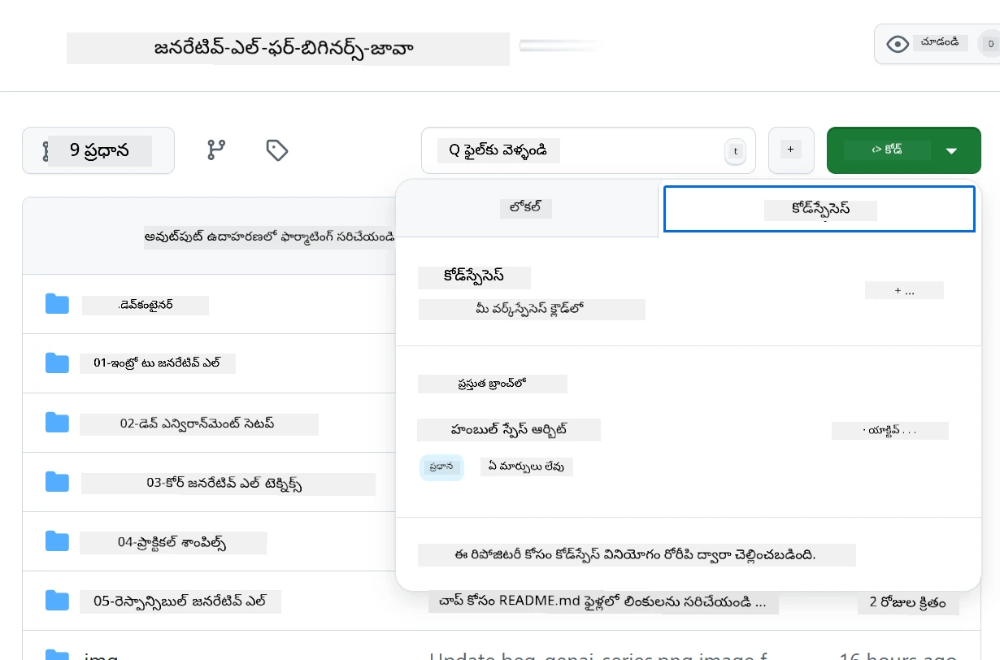
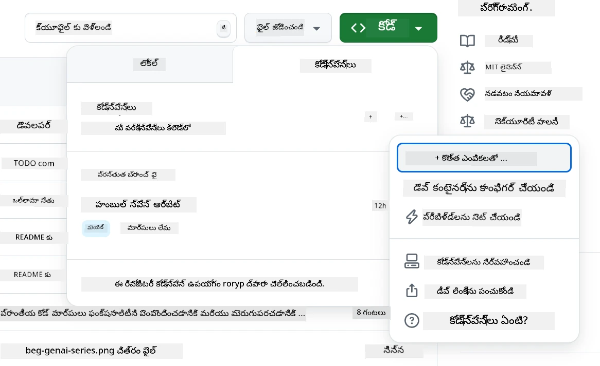
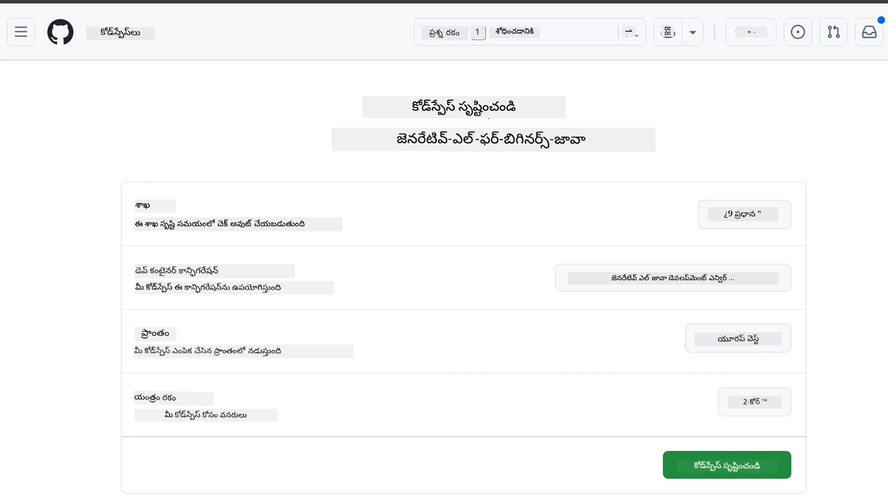
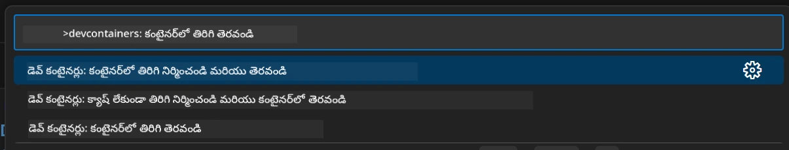
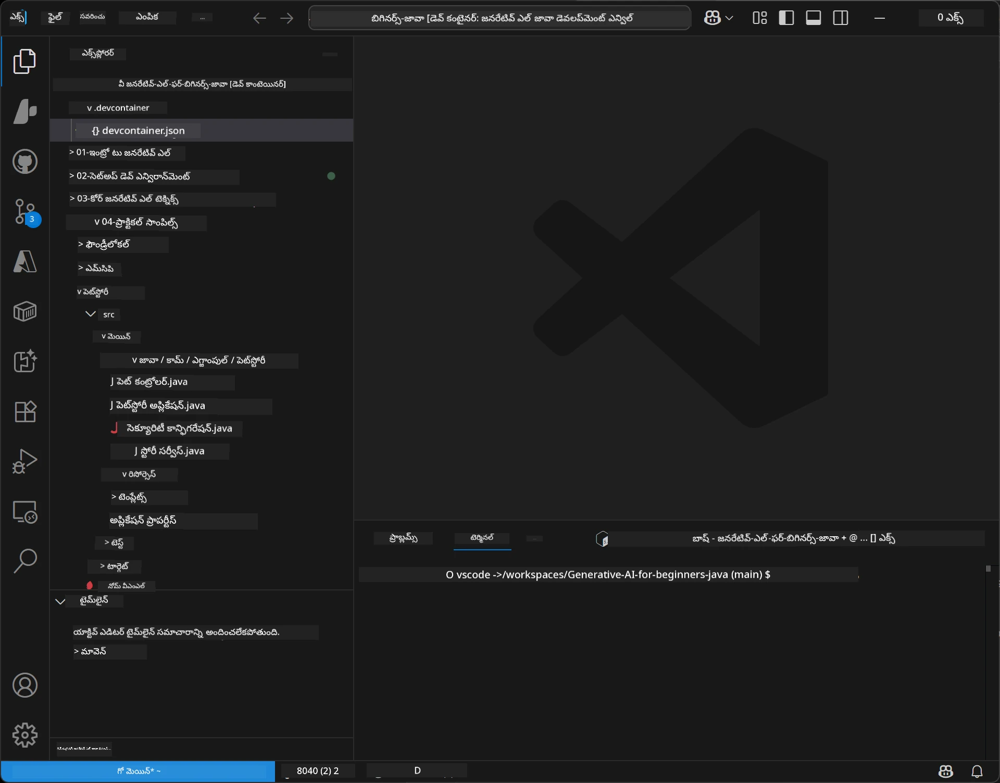
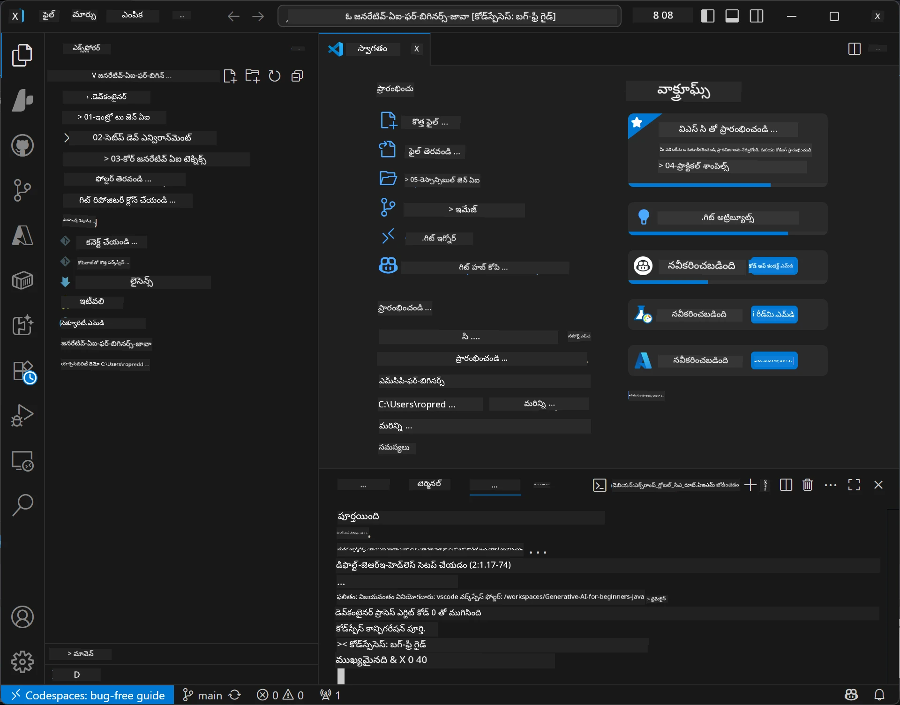

<!--
CO_OP_TRANSLATOR_METADATA:
{
  "original_hash": "96a30d42b9751a3d4e4b20e28d29d459",
  "translation_date": "2026-01-28T05:37:21+00:00",
  "source_file": "02-SetupDevEnvironment/README.md",
  "language_code": "te"
}
-->
# Java కోసం జనరేటివ్ AI అభివృద్ధి పరిసరాన్ని ఏర్పాటు

> **తక్షణ ప్రారంభం**: 2 నిమిషాల్లో క్లౌడ్‌లో కోడ్ చేయండి - [GitHub Codespaces సెటప్](../../../02-SetupDevEnvironment) కు వెళ్ళండి - స్థానిక ఇన్‌స్టాలేషన్ అవసరం లేదు మరియు github మోడల్స్ ఉపయోగిస్తుంది!

> **Azure OpenAI ఆసక్తి ఉన్నవారా?**, మా [Azure OpenAI సెటప్ గైడ్](getting-started-azure-openai.md) చూడండి, కొత్త Azure OpenAI వనరును సృష్టించే దశలతో.

## మీరు ఏమి నేర్చుకుంటారు

- AI అనువర్తనాల కోసం Java అభివృద్ధి పరిసరాన్ని ఎలా ఏర్పాటు చేయాలో
- మీ ఇష్టమైన అభివృద్ధి పరిసరాన్ని ఎంచుకోవడం మరియు కాన్ఫిగర్ చేయడం (Codespaces తో క్లౌడ్-ఫస్ట్, స్థానిక డెవ్ కంటైనర్, లేదా పూర్తి స్థానిక సెటప్)
- GitHub మోడల్స్‌ను కనెక్ట్ చేసి మీ సెటప్‌ని పరీక్షించడం

## కంటెంట్ పట్టిక

- [మీరు ఏమి నేర్చుకుంటారు](../../../02-SetupDevEnvironment)
- [పరిచయం](../../../02-SetupDevEnvironment)
- [దశ 1: మీ అభివృద్ధి పరిసరాన్ని సెటప్ చేయండి](../../../02-SetupDevEnvironment)
  - [ఎంపిక A: GitHub Codespaces (సిఫార్సు)](../../../02-SetupDevEnvironment)
  - [ఎంపిక B: స్థానిక డెవ్ కంటైనర్](../../../02-SetupDevEnvironment)
  - [ఎంపిక C: మీ ఇప్పటికే ఉన్న స్థానిక ఇన్‌స్టాలేషన్ ఉపయోగించండి](../../../02-SetupDevEnvironment)
- [దశ 2: GitHub పర్సనల్ యాక్సెస్ టోకెన్ సృష్టించండి](../../../02-SetupDevEnvironment)
- [దశ 3: GitHub మోడల్స్ ఉదాహరణతో మీ సెటప్‌ని పరీక్షించండి](../../../02-SetupDevEnvironment)
- [సమస్యల పరిష్కారం](../../../02-SetupDevEnvironment)
- [సారాంశం](../../../02-SetupDevEnvironment)
- [తరువాతి దశలు](../../../02-SetupDevEnvironment)

## పరిచయం

ఈ అధ్యాయం మీకు అభివృద్ది పరిసరాన్ని ఎలా ఏర్పాటు చేయాలో మార్గదర్శనం చేస్తుంది. మేము **GitHub Models** ను మా ప్రధాన ఉదాహరణగా ఉపయోగిస్తాము ఎందుకంటే ఇది ఉచితం, కేవలం GitHub ఖాతాతో సులభంగా సెటప్ చేయవచ్చు, క్రెడిట్ కార్డ్ అవసరం లేదు, మరియు అనేక మోడల్స్‌ను ప్రయోగం కోసం అందిస్తుంది.

**స్థానిక సెటప్ అవసరం లేదు!** GitHub Codespaces ను ఉపయోగించి బ్రౌజర్‌లోనే పూర్తి అభివృద్ధి పరిసరంతో వెంటనే కోడింగ్ ప్రారంభించవచ్చు.


మేము ఈ కోర్సు కోసం [**GitHub Models**](https://github.com/marketplace?type=models) ఉపయోగించవలసిందిగా సిఫార్సు చేస్తున్నాము ఎందుకంటే:
- **ఉచితం** ప్రారంభించడానికి
- **సులభం** కేవలం GitHub ఖాతాతో సెటప్ చేయడం
- **క్రెడిట్ కార్డ్ అవసరం లేదు**
- **చలాయింపుకు అనేక మోడల్స్** అందుబాటులో ఉంటాయి

> **గమనించండి**: ఈ శిక్షణలో ఉపయోగించిన GitHub Models కు ఈ ఉచిత పరిమితులు ఉన్నాయి:
> - 1 నిమిషానికి 15 అభ్యర్థనలు (ప్రతి రోజు 150)
> - ఒక్కో అభ్యర్థనకు సుమారు 8,000 పదాలు ఇన్‌పుట్, సుమారు 4,000 పదాలు అవుట్పుట్
> - 5 సమాంతర అభ్యర్థనలు
> 
> ఉత్పత్తి వాడుక కోసం, మీ Azure ఖాతాతో Azure AI Foundry Models కి అప్‌గ్రేడ్ చేయండి. మీ కోడ్ మారాల్సిన అవసరం లేదు. [Azure AI Foundry డాక్యుమెంటేషన్](https://learn.microsoft.com/azure/ai-foundry/foundry-models/how-to/quickstart-github-models) చూడండి.


## దశ 1: మీ అభివృద్ధి పరిసరాన్ని సెటప్ చేయండి

<a name="quick-start-cloud"></a>

మేము ఈ Generative AI for Java కోర్సుకు అవసరమైన అన్ని టూల్స్‌తో ముందుగానే సెటప్ చేసిన అభివృద్ధి కంటైనర్ సృష్టించాము, తద్వారా సెటప్ సమయాన్ని తగ్గించుకోవచ్చు. మీరు మీ ఇష్టమైన అభివృద్ధి విధానాన్ని ఎంచుకోండి:

### పరిసర సెటప్ ఎంపికలు:

#### ఎంపిక A: GitHub Codespaces (సిఫార్సు)

**2 నిమిషాల్లో కోడింగ్ ప్రారంభించండి - స్థానిక సెటప్ అవసరం లేదు!**

1. ఈ రిపోజిటరీని మీ GitHub ఖాతాకి Fork చేయండి
   > **గమనిక**: ప్రాథమిక కాన్ఫిగరేషన్ మార్చాలనుకుంటే దయచేసి [Dev Container Configuration](../../../.devcontainer/devcontainer.json) చూడండి
2. **Code** → **Codespaces** టాబ్ → **...** → **New with options...** క్లిక్ చేయండి
3. డిఫాల్ట్ ఎంపికలు ఉపయోగించండి – ఇది ఈ కోర్సు కోసం సృష్టించిన **Generative AI Java Development Environment** కస్టమ్ డెవ్ కంటైనర్ కాన్ఫిగరేషన్‌ను ఎంచుకుంటుంది
4. **Create codespace** క్లిక్ చేయండి
5. పరిసరాన్ని సిద్ధం అయ్యేవరకు సుమారు 2 నిమిషాలు వేచి ఉండండి
6. [దశ 2: GitHub టోకెన్ సృష్టించండి](../../../02-SetupDevEnvironment) కు వెళ్లండి








> **Codespaces లాభాలు**:
> - స్థానిక ఇన్‌స్టాలేషన్ అవసరం లేదు
> - బ్రౌజర్ ఉన్న ఏ డివైస్‌తోనైనా పని చేస్తుంది
> - అన్ని టూల్స్ మరియు డిపెండెన్సీలతో ముందుగానే సెట్ చేయబడింది
> - వ్యక్తిగత ఖాతాల కోసం నెలకు 60 గంటలు ఉచితం
> - అన్ని అభ్యసనకర్తలకు సమాన పరిసరాలు

#### ఎంపిక B: స్థానిక డెవ్ కంటైనర్

**డాకర్‌తో స్థానిక అభివృద్ధిని ఇష్టపడే డెవలపర్ల కోసం**

1. ఈ రిపోజిటరీని ఫోర్క్ చేసి స్థానిక మెషీన్‌లో క్లోన్ చేయండి
   > **గమనిక**: ప్రాథమిక కాన్ఫిగరేషన్ మార్చాలనుకుంటే దయచేసి [Dev Container Configuration](../../../.devcontainer/devcontainer.json) చూడండి
2. [Docker Desktop](https://www.docker.com/products/docker-desktop/) మరియు [VS Code](https://code.visualstudio.com/) ఇన్‌స్టాల్ చేయండి
3. VS Codeలో [Dev Containers ఎక్స్‌టెన్షన్](https://marketplace.visualstudio.com/items?itemName=ms-vscode-remote.remote-containers) ఇన్‌స్టాల్ చేయండి
4. రిపోజిటరీ ఫోల్డర్‌ను VS Codeలో తెరవండి
5. ప్రాంప్ట్ వచ్చినప్పుడు **Reopen in Container** క్లిక్ చేయండి (లేదా `Ctrl+Shift+P` → "Dev Containers: Reopen in Container" ఉపయోగించండి)
6. కంటైనర్ నిర్మాణం మరియు స్టార్ట్ అయ్యేవరకు వేచి ఉండండి
7. [దశ 2: GitHub టోకెన్ సృష్టించండి](../../../02-SetupDevEnvironment) కు వెళ్లండి





#### ఎంపిక C: మీ ఇప్పటికే ఉన్న స్థానిక ఇన్‌స్టాలేషన్ ఉపయోగించండి

**పూర్వపు Java అభివృద్ధి పరిసరాలతో ఉన్న డెవలపర్ల కోసం**

అవసరాలు:
- [Java 21+](https://www.oracle.com/java/technologies/javase/jdk21-archive-downloads.html) 
- [Maven 3.9+](https://maven.apache.org/download.cgi)
- [VS Code](https://code.visualstudio.com) లేదా మీ ఇష్టమైన IDE

దశలు:
1. ఈ రిపోజిటరీని మీ స్థానిక మెషీన్‌కు క్లోన్ చేయండి
2. ప్రాజెక్ట్‌ను మీ IDE లో తెరవండి
3. [దశ 2: GitHub టోకెన్ సృష్టించండి](../../../02-SetupDevEnvironment) కు వెళ్లండి

> **ప్రో టిప్**: మీ దగ్గర తక్కువ స్పెక్స్ మెషీన్ అయితే కానీ స్థానికంగా VS Code ఉపయోగించాలనుకుంటే GitHub Codespaces వాడండి! మీ స్థానిక VS Code ను క్లౌడ్‌లో హోస్ట్ చేసిన Codespace కి కనెక్ట్ చేసుకోవచ్చు.




## దశ 2: GitHub పర్సనల్ యాక్సెస్ టోకెన్ సృష్టించండి

1. [GitHub సెట్టింగ్స్](https://github.com/settings/profile) కు వెళ్ళి, మీ ప్రొఫైల్ మెనువులోని **Settings** ఎంచుకోండి.
2. ఎడమ సైడ్‌బార్‌లో, **Developer settings** (సాధారణంగా కింద భాగంలో) క్లిక్ చేయండి.
3. **Personal access tokens** లో, **Fine-grained tokens** క్లిక్ చేయండి (లేదా ఈ నేరుగా [లింక్](https://github.com/settings/personal-access-tokens) అనుసరించండి).
4. **Generate new token** క్లిక్ చేయండి.
5. "Token name" కింద వివరణాత్మక పేరు పెట్టండి (ఉదా: `GenAI-Java-Course-Token`).
6. గడువు తేదీని సెట్ చేయండి (భద్రతా ఉత్తమ ఆచరణల కోసం 7 రోజులు సిఫార్సు).
7. "Resource owner" కింద మీ యూజర్ ఖాతాను ఎంచుకోండి.
8. "Repository access" కింద GitHub Models ఉపయోగించాలనుకునే రిపోజిటరీలను ఎంచుకోండి (లేదా అవసరమైతే "All repositories").
9. "Account permissions" లో **Models** చర్యను **Read-only** గా సెట్ చేయండి.
10. **Generate token** క్లిక్ చేయండి.
11. **మీ టోకెన్ ను ఇప్పటి తానే కాపీ చేసి భద్రపరచండి** – తిరిగి చూడలేరు!

> **భద్రతా సూచన**: మీ యాక్సెస్ టోకెన్‌ల కొరకు కనీసం అవసరమైన స్కోప్ మరియు మితమైన గడువు సమయం ఉపయోగించండి.

## దశ 3: GitHub మోడల్స్ ఉదాహరణతో మీ సెటప్‌ని పరీక్షించండి

మీ అభివృద్ధి పరిసరమే సిద్ధమైన తర్వాత, మనము [`02-SetupDevEnvironment/examples/github-models`](../../../02-SetupDevEnvironment/examples/github-models) లోని ఉదాహరణ అనువర్తనం తో GitHub Models ఇంటిగ్రేషన్‌ని పరీక్షిద్దాం.

1. మీ అభివృద్ధి పరిసరంలో టెర్మినల్ తెరవండి.
2. GitHub Models ఉదాహరణకి నావిగేట్ అవ్వండి:
   ```bash
   cd 02-SetupDevEnvironment/examples/github-models
   ```
3. మీ GitHub టోకెన్‌ను ఎన్‌విరాన్‌మెంట్ వేరియబుల్‌గా సెట్ చేయండి:
   ```bash
   # మాక్‌ఓఎస్/లినక్స్
   export GITHUB_TOKEN=your_token_here
   
   # విండోస్ (కమాండ్ ప్రాంప్ట్)
   set GITHUB_TOKEN=your_token_here
   
   # విండోస్ (పవర్‌షెల్)
   $env:GITHUB_TOKEN="your_token_here"
   ```

4. అనువర్తనాన్ని రన్ చేయండి:
   ```bash
   mvn compile exec:java -Dexec.mainClass="com.example.githubmodels.App"
   ```

ఇలాంటిది అవుట్పుట్ కనిపించాలి:
```text
Using model: gpt-4.1-nano
Sending request to GitHub Models...
Response: Hello World!
```

### ఉదాహరణ కోడ్‌ను అర్థం చేసుకోవడం

ముందుగా మనం చేసిన దానిని అర్థం చేసుకుందాం. `examples/github-models` కిందని ఉదాహరణ GitHub Models కు కనెక్ట్ కావడానికి OpenAI Java SDK ను ఉపయోగిస్తుంది:

**ఈ కోడ్ ఏమి చేస్తుంది:**
- మీ పర్సనల్ యాక్సెస్ టోకెన్ ఉపయోగించి GitHub Models కు **కనెక్ట్ అవుతుంది**
- AI మోడల్‌కు ఒక సరళమైన "అందరికీ హలో చెప్పండి!" సందేశం **పంపుతుంది**
- AI యొక్క ప్రతిస్పందనని **స్వీకరించి ప్రదర్శిస్తుంది**
- మీ సెటప్ సరిగా పనిచేస్తుందో **ధృవీకరిస్తుంది**

**ముఖ్య ఆధారపడే ప్యాకేజీ** (`pom.xml` లో):
```xml
<dependency>
    <groupId>com.openai</groupId>
    <artifactId>openai-java</artifactId>
    <version>2.12.0</version>
</dependency>
```

**ప్రధాన కోడ్** (`App.java`):
```java
// OpenAI జావా SDK ఉపయోగించి GitHub నమూనాలకు కనెక్ట్ అవ్వండి
OpenAIClient client = OpenAIOkHttpClient.builder()
    .apiKey(pat)
    .baseUrl("https://models.inference.ai.azure.com")
    .build();

// చాట్ పూర్తి చేసే అభ్యర్థనను సృష్టించండి
ChatCompletionCreateParams params = ChatCompletionCreateParams.builder()
    .model(modelId)
    .addSystemMessage("You are a concise assistant.")
    .addUserMessage("Say Hello World!")
    .build();

// AI ప్రతిస్పందనను పొందండి
ChatCompletion response = client.chat().completions().create(params);
System.out.println("Response: " + response.choices().get(0).message().content().orElse("No response content"));
```

## సారాంశం

చాలా బాగుంది! ఇప్పుడు మీ దగ్గర అన్నీ సెట్ అయ్యాయి:

- AI మోడల్ యాక్సెస్ కోసం సరైన అనుమతులతో GitHub Personal Access Token సృష్టించారు
- మీ Java అభివృద్ధి పరిసరాన్ని (Codespaces, డెవ్ కంటైనర్స్, లేదా స్థానికం ఏదైనా) నడుపుతున్నారు
- OpenAI Java SDK ఉపయోగించి GitHub Models తో కనెక్ట్ అయ్యారు ఫ్రీ AI అభివృద్ధి కోసం
- AI మోడల్స్ తో మాట్లాడే సరిగా పనిచేస్తున్న ఒక సరళ ఉదాహరణతో ధృవీకరించారు

## తర్వాతి దశలు

[అధ్యాయం 3: కోర్ జనరేటివ్ AI సాంకేతికతలు](../03-CoreGenerativeAITechniques/README.md)

## సమస్య పరిష్కారం

సమస్యలు ఎదురైతే? ఇక్కడ సాధారణ సమస్యలు మరియు పరిష్కారాలు:

- **టోకెన్ పనిచేయడంలేదు?**
  - మీరు టోకెన్‌ను সম্পూర్ణంగా ఎటువంటి అదనపు స్ధానాలు లేకుండా కాపీ చేసిందో నిర్ధారించండి
  - టోకెన్ సరిగ్గా ఎన్‌విరాన్‌మెంట్ వేరియబుల్‌గా సెట్ అయ్యిందో చూసుకోండి
  - టోకెన్ సరైన అనుమతులు (Models: పఠన మోడ్‌లో) కలిగి ఉన్నదో తనిఖీ చేయండి

- **Maven కనిపించట్లేదు?**
  - డెవ్ కంటైనర్స్ లేదా Codespaces ఉపయోగిస్తుంటే Maven ముందుగానే ఇన్‌స్టాల్ ఉంటుంది
  - స్థానిక సెటప్ లో Java 21+ మరియు Maven 3.9+ ఇన్‌స్టాల్ అయ్యి ఉండాలి
  - `mvn --version` తో ఇన్‌స్టాలేషన్ ధృవీకరించండి

- **కనెక్షన్ సమస్యలు?**
  - ఇంటర్నెట్ కనెక్షన్ పర్యవేక్షించండి
  - GitHub మీ నెట్‌వర్క్ నుండి అందుబాటులో ఉన్నదో తనిఖీ చేయండి
  - GitHub Models ఎండ్‌పాయింట్‌ను బ్లాక్ చేసే ఫైర్వాల్ లాంటి বাধలు ఉండవని నిర్ధారించండి

- **డెవ్ కంటైనర్ ప్రారంభం అవడం లేదు?**
  - Docker Desktop నడుస్తుందా చూడండి (స్థానిక అభివృద్ధి కోసం)
  - కంటైనర్‌ను తిరిగి నిర్మించండి: `Ctrl+Shift+P` → "Dev Containers: Rebuild Container"

- **అనువర్తన కంపైలేషన్ లో ఎర్రర్లు?**
  - మీరు సరైన డైరెక్టరీలో ఉన్నారా చూసుకోండి: `02-SetupDevEnvironment/examples/github-models`
  - `mvn clean compile` తో క్లీనింగ్ చేయండి, తిరిగి కంపైల్ చేయండి

> **సహాయం కావాలా?**: ఇంకా సమస్య ఉంటే? రిపోజిటరీలో ఒక ఇష్యూ తెరిచి మాతో సంప్రదించండి.

---

<!-- CO-OP TRANSLATOR DISCLAIMER START -->
**అస్పష్టత**:
ఈ డాక్యుమెంట్ [Co-op Translator](https://github.com/Azure/co-op-translator) అనే AI అనువాద సేవ ఉపయోగించి అనువదించబడింది. మేము ఖచ్చితత్వంతో ప్రయత్నిస్తేనూ, ఆటోమెటెడ్ అనువాదాలు తప్పులు లేదా అసత్యతలు కలిగి ఉండవచ్చు అని దయచేసి గమనించండి. స్వదేశ భాషలోున్న మౌలిక డాక్యుమెంట్‌ను అధికారిక మార్గదర్శకంగా భావించాలి. కీలకమైన సమాచారానికైతే, నిపుణుల చేతి అనువాదం సిఫార్సు చేయబడింది. ఈ అనువాదం వలన సంభవించే ఏవైనా అపార్థాలు లేదా తప్పుగా అర్థం చేసుకోవడాలకు మేము బాధ్యులు కాదు.
<!-- CO-OP TRANSLATOR DISCLAIMER END -->