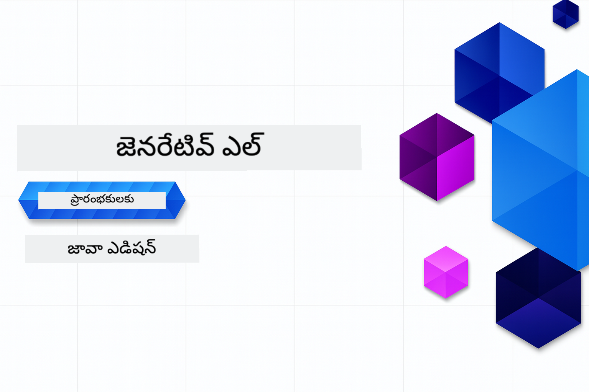

<!--
CO_OP_TRANSLATOR_METADATA:
{
  "original_hash": "459109e7c925f3a7b94440ad61c596a0",
  "translation_date": "2026-01-05T10:03:42+00:00",
  "source_file": "README.md",
  "language_code": "te"
}
-->
# జనరేటివ్ AI ప్రారంభకులకు - జావా సంచిక  
[](https://discord.gg/nTYy5BXMWG)



**సమయ కేటాయింపు**: మొత్తం వర్క్‌షాప్‌ను ఆన్‌లైన్‌లో స్థానిక సెటప్ లేకుండా పూర్తి చేయవచ్చు. వాతావరణ సెటప్‌కు 2 నిమిషాలు పట్టుతుంది, నమూనాలను అన్వేషించడం అన్వేషణ లోతు మీద ఆధారపడి 1-3 గంటలు పడుతుంది.

> **వేగంగా ప్రారంభించండి**  

1. ఈ రిపాజిటరీని మీ GitHub ఖాతాకు ఫోర్క్ చేయండి  
2. **Code** → **Codespaces** ట్యాబ్ → **...** → **New with options...** క్లిక్ చేయండి  
3. డిఫాల్ట్స్‌ను ఉపయోగించండి – ఇది ఈ కోర్సు కోసం సృష్టించిన Development కంటైనర్‌ని ఎంచుకుంటుంది  
4. **Create codespace** క్లిక్ చేయండి  
5. వాతావరణం తయారుకావడానికి ~2 నిమిషాలు వేచి ఉండండి  
6. నేరుగా [మొదటి ఉదాహరణకు](./02-SetupDevEnvironment/README.md#step-2-create-a-github-personal-access-token) వెళ్ళండి  

> **స్థానికంగా క్లోన్ చేసుకోమని ఇష్టపడుతున్నారా?**  
>  
> ఈ రిపాజిటరీలో 50+ భాషా అనువాదాలు ఉన్నాయి, వలన డౌన్లోడ్ పరిమాణం భారీగా పెరుగుతుంది. అనువాదాలు లేకుండా క్లోన్ చేయడానికి sparse checkout ఉపయోగించండి:  
> ```bash
> git clone --filter=blob:none --sparse https://github.com/microsoft/Generative-AI-for-beginners-java.git
> cd Generative-AI-for-beginners-java
> git sparse-checkout set --no-cone '/*' '!translations' '!translated_images'
> ```
> ఇది కోర్సును పూర్తి చేయడానికి కావలసిన అన్ని విషయాలను చాలా వేగంగా డౌన్లోడ్ చేస్తుంది.

## బహుభాషా మద్దతు  

### GitHub Action ద్వారా మద్దతు ఉంది (స్వయంచాలకంగా & ఎప్పుడూ తాజా)

<!-- CO-OP TRANSLATOR LANGUAGES TABLE START -->
[అరబిక్](../ar/README.md) | [బెంగాలీ](../bn/README.md) | [బుల్‌గేరియన్](../bg/README.md) | [బర్మీస్ (మయన్మార్)](../my/README.md) | [చైనీస్ (సింప్లిఫైడ్)](../zh/README.md) | [చైనీస్ (సాంప్రదాయ, హాంకాంగ్)](../hk/README.md) | [చైనీస్ (సాంప్రదాయ, మాకావు)](../mo/README.md) | [చైనీస్ (సాంప్రదాయ, తైవాన్)](../tw/README.md) | [క్రోయేషియన్](../hr/README.md) | [చెక్](../cs/README.md) | [డాన్‌మిష్](../da/README.md) | [డచ్](../nl/README.md) | [ఎస్తోనియన్](../et/README.md) | [ఫిన్నిష్](../fi/README.md) | [ఫ్రెంచ్](../fr/README.md) | [జర్మన్](../de/README.md) | [గ్రీకు](../el/README.md) | [హీబ్రూ](../he/README.md) | [హిందీ](../hi/README.md) | [హంగేరియన్](../hu/README.md) | [ఇండోనేషియన్](../id/README.md) | [ఇటాలియన్](../it/README.md) | [జపనీస్](../ja/README.md) | [కన్నడ](../kn/README.md) | [కొరియన్](../ko/README.md) | [లిథువానియన్](../lt/README.md) | [మలయ్](../ms/README.md) | [మలయాళం](../ml/README.md) | [మరాఠీ](../mr/README.md) | [నేపాలి](../ne/README.md) | [నైజీరియన్ పిడగినె](../pcm/README.md) | [నార్వేజియన్](../no/README.md) | [పర్షియన్ (ఫార్సీ)](../fa/README.md) | [పోలిష్](../pl/README.md) | [పోర్చుగీసు (బ్రెజిల్)](../br/README.md) | [పోర్చుగీసు (పోర్టుగాల్)](../pt/README.md) | [పంచాబీ (గుర్ముఖీ)](../pa/README.md) | [రోమనియన్](../ro/README.md) | [రష్యన్](../ru/README.md) | [సെర్బియన్ (సిరిలిక్)](../sr/README.md) | [స్లోవాక్](../sk/README.md) | [స్లోవేనియన్](../sl/README.md) | [స్పానిష్](../es/README.md) | [స్వాహిలి](../sw/README.md) | [స్వీడిష్](../sv/README.md) | [టాగాలాగ్ (ఫిలిపినో)](../tl/README.md) | [తమిళ్](../ta/README.md) | [తెలుగు](./README.md) | [థాయి](../th/README.md) | [టర్కిష్](../tr/README.md) | [ఉక్రెయిన్](../uk/README.md) | [ఉర్దూ](../ur/README.md) | [వియత్నామీస్](../vi/README.md)

> **స్థానికంగా క్లోన్ చేసుకోమని ఇష్టపడుతున్నారా?**

> ఈ రిపాజిటరీలో 50+ భాషా అనువాదాలు ఉన్నాయి, వలన డౌన్లోడ్ పరిమాణం భారీగా పెరుగుతుంది. అనువాదాలు లేకుండా క్లోన్ చేయడానికి sparse checkout ఉపయోగించండి:  
> ```bash
> git clone --filter=blob:none --sparse https://github.com/microsoft/Generative-AI-for-beginners-java.git
> cd Generative-AI-for-beginners-java
> git sparse-checkout set --no-cone '/*' '!translations' '!translated_images'
> ```
> ఇది కోర్సును పూర్తి చేయడానికి కావలసిన అన్ని విషయాలను చాలా వేగంగా డౌన్లోడ్ చేస్తుంది.  
<!-- CO-OP TRANSLATOR LANGUAGES TABLE END -->

## కోర్సు నిర్మాణం & నేర్చుకునే మార్గం  

### **అధ్యాయం 1: జనరేటివ్ AI పరిచయం**  
- **ప్రధాన భావాలు**: పెద్ద భాషా నమూనాలు, టోకెన్లు, ఎంబెడ్డింగ్లు, AI సామర్థ్యాలు అర్థం చేసుకోవడం  
- **జావా AI పరిసరాలు**: Spring AI మరియు OpenAI SDKల అవలోకనం  
- **మోడల్ కాంటెక్స్ట్ ప్రోటోకాల్**: MCP పరిచయం మరియు AI ఏజెంట్ కమ్యూనికేషన్‌లో ఆ పాత్ర  
- **ప్రాయోగిక అప్లికేషన్లు**: చాట్‌బాట్లు మరియు కంటెంట్ ఉత్పత్తి వంటి వాస్తవ ప్రపంచ సన్నివేశాలు  
- **[→ అధ్యాయం 1 ప్రారంభించండి](./01-IntroToGenAI/README.md)**  

### **అధ్యాయం 2: అభివృద్ధి వాతావరణం సెటప్**  
- **బహుళ ప్రొవైడర్ కాన్ఫిగరేషన్**: GitHub Models, Azure OpenAI, మరియు OpenAI జావా SDK ఇంటిగ్రేషన్లు సెటప్ చేయడం  
- **Spring Boot + Spring AI**: ఎంటర్‌ప్రైజ్ AI అప్లికేషన్ అభివృద్ధికి ఉత్తమ మార్గాలు  
- **GitHub Models**: ప్రోటోటైపింగ్ మరియు నేర్చుకోవడానికి ఉచిత AI మోడల్స్ (క్రెడిట్ కార్డు అవసరం లేదు)  
- **అభివృద్ధి సాధనాలు**: డోకర్ కంటైనర్లు, VS కోడ్, మరియు GitHub Codespaces కన్‌ఫిగరేషన్  
- **[→ అధ్యాయం 2 ప్రారంభించండి](./02-SetupDevEnvironment/README.md)**  

### **అధ్యాయం 3: ప్రధాన జనరేటివ్ AI సాంకేతికతలు**  
- **ప్రాంప్ట్ ఇంజనీరింగ్**: ఉత్తమ AI మోడల్ స్పందనలు కోసం సాంకేతికతలు  
- **ఎంబెడ్డింగ్లు & వెక్టర్ ఆపరేషన్లు**: సేమాంటిక్ సర్చ్ మరియు సాదృశ్య సరిపోలింపు అమలు చేయడం  
- **రిట్రీవల్-ఆగ్మెంటెడ్ జనరేషన్ (RAG)**: AIని మీ స్వంత డేటా మూలాలతో కలపడం  
- **ఫంక్షన్ కాల్లింగ్**: AI సామర్థ్యాలను కస్టమ్ టూల్స్ మరియు ప్లగిన్లతో విస్తరించడం  
- **[→ అధ్యాయం 3 ప్రారంభించండి](./03-CoreGenerativeAITechniques/README.md)**  

### **అధ్యాయం 4: ప్రాయోగిక అప్లికేషన్లు & ప్రాజెక్టులు**  
- **పెట్ స్టోరి జనరేటర్** (`petstory/`): GitHub మోడల్స్‌తో సృజనాత్మక కంటెంట్ జనరేషన్  
- **ఫౌండ్రీ లోకల్ డెమో** (`foundrylocal/`): OpenAI జావా SDKతో లోకల్ AI మోడల్ ఇంటిగ్రేషన్  
- **MCP క్యాలిక్యులేటర్ సర్వీస్** (`calculator/`): Spring AIతో ప్రాథమిక మోడల్ కాంటెక్స్ట్ ప్రోటోకాల్ అమలు  
- **[→ అధ్యాయం 4 ప్రారంభించండి](./04-PracticalSamples/README.md)**  

### **అధ్యాయం 5: బాధ్యతాయుత AI అభివృద్ధి**  
- **GitHub Models సురక్షత**: బిల్ట్-ఇన్ కంటెంట్ ఫిల్టర్డ్ మరియు సురక్షత మెకానిజంకులను పరీక్షించండి (హార్డ్ బ్లాక్స్ మరియు సాఫ్ట్ రద్దులు)  
- **బాధ్యతాయుత AI డెమో**: ఆధునిక AI సురక్షత వ్యవస్థలు ఎలా పనిచేస్తాయో ప్రాక్టికల్ ఉదాహరణ  
- **ఉత్తమ ప్రాథమికాలు**: నైతిక AI అభివృద్ధి మరియు అమలుకు అవసరమైన మార్గదర్శకాలు  
- **[→ అధ్యాయం 5 ప్రారంభించండి](./05-ResponsibleGenAI/README.md)**  

## అదనపు వనరులు  

<!-- CO-OP TRANSLATOR OTHER COURSES START -->  
### LangChain  
[](https://aka.ms/langchain4j-for-beginners)  
[](https://aka.ms/langchainjs-for-beginners?WT.mc_id=m365-94501-dwahlin)  

---  

### Azure / Edge / MCP / Agents  
[](https://github.com/microsoft/AZD-for-beginners?WT.mc_id=academic-105485-koreyst)  
[](https://github.com/microsoft/edgeai-for-beginners?WT.mc_id=academic-105485-koreyst)  
[](https://github.com/microsoft/mcp-for-beginners?WT.mc_id=academic-105485-koreyst)  
[](https://github.com/microsoft/ai-agents-for-beginners?WT.mc_id=academic-105485-koreyst)  

---  
   
### Generative AI సిరీస్  
[](https://github.com/microsoft/generative-ai-for-beginners?WT.mc_id=academic-105485-koreyst)  
[-9333EA?style=for-the-badge&labelColor=E5E7EB&color=9333EA)](https://github.com/microsoft/Generative-AI-for-beginners-dotnet?WT.mc_id=academic-105485-koreyst)  
[-C084FC?style=for-the-badge&labelColor=E5E7EB&color=C084FC)](https://github.com/microsoft/generative-ai-for-beginners-java?WT.mc_id=academic-105485-koreyst)  
[-E879F9?style=for-the-badge&labelColor=E5E7EB&color=E879F9)](https://github.com/microsoft/generative-ai-with-javascript?WT.mc_id=academic-105485-koreyst)  

---  
   
### ప్రాధమిక అభ్యాసం  
[](https://aka.ms/ml-beginners?WT.mc_id=academic-105485-koreyst)  
[](https://aka.ms/datascience-beginners?WT.mc_id=academic-105485-koreyst)  
[](https://aka.ms/ai-beginners?WT.mc_id=academic-105485-koreyst)  
[](https://github.com/microsoft/Security-101?WT.mc_id=academic-96948-sayoung)  
[](https://aka.ms/webdev-beginners?WT.mc_id=academic-105485-koreyst)  
[](https://aka.ms/iot-beginners?WT.mc_id=academic-105485-koreyst)
[](https://github.com/microsoft/xr-development-for-beginners?WT.mc_id=academic-105485-koreyst)

---
 
### కొపైలట్ సిరీస్
[](https://aka.ms/GitHubCopilotAI?WT.mc_id=academic-105485-koreyst)
[](https://github.com/microsoft/mastering-github-copilot-for-dotnet-csharp-developers?WT.mc_id=academic-105485-koreyst)
[](https://github.com/microsoft/CopilotAdventures?WT.mc_id=academic-105485-koreyst)
<!-- CO-OP TRANSLATOR OTHER COURSES END -->

## సహాయం పొందడం

మీరు ఇబ్బంది పడితే లేదా AI అనువర్తనాలు నిర్మించడంపై ఏవైనా ప్రశ్నలు ఉంటే. MCP గురించి చర్చల్లో ఇతర అభ్యాసకులు మరియు అనుభవజ్ఞులైన డెవెలపర్లతో చేరండి. ఇది ప్రశ్నలకి స్వాగతం పలుకుతుంది మరియు జ్ఞానం ఉచితంగా పంచుకునే సమర్థించే సమూహం.

[](https://discord.gg/nTYy5BXMWG)

మీకు ఉత్పత్తి ప్రతిస్పందన లేదా నిర్మిస్తున్న సమయంలో లోపాలు ఉంటే సందర్శించండి:

[](https://aka.ms/foundry/forum)

---

<!-- CO-OP TRANSLATOR DISCLAIMER START -->
**విమర్శన**:  
ఈ పత్రాన్ని AI అనువాద సేవ [Co-op Translator](https://github.com/Azure/co-op-translator) ఉపయోగిస్తూ అనువదించబడింది. మేము సరిగా తర్జుమా చేయడానికి ప్రయత్నిస్తున్నప్పటికీ, ఆటోమేటెడ్ అనువాదాలలో పొరపాట్లు లేదా నిఖార్సైనత లేకపోవచ్చు. ఈ పత్రం الأصل భాషలో ఉన్నది మార్గదర్శకమైన వనరు గా పరిగణించాలి. అత్యవసర సమాచారం కోసం, వృత్తిపరమైన మానవ అనువాదం మంచిది. ఈ అనువాదం వలన ఏర్పడిన ఏ దోషమూ లేదా వికృత విశ్లేషణల కోసం మేము బాధ్యత కలిగి ఉండము.
<!-- CO-OP TRANSLATOR DISCLAIMER END -->