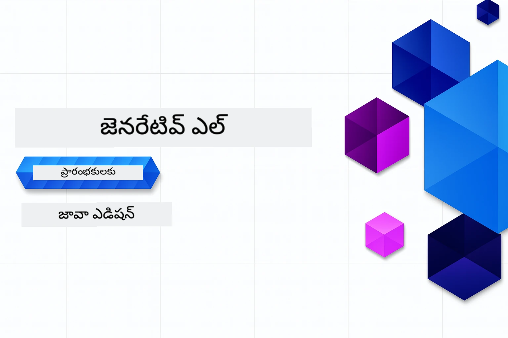

# ప్రారంభికుల కోసం జనరేటివ్ AI - జావా ఎడిషన్
[](https://discord.gg/nTYy5BXMWG)



**సమయం కేటాయింపు**: మొత్తం వర్క్‌షాప్ స్థానిక సెటప్ లేకుండా ఆన్‌లైన్‌లో పూర్తి చేయవచ్చు. వాతావరణం సెటప్ 2 నిమిషాలా, నమూనాలను పరిశీలించడానికి అన్వేషణ లోతు ఆధారంగా 1-3 గంటల సమయం తీసుకుంటుంది.

> **త్వరిత ప్రారంభం**

1. ఈ రిపోజిటరీని మీ GitHub ఖాతాకు ఫోర్క్ చేయండి
2. **Code** → **Codespaces** టాబ్ → **...** → **New with options...** క్లిక్ చేయండి
3. డిఫాల్ట్‌లను ఉపయోగించండి – ఇది ఈ కోర్సు కోసం సృష్టించిన డెవలప్‌మెంట్ కంటైనర్‌ను ఎంచుకుంటుంది
4. **Create codespace** క్లిక్ చేయండి
5. వాతావరణం సిద్ధంగా ఉండడానికి సుమారు 2 నిమిషాలు వేచి ఉండండి
6. నేరుగా [మొదటి ఉదాహరణ](./02-SetupDevEnvironment/README.md#step-2-create-a-github-personal-access-token)కు వెళ్లండి

## బహుళ-భాషా మద్దతు

### GitHub యాక్షన్ ద్వారా మద్దతు (స్వయంచాలక & ఎప్పుడూ తాజా)

<!-- CO-OP TRANSLATOR LANGUAGES TABLE START -->
[Arabic](../ar/README.md) | [Bengali](../bn/README.md) | [Bulgarian](../bg/README.md) | [Burmese (Myanmar)](../my/README.md) | [Chinese (Simplified)](../zh-CN/README.md) | [Chinese (Traditional, Hong Kong)](../zh-HK/README.md) | [Chinese (Traditional, Macau)](../zh-MO/README.md) | [Chinese (Traditional, Taiwan)](../zh-TW/README.md) | [Croatian](../hr/README.md) | [Czech](../cs/README.md) | [Danish](../da/README.md) | [Dutch](../nl/README.md) | [Estonian](../et/README.md) | [Finnish](../fi/README.md) | [French](../fr/README.md) | [German](../de/README.md) | [Greek](../el/README.md) | [Hebrew](../he/README.md) | [Hindi](../hi/README.md) | [Hungarian](../hu/README.md) | [Indonesian](../id/README.md) | [Italian](../it/README.md) | [Japanese](../ja/README.md) | [Kannada](../kn/README.md) | [Khmer](../km/README.md) | [Korean](../ko/README.md) | [Lithuanian](../lt/README.md) | [Malay](../ms/README.md) | [Malayalam](../ml/README.md) | [Marathi](../mr/README.md) | [Nepali](../ne/README.md) | [Nigerian Pidgin](../pcm/README.md) | [Norwegian](../no/README.md) | [Persian (Farsi)](../fa/README.md) | [Polish](../pl/README.md) | [Portuguese (Brazil)](../pt-BR/README.md) | [Portuguese (Portugal)](../pt-PT/README.md) | [Punjabi (Gurmukhi)](../pa/README.md) | [Romanian](../ro/README.md) | [Russian](../ru/README.md) | [Serbian (Cyrillic)](../sr/README.md) | [Slovak](../sk/README.md) | [Slovenian](../sl/README.md) | [Spanish](../es/README.md) | [Swahili](../sw/README.md) | [Swedish](../sv/README.md) | [Tagalog (Filipino)](../tl/README.md) | [Tamil](../ta/README.md) | [Telugu](./README.md) | [Thai](../th/README.md) | [Turkish](../tr/README.md) | [Ukrainian](../uk/README.md) | [Urdu](../ur/README.md) | [Vietnamese](../vi/README.md)

> **స్థానికంగా క్లోన్ చేయాలనుకుంటున్నారా?**
>
> ఈ రిపోజిటరీ 50+ భాషల అనువాదాలను కలిగి ఉంది, ఇది డౌన్లోడ్ పరిమాణాన్ని గణనీయంగా పెంచుతుంది. అనువాదాలు లేకుండా క్లోన్ చేయడానికి, స్పార్స్ చెకౌట్ ఉపయోగించండి:
>
> **Bash / macOS / Linux:**
> ```bash
> git clone --filter=blob:none --sparse https://github.com/microsoft/Generative-AI-for-beginners-java.git
> cd Generative-AI-for-beginners-java
> git sparse-checkout set --no-cone '/*' '!translations' '!translated_images'
> ```
>
> **CMD (Windows):**
> ```cmd
> git clone --filter=blob:none --sparse https://github.com/microsoft/Generative-AI-for-beginners-java.git
> cd Generative-AI-for-beginners-java
> git sparse-checkout set --no-cone "/*" "!translations" "!translated_images"
> ```
>
> ఇది కోర్స్‌ను పూర్తి చేయడానికి అవసరమైన ప్రతీదాన్ని మీకు చాలా వేగంగా డౌన్లోడ్ చేస్తుంది.
<!-- CO-OP TRANSLATOR LANGUAGES TABLE END -->

## కోర్స్ నిర్మాణం & నేర్చుకునే మార్గం

### **అధ్యాయం 1: జనరేటివ్ AI పరిచయం**
- **ముఖ్యాంశాలు**: పెద్ద భాషా మోడల్స్, టోకెన్లు, ఎంబెడ్డింగ్స్ మరియు AI సామర్థ్యాల అవగాహన
- **జావా AI ఎకోసిస్టమ్**: స్ప్రింగ్ AI మరియు OpenAI SDKల అవలోకనం
- **మోడల్ కాంటెక్స్ట్ ప్రోటోకాల్**: MCP పరిచయం మరియు AI ఏజెంట్ సంభాషణలో దీని పాత్ర
- **ప్రాయోగిక అనువర్తనాలు**: చాట్‌బాట్లు మరియు కంటెంట్ ఉత్పత్తి వంటి రియల్-వరల్డ్ సన్నివేశాలు
- **[→ అధ్యాయం 1 ప్రారంభించండి](./01-IntroToGenAI/README.md)**

### **అధ్యాయం 2: డెవలప్‌మెంట్ వాతావరణం సెటప్**
- **బహుళ-ప్రొవైడర్ కాన్ఫిగరేషన్**: GitHub మోడల్స్, Azure OpenAI మరియు OpenAI జావా SDK ఇంటిగ్రేషన్లు సెటప్ చేయడం
- **స్ప్రింగ్ బూట్ + స్ప్రింగ్ AI**: ఎంటర్ప్రైజ్ AI అప్లికేషన్ అభివృద్ధికి ఉత్తమ అభ్యాసాలు
- **GitHub Models**: ప్రోటోటైపింగ్ మరియు నేర్చుకోవడానికి ఉచిత AI మోడల్ యాక్సెస్ (క్రెడిట్ కార్డు అవసరం లేదు)
- **అభివృద్ధి పరికరాలు**: డోకర్ కంటైనర్ల, VS కోడ్, GitHub కోడ్‌స్పేస్‌ల కాన్ఫిగరేషన్
- **[→ అధ్యాయం 2 ప్రారంభించండి](./02-SetupDevEnvironment/README.md)**

### **అధ్యాయం 3: ప్రాథమిక జనరేటివ్ AI సాంకేతికతలు**
- **ప్రాంప్ట్ ఇంజనీరీంగ్**: ఉత్తమ AI మోడల్ ప్రతిస్పందనలకు సాంకేతికతలు
- **ఎంబెడ్డింగ్స్ & వెక్టార్ ఆపరేషన్లు**: సెమాంటిక్ సెర్చ్ మరియు సారూప్యత జతచేసే విధానం అమలు చేయడం
- **రిట్రీవల్-ఆగ్మెంటెడ్ జనరేషన్ (RAG)**: AIని మీ స్వంత డేటా సోర్స్‌లతో కలపడం
- **ఫంక్షన్ కాలింగ్**: కస్టమ్ టూల్స్ మరియు ప్లగిన్లతో AI సామర్థ్యాలను విస్తరించడం
- **[→ అధ్యాయం 3 ప్రారంభించండి](./03-CoreGenerativeAITechniques/README.md)**

### **అధ్యాయం 4: ప్రాక్టికల్ అనువర్తనాలు & ప్రాజెక్ట్స్**
- **పెట్ స్టోరీ జనరేటర్** (`petstory/`): GitHub మోడల్స్ తో సృజనాత్మక కంటెంట్ ఉత్పత్తి
- **ఫౌండ్‌రీ లోకల్ డెమో** (`foundrylocal/`): OpenAI జావా SDKతో లోకల్ AI మోడల్ ఇంటిగ్రేషన్
- **MCP కేలిక్యులేటర్ సర్వీస్** (`calculator/`): స్ప్రింగ్ AIతో మోడల్ కాంటెక్స్ట్ ప్రోటోకాల్ యొక్క ప్రాథమిక అమల్లు
- **[→ అధ్యాయం 4 ప్రారంభించండి](./04-PracticalSamples/README.md)**

### **అధ్యాయం 5: బాధ్యతాయుత AI అభివృద్ధి**
- **GitHub మోడల్స్ సేఫ్టీ**: బిల్ట్-ఇన్ కంటెంట్ ఫిల్టరింగ్ మరియు సేఫ్టీ మెకానిజమ్‌లు (హార్డ్ బ్లాక్స్ మరియు సాఫ్ట్ రిఫ్యూజల్స్) పరీక్షించండి
- **బాధ్యతాయుత AI డెమో**: ఆధునిక AI సేఫ్టీ సిస్టమ్‌లు ఎలా పనిచేస్తాయో ప్రాక్టికల్ ఉదాహరణ
- **ఉత్తమ అభ్యాసాలు**: నైతిక AI అభివృద్ధి మరియు triểnploymentకి అవసరమైన మార్గదర్శకాలు
- **[→ అధ్యాయం 5 ప్రారంభించండి](./05-ResponsibleGenAI/README.md)**

## అదనపు వనరులు

<!-- CO-OP TRANSLATOR OTHER COURSES START -->
### లాంగ్‌చెయిన్
[](https://aka.ms/langchain4j-for-beginners)
[](https://aka.ms/langchainjs-for-beginners?WT.mc_id=m365-94501-dwahlin)
[](https://github.com/microsoft/langchain-for-beginners?WT.mc_id=m365-94501-dwahlin)
---

### అజుర్ / ఎడ్జ్ / MCP / ఏజెంట్లు
[](https://github.com/microsoft/AZD-for-beginners?WT.mc_id=academic-105485-koreyst)
[](https://github.com/microsoft/edgeai-for-beginners?WT.mc_id=academic-105485-koreyst)
[](https://github.com/microsoft/mcp-for-beginners?WT.mc_id=academic-105485-koreyst)
[](https://github.com/microsoft/ai-agents-for-beginners?WT.mc_id=academic-105485-koreyst)

---
 
### జనరేటివ్ AI సిరీస్
[](https://github.com/microsoft/generative-ai-for-beginners?WT.mc_id=academic-105485-koreyst)
[-9333EA?style=for-the-badge&labelColor=E5E7EB&color=9333EA)](https://github.com/microsoft/Generative-AI-for-beginners-dotnet?WT.mc_id=academic-105485-koreyst)
[-C084FC?style=for-the-badge&labelColor=E5E7EB&color=C084FC)](https://github.com/microsoft/generative-ai-for-beginners-java?WT.mc_id=academic-105485-koreyst)
[-E879F9?style=for-the-badge&labelColor=E5E7EB&color=E879F9)](https://github.com/microsoft/generative-ai-with-javascript?WT.mc_id=academic-105485-koreyst)

---
 
### ప్రాథమిక అభ్యాసం
[](https://aka.ms/ml-beginners?WT.mc_id=academic-105485-koreyst)
[](https://aka.ms/datascience-beginners?WT.mc_id=academic-105485-koreyst)
[](https://aka.ms/ai-beginners?WT.mc_id=academic-105485-koreyst)
[](https://github.com/microsoft/Security-101?WT.mc_id=academic-96948-sayoung)

[](https://aka.ms/webdev-beginners?WT.mc_id=academic-105485-koreyst)
[](https://aka.ms/iot-beginners?WT.mc_id=academic-105485-koreyst)
[](https://github.com/microsoft/xr-development-for-beginners?WT.mc_id=academic-105485-koreyst)

---
 
### కొపైలట్ సిరీస్
[](https://aka.ms/GitHubCopilotAI?WT.mc_id=academic-105485-koreyst)
[](https://github.com/microsoft/mastering-github-copilot-for-dotnet-csharp-developers?WT.mc_id=academic-105485-koreyst)
[](https://github.com/microsoft/CopilotAdventures?WT.mc_id=academic-105485-koreyst)
<!-- CO-OP TRANSLATOR OTHER COURSES END -->

## సహాయం పొందడం

మీరు ఎక్కడాయినా చిక్కుకున్నట్లయితే లేదా AI యాప్‌లను నిర్మించడంపై ఏవైనా ప్రశ్నలు ఉంటే. MCP గురించి fellow అభ్యర్థులు మరియు అనుభవజ్ఞులైన డెవలపర్లతో చర్చల్లో పాల్గొనండి. ఇది ప్రశ్నలకు స్వాగతం పలుకుతున్న, జ్ఞానం స్వేచ్ఛగా పంచుకునే మద్దతున్న కమ్యూనిటీ.

[](https://discord.gg/nTYy5BXMWG)

ఉత్పత్తి అభిప్రాయం లేదా నిర్మాణ సమయంలో పొరపాట్లు ఉంటే సందర్శించండి:

[](https://aka.ms/foundry/forum)

---

<!-- CO-OP TRANSLATOR DISCLAIMER START -->
**వివరణ నివేదిక**:  
ఈ డాక్యుమెంట్‌ను AI అనువాద సేవ [Co-op Translator](https://github.com/Azure/co-op-translator) ఉపయోగించి అనువదించారు. మేము ఖచ్చితత్వానికి ప్రయత్నిస్తున్నప్పటికీ, స్వయంచాలక అనువాదాల్లో పొరపాట్లు లేదా లోపాలు ఉండవచ్చు. అసలు డాక్యుమెంట్ దాని స్థానిక భాషలోనే అధికారం కలిగిన వనరు గా పరిగణించాలి. అత్యవసర సమాచారం కోసం, వృత్తిపరమైన మానవ అనువాదం అవసరం. ఈ అనువాదం కారణంగా వచ్చిన ఏదైనా అపార్థాలు లేదా తప్పుదారులపై మేము బాధ్యత వహించడం లేదు.
<!-- CO-OP TRANSLATOR DISCLAIMER END -->