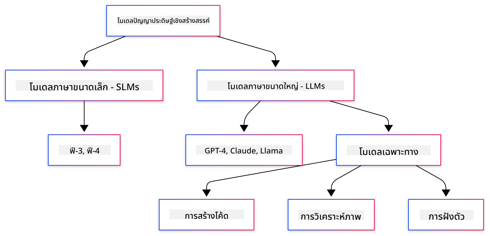
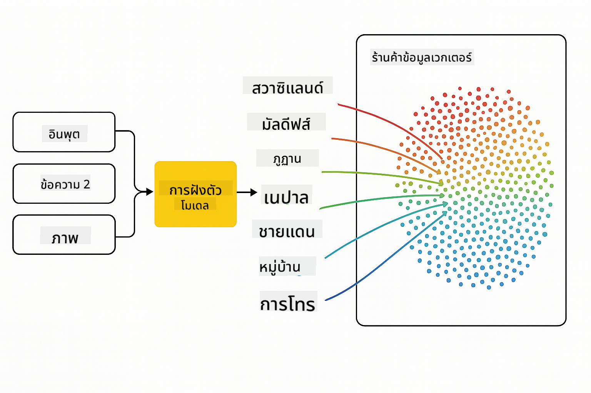

<!--
CO_OP_TRANSLATOR_METADATA:
{
  "original_hash": "75bfb080ca725e8a9aa9c80cae25fba1",
  "translation_date": "2025-07-29T09:20:53+00:00",
  "source_file": "01-IntroToGenAI/README.md",
  "language_code": "th"
}
-->
# บทนำสู่ Generative AI - ฉบับภาษา Java

## สิ่งที่คุณจะได้เรียนรู้

- **พื้นฐานของ Generative AI** รวมถึง LLMs, การออกแบบคำสั่ง (prompt engineering), โทเค็น, embeddings และฐานข้อมูลเวกเตอร์
- **เปรียบเทียบเครื่องมือพัฒนา AI สำหรับ Java** เช่น Azure OpenAI SDK, Spring AI และ OpenAI Java SDK
- **ค้นพบ Model Context Protocol** และบทบาทของมันในการสื่อสารของ AI agent

## สารบัญ

- [บทนำ](../../../01-IntroToGenAI)
- [ทบทวนแนวคิด Generative AI](../../../01-IntroToGenAI)
- [การออกแบบคำสั่ง (Prompt Engineering)](../../../01-IntroToGenAI)
- [โทเค็น, embeddings และ agents](../../../01-IntroToGenAI)
- [เครื่องมือและไลบรารีสำหรับพัฒนา AI ด้วย Java](../../../01-IntroToGenAI)
  - [OpenAI Java SDK](../../../01-IntroToGenAI)
  - [Spring AI](../../../01-IntroToGenAI)
  - [Azure OpenAI Java SDK](../../../01-IntroToGenAI)
- [สรุป](../../../01-IntroToGenAI)
- [ขั้นตอนถัดไป](../../../01-IntroToGenAI)

## บทนำ

ยินดีต้อนรับสู่บทแรกของ Generative AI สำหรับผู้เริ่มต้น - ฉบับภาษา Java! บทเรียนพื้นฐานนี้จะพาคุณไปรู้จักกับแนวคิดหลักของ Generative AI และวิธีการใช้งานด้วย Java คุณจะได้เรียนรู้เกี่ยวกับส่วนประกอบสำคัญของแอปพลิเคชัน AI เช่น Large Language Models (LLMs), โทเค็น, embeddings และ AI agents นอกจากนี้ เรายังจะสำรวจเครื่องมือ Java หลักที่คุณจะใช้ตลอดหลักสูตรนี้

### ทบทวนแนวคิด Generative AI

Generative AI เป็นประเภทของปัญญาประดิษฐ์ที่สร้างเนื้อหาใหม่ เช่น ข้อความ รูปภาพ หรือโค้ด โดยอ้างอิงจากรูปแบบและความสัมพันธ์ที่เรียนรู้จากข้อมูล โมเดล Generative AI สามารถสร้างคำตอบที่คล้ายมนุษย์ เข้าใจบริบท และบางครั้งก็สร้างเนื้อหาที่ดูเหมือนมนุษย์สร้างขึ้น

เมื่อคุณพัฒนาแอปพลิเคชัน AI ด้วย Java คุณจะทำงานร่วมกับ **โมเดล Generative AI** เพื่อสร้างเนื้อหา ความสามารถบางอย่างของโมเดล Generative AI ได้แก่:

- **การสร้างข้อความ**: สร้างข้อความที่คล้ายมนุษย์สำหรับแชทบอท เนื้อหา และการเติมข้อความ
- **การสร้างและวิเคราะห์ภาพ**: สร้างภาพที่สมจริง ปรับปรุงภาพถ่าย และตรวจจับวัตถุ
- **การสร้างโค้ด**: เขียนโค้ดหรือสคริปต์

มีโมเดลเฉพาะที่เหมาะสำหรับงานต่าง ๆ เช่น **Small Language Models (SLMs)** และ **Large Language Models (LLMs)** ที่สามารถจัดการกับการสร้างข้อความ โดย LLMs มักจะให้ประสิทธิภาพที่ดีกว่าสำหรับงานที่ซับซ้อน สำหรับงานที่เกี่ยวกับภาพ คุณจะใช้โมเดลวิชั่นเฉพาะหรือโมเดลมัลติโมดัล

แน่นอนว่าคำตอบจากโมเดลเหล่านี้ไม่ได้สมบูรณ์แบบเสมอไป คุณอาจเคยได้ยินว่าโมเดล "หลอน" หรือสร้างข้อมูลที่ไม่ถูกต้องในลักษณะที่ดูน่าเชื่อถือ แต่คุณสามารถช่วยให้โมเดลสร้างคำตอบที่ดีขึ้นได้โดยการให้คำแนะนำและบริบทที่ชัดเจน ซึ่งนี่คือจุดที่ **การออกแบบคำสั่ง (prompt engineering)** มีบทบาทสำคัญ

#### การออกแบบคำสั่ง (Prompt Engineering)

การออกแบบคำสั่งคือการออกแบบอินพุตที่มีประสิทธิภาพเพื่อชี้นำโมเดล AI ให้ได้ผลลัพธ์ตามที่ต้องการ ซึ่งรวมถึง:

- **ความชัดเจน**: ทำให้คำแนะนำชัดเจนและไม่กำกวม
- **บริบท**: ให้ข้อมูลพื้นหลังที่จำเป็น
- **ข้อจำกัด**: ระบุข้อจำกัดหรือรูปแบบที่ต้องการ

แนวปฏิบัติที่ดีที่สุดสำหรับการออกแบบคำสั่ง ได้แก่ การออกแบบคำสั่งที่ดี การให้คำแนะนำที่ชัดเจน การแบ่งงานออกเป็นส่วนย่อย การเรียนรู้แบบ one-shot และ few-shot และการปรับแต่งคำสั่ง การทดสอบคำสั่งต่าง ๆ เป็นสิ่งสำคัญเพื่อค้นหาสิ่งที่เหมาะสมที่สุดสำหรับกรณีการใช้งานของคุณ

เมื่อพัฒนาแอปพลิเคชัน คุณจะทำงานกับคำสั่งประเภทต่าง ๆ:
- **System prompts**: กำหนดกฎพื้นฐานและบริบทสำหรับพฤติกรรมของโมเดล
- **User prompts**: ข้อมูลอินพุตจากผู้ใช้แอปพลิเคชันของคุณ
- **Assistant prompts**: คำตอบของโมเดลที่อิงตาม system และ user prompts

> **เรียนรู้เพิ่มเติม**: เรียนรู้เพิ่มเติมเกี่ยวกับการออกแบบคำสั่งใน [บท Prompt Engineering ของหลักสูตร GenAI for Beginners](https://github.com/microsoft/generative-ai-for-beginners/tree/main/04-prompt-engineering-fundamentals)

#### โทเค็น, embeddings และ agents

เมื่อทำงานกับโมเดล Generative AI คุณจะพบคำศัพท์เช่น **โทเค็น**, **embeddings**, **agents** และ **Model Context Protocol (MCP)** ต่อไปนี้คือภาพรวมของแนวคิดเหล่านี้:

- **โทเค็น**: โทเค็นคือหน่วยข้อความที่เล็กที่สุดในโมเดล อาจเป็นคำ ตัวอักษร หรือส่วนของคำ โทเค็นใช้แทนข้อมูลข้อความในรูปแบบที่โมเดลเข้าใจได้ ตัวอย่างเช่น ประโยค "The quick brown fox jumped over the lazy dog" อาจถูกแปลงเป็นโทเค็นเป็น ["The", " quick", " brown", " fox", " jumped", " over", " the", " lazy", " dog"] หรือ ["The", " qu", "ick", " br", "own", " fox", " jump", "ed", " over", " the", " la", "zy", " dog"] ขึ้นอยู่กับกลยุทธ์การแปลงโทเค็น

การแปลงโทเค็นเป็นกระบวนการที่แบ่งข้อความออกเป็นหน่วยย่อยเหล่านี้ ซึ่งสำคัญเพราะโมเดลทำงานกับโทเค็นแทนที่จะเป็นข้อความดิบ จำนวนโทเค็นในคำสั่งส่งผลต่อความยาวและคุณภาพของคำตอบ เนื่องจากโมเดลมีข้อจำกัดของโทเค็นในหน้าต่างบริบท (เช่น 128K โทเค็นสำหรับ GPT-4 รวมทั้งอินพุตและเอาต์พุต)

  ใน Java คุณสามารถใช้ไลบรารี เช่น OpenAI SDK เพื่อจัดการการแปลงโทเค็นโดยอัตโนมัติเมื่อส่งคำขอไปยังโมเดล AI

- **Embeddings**: Embeddings คือการแสดงผลแบบเวกเตอร์ของโทเค็นที่จับความหมายเชิงความหมาย เป็นการแสดงผลเชิงตัวเลข (โดยทั่วไปเป็นอาร์เรย์ของตัวเลขทศนิยม) ที่ช่วยให้โมเดลเข้าใจความสัมพันธ์ระหว่างคำและสร้างคำตอบที่เกี่ยวข้องกับบริบท คำที่มีความหมายคล้ายกันจะมี embeddings ที่คล้ายกัน ทำให้โมเดลเข้าใจแนวคิดเช่นคำพ้องความหมายและความสัมพันธ์เชิงความหมาย

  ใน Java คุณสามารถสร้าง embeddings โดยใช้ OpenAI SDK หรือไลบรารีอื่น ๆ ที่รองรับการสร้าง embeddings สิ่งเหล่านี้มีความสำคัญสำหรับงานเช่นการค้นหาเชิงความหมาย ซึ่งคุณต้องการค้นหาเนื้อหาที่คล้ายกันตามความหมายแทนที่จะเป็นการจับคู่ข้อความแบบตรงตัว

- **ฐานข้อมูลเวกเตอร์**: ฐานข้อมูลเวกเตอร์เป็นระบบจัดเก็บข้อมูลเฉพาะที่เหมาะสำหรับ embeddings ช่วยให้สามารถค้นหาความคล้ายคลึงกันได้อย่างมีประสิทธิภาพ และมีความสำคัญสำหรับรูปแบบ Retrieval-Augmented Generation (RAG) ซึ่งคุณต้องค้นหาข้อมูลที่เกี่ยวข้องจากชุดข้อมูลขนาดใหญ่ตามความคล้ายคลึงกันเชิงความหมายแทนที่จะเป็นการจับคู่แบบตรงตัว

> **หมายเหตุ**: ในหลักสูตรนี้ เราจะไม่ครอบคลุมฐานข้อมูลเวกเตอร์ แต่คิดว่าควรกล่าวถึงเพราะมันถูกใช้งานอย่างแพร่หลายในแอปพลิเคชันจริง

- **Agents & MCP**: ส่วนประกอบ AI ที่โต้ตอบกับโมเดล เครื่องมือ และระบบภายนอกได้อย่างอัตโนมัติ Model Context Protocol (MCP) ให้วิธีการมาตรฐานสำหรับ agents ในการเข้าถึงแหล่งข้อมูลภายนอกและเครื่องมืออย่างปลอดภัย เรียนรู้เพิ่มเติมใน [หลักสูตร MCP for Beginners](https://github.com/microsoft/mcp-for-beginners)

ในแอปพลิเคชัน AI ด้วย Java คุณจะใช้โทเค็นสำหรับการประมวลผลข้อความ, embeddings สำหรับการค้นหาเชิงความหมายและ RAG, ฐานข้อมูลเวกเตอร์สำหรับการดึงข้อมูล และ agents พร้อม MCP สำหรับการสร้างระบบอัจฉริยะที่ใช้เครื่องมือ

### เครื่องมือและไลบรารีสำหรับพัฒนา AI ด้วย Java

Java มีเครื่องมือที่ยอดเยี่ยมสำหรับการพัฒนา AI มีไลบรารีหลักสามตัวที่เราจะสำรวจในหลักสูตรนี้ ได้แก่ OpenAI Java SDK, Azure OpenAI SDK และ Spring AI

ตารางอ้างอิงด่วนด้านล่างแสดง SDK ที่ใช้ในตัวอย่างแต่ละบท:

| บท | ตัวอย่าง | SDK |
|---------|--------|-----|
| 02-SetupDevEnvironment | github-models | OpenAI Java SDK |
| 02-SetupDevEnvironment | basic-chat-azure | Spring AI Azure OpenAI |
| 03-CoreGenerativeAITechniques | examples | Azure OpenAI SDK |
| 04-PracticalSamples | petstory | OpenAI Java SDK |
| 04-PracticalSamples | foundrylocal | OpenAI Java SDK |
| 04-PracticalSamples | calculator | Spring AI MCP SDK + LangChain4j |

**ลิงก์เอกสาร SDK:**
- [Azure OpenAI Java SDK](https://github.com/Azure/azure-sdk-for-java/tree/azure-ai-openai_1.0.0-beta.16/sdk/openai/azure-ai-openai)
- [Spring AI](https://docs.spring.io/spring-ai/reference/)
- [OpenAI Java SDK](https://github.com/openai/openai-java)
- [LangChain4j](https://docs.langchain4j.dev/)

#### OpenAI Java SDK

OpenAI SDK เป็นไลบรารี Java อย่างเป็นทางการสำหรับ OpenAI API มันให้ส่วนต่อประสานที่เรียบง่ายและสม่ำเสมอสำหรับการโต้ตอบกับโมเดลของ OpenAI ทำให้ง่ายต่อการรวมความสามารถ AI เข้ากับแอปพลิเคชัน Java ตัวอย่าง GitHub Models ในบทที่ 2, แอปพลิเคชัน Pet Story และตัวอย่าง Foundry Local ในบทที่ 4 แสดงให้เห็นถึงวิธีการใช้ OpenAI SDK

#### Spring AI

Spring AI เป็นเฟรมเวิร์กที่ครอบคลุมซึ่งนำความสามารถ AI มาสู่แอปพลิเคชัน Spring โดยให้เลเยอร์นามธรรมที่สม่ำเสมอระหว่างผู้ให้บริการ AI ต่าง ๆ มันผสานรวมกับระบบนิเวศของ Spring ได้อย่างราบรื่น ทำให้เป็นตัวเลือกที่เหมาะสำหรับแอปพลิเคชัน Java ระดับองค์กรที่ต้องการความสามารถ AI

จุดแข็งของ Spring AI อยู่ที่การผสานรวมกับระบบนิเวศของ Spring ทำให้ง่ายต่อการสร้างแอปพลิเคชัน AI ที่พร้อมใช้งานในระดับการผลิตด้วยรูปแบบ Spring ที่คุ้นเคย เช่น การฉีดพึ่งพา (dependency injection), การจัดการการกำหนดค่า และเฟรมเวิร์กการทดสอบ คุณจะใช้ Spring AI ในบทที่ 2 และ 4 เพื่อสร้างแอปพลิเคชันที่ใช้ทั้ง OpenAI และไลบรารี Model Context Protocol (MCP) ของ Spring AI

##### Model Context Protocol (MCP)

[Model Context Protocol (MCP)](https://modelcontextprotocol.io/) เป็นมาตรฐานใหม่ที่ช่วยให้แอปพลิเคชัน AI สามารถโต้ตอบกับแหล่งข้อมูลภายนอกและเครื่องมือได้อย่างปลอดภัย MCP ให้วิธีการมาตรฐานสำหรับโมเดล AI ในการเข้าถึงข้อมูลเชิงบริบทและดำเนินการในแอปพลิเคชันของคุณ

ในบทที่ 4 คุณจะสร้างบริการเครื่องคิดเลข MCP แบบง่ายที่แสดงให้เห็นถึงพื้นฐานของ Model Context Protocol ด้วย Spring AI โดยแสดงวิธีสร้างการผสานรวมเครื่องมือพื้นฐานและสถาปัตยกรรมบริการ

#### Azure OpenAI Java SDK

Azure OpenAI client library สำหรับ Java เป็นการปรับแต่ง REST APIs ของ OpenAI ที่ให้ส่วนต่อประสานที่เหมาะสมและการผสานรวมกับระบบนิเวศ SDK ของ Azure ในบทที่ 3 คุณจะสร้างแอปพลิเคชันโดยใช้ Azure OpenAI SDK รวมถึงแอปพลิเคชันแชท การเรียกฟังก์ชัน และรูปแบบ RAG (Retrieval-Augmented Generation)

> หมายเหตุ: Azure OpenAI SDK มีฟีเจอร์น้อยกว่า OpenAI Java SDK ดังนั้นสำหรับโปรเจกต์ในอนาคต ควรพิจารณาใช้ OpenAI Java SDK

## สรุป

จบบทพื้นฐานแล้ว! ตอนนี้คุณเข้าใจ:

- แนวคิดหลักเบื้องหลัง Generative AI - ตั้งแต่ LLMs และการออกแบบคำสั่งไปจนถึงโทเค็น, embeddings และฐานข้อมูลเวกเตอร์
- ตัวเลือกเครื่องมือสำหรับการพัฒนา AI ด้วย Java: Azure OpenAI SDK, Spring AI และ OpenAI Java SDK
- Model Context Protocol คืออะไร และมันช่วยให้ AI agents ทำงานร่วมกับเครื่องมือภายนอกได้อย่างไร

## ขั้นตอนถัดไป

[บทที่ 2: การตั้งค่าสภาพแวดล้อมการพัฒนา](../02-SetupDevEnvironment/README.md)

**ข้อจำกัดความรับผิดชอบ**:  
เอกสารนี้ได้รับการแปลโดยใช้บริการแปลภาษา AI [Co-op Translator](https://github.com/Azure/co-op-translator) แม้ว่าเราจะพยายามให้การแปลมีความถูกต้อง แต่โปรดทราบว่าการแปลอัตโนมัติอาจมีข้อผิดพลาดหรือความไม่แม่นยำ เอกสารต้นฉบับในภาษาดั้งเดิมควรถือเป็นแหล่งข้อมูลที่เชื่อถือได้ สำหรับข้อมูลที่สำคัญ ขอแนะนำให้ใช้บริการแปลภาษามนุษย์ที่เป็นมืออาชีพ เราจะไม่รับผิดชอบต่อความเข้าใจผิดหรือการตีความที่ผิดพลาดซึ่งเกิดจากการใช้การแปลนี้