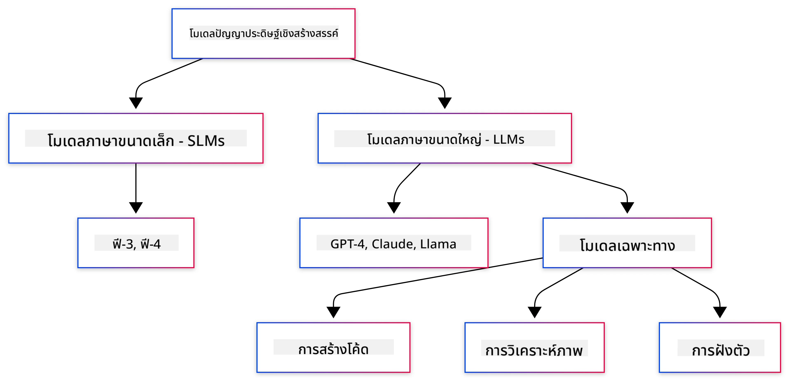
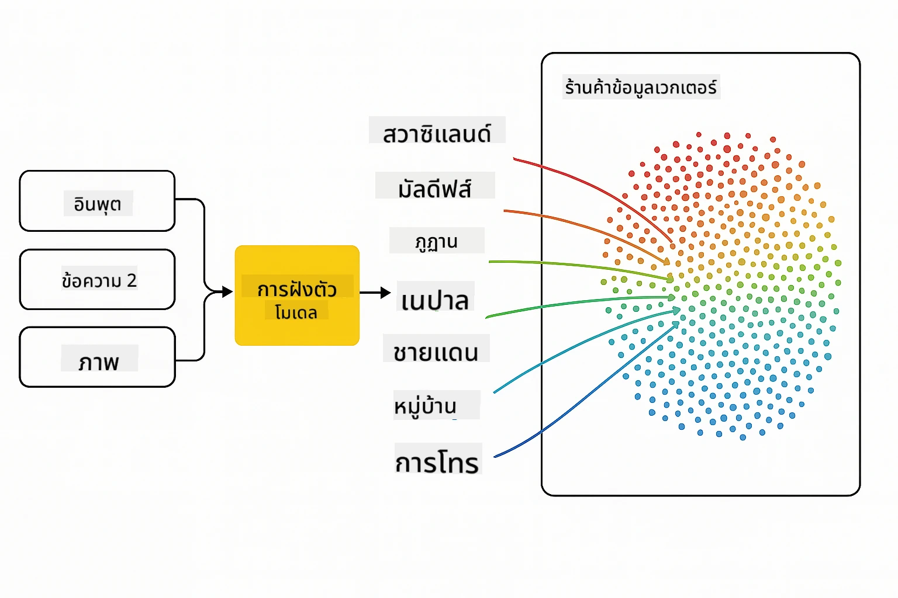
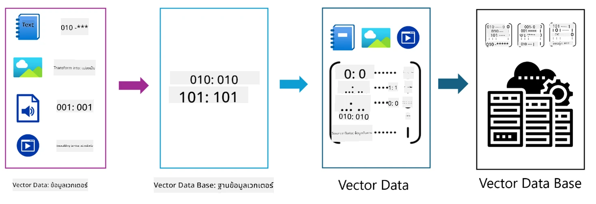
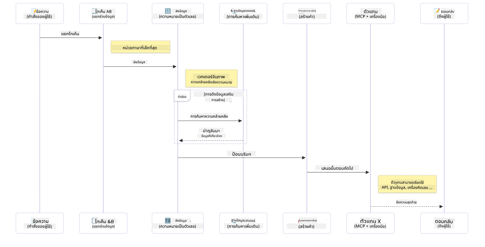

# บทนำสู่ Generative AI - เวอร์ชัน Java

> **วิดีโอ**: [รับชมวิดีโอภาพรวมของบทเรียนนี้บน YouTube](https://www.youtube.com/watch?v=XH46tGp_eSw) คุณยังสามารถคลิกที่รูปภาพขนาดย่อด้านบนได้เช่นกัน

## สิ่งที่คุณจะได้เรียนรู้

- **พื้นฐานของ Generative AI** รวมถึง LLMs, การออกแบบ prompt, tokens, embeddings, และฐานข้อมูลเวกเตอร์
- **เปรียบเทียบเครื่องมือพัฒนา AI ใน Java** รวมถึง Azure OpenAI SDK, Spring AI, และ OpenAI Java SDK
- **ค้นพบ Model Context Protocol** และบทบาทของมันในการสื่อสารของตัวแทน AI

## สารบัญ

- [บทนำ](#บทนำ)
- [การรีเฟรชอย่างรวดเร็วเกี่ยวกับแนวคิดของ Generative AI](#การรีเฟรชอย่างรวดเร็วเกี่ยวกับแนวคิดของ-generative-ai)
- [ทบทวนการออกแบบ prompt](#ทบทวนการออกแบบ-prompt)
- [Tokens, embeddings, และ agents](#tokens-embeddings-และ-agents)
- [เครื่องมือและไลบรารีพัฒนา AI สำหรับ Java](#เครื่องมือและไลบรารีพัฒนา-ai-สำหรับ-java)
  - [OpenAI Java SDK](#openai-java-sdk)
  - [Spring AI](#spring-ai)
  - [Azure OpenAI Java SDK](#azure-openai-java-sdk)
- [สรุป](#สรุป)
- [ขั้นตอนถัดไป](#ขั้นตอนถัดไป)

## บทนำ

ยินดีต้อนรับสู่บทแรกของ Generative AI สำหรับผู้เริ่มต้น - เวอร์ชัน Java! บทเรียนพื้นฐานนี้จะแนะนำแนวคิดหลักของ generative AI และวิธีการทำงานกับมันโดยใช้ Java คุณจะได้เรียนรู้เกี่ยวกับส่วนประกอบพื้นฐานของแอปพลิเคชัน AI รวมถึง Large Language Models (LLMs), tokens, embeddings และตัวแทน AI นอกจากนี้เรายังจะสำรวจเครื่องมือหลักของ Java ที่คุณจะใช้ตลอดหลักสูตรนี้

### การรีเฟรชอย่างรวดเร็วเกี่ยวกับแนวคิดของ Generative AI

Generative AI เป็นประเภทของปัญญาประดิษฐ์ที่สร้างเนื้อหาใหม่ เช่น ข้อความ รูปภาพ หรือโค้ด โดยอิงตามรูปแบบและความสัมพันธ์ที่เรียนรู้จากข้อมูล โมเดล generative AI สามารถสร้างคำตอบที่เหมือนมนุษย์ เข้าใจบริบท และบางครั้งแม้แต่สร้างเนื้อหาที่ดูเหมือนมนุษย์จริงๆ

เมื่อคุณพัฒนาแอปพลิเคชัน AI ด้วย Java คุณจะทำงานกับ **โมเดล generative AI** เพื่อสร้างเนื้อหา ความสามารถบางอย่างของโมเดล generative AI มีดังนี้:

- **การสร้างข้อความ**: สร้างข้อความที่เหมือนมนุษย์สำหรับแชทบอท เนื้อหา และการเติมข้อความ
- **การสร้างและวิเคราะห์ภาพ**: สร้างภาพที่สมจริง ปรับปรุงภาพถ่าย และตรวจจับวัตถุ
- **การสร้างโค้ด**: เขียนโค้ดชิ้นย่อยหรือสคริปต์

มีโมเดลบางประเภทที่ถูกปรับแต่งเพื่อรองรับงานที่แตกต่างกัน ตัวอย่างเช่น ทั้ง **Small Language Models (SLMs)** และ **Large Language Models (LLMs)** สามารถจัดการกับการสร้างข้อความได้ โดย LLMs มักจะให้ประสิทธิภาพที่ดีกว่าสำหรับงานที่ซับซ้อน สำหรับงานที่เกี่ยวข้องกับภาพ คุณจะใช้โมเดลวิชั่นเฉพาะหรือโมเดลมัลติ-โหมด

แน่นอนว่าคำตอบจากโมเดลเหล่านี้ไม่ได้สมบูรณ์แบบตลอดเวลา คุณอาจเคยได้ยินเกี่ยวกับโมเดลที่ "สร้างภาพฝัน" หรือสร้างข้อมูลที่ผิดพลาดในลักษณะที่ดูลักษณะน่าเชื่อถือ แต่คุณสามารถช่วยชี้แนะแบบจำลองเพื่อให้สร้างคำตอบที่ดีขึ้นโดยการให้คำแนะนำและบริบทที่ชัดเจน นี่คือจุดที่ **การออกแบบ prompt** เข้ามามีบทบาท

#### ทบทวนการออกแบบ prompt

การออกแบบ prompt คือการออกแบบอินพุตที่มีประสิทธิภาพเพื่อชี้นำโมเดล AI ไปยังผลลัพธ์ที่ต้องการ ซึ่งเกี่ยวข้องกับ:

- **ความชัดเจน**: ทำให้คำแนะนำชัดเจนและไม่คลุมเครือ
- **บริบท**: ให้ข้อมูลพื้นหลังที่จำเป็น
- **ข้อจำกัด**: ระบุข้อจำกัดหรือรูปแบบใดๆ

แนวทางปฏิบัติที่ดีที่สุดสำหรับการออกแบบ prompt ได้แก่ การออกแบบ prompt, คำแนะนำที่ชัดเจน, การแบ่งงาน, การเรียนรู้แบบ one-shot และ few-shot, และการปรับจูน prompt การทดสอบ prompt ต่างๆ จึงเป็นสิ่งสำคัญเพื่อหาสิ่งที่เหมาะสมที่สุดสำหรับกรณีการใช้งานเฉพาะของคุณ

เมื่อพัฒนาแอปพลิเคชัน คุณจะทำงานกับประเภท prompt ต่างๆ ดังนี้:
- **System prompts**: กำหนดกฎพื้นฐานและบริบทสำหรับพฤติกรรมของโมเดล
- **User prompts**: ข้อมูลอินพุตจากผู้ใช้แอปพลิเคชันของคุณ
- **Assistant prompts**: คำตอบของโมเดลที่อิงจาก system และ user prompts

> **เรียนรู้เพิ่มเติม**: เรียนรู้เพิ่มเติมเกี่ยวกับการออกแบบ prompt ใน [บท Prompt Engineering ของหลักสูตร GenAI สำหรับผู้เริ่มต้น](https://github.com/microsoft/generative-ai-for-beginners/tree/main/04-prompt-engineering-fundamentals)

#### Tokens, embeddings, และ agents

เมื่อทำงานกับโมเดล generative AI คุณจะพบคำว่า **tokens**, **embeddings**, **agents**, และ **Model Context Protocol (MCP)** นี่คือภาพรวมอย่างละเอียดของแนวคิดเหล่านี้:

- **Tokens**: Tokens คือหน่วยย่อยที่สุดของข้อความในโมเดล อาจเป็นคำ ตัวอักษร หรือ subwords Tokens ถูกใช้เพื่อแทนข้อมูลข้อความในรูปแบบที่โมเดลเข้าใจได้ เช่น ประโยค "The quick brown fox jumped over the lazy dog" อาจถูกแบ่งเป็น tokens เช่น ["The", " quick", " brown", " fox", " jumped", " over", " the", " lazy", " dog"] หรือ ["The", " qu", "ick", " br", "own", " fox", " jump", "ed", " over", " the", " la", "zy", " dog"] ขึ้นอยู่กับกลยุทธ์การแบ่ง tokens

การ tokenization คือกระบวนการแบ่งข้อความให้เป็นหน่วยเล็กๆ เหล่านี้ สำคัญมากเพราะโมเดลทำงานกับ tokens แทนข้อความดิบ จำนวน tokens ใน prompt มีผลต่อความยาวและคุณภาพของคำตอบ เพราะโมเดลมีข้อจำกัดจำนวน tokens สำหรับหน้าต่างบริบท (เช่น 128K tokens สำหรับบริบททั้งหมดของ GPT-4o รวมทั้งอินพุตและเอาท์พุต)

  ใน Java คุณสามารถใช้ไลบรารีอย่าง OpenAI SDK เพื่อจัดการ tokenization โดยอัตโนมัติเมื่อส่งคำขอไปยังโมเดล AI

- **Embeddings**: Embeddings คือการแทนข้อมูล tokens ในรูปเวกเตอร์ที่จับความหมายเชิงนัย Embeddings เป็นการแทนตัวเลข (โดยปกติเป็นอาเรย์ของเลขทศนิยม) ที่ช่วยให้โมเดลเข้าใจความสัมพันธ์ระหว่างคำและสร้างคำตอบที่เกี่ยวข้องกับบริบท คำที่มีความหมายใกล้เคียงกันจะมี embeddings ที่คล้ายกัน ทำให้โมเดลเข้าใจแนวคิดอย่างคำพ้องและความสัมพันธ์เชิงนัย

  ใน Java คุณสามารถสร้าง embeddings โดยใช้ OpenAI SDK หรือไลบรารีอื่นๆ ที่รองรับการสร้าง embeddings ซึ่ง embeddings เหล่านี้สำคัญสำหรับงานอย่าง semantic search ที่คุณต้องการหาข้อมูลที่มีความหมายใกล้เคียงกันมากกว่าการจับคู่ข้อความตรงๆ

- **ฐานข้อมูลเวกเตอร์**: ฐานข้อมูลเวกเตอร์เป็นระบบจัดเก็บข้อมูลเฉพาะที่ถูกปรับแต่งสำหรับ embeddings โดยเฉพาะ ช่วยให้สามารถค้นหาความคล้ายคลึงกันได้อย่างมีประสิทธิภาพ และเป็นสิ่งสำคัญสำหรับรูปแบบ Retrieval-Augmented Generation (RAG) ที่ต้องค้นหาข้อมูลที่เกี่ยวข้องจากชุดข้อมูลขนาดใหญ่โดยอาศัยความคล้ายเชิงนัยมากกว่าการจับคู่ตัวอักษรตรงๆ

> **หมายเหตุ**: ในหลักสูตรนี้ เราจะไม่ครอบคลุมฐานข้อมูลเวกเตอร์ แต่คิดว่าน่าสนใจที่จะกล่าวถึงเพราะนิยมใช้ในแอปพลิเคชันจริง

- **Agents & MCP**: องค์ประกอบ AI ที่ทำงานอัตโนมัติ และโต้ตอบกับโมเดล เครื่องมือ และระบบภายนอก Model Context Protocol (MCP) เป็นวิธีมาตรฐานสำหรับ agents ในการเข้าถึงแหล่งข้อมูลภายนอกและเครื่องมือต่างๆ อย่างปลอดภัย เรียนรู้เพิ่มเติมได้ในหลักสูตร [MCP for Beginners](https://github.com/microsoft/mcp-for-beginners)

ในแอปพลิเคชัน AI บน Java คุณจะใช้ tokens สำหรับการประมวลผลข้อความ, embeddings สำหรับ semantic search และ RAG, ฐานข้อมูลเวกเตอร์สำหรับการเรียกข้อมูล, และ agents ที่ใช้ MCP เพื่อสร้างระบบอัจฉริยะที่ใช้เครื่องมือต่างๆ

### เครื่องมือและไลบรารีพัฒนา AI สำหรับ Java

Java มีเครื่องมือที่ยอดเยี่ยมสำหรับการพัฒนา AI มีสามไลบรารีหลักที่เราจะสำรวจตลอดหลักสูตรนี้ ได้แก่ OpenAI Java SDK, Azure OpenAI SDK และ Spring AI

นี่คือตารางอ้างอิงอย่างรวดเร็วแสดงว่า SDK ใดถูกใช้ในตัวอย่างของแต่ละบท:

| บท | ตัวอย่าง | SDK |
|---------|--------|-----|
| 02-SetupDevEnvironment | github-models | OpenAI Java SDK |
| 02-SetupDevEnvironment | basic-chat-azure | Spring AI Azure OpenAI |
| 03-CoreGenerativeAITechniques | examples | Azure OpenAI SDK |
| 04-PracticalSamples | petstory | OpenAI Java SDK |
| 04-PracticalSamples | foundrylocal | OpenAI Java SDK |
| 04-PracticalSamples | calculator | Spring AI MCP SDK + LangChain4j |

**ลิงก์เอกสาร SDK:**
- [Azure OpenAI Java SDK](https://github.com/Azure/azure-sdk-for-java/tree/azure-ai-openai_1.0.0-beta.16/sdk/openai/azure-ai-openai)
- [Spring AI](https://docs.spring.io/spring-ai/reference/)
- [OpenAI Java SDK](https://github.com/openai/openai-java)
- [LangChain4j](https://docs.langchain4j.dev/)

#### OpenAI Java SDK

OpenAI SDK เป็นไลบรารี Java อย่างเป็นทางการสำหรับ API ของ OpenAI ให้ส่วนติดต่อที่เรียบง่ายและสม่ำเสมอสำหรับการใช้งานโมเดลของ OpenAI ทำให้ง่ายต่อการรวมความสามารถ AI เข้ากับแอปพลิเคชัน Java ตัวอย่าง GitHub Models ในบทที่ 2, แอปพลิเคชัน Pet Story และตัวอย่าง Foundry Local ในบทที่ 4 แสดงวิธีใช้ OpenAI SDK

#### Spring AI

Spring AI เป็นเฟรมเวิร์กแบบครบวงจรที่นำความสามารถ AI มาสู่แอปพลิเคชัน Spring โดยให้เลเยอร์การนามธรรมที่สม่ำเสมอสำหรับผู้ให้บริการ AI ต่างๆ มันผสานรวมอย่างราบรื่นกับระบบนิเวศของ Spring ซึ่งเหมาะอย่างยิ่งสำหรับแอปพลิเคชัน Java ระดับองค์กรที่ต้องการความสามารถ AI

จุดแข็งของ Spring AI อยู่ที่การผนวกรวมอย่างราบรื่นกับระบบนิเวศของ Spring ทำให้การสร้างแอปพลิเคชัน AI ที่พร้อมใช้งานในสภาพแวดล้อมจริงเป็นเรื่องง่ายโดยใช้รูปแบบ Spring ที่คุ้นเคย เช่น Dependency Injection, การจัดการการกำหนดค่า, และเฟรมเวิร์กการทดสอบ คุณจะใช้ Spring AI ในบทที่ 2 และ 4 เพื่อสร้างแอปพลิเคชันที่ใช้ทั้ง OpenAI และไลบรารี Model Context Protocol (MCP) ของ Spring AI

##### Model Context Protocol (MCP)

[Model Context Protocol (MCP)](https://modelcontextprotocol.io/) เป็นมาตรฐานใหม่ที่ช่วยให้แอปพลิเคชัน AI สามารถโต้ตอบกับแหล่งข้อมูลภายนอกและเครื่องมือต่างๆ ได้อย่างปลอดภัย MCP ให้วิธีมาตรฐานสำหรับโมเดล AI ในการเข้าถึงข้อมูลบริบทและดำเนินการต่างๆ ในแอปพลิเคชันของคุณ

ในบทที่ 4 คุณจะสร้างบริการเครื่องคิดเลข MCP อย่างง่ายที่แสดงหลักการพื้นฐานของ Model Context Protocol ด้วย Spring AI โดยสาธิตวิธีสร้างการผนวกรวมเครื่องมือและโครงสร้างบริการพื้นฐาน

#### Azure OpenAI Java SDK

ไลบรารีลูกค้า Azure OpenAI สำหรับ Java เป็นการดัดแปลง REST APIs ของ OpenAI ที่มีอินเทอร์เฟซแบบ idiomatic และผสานรวมกับระบบนิเวศของ Azure SDK ในบทที่ 3 คุณจะสร้างแอปพลิเคชันโดยใช้ Azure OpenAI SDK รวมถึงแอปพลิเคชันแชท, การเรียกฟังก์ชัน, และรูปแบบ RAG (Retrieval-Augmented Generation)

> หมายเหตุ: Azure OpenAI SDK มีความล่าช้าในเรื่องคุณสมบัติเมื่อเทียบกับ OpenAI Java SDK ดังนั้นสำหรับโครงการในอนาคต ให้พิจารณาใช้ OpenAI Java SDK

## สรุป

นี่คือการสรุปพื้นฐาน! ตอนนี้คุณเข้าใจ:

- แนวคิดหลักเบื้องหลัง generative AI - ตั้งแต่ LLMs และการออกแบบ prompt ไปจนถึง tokens, embeddings และฐานข้อมูลเวกเตอร์
- ตัวเลือกเครื่องมือของคุณสำหรับการพัฒนา AI ด้วย Java: Azure OpenAI SDK, Spring AI และ OpenAI Java SDK
- Model Context Protocol คืออะไรและช่วยให้ตัวแทน AI ทำงานกับเครื่องมือภายนอกได้อย่างไร

## ขั้นตอนถัดไป

[บทที่ 2: การตั้งค่าสภาพแวดล้อมการพัฒนา](../02-SetupDevEnvironment/README.md)

---

<!-- CO-OP TRANSLATOR DISCLAIMER START -->
**ข้อจำกัดความรับผิดชอบ**:  
เอกสารฉบับนี้ได้รับการแปลโดยใช้บริการแปลภาษาอัตโนมัติ [Co-op Translator](https://github.com/Azure/co-op-translator) แม้ว่าจะมีความพยายามในการรักษาความถูกต้อง แต่โปรดทราบว่าการแปลอัตโนมัติอาจมีข้อผิดพลาดหรือความไม่ถูกต้อง เอกสารต้นฉบับในภาษาต้นฉบับควรถือเป็นแหล่งข้อมูลที่น่าเชื่อถือ สำหรับข้อมูลสำคัญ แนะนำให้ใช้บริการแปลโดยผู้เชี่ยวชาญที่เป็นมนุษย์ เราไม่รับผิดชอบต่อความเข้าใจผิดหรือการตีความที่ผิดพลาดใด ๆ ที่เกิดจากการใช้การแปลฉบับนี้
<!-- CO-OP TRANSLATOR DISCLAIMER END -->