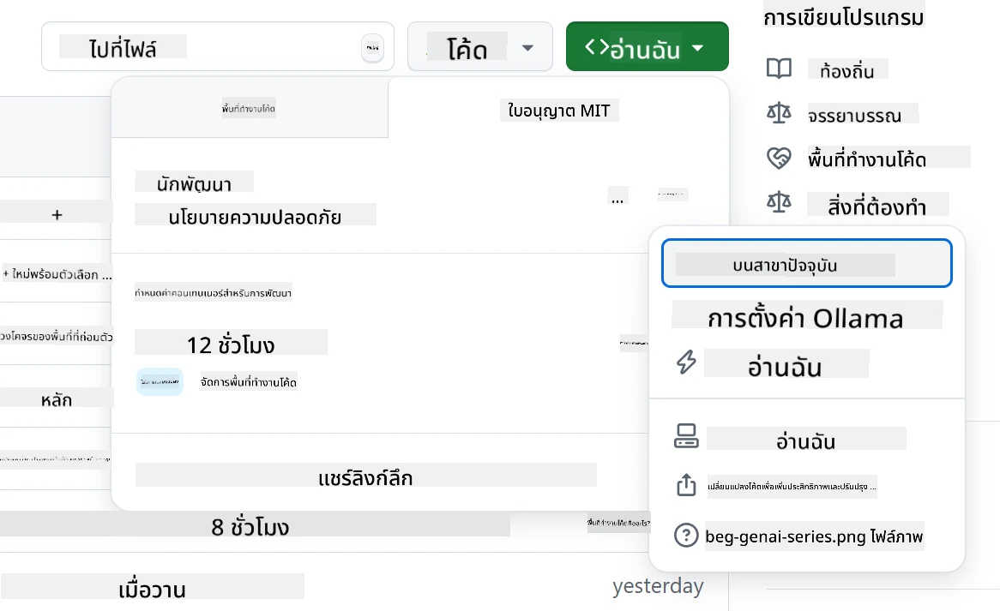
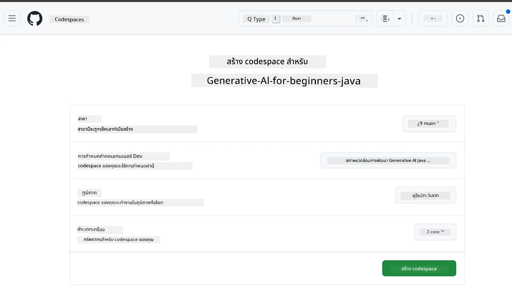
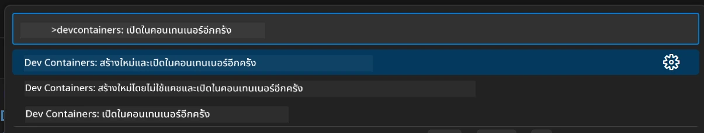
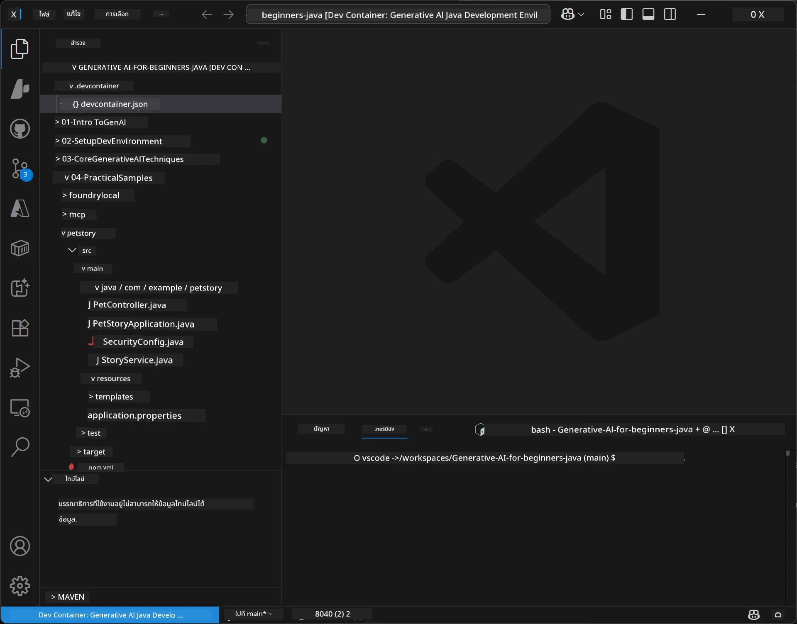
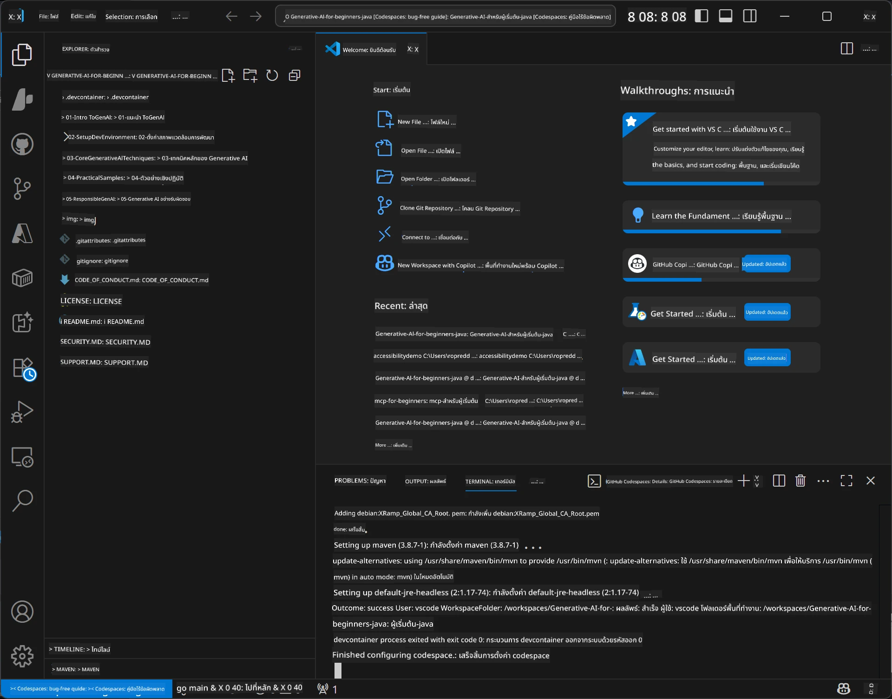

# การตั้งค่าสภาพแวดล้อมการพัฒนาสำหรับ Generative AI สำหรับ Java

> **เริ่มต้นอย่างรวดเร็ว**: โค้ดในคลาวด์ใน 2 นาที - ข้ามไปที่ [การตั้งค่า GitHub Codespaces](../../../02-SetupDevEnvironment) - ไม่ต้องติดตั้งในเครื่องและใช้โมเดลของ github!

> **สนใจ Azure OpenAI?**, ดู [คู่มือการตั้งค่า Azure OpenAI](getting-started-azure-openai.md) ของเราพร้อมขั้นตอนการสร้างทรัพยากร Azure OpenAI ใหม่

## สิ่งที่คุณจะได้เรียนรู้

- ตั้งค่าสภาพแวดล้อมการพัฒนา Java สำหรับแอปพลิเคชัน AI
- เลือกและกำหนดค่าสภาพแวดล้อมการพัฒนาที่คุณต้องการ (เน้นคลาวด์ด้วย Codespaces, dev container ในเครื่อง, หรือการตั้งค่าเต็มรูปแบบในเครื่อง)
- ทดสอบการตั้งค่าของคุณโดยการเชื่อมต่อกับ GitHub Models

## สารบัญ

- [สิ่งที่คุณจะได้เรียนรู้](../../../02-SetupDevEnvironment)
- [บทนำ](../../../02-SetupDevEnvironment)
- [ขั้นตอนที่ 1: ตั้งค่าสภาพแวดล้อมการพัฒนา](../../../02-SetupDevEnvironment)
  - [ตัวเลือก A: GitHub Codespaces (แนะนำ)](../../../02-SetupDevEnvironment)
  - [ตัวเลือก B: Local Dev Container](../../../02-SetupDevEnvironment)
  - [ตัวเลือก C: ใช้การติดตั้งในเครื่องที่มีอยู่แล้ว](../../../02-SetupDevEnvironment)
- [ขั้นตอนที่ 2: สร้าง GitHub Personal Access Token](../../../02-SetupDevEnvironment)
- [ขั้นตอนที่ 3: ทดสอบการตั้งค่าของคุณ](../../../02-SetupDevEnvironment)
- [การแก้ไขปัญหา](../../../02-SetupDevEnvironment)
- [สรุป](../../../02-SetupDevEnvironment)
- [ขั้นตอนถัดไป](../../../02-SetupDevEnvironment)

## บทนำ

บทนี้จะแนะนำคุณผ่านการตั้งค่าสภาพแวดล้อมการพัฒนา เราจะใช้ **GitHub Models** เป็นตัวอย่างหลักของเราเพราะมันฟรี, ง่ายต่อการตั้งค่าด้วยแค่บัญชี GitHub, ไม่ต้องใช้บัตรเครดิต, และให้การเข้าถึงโมเดลหลายตัวสำหรับการทดลอง

**ไม่ต้องติดตั้งในเครื่อง!** คุณสามารถเริ่มเขียนโค้ดได้ทันทีโดยใช้ GitHub Codespaces ซึ่งให้สภาพแวดล้อมการพัฒนาเต็มรูปแบบในเว็บเบราว์เซอร์ของคุณ


เราแนะนำให้ใช้ [**GitHub Models**](https://github.com/marketplace?type=models) สำหรับคอร์สนี้เพราะว่า:
- **ฟรี** เริ่มต้นได้ทันที
- **ง่าย** ที่จะตั้งค่าด้วยเพียงบัญชี GitHub
- **ไม่ต้องใช้บัตรเครดิต**
- มี **โมเดลหลายตัว** สำหรับการทดลอง

> **หมายเหตุ**: GitHub Models ที่ใช้ในการอบรมนี้มีข้อจำกัดฟรีดังนี้:
> - 15 คำขอต่อหนึ่งนาที (150 ต่อวัน)
> - ประมาณ 8,000 คำเข้า, 4,000 คำออกต่อคำขอ
> - 5 คำขอทำงานพร้อมกัน
> 
> สำหรับการใช้งานจริง, อัปเกรดเป็น Azure AI Foundry Models ด้วยบัญชี Azure ของคุณ โค้ดของคุณไม่จำเป็นต้องเปลี่ยน ดูข้อมูลจาก [เอกสาร Azure AI Foundry](https://learn.microsoft.com/azure/ai-foundry/foundry-models/how-to/quickstart-github-models).

## ขั้นตอนที่ 1: ตั้งค่าสภาพแวดล้อมการพัฒนา

<a name="quick-start-cloud"></a>

เราได้สร้าง dev container ที่กำหนดค่าไว้ล่วงหน้าเพื่อลดเวลาการตั้งค่าและให้แน่ใจว่าคุณมีเครื่องมือที่จำเป็นทั้งหมดสำหรับคอร์ส Generative AI สำหรับ Java นี้ เลือกวิธีการพัฒนาที่คุณต้องการ:

### ตัวเลือกการตั้งค่าสภาพแวดล้อม:

#### ตัวเลือก A: GitHub Codespaces (แนะนำ)

**เริ่มเขียนโค้ดใน 2 นาที - ไม่ต้องติดตั้งในเครื่อง!**

1. Fork รีโพซิทอรีนี้ไปยังบัญชี GitHub ของคุณ
   > **หมายเหตุ**: หากคุณต้องการแก้ไขการตั้งค่าพื้นฐาน กรุณาดูที่ [Dev Container Configuration](../../../.devcontainer/devcontainer.json)
2. คลิก **Code** → แท็บ **Codespaces** → **...** → **New with options...**
3. ใช้ค่าดีฟอลต์ – ซึ่งจะเลือก **การกำหนดค่า Dev container**: **Generative AI Java Development Environment** devcontainer ที่สร้างขึ้นสำหรับคอร์สนี้โดยเฉพาะ
4. คลิก **Create codespace**
5. รอประมาณ 2 นาทีให้สภาพแวดล้อมพร้อมใช้งาน
6. ดำเนินการต่อไปที่ [ขั้นตอนที่ 2: สร้าง GitHub Token](../../../02-SetupDevEnvironment)







> **ข้อดีของ Codespaces**:
> - ไม่ต้องติดตั้งในเครื่อง
> - ใช้งานได้กับอุปกรณ์ใดก็ได้ที่มีเว็บเบราว์เซอร์
> - ตั้งค่าล่วงหน้าพร้อมเครื่องมือและการพึ่งพาทั้งหมด
> - ฟรี 60 ชั่วโมงต่อเดือนสำหรับบัญชีส่วนตัว
> - สภาพแวดล้อมที่สม่ำเสมอสำหรับผู้เรียนทุกคน

#### ตัวเลือก B: Local Dev Container

**สำหรับนักพัฒนาที่ต้องการพัฒนาในเครื่องด้วย Docker**

1. Fork และโคลนรีโพซิทอรีนี้ไปยังเครื่องของคุณ
   > **หมายเหตุ**: หากคุณต้องการแก้ไขการตั้งค่าพื้นฐาน กรุณาดูที่ [Dev Container Configuration](../../../.devcontainer/devcontainer.json)
2. ติดตั้ง [Docker Desktop](https://www.docker.com/products/docker-desktop/) และ [VS Code](https://code.visualstudio.com/)
3. ติดตั้งส่วนขยาย [Dev Containers extension](https://marketplace.visualstudio.com/items?itemName=ms-vscode-remote.remote-containers) ใน VS Code
4. เปิดโฟลเดอร์รีโพซิทอรีใน VS Code
5. เมื่อมีคำถาม ให้คลิก **Reopen in Container** (หรือใช้ `Ctrl+Shift+P` → "Dev Containers: Reopen in Container")
6. รอให้ container สร้างและเริ่มทำงาน
7. ดำเนินการต่อไปที่ [ขั้นตอนที่ 2: สร้าง GitHub Token](../../../02-SetupDevEnvironment)





#### ตัวเลือก C: ใช้การติดตั้งในเครื่องที่มีอยู่แล้ว

**สำหรับนักพัฒนาที่มีสภาพแวดล้อม Java อยู่แล้ว**

สิ่งที่ต้องมี:
- [Java 21+](https://www.oracle.com/java/technologies/javase/jdk21-archive-downloads.html) 
- [Maven 3.9+](https://maven.apache.org/download.cgi)
- [VS Code](https://code.visualstudio.com) หรือ IDE ที่คุณชอบ

ขั้นตอน:
1. โคลนรีโพซิทอรีนี้ไปยังเครื่องของคุณ
2. เปิดโปรเจคใน IDE ของคุณ
3. ดำเนินการต่อไปที่ [ขั้นตอนที่ 2: สร้าง GitHub Token](../../../02-SetupDevEnvironment)

> **เคล็ดลับมือโปร**: หากเครื่องคุณสเปคต่ำแต่ต้องการใช้ VS Code ในเครื่อง ให้ใช้ GitHub Codespaces! คุณสามารถเชื่อมต่อ VS Code ในเครื่องกับ Codespace ที่โฮสต์ในคลาวด์เพื่อรวมข้อดีทั้งสองด้าน




## ขั้นตอนที่ 2: สร้าง GitHub Personal Access Token

1. ไปที่ [GitHub Settings](https://github.com/settings/profile) และเลือก **Settings** จากเมนูโปรไฟล์ของคุณ
2. ในแถบด้านซ้าย คลิก **Developer settings** (มักอยู่ด้านล่าง)
3. ภายใต้ **Personal access tokens** คลิก **Fine-grained tokens** (หรือใช้ลิงก์ตรงนี้ [link](https://github.com/settings/personal-access-tokens))
4. คลิก **Generate new token**
5. ใต้ "Token name" ใส่ชื่อที่อธิบายได้ (เช่น `GenAI-Java-Course-Token`)
6. ตั้งวันหมดอายุ (แนะนำ: 7 วันเพื่อความปลอดภัย)
7. ใต้ "Resource owner" เลือกบัญชีผู้ใช้ของคุณ
8. ใต้ "Repository access" เลือกรีโพซิทอรีที่คุณต้องการใช้กับ GitHub Models (หรือเลือก "All repositories" หากจำเป็น)
9. ใต้ "Account permissions" หาหัวข้อ **Models** และตั้งเป็น **Read-only**
10. คลิก **Generate token**
11. **คัดลอกและบันทึกโทเค็นของคุณตอนนี้** – คุณจะไม่เห็นมันอีก!

> **คำแนะนำด้านความปลอดภัย**: ใช้ขอบเขตน้อยที่สุดที่จำเป็นและตั้งเวลาหมดอายุสั้นที่สุดที่เหมาะสมสำหรับโทเค็นของคุณ

## ขั้นตอนที่ 3: ทดสอบการตั้งค่าของคุณด้วยตัวอย่าง GitHub Models

เมื่อสภาพแวดล้อมการพัฒนาของคุณพร้อมแล้ว มาลองทดสอบการเชื่อมต่อ GitHub Models ด้วยแอปพลิเคชันตัวอย่างใน [`02-SetupDevEnvironment/examples/github-models`](../../../02-SetupDevEnvironment/examples/github-models).

1. เปิดเทอร์มินัลในสภาพแวดล้อมพัฒนาของคุณ
2. ไปยังตัวอย่าง GitHub Models:
   ```bash
   cd 02-SetupDevEnvironment/examples/github-models
   ```
3. ตั้งค่า GitHub token ของคุณเป็นตัวแปรสภาพแวดล้อม:
   ```bash
   # macOS/Linux
   export GITHUB_TOKEN=your_token_here
   
   # Windows (พรอมต์คำสั่ง)
   set GITHUB_TOKEN=your_token_here
   
   # Windows (PowerShell)
   $env:GITHUB_TOKEN="your_token_here"
   ```

4. รันแอปพลิเคชัน:
   ```bash
   mvn compile exec:java -Dexec.mainClass="com.example.githubmodels.App"
   ```

คุณควรเห็นผลลัพธ์คล้ายกับ:
```text
Using model: gpt-4.1-nano
Sending request to GitHub Models...
Response: Hello World!
```

### ทำความเข้าใจโค้ดตัวอย่าง

ก่อนอื่น ให้เข้าใจสิ่งที่เราเพิ่งรัน ตัวอย่างในโฟลเดอร์ `examples/github-models` ใช้ OpenAI Java SDK เพื่อเชื่อมต่อกับ GitHub Models:

**สิ่งที่โค้ดนี้ทำ:**
- **เชื่อมต่อ** กับ GitHub Models โดยใช้ personal access token ของคุณ
- **ส่ง** ข้อความง่ายๆ "Say Hello World!" ไปยังโมเดล AI
- **รับ** และแสดงการตอบกลับจาก AI
- **ตรวจสอบ** ว่าการตั้งค่าของคุณทำงานถูกต้อง

**ไลบรารีหลัก** (ใน `pom.xml`):
```xml
<dependency>
    <groupId>com.openai</groupId>
    <artifactId>openai-java</artifactId>
    <version>2.12.0</version>
</dependency>
```

**โค้ดหลัก** (`App.java`):
```java
// เชื่อมต่อกับโมเดล GitHub โดยใช้ OpenAI Java SDK
OpenAIClient client = OpenAIOkHttpClient.builder()
    .apiKey(pat)
    .baseUrl("https://models.inference.ai.azure.com")
    .build();

// สร้างคำขอการสนทนาเสร็จสิ้น
ChatCompletionCreateParams params = ChatCompletionCreateParams.builder()
    .model(modelId)
    .addSystemMessage("You are a concise assistant.")
    .addUserMessage("Say Hello World!")
    .build();

// รับการตอบกลับจาก AI
ChatCompletion response = client.chat().completions().create(params);
System.out.println("Response: " + response.choices().get(0).message().content().orElse("No response content"));
```

## สรุป

เยี่ยม! ตอนนี้คุณได้ตั้งค่าทุกอย่างเรียบร้อยแล้ว:

- สร้าง GitHub Personal Access Token ที่มีสิทธิ์เหมาะสมสำหรับการเข้าถึงโมเดล AI
- เปิดใช้งานสภาพแวดล้อมการพัฒนา Java (ไม่ว่าจะเป็น Codespaces, dev container หรือแบบติดตั้งในเครื่อง)
- เชื่อมต่อกับ GitHub Models โดยใช้ OpenAI Java SDK สำหรับการพัฒนา AI ฟรี
- ทดสอบทุกอย่างทำงานได้ด้วยตัวอย่างง่ายๆ ที่สื่อสารกับโมเดล AI

## ขั้นตอนถัดไป

[บทที่ 3: เทคนิคหลักของ Generative AI](../03-CoreGenerativeAITechniques/README.md)

## การแก้ไขปัญหา

พบปัญหาหรือไม่? นี่คือปัญหาทั่วไปและวิธีแก้:

- **โทเค็นไม่ทำงาน?** 
  - ตรวจสอบว่าคุณคัดลอกโทเค็นทั้งหมด ไม่มีช่องว่างเกิน
  - ตรวจสอบว่าโทเค็นถูกตั้งเป็นตัวแปรสภาพแวดล้อมอย่างถูกต้อง
  - ตรวจสอบว่าโทเค็นของคุณมีสิทธิ์ถูกต้อง (Models: Read-only)

- **หา Maven ไม่เจอ?** 
  - หากใช้ dev containers/Codespaces, Maven ควรติดตั้งมาแล้ว
  - สำหรับการตั้งค่าในเครื่อง, ให้แน่ใจว่าติดตั้ง Java 21+ และ Maven 3.9+ แล้ว
  - ลองใช้คำสั่ง `mvn --version` เพื่อตรวจสอบการติดตั้ง

- **ปัญหาการเชื่อมต่อ?** 
  - ตรวจสอบการเชื่อมต่ออินเทอร์เน็ตของคุณ
  - ยืนยันว่า GitHub เข้าถึงได้จากเครือข่ายของคุณ
  - ให้แน่ใจว่าคุณไม่ได้อยู่หลังไฟร์วอลล์ที่บล็อก endpoint ของ GitHub Models

- **Dev container ไม่เริ่ม?** 
  - ตรวจสอบว่า Docker Desktop ทำงานอยู่ (สำหรับการพัฒนาในเครื่อง)
  - ลองสร้าง container ใหม่: `Ctrl+Shift+P` → "Dev Containers: Rebuild Container"

- **ข้อผิดพลาดในการคอมไพล์แอปฯ?**
  - ตรวจสอบว่าคุณอยู่ในไดเรกทอรีถูกต้อง: `02-SetupDevEnvironment/examples/github-models`
  - ลองทำความสะอาดและคอมไพล์ใหม่: `mvn clean compile`

> **ต้องการความช่วยเหลือ?**: หากยังมีปัญหา แสดงปัญหาในรีโพซิทอรีและเราจะช่วยคุณเอง.

---

<!-- CO-OP TRANSLATOR DISCLAIMER START -->
**ข้อจำกัดความรับผิดชอบ**:  
เอกสารฉบับนี้ถูกแปลโดยใช้บริการแปลภาษาอัตโนมัติ [Co-op Translator](https://github.com/Azure/co-op-translator) แม้เราจะพยายามให้ความถูกต้องสูงสุด โปรดทราบว่าการแปลอัตโนมัติอาจมีข้อผิดพลาดหรือความไม่ถูกต้อง เอกสารต้นฉบับในภาษาต้นทางควรถูกพิจารณาเป็นแหล่งข้อมูลที่เชื่อถือได้ สำหรับข้อมูลที่สำคัญ ขอแนะนำให้ใช้บริการแปลโดยมืออาชีพที่เป็นมนุษย์ เราจะไม่รับผิดชอบต่อความเข้าใจผิดหรือการตีความที่ผิดพลาดใดๆ ที่เกิดจากการใช้การแปลนี้
<!-- CO-OP TRANSLATOR DISCLAIMER END -->