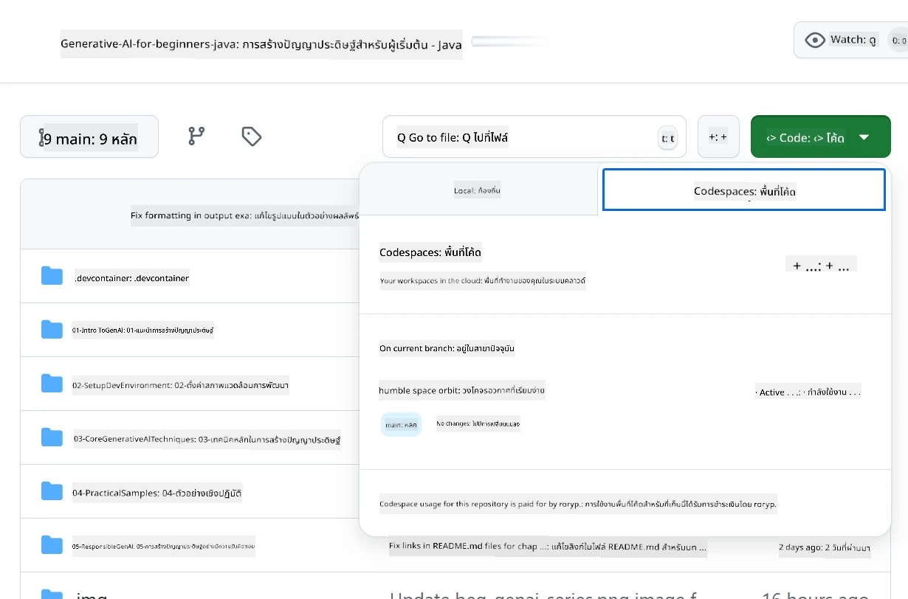

<!--
CO_OP_TRANSLATOR_METADATA:
{
  "original_hash": "bfdb4b4eadbee3a59ef742439f58326a",
  "translation_date": "2025-07-27T13:11:32+00:00",
  "source_file": "02-SetupDevEnvironment/getting-started-azure-openai.md",
  "language_code": "th"
}
-->
# การตั้งค่าสภาพแวดล้อมการพัฒนาสำหรับ Azure OpenAI

> **เริ่มต้นอย่างรวดเร็ว**: คู่มือนี้สำหรับการตั้งค่า Azure OpenAI หากต้องการเริ่มต้นใช้งานโมเดลฟรีทันที ให้ใช้ [GitHub Models with Codespaces](./README.md#quick-start-cloud)

คู่มือนี้จะช่วยคุณตั้งค่าโมเดล Azure AI Foundry สำหรับแอป Java AI ในคอร์สนี้

## สารบัญ

- [ภาพรวมการตั้งค่าอย่างรวดเร็ว](../../../02-SetupDevEnvironment)
- [ขั้นตอนที่ 1: สร้างทรัพยากร Azure AI Foundry](../../../02-SetupDevEnvironment)
  - [สร้าง Hub และ Project](../../../02-SetupDevEnvironment)
  - [ปรับใช้โมเดล GPT-4o-mini](../../../02-SetupDevEnvironment)
- [ขั้นตอนที่ 2: สร้าง Codespace ของคุณ](../../../02-SetupDevEnvironment)
- [ขั้นตอนที่ 3: กำหนดค่าสภาพแวดล้อมของคุณ](../../../02-SetupDevEnvironment)
- [ขั้นตอนที่ 4: ทดสอบการตั้งค่าของคุณ](../../../02-SetupDevEnvironment)
- [ขั้นตอนต่อไป](../../../02-SetupDevEnvironment)
- [แหล่งข้อมูล](../../../02-SetupDevEnvironment)
- [แหล่งข้อมูลเพิ่มเติม](../../../02-SetupDevEnvironment)

## ภาพรวมการตั้งค่าอย่างรวดเร็ว

1. สร้างทรัพยากร Azure AI Foundry (Hub, Project, Model)
2. สร้าง Codespace พร้อมคอนเทนเนอร์พัฒนา Java
3. กำหนดค่าไฟล์ .env ด้วยข้อมูลรับรอง Azure OpenAI
4. ทดสอบการตั้งค่าของคุณด้วยโปรเจกต์ตัวอย่าง

## ขั้นตอนที่ 1: สร้างทรัพยากร Azure AI Foundry

### สร้าง Hub และ Project

1. ไปที่ [Azure AI Foundry Portal](https://ai.azure.com/) และลงชื่อเข้าใช้
2. คลิก **+ Create** → **New hub** (หรือไปที่ **Management** → **All hubs** → **+ New hub**)
3. กำหนดค่า Hub ของคุณ:
   - **Hub name**: เช่น "MyAIHub"
   - **Subscription**: เลือกการสมัครใช้งาน Azure ของคุณ
   - **Resource group**: สร้างใหม่หรือเลือกที่มีอยู่
   - **Location**: เลือกที่ใกล้คุณที่สุด
   - **Storage account**: ใช้ค่าเริ่มต้นหรือกำหนดเอง
   - **Key vault**: ใช้ค่าเริ่มต้นหรือกำหนดเอง
   - คลิก **Next** → **Review + create** → **Create**
4. เมื่อสร้างเสร็จแล้ว คลิก **+ New project** (หรือ **Create project** จากหน้า Hub overview)
   - **Project name**: เช่น "GenAIJava"
   - คลิก **Create**

### ปรับใช้โมเดล GPT-4o-mini

1. ในโปรเจกต์ของคุณ ไปที่ **Model catalog** และค้นหา **gpt-4o-mini**
   - *ทางเลือก: ไปที่ **Deployments** → **+ Create deployment***
2. คลิก **Deploy** บนการ์ดโมเดล gpt-4o-mini
3. กำหนดค่าการปรับใช้:
   - **Deployment name**: "gpt-4o-mini"
   - **Model version**: ใช้เวอร์ชันล่าสุด
   - **Deployment type**: Standard
4. คลิก **Deploy**
5. เมื่อปรับใช้เสร็จแล้ว ไปที่แท็บ **Deployments** และคัดลอกค่าต่อไปนี้:
   - **Deployment name** (เช่น "gpt-4o-mini")
   - **Target URI** (เช่น `https://your-hub-name.openai.azure.com/`)  
      > **สำคัญ**: คัดลอกเฉพาะ URL พื้นฐาน (เช่น `https://myhub.openai.azure.com/`) ไม่ใช่เส้นทาง endpoint ทั้งหมด
   - **Key** (จากส่วน Keys and Endpoint)

> **ยังมีปัญหาอยู่หรือไม่?** เยี่ยมชม [เอกสาร Azure AI Foundry อย่างเป็นทางการ](https://learn.microsoft.com/azure/ai-foundry/how-to/create-projects?tabs=ai-foundry&pivots=hub-project)

## ขั้นตอนที่ 2: สร้าง Codespace ของคุณ

1. Fork repository นี้ไปยังบัญชี GitHub ของคุณ  
   > **หมายเหตุ**: หากคุณต้องการแก้ไขการตั้งค่าพื้นฐาน โปรดดูที่ [Dev Container Configuration](../../../.devcontainer/devcontainer.json)
2. ใน repo ที่คุณ fork มา คลิก **Code** → แท็บ **Codespaces**
3. คลิก **...** → **New with options...**  

4. เลือก **Dev container configuration**: 
   - **Generative AI Java Development Environment**
5. คลิก **Create codespace**

## ขั้นตอนที่ 3: กำหนดค่าสภาพแวดล้อมของคุณ

เมื่อ Codespace ของคุณพร้อมแล้ว ให้ตั้งค่าข้อมูลรับรอง Azure OpenAI:

1. **ไปที่โปรเจกต์ตัวอย่างจาก root ของ repository:**
   ```bash
   cd 02-SetupDevEnvironment/examples/basic-chat-azure
   ```

2. **สร้างไฟล์ .env:**
   ```bash
   cp .env.example .env
   ```

3. **แก้ไขไฟล์ .env ด้วยข้อมูลรับรอง Azure OpenAI ของคุณ:**
   ```bash
   # Your Azure OpenAI API key (from Azure AI Foundry portal)
   AZURE_AI_KEY=your-actual-api-key-here
   
   # Your Azure OpenAI endpoint URL (e.g., https://myhub.openai.azure.com/)
   AZURE_AI_ENDPOINT=https://your-hub-name.openai.azure.com/
   ```

   > **หมายเหตุด้านความปลอดภัย**: 
   > - ห้าม commit ไฟล์ `.env` ของคุณไปยัง version control
   > - ไฟล์ `.env` ได้รับการเพิ่มไว้ใน `.gitignore` แล้ว
   > - เก็บ API keys ของคุณให้ปลอดภัยและหมุนเวียนเป็นประจำ

## ขั้นตอนที่ 4: ทดสอบการตั้งค่าของคุณ

รันแอปพลิเคชันตัวอย่างเพื่อตรวจสอบการเชื่อมต่อ Azure OpenAI ของคุณ:

```bash
mvn clean spring-boot:run
```

คุณควรเห็นการตอบกลับจากโมเดล GPT-4o-mini!

> **ผู้ใช้ VS Code**: คุณสามารถกด `F5` ใน VS Code เพื่อรันแอปพลิเคชันได้ การตั้งค่า launch configuration ได้ถูกกำหนดไว้แล้วให้โหลดไฟล์ `.env` ของคุณโดยอัตโนมัติ

> **ตัวอย่างเต็มรูปแบบ**: ดู [ตัวอย่าง Azure OpenAI แบบ End-to-End](./examples/basic-chat-azure/README.md) สำหรับคำแนะนำและการแก้ไขปัญหาโดยละเอียด

## ขั้นตอนต่อไป

**การตั้งค่าเสร็จสมบูรณ์!** ตอนนี้คุณมี:
- Azure OpenAI พร้อม gpt-4o-mini ที่ปรับใช้แล้ว
- การกำหนดค่าไฟล์ .env ในเครื่อง
- สภาพแวดล้อมการพัฒนา Java พร้อมใช้งาน

**ดำเนินการต่อไปที่** [บทที่ 3: เทคนิคหลักของ Generative AI](../03-CoreGenerativeAITechniques/README.md) เพื่อเริ่มสร้างแอปพลิเคชัน AI!

## แหล่งข้อมูล

- [เอกสาร Azure AI Foundry](https://learn.microsoft.com/azure/ai-services/)
- [เอกสาร Spring AI Azure OpenAI](https://docs.spring.io/spring-ai/reference/api/clients/azure-openai-chat.html)
- [Azure OpenAI Java SDK](https://learn.microsoft.com/java/api/overview/azure/ai-openai-readme)

## แหล่งข้อมูลเพิ่มเติม

- [ดาวน์โหลด VS Code](https://code.visualstudio.com/Download)
- [รับ Docker Desktop](https://www.docker.com/products/docker-desktop)
- [Dev Container Configuration](../../../.devcontainer/devcontainer.json)

**ข้อจำกัดความรับผิดชอบ**:  
เอกสารนี้ได้รับการแปลโดยใช้บริการแปลภาษา AI [Co-op Translator](https://github.com/Azure/co-op-translator) แม้ว่าเราจะพยายามให้การแปลมีความถูกต้องมากที่สุด แต่โปรดทราบว่าการแปลอัตโนมัติอาจมีข้อผิดพลาดหรือความไม่ถูกต้อง เอกสารต้นฉบับในภาษาดั้งเดิมควรถือเป็นแหล่งข้อมูลที่เชื่อถือได้ สำหรับข้อมูลที่สำคัญ ขอแนะนำให้ใช้บริการแปลภาษามืออาชีพ เราไม่รับผิดชอบต่อความเข้าใจผิดหรือการตีความที่ผิดพลาดซึ่งเกิดจากการใช้การแปลนี้