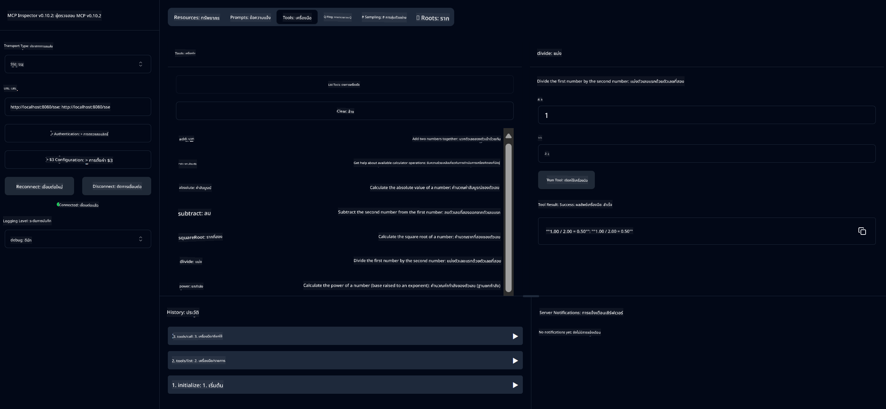

<!--
CO_OP_TRANSLATOR_METADATA:
{
  "original_hash": "5bd7a347d6ed1d706443f9129dd29dd9",
  "translation_date": "2025-07-25T09:34:06+00:00",
  "source_file": "04-PracticalSamples/mcp/calculator/README.md",
  "language_code": "th"
}
-->
# บริการเครื่องคิดเลข MCP

>**Note**: บทนี้มี [**Tutorial**](./TUTORIAL.md) ที่จะแนะนำคุณผ่านตัวอย่างต่างๆ

ยินดีต้อนรับสู่ประสบการณ์การใช้งานจริงครั้งแรกของคุณกับ **Model Context Protocol (MCP)**! ในบทก่อนหน้านี้ คุณได้เรียนรู้เกี่ยวกับพื้นฐานของ AI เชิงสร้างสรรค์และตั้งค่าพื้นฐานสำหรับการพัฒนา ตอนนี้ถึงเวลาสร้างสิ่งที่ใช้งานได้จริงแล้ว

บริการเครื่องคิดเลขนี้แสดงให้เห็นว่าโมเดล AI สามารถโต้ตอบกับเครื่องมือภายนอกได้อย่างปลอดภัยผ่าน MCP อย่างไร แทนที่จะพึ่งพาความสามารถทางคณิตศาสตร์ของโมเดล AI ซึ่งบางครั้งอาจไม่แม่นยำ เราจะแสดงวิธีสร้างระบบที่แข็งแกร่งซึ่ง AI สามารถเรียกใช้บริการเฉพาะทางเพื่อการคำนวณที่แม่นยำ

## สารบัญ

- [สิ่งที่คุณจะได้เรียนรู้](../../../../../04-PracticalSamples/mcp/calculator)
- [ข้อกำหนดเบื้องต้น](../../../../../04-PracticalSamples/mcp/calculator)
- [แนวคิดสำคัญ](../../../../../04-PracticalSamples/mcp/calculator)
- [เริ่มต้นอย่างรวดเร็ว](../../../../../04-PracticalSamples/mcp/calculator)
- [การดำเนินการของเครื่องคิดเลขที่มีให้ใช้งาน](../../../../../04-PracticalSamples/mcp/calculator)
- [ไคลเอนต์ทดสอบ](../../../../../04-PracticalSamples/mcp/calculator)
  - [1. ไคลเอนต์ MCP โดยตรง (SDKClient)](../../../../../04-PracticalSamples/mcp/calculator)
  - [2. ไคลเอนต์ที่ขับเคลื่อนด้วย AI (LangChain4jClient)](../../../../../04-PracticalSamples/mcp/calculator)
- [MCP Inspector (Web UI)](../../../../../04-PracticalSamples/mcp/calculator)
  - [คำแนะนำทีละขั้นตอน](../../../../../04-PracticalSamples/mcp/calculator)

## สิ่งที่คุณจะได้เรียนรู้

เมื่อทำตัวอย่างนี้ คุณจะเข้าใจ:
- วิธีสร้างบริการที่รองรับ MCP โดยใช้ Spring Boot
- ความแตกต่างระหว่างการสื่อสารผ่านโปรโตคอลโดยตรงและการโต้ตอบที่ขับเคลื่อนด้วย AI
- วิธีที่โมเดล AI ตัดสินใจว่าจะใช้เครื่องมือภายนอกเมื่อใดและอย่างไร
- แนวทางปฏิบัติที่ดีที่สุดสำหรับการสร้างแอปพลิเคชัน AI ที่รองรับเครื่องมือ

เหมาะสำหรับผู้เริ่มต้นที่เรียนรู้แนวคิด MCP และพร้อมที่จะสร้างการผสานรวมเครื่องมือ AI ครั้งแรก!

## ข้อกำหนดเบื้องต้น

- Java 21+
- Maven 3.6+
- **GitHub Token**: จำเป็นสำหรับไคลเอนต์ที่ขับเคลื่อนด้วย AI หากคุณยังไม่ได้ตั้งค่า โปรดดู [บทที่ 2: การตั้งค่าสภาพแวดล้อมการพัฒนา](../../../02-SetupDevEnvironment/README.md) สำหรับคำแนะนำ

## แนวคิดสำคัญ

**Model Context Protocol (MCP)** เป็นวิธีมาตรฐานสำหรับแอปพลิเคชัน AI ในการเชื่อมต่อกับเครื่องมือภายนอกอย่างปลอดภัย คิดว่าเป็น "สะพาน" ที่ช่วยให้โมเดล AI ใช้บริการภายนอก เช่น เครื่องคิดเลขของเรา แทนที่โมเดล AI จะพยายามคำนวณด้วยตัวเอง (ซึ่งอาจไม่แม่นยำ) มันสามารถเรียกใช้บริการเครื่องคิดเลขของเราเพื่อให้ได้ผลลัพธ์ที่ถูกต้อง MCP ช่วยให้การสื่อสารนี้เกิดขึ้นอย่างปลอดภัยและสม่ำเสมอ

**Server-Sent Events (SSE)** ช่วยให้การสื่อสารแบบเรียลไทม์ระหว่างเซิร์ฟเวอร์และไคลเอนต์ แตกต่างจากคำขอ HTTP แบบดั้งเดิมที่คุณต้องรอการตอบกลับ SSE ช่วยให้เซิร์ฟเวอร์ส่งการอัปเดตไปยังไคลเอนต์อย่างต่อเนื่อง เหมาะสำหรับแอปพลิเคชัน AI ที่การตอบกลับอาจถูกสตรีมหรือใช้เวลาประมวลผล

**AI Tools & Function Calling** ช่วยให้โมเดล AI เลือกและใช้ฟังก์ชันภายนอกโดยอัตโนมัติ (เช่น การดำเนินการของเครื่องคิดเลข) ตามคำขอของผู้ใช้ เมื่อคุณถามว่า "15 + 27 เท่ากับเท่าไหร่?" โมเดล AI เข้าใจว่าคุณต้องการการบวก และเรียกใช้เครื่องมือ `add` ของเราพร้อมพารามิเตอร์ที่ถูกต้อง (15, 27) และส่งคืนผลลัพธ์ในรูปแบบภาษาธรรมชาติ AI ทำหน้าที่เป็นผู้ประสานงานอัจฉริยะที่รู้ว่าจะใช้เครื่องมือแต่ละตัวเมื่อใดและอย่างไร

## เริ่มต้นอย่างรวดเร็ว

### 1. ไปที่ไดเรกทอรีแอปพลิเคชันเครื่องคิดเลข
```bash
cd Generative-AI-for-beginners-java/04-PracticalSamples/mcp/calculator
```

### 2. สร้างและรัน
```bash
mvn clean install -DskipTests
java -jar target/calculator-server-0.0.1-SNAPSHOT.jar
```

### 3. ทดสอบด้วยไคลเอนต์
- **SDKClient**: การโต้ตอบโปรโตคอล MCP โดยตรง
- **LangChain4jClient**: การโต้ตอบด้วยภาษาธรรมชาติที่ขับเคลื่อนด้วย AI (ต้องใช้ GitHub token)

## การดำเนินการของเครื่องคิดเลขที่มีให้ใช้งาน

- `add(a, b)`, `subtract(a, b)`, `multiply(a, b)`, `divide(a, b)`
- `power(base, exponent)`, `squareRoot(number)`, `absolute(number)`
- `modulus(a, b)`, `help()`

## ไคลเอนต์ทดสอบ

### 1. ไคลเอนต์ MCP โดยตรง (SDKClient)
ทดสอบการสื่อสารโปรโตคอล MCP แบบดิบ รันด้วย:
```bash
mvn test-compile exec:java -Dexec.mainClass="com.microsoft.mcp.sample.client.SDKClient" -Dexec.classpathScope=test
```

### 2. ไคลเอนต์ที่ขับเคลื่อนด้วย AI (LangChain4jClient)
แสดงการโต้ตอบด้วยภาษาธรรมชาติกับ GitHub Models ต้องใช้ GitHub token (ดู [ข้อกำหนดเบื้องต้น](../../../../../04-PracticalSamples/mcp/calculator))

**รัน:**
```bash
mvn test-compile exec:java -Dexec.mainClass="com.microsoft.mcp.sample.client.LangChain4jClient" -Dexec.classpathScope=test
```

## MCP Inspector (Web UI)

MCP Inspector ให้บริการอินเทอร์เฟซเว็บแบบภาพเพื่อทดสอบบริการ MCP ของคุณโดยไม่ต้องเขียนโค้ด เหมาะสำหรับผู้เริ่มต้นที่ต้องการเข้าใจวิธีการทำงานของ MCP!

### คำแนะนำทีละขั้นตอน:

1. **เริ่มเซิร์ฟเวอร์เครื่องคิดเลข** (หากยังไม่ได้รัน):
   ```bash
   java -jar target/calculator-server-0.0.1-SNAPSHOT.jar
   ```

2. **ติดตั้งและรัน MCP Inspector** ในเทอร์มินัลใหม่:
   ```bash
   npx @modelcontextprotocol/inspector
   ```

3. **เปิดอินเทอร์เฟซเว็บ**:
   - มองหาข้อความเช่น "Inspector running at http://localhost:6274"
   - เปิด URL นั้นในเว็บเบราว์เซอร์ของคุณ

4. **เชื่อมต่อกับบริการเครื่องคิดเลขของคุณ**:
   - ในอินเทอร์เฟซเว็บ ตั้งค่าประเภทการส่งข้อมูลเป็น "SSE"
   - ตั้งค่า URL เป็น: `http://localhost:8080/sse`
   - คลิกปุ่ม "Connect"

5. **สำรวจเครื่องมือที่มีให้ใช้งาน**:
   - คลิก "List Tools" เพื่อดูการดำเนินการของเครื่องคิดเลขทั้งหมด
   - คุณจะเห็นฟังก์ชัน เช่น `add`, `subtract`, `multiply` เป็นต้น

6. **ทดสอบการดำเนินการของเครื่องคิดเลข**:
   - เลือกเครื่องมือ (เช่น "add")
   - ป้อนพารามิเตอร์ (เช่น `a: 15`, `b: 27`)
   - คลิก "Run Tool"
   - ดูผลลัพธ์ที่ส่งคืนโดยบริการ MCP ของคุณ!

วิธีการแบบภาพนี้ช่วยให้คุณเข้าใจว่าการสื่อสาร MCP ทำงานอย่างไร ก่อนที่จะสร้างไคลเอนต์ของคุณเอง



---
**อ้างอิง:** [MCP Server Boot Starter Docs](https://docs.spring.io/spring-ai/reference/api/mcp/mcp-server-boot-starter-docs.html)

**ข้อจำกัดความรับผิดชอบ**:  
เอกสารนี้ได้รับการแปลโดยใช้บริการแปลภาษา AI [Co-op Translator](https://github.com/Azure/co-op-translator) แม้ว่าเราจะพยายามให้การแปลมีความถูกต้องมากที่สุด แต่โปรดทราบว่าการแปลโดยอัตโนมัติอาจมีข้อผิดพลาดหรือความไม่ถูกต้อง เอกสารต้นฉบับในภาษาดั้งเดิมควรถือเป็นแหล่งข้อมูลที่เชื่อถือได้ สำหรับข้อมูลที่สำคัญ ขอแนะนำให้ใช้บริการแปลภาษามืออาชีพ เราไม่รับผิดชอบต่อความเข้าใจผิดหรือการตีความที่ผิดพลาดซึ่งเกิดจากการใช้การแปลนี้