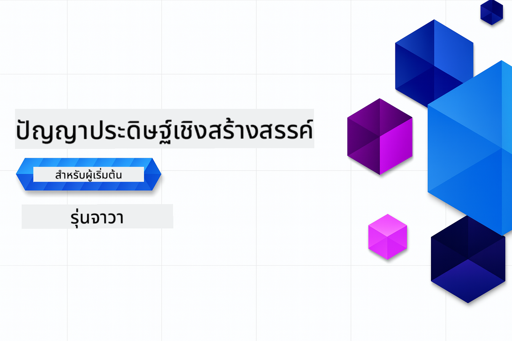

<!--
CO_OP_TRANSLATOR_METADATA:
{
  "original_hash": "ff95bb9d60ecd46e1a2215e341062967",
  "translation_date": "2025-07-26T17:33:58+00:00",
  "source_file": "README.md",
  "language_code": "th"
}
-->
# ปัญญาประดิษฐ์เชิงสร้างสรรค์สำหรับผู้เริ่มต้น - ฉบับภาษา Java  

**ระยะเวลาในการเรียนรู้**: เวิร์กชอปทั้งหมดสามารถทำออนไลน์ได้โดยไม่ต้องตั้งค่าบนเครื่องของคุณ หากต้องการรันตัวอย่าง การตั้งค่าสภาพแวดล้อมใช้เวลาเพียง 2 นาที และการสำรวจตัวอย่างใช้เวลา 1-3 ชั่วโมง ขึ้นอยู่กับความลึกของการสำรวจ

> **เริ่มต้นอย่างรวดเร็ว**

1. Fork repository นี้ไปยังบัญชี GitHub ของคุณ  
2. คลิก **Code** → **Codespaces** tab → **...** → **New with options...**  
3. ใช้ค่าตั้งต้น – ระบบจะเลือก Development container ที่สร้างขึ้นสำหรับคอร์สนี้  
4. คลิก **Create codespace**  
5. รอประมาณ 2 นาทีเพื่อให้สภาพแวดล้อมพร้อมใช้งาน  
6. ไปที่ [การสร้าง GitHub Models Token ของคุณ](./02-SetupDevEnvironment/README.md#step-2-create-a-github-personal-access-token)  

## รองรับหลายภาษา  

### รองรับผ่าน GitHub Action (อัตโนมัติและอัปเดตเสมอ)  

[French](../fr/README.md) | [Spanish](../es/README.md) | [German](../de/README.md) | [Russian](../ru/README.md) | [Arabic](../ar/README.md) | [Persian (Farsi)](../fa/README.md) | [Urdu](../ur/README.md) | [Chinese (Simplified)](../zh/README.md) | [Chinese (Traditional, Macau)](../mo/README.md) | [Chinese (Traditional, Hong Kong)](../hk/README.md) | [Chinese (Traditional, Taiwan)](../tw/README.md) | [Japanese](../ja/README.md) | [Korean](../ko/README.md) | [Hindi](../hi/README.md) | [Bengali](../bn/README.md) | [Marathi](../mr/README.md) | [Nepali](../ne/README.md) | [Punjabi (Gurmukhi)](../pa/README.md) | [Portuguese (Portugal)](../pt/README.md) | [Portuguese (Brazil)](../br/README.md) | [Italian](../it/README.md) | [Polish](../pl/README.md) | [Turkish](../tr/README.md) | [Greek](../el/README.md) | [Thai](./README.md) | [Swedish](../sv/README.md) | [Danish](../da/README.md) | [Norwegian](../no/README.md) | [Finnish](../fi/README.md) | [Dutch](../nl/README.md) | [Hebrew](../he/README.md) | [Vietnamese](../vi/README.md) | [Indonesian](../id/README.md) | [Malay](../ms/README.md) | [Tagalog (Filipino)](../tl/README.md) | [Swahili](../sw/README.md) | [Hungarian](../hu/README.md) | [Czech](../cs/README.md) | [Slovak](../sk/README.md) | [Romanian](../ro/README.md) | [Bulgarian](../bg/README.md) | [Serbian (Cyrillic)](../sr/README.md) | [Croatian](../hr/README.md) | [Slovenian](../sl/README.md) | [Ukrainian](../uk/README.md) | [Burmese (Myanmar)](../my/README.md)  

## โครงสร้างคอร์สและเส้นทางการเรียนรู้  

### **บทที่ 1: แนะนำปัญญาประดิษฐ์เชิงสร้างสรรค์**  
- **แนวคิดหลัก**: ทำความเข้าใจ Large Language Models, tokens, embeddings และความสามารถของ AI  
- **ระบบนิเวศ AI ใน Java**: ภาพรวมของ Spring AI และ OpenAI SDKs  
- **Model Context Protocol**: แนะนำ MCP และบทบาทของมันในการสื่อสารของ AI agent  
- **การประยุกต์ใช้งานจริง**: ตัวอย่างในโลกจริง เช่น แชทบอทและการสร้างเนื้อหา  
- **[→ เริ่มบทที่ 1](./01-IntroToGenAI/README.md)**  

### **บทที่ 2: การตั้งค่าสภาพแวดล้อมการพัฒนา**  
- **การตั้งค่าหลายผู้ให้บริการ**: ตั้งค่า GitHub Models, Azure OpenAI และ OpenAI Java SDK  
- **Spring Boot + Spring AI**: แนวปฏิบัติที่ดีที่สุดสำหรับการพัฒนาแอปพลิเคชัน AI ในองค์กร  
- **GitHub Models**: การเข้าถึงโมเดล AI ฟรีสำหรับการทดลองและการเรียนรู้ (ไม่ต้องใช้บัตรเครดิต)  
- **เครื่องมือพัฒนา**: การตั้งค่า Docker containers, VS Code และ GitHub Codespaces  
- **[→ เริ่มบทที่ 2](./02-SetupDevEnvironment/README.md)**  

### **บทที่ 3: เทคนิคหลักของปัญญาประดิษฐ์เชิงสร้างสรรค์**  
- **Prompt Engineering**: เทคนิคสำหรับการตอบสนองของโมเดล AI ที่เหมาะสม  
- **Embeddings & Vector Operations**: การใช้งาน semantic search และ similarity matching  
- **Retrieval-Augmented Generation (RAG)**: ผสาน AI กับแหล่งข้อมูลของคุณเอง  
- **Function Calling**: ขยายความสามารถของ AI ด้วยเครื่องมือและปลั๊กอินที่กำหนดเอง  
- **[→ เริ่มบทที่ 3](./03-CoreGenerativeAITechniques/README.md)**  

### **บทที่ 4: การประยุกต์ใช้งานจริงและโปรเจกต์**  
- **Pet Story Generator** (`petstory/`): การสร้างเนื้อหาเชิงสร้างสรรค์ด้วย GitHub Models  
- **Foundry Local Demo** (`foundrylocal/`): การผสานโมเดล AI ในเครื่องด้วย OpenAI Java SDK  
- **MCP Calculator Service** (`mcp/calculator/`): การใช้งาน Model Context Protocol เบื้องต้นด้วย Spring AI  
- **[→ เริ่มบทที่ 4](./04-PracticalSamples/README.md)**  

### **บทที่ 5: การพัฒนา AI อย่างมีความรับผิดชอบ**  
- **GitHub Models Safety**: ทดสอบการกรองเนื้อหาและกลไกความปลอดภัยในตัว  
- **Responsible AI Demo**: ตัวอย่างการใช้งานจริงที่แสดงการทำงานของตัวกรองความปลอดภัย AI  
- **แนวปฏิบัติที่ดีที่สุด**: แนวทางสำคัญสำหรับการพัฒนาและปรับใช้ AI อย่างมีจริยธรรม  
- **[→ เริ่มบทที่ 5](./05-ResponsibleGenAI/README.md)**  

## แหล่งข้อมูลเพิ่มเติม  

- [AI Agents For Beginners](https://github.com/microsoft/ai-agents-for-beginners)  
- [Generative AI for Beginners using .NET](https://github.com/microsoft/Generative-AI-for-beginners-dotnet)  
- [Generative AI for Beginners using JavaScript](https://github.com/microsoft/generative-ai-with-javascript)  
- [Generative AI for Beginners](https://github.com/microsoft/generative-ai-for-beginners)  
- [ML for Beginners](https://aka.ms/ml-beginners)  
- [Data Science for Beginners](https://aka.ms/datascience-beginners)  
- [AI for Beginners](https://aka.ms/ai-beginners)  
- [Cybersecurity for Beginners](https://github.com/microsoft/Security-101)  
- [Web Dev for Beginners](https://aka.ms/webdev-beginners)  
- [IoT for Beginners](https://aka.ms/iot-beginners)  
- [XR Development for Beginners](https://github.com/microsoft/xr-development-for-beginners)  
- [Mastering GitHub Copilot for AI Paired Programming](https://aka.ms/GitHubCopilotAI)  
- [Mastering GitHub Copilot for C#/.NET Developers](https://github.com/microsoft/mastering-github-copilot-for-dotnet-csharp-developers)  
- [Choose Your Own Copilot Adventure](https://github.com/microsoft/CopilotAdventures)  
- [RAG Chat App with Azure AI Services](https://github.com/Azure-Samples/azure-search-openai-demo-java)  

**ข้อจำกัดความรับผิดชอบ**:  
เอกสารนี้ได้รับการแปลโดยใช้บริการแปลภาษา AI [Co-op Translator](https://github.com/Azure/co-op-translator) แม้ว่าเราจะพยายามให้การแปลมีความถูกต้องมากที่สุด แต่โปรดทราบว่าการแปลโดยอัตโนมัติอาจมีข้อผิดพลาดหรือความไม่ถูกต้อง เอกสารต้นฉบับในภาษาดั้งเดิมควรถือเป็นแหล่งข้อมูลที่เชื่อถือได้ สำหรับข้อมูลที่สำคัญ ขอแนะนำให้ใช้บริการแปลภาษามืออาชีพ เราไม่รับผิดชอบต่อความเข้าใจผิดหรือการตีความที่ผิดพลาดซึ่งเกิดจากการใช้การแปลนี้