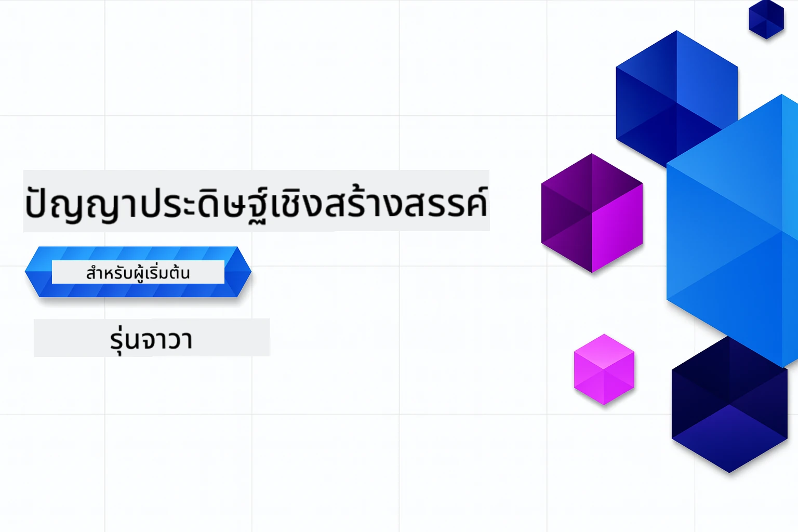

# ปัญญาประดิษฐ์เชิงสร้างสรรค์สำหรับผู้เริ่มต้น - ฉบับจาวา
[](https://discord.gg/nTYy5BXMWG)



**เวลาที่ต้องใช้**: เวิร์กช็อปทั้งหมดยังสามารถทำออนไลน์ได้โดยไม่ต้องตั้งค่าเครื่องภายในเครื่อง เวลาในการตั้งค่าสภาพแวดล้อมใช้เวลา 2 นาที และการสำรวจตัวอย่างจะใช้เวลาประมาณ 1-3 ชั่วโมง ขึ้นอยู่กับความลึกของการสำรวจ

> **เริ่มต้นอย่างรวดเร็ว**

1. Fork ที่เก็บนี้ไปยังบัญชี GitHub ของคุณ
2. คลิก **Code** → แท็บ **Codespaces** → **...** → **New with options...**
3. ใช้ค่าปริยาย – นี้จะเลือก development container ที่สร้างไว้สำหรับหลักสูตรนี้
4. คลิก **Create codespace**
5. รอสักครู่ประมาณ 2 นาที เพื่อให้สภาพแวดล้อมพร้อมใช้งาน
6. ข้ามไปที่ [ตัวอย่างแรก](./02-SetupDevEnvironment/README.md#step-2-create-a-github-personal-access-token)

## รองรับหลายภาษา

### สนับสนุนผ่าน GitHub Action (อัตโนมัติ & อัปเดตตลอดเวลา)

<!-- CO-OP TRANSLATOR LANGUAGES TABLE START -->
[อาหรับ](../ar/README.md) | [เบงกาลี](../bn/README.md) | [บัลแกเรีย](../bg/README.md) | [พม่า (เมียนมา)](../my/README.md) | [จีน (ตัวย่อ)](../zh-CN/README.md) | [จีน (ตัวเต็ม, ฮ่องกง)](../zh-HK/README.md) | [จีน (ตัวเต็ม, มาเก๊า)](../zh-MO/README.md) | [จีน (ตัวเต็ม, ไต้หวัน)](../zh-TW/README.md) | [โครเอเชีย](../hr/README.md) | [เช็ก](../cs/README.md) | [เดนมาร์ก](../da/README.md) | [ดัตช์](../nl/README.md) | [เอสโตเนีย](../et/README.md) | [ฟินแลนด์](../fi/README.md) | [ฝรั่งเศส](../fr/README.md) | [เยอรมัน](../de/README.md) | [กรีก](../el/README.md) | [ฮิบรู](../he/README.md) | [ฮินดี](../hi/README.md) | [ฮังการี](../hu/README.md) | [อินโดนีเซีย](../id/README.md) | [อิตาลี](../it/README.md) | [ญี่ปุ่น](../ja/README.md) | [กันนาดา](../kn/README.md) | [เขมร](../km/README.md) | [เกาหลี](../ko/README.md) | [ลิทัวเนีย](../lt/README.md) | [มาเลย์](../ms/README.md) | [มาลายาลัม](../ml/README.md) | [มราฐี](../mr/README.md) | [เนปาล](../ne/README.md) | [นีจีเรีย พิดจิน](../pcm/README.md) | [นอร์เวย์](../no/README.md) | [เปอร์เซียน (ฟาร์ซี)](../fa/README.md) | [โปแลนด์](../pl/README.md) | [โปรตุเกส (บราซิล)](../pt-BR/README.md) | [โปรตุเกส (โปรตุเกส)](../pt-PT/README.md) | [ปัญจาบี (กูรมุขี)](../pa/README.md) | [โรมาเนีย](../ro/README.md) | [รัสเซีย](../ru/README.md) | [เซอร์เบีย (ซีริลลิก)](../sr/README.md) | [สโลวัก](../sk/README.md) | [สโลวีเนีย](../sl/README.md) | [สเปน](../es/README.md) | [สวาฮีลี](../sw/README.md) | [สวีเดน](../sv/README.md) | [ตากาล็อก (ฟิลิปปินส์)](../tl/README.md) | [ทมิฬ](../ta/README.md) | [เทลูกู](../te/README.md) | [ไทย](./README.md) | [ตุรกี](../tr/README.md) | [ยูเครน](../uk/README.md) | [อูรดู](../ur/README.md) | [เวียดนาม](../vi/README.md)

> **ต้องการโคลนไปยังเครื่องคอมพิวเตอร์หรือเปล่า?**
>
> ที่เก็บนี้รวมการแปลภาษามากกว่า 50 ภาษา ซึ่งทำให้ขนาดดาวน์โหลดเพิ่มขึ้นมาก หากต้องการโคลนโดยไม่แปลภาษา ให้ใช้ sparse checkout:
>
> **Bash / macOS / Linux:**
> ```bash
> git clone --filter=blob:none --sparse https://github.com/microsoft/Generative-AI-for-beginners-java.git
> cd Generative-AI-for-beginners-java
> git sparse-checkout set --no-cone '/*' '!translations' '!translated_images'
> ```
>
> **CMD (Windows):**
> ```cmd
> git clone --filter=blob:none --sparse https://github.com/microsoft/Generative-AI-for-beginners-java.git
> cd Generative-AI-for-beginners-java
> git sparse-checkout set --no-cone "/*" "!translations" "!translated_images"
> ```
>
> วิธีนี้จะให้ทุกสิ่งที่คุณต้องการเพื่อทำหลักสูตรนี้เสร็จอย่างรวดเร็วขึ้นมาก
<!-- CO-OP TRANSLATOR LANGUAGES TABLE END -->

## โครงสร้างหลักสูตร & เส้นทางการเรียนรู้

### **บทที่ 1: แนะนำปัญญาประดิษฐ์เชิงสร้างสรรค์**
- **แนวคิดหลัก**: เข้าใจโมเดลภาษาใหญ่, โทเค็น, การฝังข้อมูล และความสามารถของ AI
- **ระบบนิเวศ AI ในจาวา**: ภาพรวม Spring AI และ OpenAI SDKs
- **โปรโตคอลบริบทโมเดล**: การแนะนำ MCP และบทบาทในการสื่อสารของตัวแทน AI
- **การประยุกต์ใช้จริง**: กรณีใช้งานในโลกจริง รวมถึงแชทบอทและการสร้างเนื้อหา
- **[→ เริ่มบทที่ 1](./01-IntroToGenAI/README.md)**

### **บทที่ 2: ตั้งค่าสภาพแวดล้อมการพัฒนา**
- **การตั้งค่าผู้ให้บริการหลายราย**: ตั้งค่า GitHub Models, Azure OpenAI, และ OpenAI Java SDK integrations
- **Spring Boot + Spring AI**: แนวทางปฏิบัติที่ดีที่สุดสำหรับการพัฒนาแอปพลิเคชัน AI ระดับองค์กร
- **GitHub Models**: โมเดล AI ฟรี สำหรับการสร้างต้นแบบและเรียนรู้ (ไม่ต้องใช้บัตรเครดิต)
- **เครื่องมือการพัฒนา**: คอนเทนเนอร์ Docker, VS Code, และการตั้งค่า GitHub Codespaces
- **[→ เริ่มบทที่ 2](./02-SetupDevEnvironment/README.md)**

### **บทที่ 3: เทคนิคหลักของปัญญาประดิษฐ์เชิงสร้างสรรค์**
- **การออกแบบ Prompt**: เทคนิคเพื่อการตอบสนองโมเดล AI ที่เหมาะสมที่สุด
- **การฝังข้อมูล & การดำเนินการเวกเตอร์**: การใช้งานการค้นหาเชิงความหมายและการจับคู่ความเหมือน
- **การสร้างเนื้อหาที่หนุนด้วยการดึงข้อมูล (RAG)**: รวม AI กับแหล่งข้อมูลของคุณเอง
- **การเรียกใช้ฟังก์ชัน**: ขยายความสามารถของ AI ด้วยเครื่องมือและปลั๊กอินที่กำหนดเอง
- **[→ เริ่มบทที่ 3](./03-CoreGenerativeAITechniques/README.md)**

### **บทที่ 4: การประยุกต์ใช้ปฏิบัติและโครงการ**
- **ตัวสร้างเรื่องราวสัตว์เลี้ยง** (`petstory/`): การสร้างเนื้อหาสร้างสรรค์ด้วย GitHub Models
- **การสาธิต Foundry Local** (`foundrylocal/`): การผสานโมเดล AI ท้องถิ่นกับ OpenAI Java SDK
- **บริการเครื่องคิดเลข MCP** (`calculator/`): การใช้งานพื้นฐาน Model Context Protocol กับ Spring AI
- **[→ เริ่มบทที่ 4](./04-PracticalSamples/README.md)**

### **บทที่ 5: การพัฒนาปัญญาประดิษฐ์อย่างรับผิดชอบ**
- **ความปลอดภัยของ GitHub Models**: ทดสอบการคัดกรองเนื้อหาและกลไกความปลอดภัยในตัว (ทั้งการบล็อกอย่างเข้มงวดและการปฏิเสธแบบอ่อน)
- **สาธิตการพัฒนา AI ที่รับผิดชอบ**: ตัวอย่างใช้งานจริงแสดงให้เห็นว่าระบบความปลอดภัย AI สมัยใหม่ทำงานอย่างไร
- **แนวทางปฏิบัติที่ดีที่สุด**: แนวทางสำคัญสำหรับการพัฒนาและใช้งาน AI อย่างมีจริยธรรม
- **[→ เริ่มบทที่ 5](./05-ResponsibleGenAI/README.md)**

## แหล่งข้อมูลเพิ่มเติม

<!-- CO-OP TRANSLATOR OTHER COURSES START -->
### LangChain
[](https://aka.ms/langchain4j-for-beginners)
[](https://aka.ms/langchainjs-for-beginners?WT.mc_id=m365-94501-dwahlin)
[](https://github.com/microsoft/langchain-for-beginners?WT.mc_id=m365-94501-dwahlin)
---

### Azure / Edge / MCP / ตัวแทน
[](https://github.com/microsoft/AZD-for-beginners?WT.mc_id=academic-105485-koreyst)
[](https://github.com/microsoft/edgeai-for-beginners?WT.mc_id=academic-105485-koreyst)
[](https://github.com/microsoft/mcp-for-beginners?WT.mc_id=academic-105485-koreyst)
[](https://github.com/microsoft/ai-agents-for-beginners?WT.mc_id=academic-105485-koreyst)

---
 
### ชุด Generative AI
[](https://github.com/microsoft/generative-ai-for-beginners?WT.mc_id=academic-105485-koreyst)
[-9333EA?style=for-the-badge&labelColor=E5E7EB&color=9333EA)](https://github.com/microsoft/Generative-AI-for-beginners-dotnet?WT.mc_id=academic-105485-koreyst)
[-C084FC?style=for-the-badge&labelColor=E5E7EB&color=C084FC)](https://github.com/microsoft/generative-ai-for-beginners-java?WT.mc_id=academic-105485-koreyst)
[-E879F9?style=for-the-badge&labelColor=E5E7EB&color=E879F9)](https://github.com/microsoft/generative-ai-with-javascript?WT.mc_id=academic-105485-koreyst)

---
 
### การเรียนรู้หลัก
[](https://aka.ms/ml-beginners?WT.mc_id=academic-105485-koreyst)
[](https://aka.ms/datascience-beginners?WT.mc_id=academic-105485-koreyst)
[](https://aka.ms/ai-beginners?WT.mc_id=academic-105485-koreyst)
[](https://github.com/microsoft/Security-101?WT.mc_id=academic-96948-sayoung)

[](https://aka.ms/webdev-beginners?WT.mc_id=academic-105485-koreyst)
[](https://aka.ms/iot-beginners?WT.mc_id=academic-105485-koreyst)
[](https://github.com/microsoft/xr-development-for-beginners?WT.mc_id=academic-105485-koreyst)

---
 
### ชุด Copilot
[](https://aka.ms/GitHubCopilotAI?WT.mc_id=academic-105485-koreyst)
[](https://github.com/microsoft/mastering-github-copilot-for-dotnet-csharp-developers?WT.mc_id=academic-105485-koreyst)
[](https://github.com/microsoft/CopilotAdventures?WT.mc_id=academic-105485-koreyst)
<!-- CO-OP TRANSLATOR OTHER COURSES END -->

## ขอความช่วยเหลือ

ถ้าคุณติดขัดหรือต้องการคำถามใดๆ เกี่ยวกับการสร้างแอป AI เข้าร่วมกับผู้เรียนและนักพัฒนาที่มีประสบการณ์ในการพูดคุยเกี่ยวกับ MCP นี่คือชุมชนที่สนับสนุน ซึ่งเปิดรับคำถามและแบ่งปันความรู้กันอย่างเสรี

[](https://discord.gg/nTYy5BXMWG)

หากคุณมีคำติชมเกี่ยวกับผลิตภัณฑ์หรือพบข้อผิดพลาดระหว่างการพัฒนา โปรดเยี่ยมชม:

[](https://aka.ms/foundry/forum)

---

<!-- CO-OP TRANSLATOR DISCLAIMER START -->
**ข้อจำกัดความรับผิดชอบ**:  
เอกสารนี้ได้รับการแปลโดยใช้บริการแปลภาษา AI [Co-op Translator](https://github.com/Azure/co-op-translator) แม้ว่าเราจะพยายามรักษาความถูกต้อง โปรดทราบว่าการแปลอัตโนมัติอาจมีข้อผิดพลาดหรือความไม่ถูกต้อง เอกสารต้นฉบับในภาษาต้นฉบับควรถือเป็นแหล่งข้อมูลที่เชื่อถือได้ สำหรับข้อมูลที่สำคัญ ขอแนะนำให้ใช้บริการแปลโดยมืออาชีพที่เป็นมนุษย์ เราไม่รับผิดชอบต่อความเข้าใจผิดหรือการตีความผิดที่เกิดจากการใช้การแปลนี้
<!-- CO-OP TRANSLATOR DISCLAIMER END -->