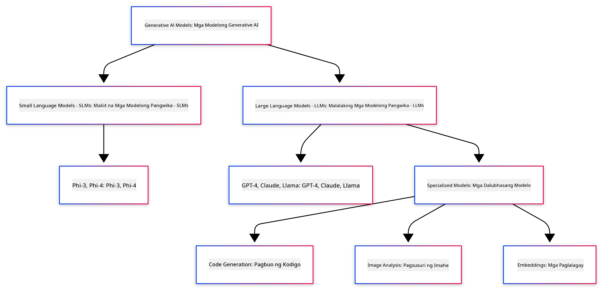
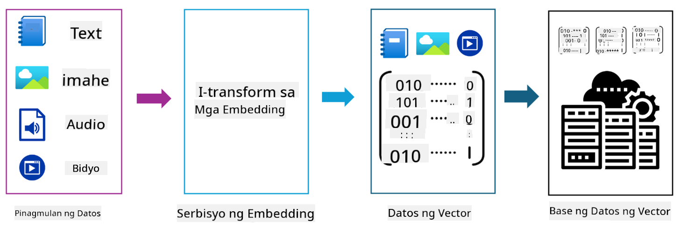

<!--
CO_OP_TRANSLATOR_METADATA:
{
  "original_hash": "006866db93a268a8769bb55f2e324291",
  "translation_date": "2025-07-28T11:03:33+00:00",
  "source_file": "01-IntroToGenAI/README.md",
  "language_code": "tl"
}
-->
# Panimula sa Generative AI - Java Edition

## Ano ang Iyong Matututunan

- **Mga pangunahing kaalaman sa Generative AI** kabilang ang LLMs, prompt engineering, tokens, embeddings, at vector databases  
- **Paghahambing ng mga Java AI development tools** tulad ng Azure OpenAI SDK, Spring AI, at OpenAI Java SDK  
- **Pagkilala sa Model Context Protocol** at ang papel nito sa komunikasyon ng AI agents  

## Talaan ng Nilalaman

- [Panimula](../../../01-IntroToGenAI)  
- [Mabilisang pag-refresh sa mga konsepto ng Generative AI](../../../01-IntroToGenAI)  
- [Review ng prompt engineering](../../../01-IntroToGenAI)  
- [Tokens, embeddings, at agents](../../../01-IntroToGenAI)  
- [Mga AI Development Tools at Libraries para sa Java](../../../01-IntroToGenAI)  
  - [OpenAI Java SDK](../../../01-IntroToGenAI)  
  - [Spring AI](../../../01-IntroToGenAI)  
  - [Azure OpenAI Java SDK](../../../01-IntroToGenAI)  
- [Buod](../../../01-IntroToGenAI)  
- [Mga Susunod na Hakbang](../../../01-IntroToGenAI)  

## Panimula

Maligayang pagdating sa unang kabanata ng Generative AI para sa mga Baguhan - Java Edition! Ang pundasyong araling ito ay magpapakilala sa iyo sa mga pangunahing konsepto ng generative AI at kung paano ito gamitin gamit ang Java. Matututunan mo ang mahahalagang bahagi ng AI applications, kabilang ang Large Language Models (LLMs), tokens, embeddings, at AI agents. Tatalakayin din natin ang mga pangunahing Java tools na gagamitin mo sa buong kurso.

### Mabilisang pag-refresh sa mga konsepto ng Generative AI

Ang Generative AI ay isang uri ng artificial intelligence na lumilikha ng bagong content, tulad ng text, larawan, o code, batay sa mga pattern at relasyon na natutunan mula sa data. Ang mga generative AI models ay maaaring bumuo ng mga tugon na parang gawa ng tao, maunawaan ang konteksto, at kung minsan ay lumikha ng content na tila gawa ng tao.

Habang nagde-develop ka ng iyong Java AI applications, gagamit ka ng **generative AI models** upang lumikha ng content. Ilan sa mga kakayahan ng generative AI models ay:

- **Text Generation**: Paglikha ng text na parang gawa ng tao para sa chatbots, content, at text completion.  
- **Image Generation at Analysis**: Pagbuo ng mga realistic na larawan, pagpapaganda ng mga larawan, at pagtukoy ng mga bagay.  
- **Code Generation**: Pagsulat ng mga code snippets o scripts.  

May mga partikular na uri ng models na na-optimize para sa iba't ibang gawain. Halimbawa, parehong **Small Language Models (SLMs)** at **Large Language Models (LLMs)** ay maaaring mag-handle ng text generation, ngunit ang LLMs ay karaniwang mas mahusay para sa mas kumplikadong gawain. Para sa mga task na may kaugnayan sa larawan, gagamit ka ng mga specialized vision models o multi-modal models.

Siyempre, hindi palaging perpekto ang mga tugon mula sa mga models. Marahil narinig mo na ang tungkol sa mga models na "hallucinating" o lumilikha ng maling impormasyon sa isang authoritative na paraan. Ngunit maaari mong gabayan ang model upang makabuo ng mas mahusay na tugon sa pamamagitan ng pagbibigay ng malinaw na mga instruksyon at konteksto. Dito pumapasok ang **prompt engineering**.

#### Review ng prompt engineering

Ang prompt engineering ay ang praktika ng pagdidisenyo ng epektibong inputs upang gabayan ang AI models patungo sa nais na outputs. Kasama rito ang:

- **Kalalinawan**: Pagbibigay ng malinaw at hindi malabong instruksyon.  
- **Konteksto**: Pagbibigay ng kinakailangang impormasyon sa background.  
- **Mga Limitasyon**: Pagtukoy ng anumang limitasyon o format.  

Ilan sa mga best practices para sa prompt engineering ay ang prompt design, malinaw na instruksyon, task breakdown, one-shot at few-shot learning, at prompt tuning. Mahalagang subukan ang iba't ibang prompts upang malaman kung ano ang pinakamahusay para sa iyong partikular na use case.

Kapag nagde-develop ng applications, gagamit ka ng iba't ibang uri ng prompts:  
- **System prompts**: Nagtatakda ng base rules at konteksto para sa behavior ng model  
- **User prompts**: Ang input data mula sa mga user ng iyong application  
- **Assistant prompts**: Ang tugon ng model batay sa system at user prompts  

> **Learn more**: Matuto pa tungkol sa prompt engineering sa [Prompt Engineering chapter ng GenAI for Beginners course](https://github.com/microsoft/generative-ai-for-beginners/tree/main/04-prompt-engineering-fundamentals)

#### Tokens, embeddings, at agents

Kapag nagtatrabaho sa generative AI models, makakakita ka ng mga terminong tulad ng **tokens**, **embeddings**, **agents**, at **Model Context Protocol (MCP)**. Narito ang detalyadong overview ng mga konseptong ito:

- **Tokens**: Ang tokens ay ang pinakamaliit na yunit ng text sa isang model. Maaari itong mga salita, karakter, o subwords. Ginagamit ang tokens upang kumatawan sa text data sa format na naiintindihan ng model. Halimbawa, ang pangungusap na "The quick brown fox jumped over the lazy dog" ay maaaring ma-tokenize bilang ["The", " quick", " brown", " fox", " jumped", " over", " the", " lazy", " dog"] o ["The", " qu", "ick", " br", "own", " fox", " jump", "ed", " over", " the", " la", "zy", " dog"] depende sa tokenization strategy.

Ang tokenization ay ang proseso ng paghahati ng text sa mas maliliit na yunit. Mahalaga ito dahil ang mga models ay gumagana sa tokens sa halip na raw text. Ang bilang ng tokens sa isang prompt ay nakakaapekto sa haba at kalidad ng tugon ng model, dahil may token limits ang mga models para sa kanilang context window (hal., 128K tokens para sa kabuuang konteksto ng GPT-4o, kabilang ang input at output).

  Sa Java, maaari mong gamitin ang mga libraries tulad ng OpenAI SDK upang awtomatikong mag-handle ng tokenization kapag nagpapadala ng mga request sa AI models.

- **Embeddings**: Ang embeddings ay mga vector representations ng tokens na kumukuha ng semantic meaning. Ito ay mga numerical representations (karaniwang arrays ng floating-point numbers) na nagpapahintulot sa models na maunawaan ang relasyon sa pagitan ng mga salita at makabuo ng mga tugon na may kaugnayan sa konteksto. Ang mga salitang magkatulad ay may magkatulad na embeddings, na nagpapahintulot sa model na maunawaan ang mga konsepto tulad ng synonyms at semantic relationships.

  Sa Java, maaari kang mag-generate ng embeddings gamit ang OpenAI SDK o iba pang libraries na sumusuporta sa embedding generation. Ang mga embeddings ay mahalaga para sa mga task tulad ng semantic search, kung saan nais mong makahanap ng katulad na content batay sa kahulugan sa halip na eksaktong text matches.

- **Vector databases**: Ang vector databases ay mga specialized storage systems na na-optimize para sa embeddings. Pinapadali nito ang efficient similarity search at mahalaga para sa Retrieval-Augmented Generation (RAG) patterns kung saan kailangan mong makahanap ng kaugnay na impormasyon mula sa malalaking datasets batay sa semantic similarity sa halip na eksaktong matches.

> **Note**: Sa kursong ito, hindi natin tatalakayin ang Vector databases ngunit mahalagang banggitin ito dahil karaniwang ginagamit ito sa mga real-world applications.

- **Agents & MCP**: Mga AI components na awtomatikong nakikipag-ugnayan sa mga models, tools, at external systems. Ang Model Context Protocol (MCP) ay nagbibigay ng standardized na paraan para sa agents na ma-access nang ligtas ang external data sources at tools. Matuto pa sa aming [MCP for Beginners](https://github.com/microsoft/mcp-for-beginners) course.

Sa Java AI applications, gagamit ka ng tokens para sa text processing, embeddings para sa semantic search at RAG, vector databases para sa data retrieval, at agents gamit ang MCP para sa pagbuo ng intelligent, tool-using systems.

### Mga AI Development Tools at Libraries para sa Java

Nag-aalok ang Java ng mahusay na tooling para sa AI development. May tatlong pangunahing libraries na ating tatalakayin sa buong kurso - OpenAI Java SDK, Azure OpenAI SDK, at Spring AI.

Narito ang mabilisang reference table na nagpapakita kung aling SDK ang ginagamit sa bawat kabanata ng mga halimbawa:

| Kabanata | Halimbawa | SDK |  
|---------|--------|-----|  
| 02-SetupDevEnvironment | github-models | OpenAI Java SDK |  
| 02-SetupDevEnvironment | basic-chat-azure | Spring AI Azure OpenAI |  
| 03-CoreGenerativeAITechniques | examples | Azure OpenAI SDK |  
| 04-PracticalSamples | petstory | OpenAI Java SDK |  
| 04-PracticalSamples | foundrylocal | OpenAI Java SDK |  
| 04-PracticalSamples | calculator | Spring AI MCP SDK + LangChain4j |  

**Mga Link sa SDK Documentation:**  
- [Azure OpenAI Java SDK](https://github.com/Azure/azure-sdk-for-java/tree/azure-ai-openai_1.0.0-beta.16/sdk/openai/azure-ai-openai)  
- [Spring AI](https://docs.spring.io/spring-ai/reference/)  
- [OpenAI Java SDK](https://github.com/openai/openai-java)  
- [LangChain4j](https://docs.langchain4j.dev/)  

#### OpenAI Java SDK

Ang OpenAI SDK ay ang opisyal na Java library para sa OpenAI API. Nagbibigay ito ng simple at consistent na interface para sa pakikipag-ugnayan sa mga models ng OpenAI, na nagpapadali sa pag-integrate ng AI capabilities sa Java applications. Ang halimbawa ng GitHub Models sa Kabanata 2, Pet Story application sa Kabanata 4, at Foundry Local example ay nagpapakita ng OpenAI SDK approach.

#### Spring AI

Ang Spring AI ay isang komprehensibong framework na nagdadala ng AI capabilities sa Spring applications, na nagbibigay ng consistent abstraction layer sa iba't ibang AI providers. Seamless itong nag-iintegrate sa Spring ecosystem, na ginagawa itong ideal na pagpipilian para sa enterprise Java applications na nangangailangan ng AI capabilities.

Ang lakas ng Spring AI ay nasa seamless integration nito sa Spring ecosystem, na nagpapadali sa pagbuo ng production-ready AI applications gamit ang mga pamilyar na Spring patterns tulad ng dependency injection, configuration management, at testing frameworks. Gagamitin mo ang Spring AI sa Kabanata 2 at 4 upang bumuo ng mga applications na gumagamit ng parehong OpenAI at Model Context Protocol (MCP) Spring AI libraries.

##### Model Context Protocol (MCP)

Ang [Model Context Protocol (MCP)](https://modelcontextprotocol.io/) ay isang emerging standard na nagpapahintulot sa AI applications na makipag-ugnayan nang ligtas sa external data sources at tools. Ang MCP ay nagbibigay ng standardized na paraan para sa AI models na ma-access ang contextual information at mag-execute ng actions sa iyong applications.

Sa Kabanata 4, bubuo ka ng isang simpleng MCP calculator service na nagpapakita ng mga pangunahing kaalaman ng Model Context Protocol gamit ang Spring AI, na nagpapakita kung paano gumawa ng basic tool integrations at service architectures.

#### Azure OpenAI Java SDK

Ang Azure OpenAI client library para sa Java ay isang adaptation ng OpenAI's REST APIs na nagbibigay ng idiomatic interface at integration sa iba pang Azure SDK ecosystem. Sa Kabanata 3, bubuo ka ng mga applications gamit ang Azure OpenAI SDK, kabilang ang chat applications, function calling, at RAG (Retrieval-Augmented Generation) patterns.

> Note: Ang Azure OpenAI SDK ay nahuhuli sa OpenAI Java SDK pagdating sa features kaya para sa mga future projects, isaalang-alang ang paggamit ng OpenAI Java SDK.

## Buod

**Binabati kita!** Matagumpay mong:  

- **Natuto tungkol sa mga pangunahing kaalaman sa Generative AI** kabilang ang LLMs, prompt engineering, tokens, embeddings, at vector databases  
- **Ikinumpara ang mga Java AI development tools** kabilang ang Azure OpenAI SDK, Spring AI, at OpenAI Java SDK  
- **Natuklasan ang Model Context Protocol** at ang papel nito sa komunikasyon ng AI agents  

## Mga Susunod na Hakbang

[Chapter 2: Setting Up the Development Environment](../02-SetupDevEnvironment/README.md)  

**Paunawa**:  
Ang dokumentong ito ay isinalin gamit ang AI translation service na [Co-op Translator](https://github.com/Azure/co-op-translator). Bagama't sinisikap naming maging tumpak, pakitandaan na ang mga awtomatikong pagsasalin ay maaaring maglaman ng mga pagkakamali o hindi pagkakatugma. Ang orihinal na dokumento sa kanyang katutubong wika ang dapat ituring na opisyal na sanggunian. Para sa mahalagang impormasyon, inirerekomenda ang propesyonal na pagsasalin ng tao. Hindi kami mananagot sa anumang hindi pagkakaunawaan o maling interpretasyon na dulot ng paggamit ng pagsasaling ito.