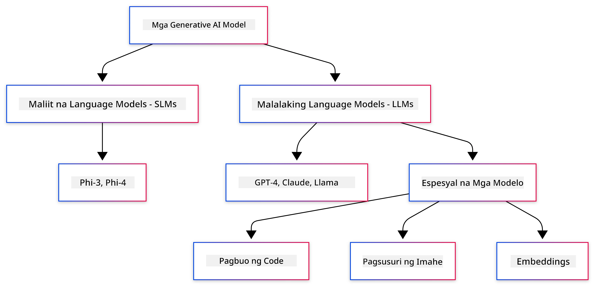
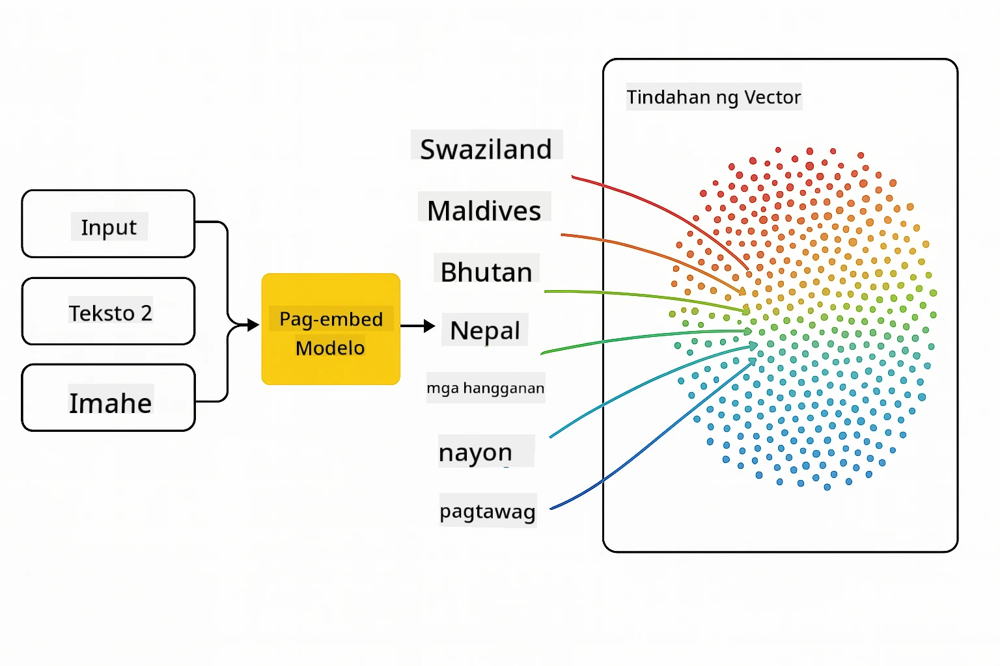
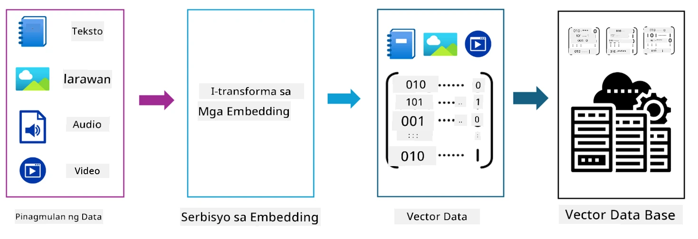
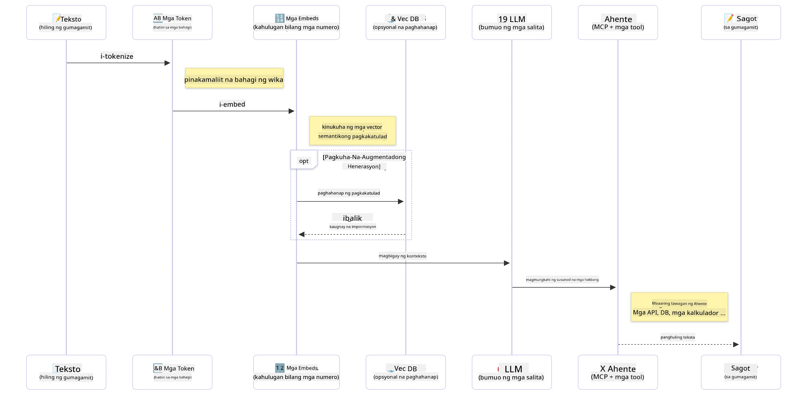

# Panimula sa Generative AI - Java Edition

> **Video**: [Panoorin ang video overview para sa araling ito sa YouTube.](https://www.youtube.com/watch?v=XH46tGp_eSw) Maaari mo ring i-click ang thumbnail na imahe sa itaas.

## Ano ang Matututuhan Mo

- **Mga pundasyon ng Generative AI** kabilang ang LLMs, prompt engineering, mga token, embeddings, at vector databases
- **Paghahambing ng mga Java AI development tools** kabilang ang Azure OpenAI SDK, Spring AI, at OpenAI Java SDK
- **Alamin ang Model Context Protocol** at ang papel nito sa komunikasyon ng AI agent

## Talaan ng Nilalaman

- [Panimula](#panimula)
- [Isang mabilis na pag-refresh sa mga konsepto ng Generative AI](#isang-mabilis-na-pag-refresh-sa-mga-konsepto-ng-generative-ai)
- [Review sa prompt engineering](#review-sa-prompt-engineering)
- [Mga token, embeddings, at mga agent](#mga-token-embeddings-at-mga-agent)
- [Mga AI Development Tools at Libraries para sa Java](#mga-ai-development-tools-at-libraries-para-sa-java)
  - [OpenAI Java SDK](#openai-java-sdk)
  - [Spring AI](#spring-ai)
  - [Azure OpenAI Java SDK](#azure-openai-java-sdk)
- [Buod](#buod)
- [Mga Susunod na Hakbang](#mga-susunod-na-hakbang)

## Panimula

Maligayang pagdating sa unang kabanata ng Generative AI para sa mga Nagsisimula - Java Edition! Ang pundasyong araling ito ay nagpapakilala sa iyo sa mga pangunahing konsepto ng generative AI at kung paano ito gamitin gamit ang Java. Matututuhan mo ang mga mahalagang bahagi ng mga AI aplikasyon, kabilang ang Large Language Models (LLMs), mga token, embeddings, at mga AI agent. Sisisirin din natin ang pangunahing Java tooling na gagamitin mo sa buong kursong ito.

### Isang mabilis na pag-refresh sa mga konsepto ng Generative AI

Ang Generative AI ay isang uri ng artipisyal na intelihensiya na lumilikha ng bagong nilalaman, tulad ng teksto, mga larawan, o code, batay sa mga pattern at relasyon na natutunan mula sa data. Ang mga generative AI model ay maaaring bumuo ng mga tao-tulad na tugon, intindihin ang konteksto, at minsan ay lumikha pa ng nilalaman na parang tao.

Habang nagde-develop ka ng iyong mga Java AI applications, gagamit ka ng **generative AI models** upang gumawa ng nilalaman. Ilan sa mga kakayahan ng generative AI models ay:

- **Paggawa ng Teksto**: Paglikha ng tao-tulad na teksto para sa mga chatbot, nilalaman, at pagtatapos ng teksto.
- **Paggawa at Pagsusuri ng Larawan**: Paglikha ng makatotohanang mga larawan, pagpapahusay ng mga larawan, at pagtukoy ng mga bagay.
- **Paggawa ng Code**: Pagsulat ng mga snippet ng code o mga script.

May mga tiyak na uri ng mga modelo na iniakma para sa iba't ibang gawain. Halimbawa, parehong kaya ng **Small Language Models (SLMs)** at **Large Language Models (LLMs)** ang paggawa ng teksto, kung saan karaniwang mas maganda ang performance ng LLMs para sa mas komplikadong mga gawain. Para sa mga gawain na may kaugnayan sa larawan, gagamit ka ng mga espesyal na vision model o multi-modal model.

Siyempre, hindi laging perpekto ang mga tugon mula sa mga modelong ito. Marahil ay narinig mo na ang tungkol sa mga modelong "hallucinate" o gumawa ng maling impormasyon na parang sigurado. Ngunit maaari mong gabayan ang modelo na makabuo ng mas mabubuting tugon sa pamamagitan ng pagbibigay sa kanila ng malinaw na mga tagubilin at konteksto. Dito pumapasok ang **prompt engineering**.

#### Review sa prompt engineering

Ang prompt engineering ay ang pagsasanay ng disenyo ng epektibong mga input upang gabayan ang mga AI model patungo sa nais na output. Kasama dito ang:

- **Kalakasan**: Pagiging malinaw at walang kalabuan ang mga tagubilin.
- **Konteksto**: Pagbigay ng kinakailangang impormasyon sa likod.
- **Mga limitasyon**: Paglalahad ng anumang mga hangganan o format.

Ilan sa mga pinakamahusay na gawain sa prompt engineering ay ang disenyo ng prompt, malinaw na mga tagubilin, paghati ng gawain, one-shot at few-shot learning, at pag-tune ng prompt. Mahalaga ang pagsubok ng iba't ibang prompts upang makita kung alin ang pinakamainam para sa iyong partikular na gamit.

Kapag nagde-develop ng mga aplikasyon, gagamit ka ng iba't ibang uri ng prompt:
- **System prompts**: Nagse-set ng mga pangunahing patakaran at konteksto para sa kilos ng modelo
- **User prompts**: Ang input na data mula sa mga gumagamit ng iyong aplikasyon
- **Assistant prompts**: Mga tugon ng modelo base sa system at user prompts

> **Matuto pa**: Matuto pa tungkol sa prompt engineering sa [Prompt Engineering chapter ng GenAI para sa mga Nagsisimula](https://github.com/microsoft/generative-ai-for-beginners/tree/main/04-prompt-engineering-fundamentals)

#### Mga token, embeddings, at mga agent

Kapag nagtatrabaho ka sa mga generative AI models, makakaharap ka ng mga terminong tulad ng **mga token**, **embeddings**, **agents**, at **Model Context Protocol (MCP)**. Narito ang detalyadong paglalahad ng mga konseptong ito:

- **Mga token**: Ang mga token ay ang pinakamaliit na yunit ng teksto sa isang modelo. Maaari itong mga salita, karakter, o subwords. Ginagamit ang mga token upang kumatawan sa data ng teksto sa isang format na naiintindihan ng modelo. Halimbawa, ang pangungusap na "The quick brown fox jumped over the lazy dog" ay maaaring ma-tokenize bilang ["The", " quick", " brown", " fox", " jumped", " over", " the", " lazy", " dog"] o ["The", " qu", "ick", " br", "own", " fox", " jump", "ed", " over", " the", " la", "zy", " dog"] depende sa istratehiya ng tokenization.

Ang tokenization ay ang proseso ng paghahati ng teksto sa maliliit na yunit na ito. Mahalaga ito dahil ang mga modelo ay gumagana sa mga token sa halip na raw na teksto. Ang bilang ng mga token sa isang prompt ay nakakaapekto sa haba at kalidad ng tugon ng modelo, dahil may mga limitasyon sa bilang ng token para sa kanilang context window (hal., 128K tokens para sa kabuuang konteksto ng GPT-4o, kabilang ang input at output).

  Sa Java, maaari mong gamitin ang mga library tulad ng OpenAI SDK upang awtomatikong pamahalaan ang tokenization kapag nagpapadala ng mga request sa mga AI model.

- **Embeddings**: Ang embeddings ay mga vector na representasyon ng mga token na kumakatawan sa kahulugan. Ito ay mga numerikal na representasyon (karaniwang arrays ng floating-point na mga numero) na nagpapahintulot sa mga modelo na intindihin ang mga relasyon sa pagitan ng mga salita at makabuo ng mga tugong naaayon sa konteksto. Ang magkatulad na mga salita ay may magkatulad na embeddings, kaya naiintindihan ng modelo ang mga konsepto tulad ng mga sinonimo at mga relasyong semantiko.

  Sa Java, maaari kang gumawa ng embeddings gamit ang OpenAI SDK o iba pang mga library na sumusuporta sa paggawa ng embedding. Mahalaga ang mga embeddings para sa mga gawain tulad ng semantic search, kung saan nais mong maghanap ng magkatulad na nilalaman batay sa kahulugan sa halip na eksaktong tugma ng teksto.

- **Vector databases**: Ang vector database ay mga espesyal na imbakan na iniakma para sa embeddings. Pinapayagan nila ang mahusay na paghahanap ng pagkakatulad at mahalaga para sa Retrieval-Augmented Generation (RAG) na mga pattern kung saan kailangan mong maghanap ng kaugnay na impormasyon mula sa malalaking dataset batay sa semantic similarity at hindi lamang sa eksaktong tugma.

> **Tandaan**: Sa kursong ito, hindi natin tatalakayin ang mga Vector database ngunit mahalagang banggitin ito dahil karaniwang ginagamit sa totoong aplikasyon.

- **Agents at MCP**: Mga bahagi ng AI na awtonomong nakikipag-ugnayan sa mga modelo, tools, at panlabas na sistema. Ang Model Context Protocol (MCP) ay nagbibigay ng isang standardized na paraan para sa mga agent na ligtas na makakuha ng access sa mga panlabas na data sources at tools. Alamin pa sa aming [MCP para sa mga Nagsisimula](https://github.com/microsoft/mcp-for-beginners) na kurso.

Sa mga Java AI application, gagamitin mo ang mga token para sa pagproseso ng teksto, embeddings para sa semantic search at RAG, vector databases para sa retrieval ng data, at mga agent na may MCP para sa paggawa ng matatalinong sistema na gumagamit ng mga tool.

### Mga AI Development Tools at Libraries para sa Java

Nag-aalok ang Java ng mahusay na tooling para sa AI development. May tatlong pangunahing library na tatalakayin natin sa buong kurso - OpenAI Java SDK, Azure OpenAI SDK, at Spring AI.

Narito ang mabilisang talaan na nagpapakita kung aling SDK ang ginagamit sa mga halimbawa ng bawat kabanata:

| Kabanata | Halimbawa | SDK |
|---------|--------|-----|
| 02-SetupDevEnvironment | github-models | OpenAI Java SDK |
| 02-SetupDevEnvironment | basic-chat-azure | Spring AI Azure OpenAI |
| 03-CoreGenerativeAITechniques | examples | Azure OpenAI SDK |
| 04-PracticalSamples | petstory | OpenAI Java SDK |
| 04-PracticalSamples | foundrylocal | OpenAI Java SDK |
| 04-PracticalSamples | calculator | Spring AI MCP SDK + LangChain4j |

**Mga Link sa Dokumentasyon ng SDK:**
- [Azure OpenAI Java SDK](https://github.com/Azure/azure-sdk-for-java/tree/azure-ai-openai_1.0.0-beta.16/sdk/openai/azure-ai-openai)
- [Spring AI](https://docs.spring.io/spring-ai/reference/)
- [OpenAI Java SDK](https://github.com/openai/openai-java)
- [LangChain4j](https://docs.langchain4j.dev/)

#### OpenAI Java SDK

Ang OpenAI SDK ay ang opisyal na Java library para sa OpenAI API. Nagbibigay ito ng simpleng at pare-parehong interface para makipag-ugnayan sa mga modelo ng OpenAI, na nagpapadali sa pag-integrate ng AI capabilities sa mga Java application. Ipinapakita ng GitHub Models example sa Kabanata 2, pati na rin ang Pet Story application at Foundry Local example sa Kabanata 4 ang paggamit ng OpenAI SDK.

#### Spring AI

Ang Spring AI ay isang komprehensibong framework na nagdadala ng AI capabilities sa mga Spring application, na nagbibigay ng isang pare-parehong abstraction layer sa iba't ibang AI provider. Seamless itong nakatutugma sa Spring ecosystem, kaya ito ang mainam na pagpipilian para sa mga enterprise Java application na nangangailangan ng AI capabilities.

Ang lakas ng Spring AI ay nasa seamless na integrasyon nito sa Spring ecosystem, na nagpapadali sa paggawa ng production-ready AI application gamit ang mga pamilyar na Spring pattern gaya ng dependency injection, configuration management, at testing frameworks. Gagamitin mo ang Spring AI sa Kabanata 2 at 4 upang bumuo ng mga aplikasyon na gumagamit ng parehong OpenAI at Model Context Protocol (MCP) Spring AI libraries.

##### Model Context Protocol (MCP)

Ang [Model Context Protocol (MCP)](https://modelcontextprotocol.io/) ay isang umuusbong na standard na nagpapahintulot sa mga AI application na ligtas na makipag-ugnayan sa mga panlabas na source ng data at mga tool. Nagbibigay ang MCP ng standardized na paraan para sa mga AI model na ma-access ang kontekstwal na impormasyon at mag-execute ng mga aksyon sa iyong mga aplikasyon.

Sa Kabanata 4, bubuuin mo ang isang simpleng MCP calculator service na nagpapakita ng mga pundasyon ng Model Context Protocol gamit ang Spring AI, na naglalaman kung paano gumawa ng mga basic tool integration at architecture ng serbisyo.

#### Azure OpenAI Java SDK

Ang Azure OpenAI client library para sa Java ay adaptasyon ng OpenAI REST API na nagbibigay ng idiomatic na interface at integrasyon sa iba pang bahagi ng Azure SDK ecosystem. Sa Kabanata 3, gagawa ka ng mga application gamit ang Azure OpenAI SDK, kabilang ang chat applications, function calling, at RAG (Retrieval-Augmented Generation) patterns.

> Tandaan: Ang Azure OpenAI SDK ay naiiba ng bahagya sa features kumpara sa OpenAI Java SDK kaya para sa mga susunod na proyekto, isaalang-alang ang paggamit ng OpenAI Java SDK.

## Buod

Dito nagtatapos ang mga pundasyon! Naiintindihan mo na ngayon:

- Ang mga pangunahing konsepto sa likod ng generative AI - mula sa LLMs at prompt engineering hanggang sa mga token, embeddings, at vector databases
- Ang mga pagpipilian sa iyong toolkit para sa Java AI development: Azure OpenAI SDK, Spring AI, at OpenAI Java SDK
- Ano ang Model Context Protocol at kung paano nito pinapagana ang mga AI agent na gumamit ng mga panlabas na tool

## Mga Susunod na Hakbang

[Chapter 2: Setting Up the Development Environment](../02-SetupDevEnvironment/README.md)

---

<!-- CO-OP TRANSLATOR DISCLAIMER START -->
**Paunawa**:
Ang dokumentong ito ay isinalin gamit ang AI translation service na [Co-op Translator](https://github.com/Azure/co-op-translator). Bagama't nagsusumikap kami para sa kawastuhan, mangyaring tandaan na ang mga awtomatikong pagsasalin ay maaaring maglaman ng mga pagkakamali o hindi pagkakatugma. Ang orihinal na dokumento sa kanyang sariling wika ang dapat ituring na pangunahing sanggunian. Para sa mahahalagang impormasyon, inirerekomenda ang propesyonal na pagsasalin ng isang tao. Hindi kami mananagot sa anumang mga maling pagkakaunawaan o maling interpretasyon na nagmumula sa paggamit ng pagsasaling ito.
<!-- CO-OP TRANSLATOR DISCLAIMER END -->