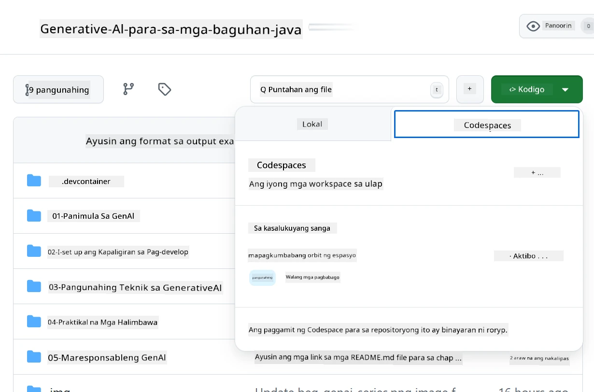
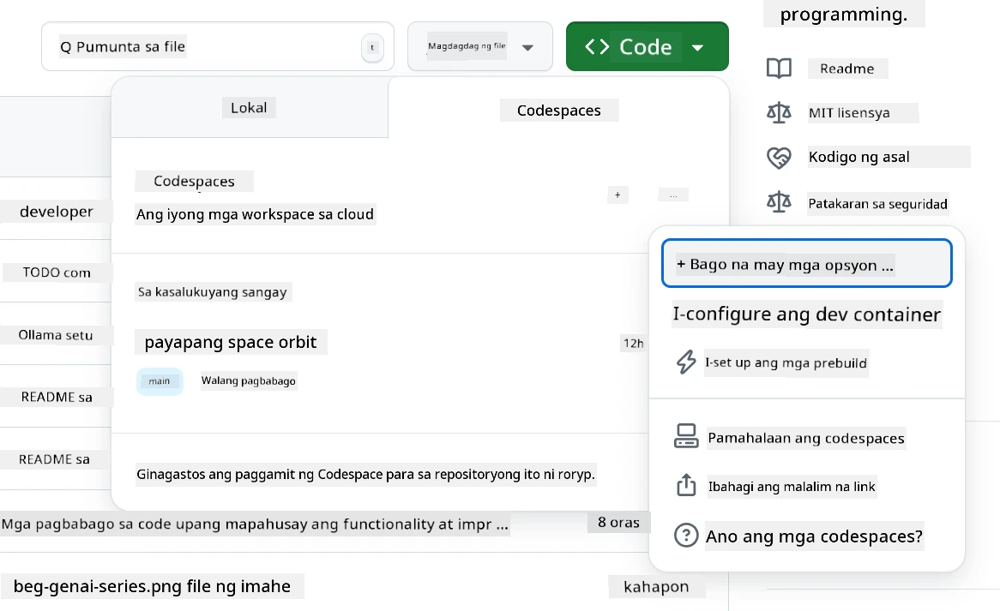
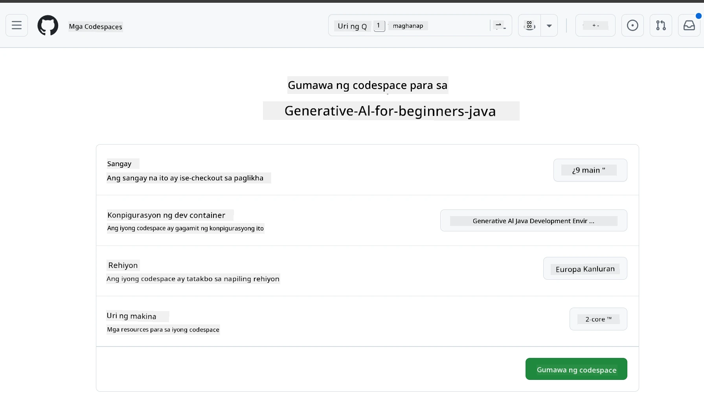
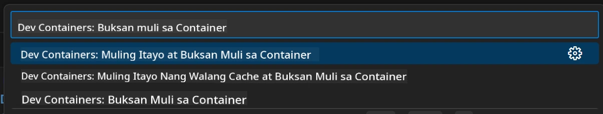
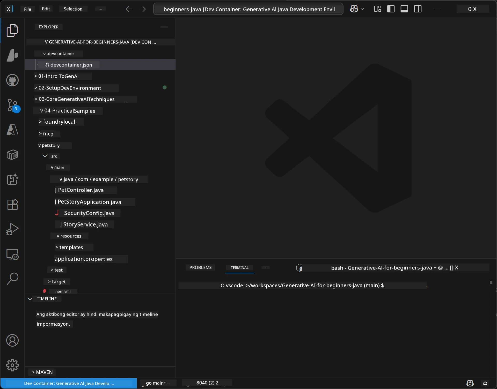
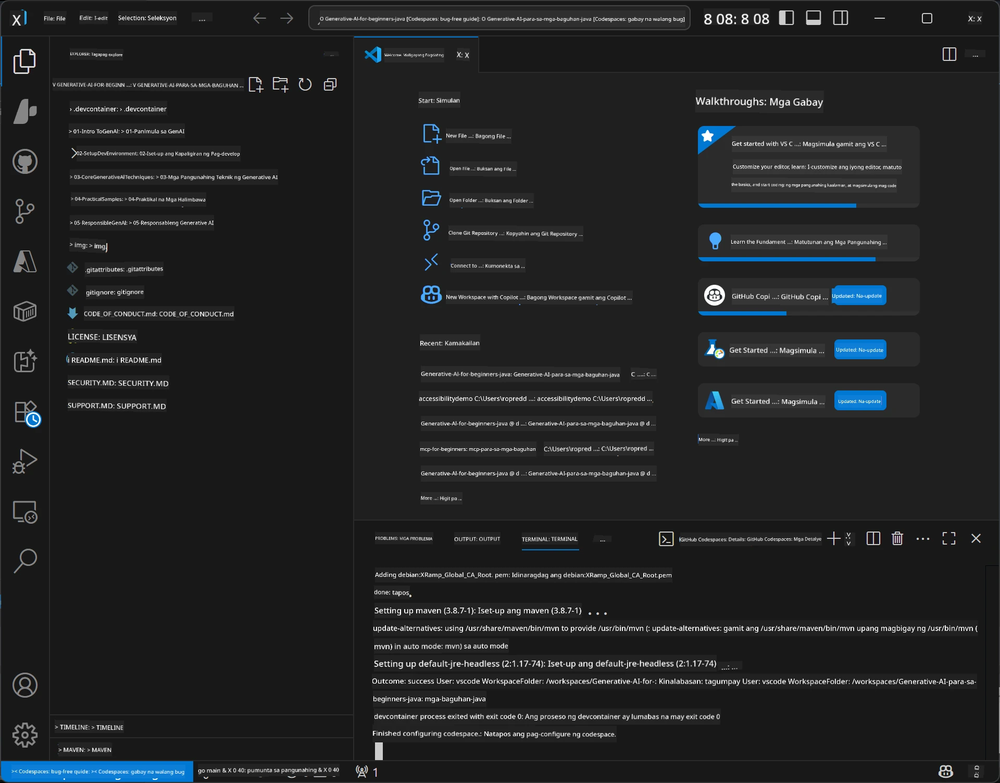

# Pag-set Up ng Development Environment para sa Generative AI para sa Java

> **Mabilisang Simula**: Mag-code sa Cloud sa loob ng 2 minuto - Tumalon sa [GitHub Codespaces Setup](../../../02-SetupDevEnvironment) - walang kinakailangang lokal na pag-install at gumagamit ng github models!

> **Interesado sa Azure OpenAI?**, tingnan ang aming [Azure OpenAI Setup Guide](getting-started-azure-openai.md) na may mga hakbang para gumawa ng bagong Azure OpenAI resource.

## Ano ang Matututuhan Mo

- Mag-set up ng Java development environment para sa AI applications
- Pumili at i-configure ang iyong nais na development environment (cloud-first gamit ang Codespaces, local dev container, o kumpletong lokal na setup)
- Subukan ang iyong setup sa pamamagitan ng pagkonekta sa GitHub Models

## Talaan ng Nilalaman

- [Ano ang Matututuhan Mo](../../../02-SetupDevEnvironment)
- [Panimula](../../../02-SetupDevEnvironment)
- [Hakbang 1: I-set Up ang Iyong Development Environment](../../../02-SetupDevEnvironment)
  - [Opsyon A: GitHub Codespaces (Inirerekomenda)](../../../02-SetupDevEnvironment)
  - [Opsyon B: Local Dev Container](../../../02-SetupDevEnvironment)
  - [Opsyon C: Gamitin ang Kasalukuyan Mong Lokal na Instalasyon](../../../02-SetupDevEnvironment)
- [Hakbang 2: Gumawa ng GitHub Personal Access Token](../../../02-SetupDevEnvironment)
- [Hakbang 3: Subukan ang Iyong Setup](../../../02-SetupDevEnvironment)
- [Pagsasaayos ng Problema](../../../02-SetupDevEnvironment)
- [Buod](../../../02-SetupDevEnvironment)
- [Mga Susunod na Hakbang](../../../02-SetupDevEnvironment)

## Panimula

Ang kabanatang ito ay gagabay sa iyo sa pag-set up ng development environment. Gagamit tayo ng **GitHub Models** bilang pangunahing halimbawa dahil ito ay libre, madaling i-setup gamit lamang ang GitHub account, hindi nangangailangan ng credit card, at nagbibigay ng access sa maraming modelo para sa eksperimento.

**Walang kinakailangang lokal na setup!** Maaari kang magsimula agad mag-code gamit ang GitHub Codespaces, na nagbibigay ng kumpletong development environment sa iyong browser.


Inirerekomenda naming gamitin ang [**GitHub Models**](https://github.com/marketplace?type=models) para sa kursong ito dahil ito ay:
- **Libre** para makapagsimula
- **Madaling** i-set up gamit lamang ang GitHub account
- **Walang credit card** na kailangan
- **Maraming modelo** na magagamit para sa eksperimento

> **Tandaan**: Ang GitHub Models na ginamit sa pagsasanay na ito ay may sumusunod na libreng limitasyon:
> - 15 kahilingan kada minuto (150 kada araw)
> - ~8,000 salita input, ~4,000 salita output kada kahilingan
> - 5 sabay-sabay na kahilingan
> 
> Para sa production, i-upgrade sa Azure AI Foundry Models gamit ang iyong Azure account. Hindi mo kailangang baguhin ang iyong code. Tingnan ang [Azure AI Foundry documentation](https://learn.microsoft.com/azure/ai-foundry/foundry-models/how-to/quickstart-github-models).

## Hakbang 1: I-set Up ang Iyong Development Environment

<a name="quick-start-cloud"></a>

Nagawa namin ang isang preconfigured development container upang mabawasan ang oras ng setup at matiyak na mayroon kang lahat ng kinakailangang tools para sa kursong Generative AI para sa Java. Piliin ang iyong nais na paraan ng pag-develop:

### Mga Opsyon sa Pag-setup ng Environment:

#### Opsyon A: GitHub Codespaces (Inirerekomenda)

**Magsimulang mag-code sa loob ng 2 minuto - walang kinakailangang lokal na setup!**

1. I-fork ang repository na ito sa iyong GitHub account  
   > **Tandaan**: Kung nais mong i-edit ang basic config, tingnan ang [Dev Container Configuration](../../../.devcontainer/devcontainer.json)  
2. I-click ang **Code** → tab na **Codespaces** → **...** → **New with options...**  
3. Gamitin ang defaults – pipiliin nito ang **Dev container configuration**: **Generative AI Java Development Environment**, ang custom devcontainer na ginawa para sa kursong ito  
4. I-click ang **Create codespace**  
5. Maghintay ng mga ~2 minuto para maging handa ang environment  
6. Magpatuloy sa [Hakbang 2: Gumawa ng GitHub Token](../../../02-SetupDevEnvironment)







> **Mga Benepisyo ng Codespaces**:  
> - Walang kinakailangang lokal na pag-install  
> - Gumagana sa anumang device na may browser  
> - Pre-configured na may lahat ng tools at dependencies  
> - Libreng 60 oras kada buwan para sa personal accounts  
> - Konsistent na environment para sa lahat ng nag-aaral

#### Opsyon B: Local Dev Container

**Para sa mga developer na mas gustong lokal na pag-develop gamit ang Docker**

1. I-fork at i-clone ang repository na ito sa iyong lokal na makina  
   > **Tandaan**: Kung nais mong i-edit ang basic config, tingnan ang [Dev Container Configuration](../../../.devcontainer/devcontainer.json)  
2. Mag-install ng [Docker Desktop](https://www.docker.com/products/docker-desktop/) at [VS Code](https://code.visualstudio.com/)  
3. I-install ang [Dev Containers extension](https://marketplace.visualstudio.com/items?itemName=ms-vscode-remote.remote-containers) sa VS Code  
4. Buksan ang folder ng repository sa VS Code  
5. Kapag pinilit, i-click ang **Reopen in Container** (o gamitin ang `Ctrl+Shift+P` → "Dev Containers: Reopen in Container")  
6. Maghintay para mabuo at magsimula ang container  
7. Magpatuloy sa [Hakbang 2: Gumawa ng GitHub Token](../../../02-SetupDevEnvironment)





#### Opsyon C: Gamitin ang Kasalukuyan Mong Lokal na Instalasyon

**Para sa mga developer na may kasalukuyang Java environment**

Mga kinakailangan:  
- [Java 21+](https://www.oracle.com/java/technologies/javase/jdk21-archive-downloads.html)  
- [Maven 3.9+](https://maven.apache.org/download.cgi)  
- [VS Code](https://code.visualstudio.com) o ang iyong paboritong IDE

Mga hakbang:  
1. I-clone ang repository na ito sa iyong lokal na makina  
2. Buksan ang proyekto sa iyong IDE  
3. Magpatuloy sa [Hakbang 2: Gumawa ng GitHub Token](../../../02-SetupDevEnvironment)

> **Pro Tip**: Kung may mababang spec na makina ka pero gusto mo ang VS Code lokal, gamitin ang GitHub Codespaces! Maaari mong i-connect ang lokal mong VS Code sa cloud-hosted Codespace para sa pinakamahusay sa dalawang mundo.



## Hakbang 2: Gumawa ng GitHub Personal Access Token

1. Pumunta sa [GitHub Settings](https://github.com/settings/profile) at piliin ang **Settings** mula sa iyong profile menu.  
2. Sa kaliwang sidebar, i-click ang **Developer settings** (karaniwan nasa ibaba).  
3. Sa ilalim ng **Personal access tokens**, i-click ang **Fine-grained tokens** (o sundin ang direktang [link na ito](https://github.com/settings/personal-access-tokens)).  
4. I-click ang **Generate new token**.  
5. Sa ilalim ng "Token name", maglagay ng isang malinaw na pangalan (hal., `GenAI-Java-Course-Token`).  
6. Magtakda ng expiration date (inirerekomenda: 7 araw para sa pinakamahusay na mga praktis sa seguridad).  
7. Sa ilalim ng "Resource owner", piliin ang iyong user account.  
8. Sa ilalim ng "Repository access", piliin ang mga repository na nais mong gamitin kasama ang GitHub Models (o "All repositories" kung kinakailangan).  
9. Sa ilalim ng "Account permissions", hanapin ang **Models** at itakda ito sa **Read-only**.  
10. I-click ang **Generate token**.  
11. **Kopyahin at i-save ang iyong token ngayon** – hindi mo na ito muling makikita!

> **Tip sa Seguridad**: Gumamit ng pinakamababang sakop na kinakailangan at pinakamaikling praktikal na oras ng pag-expire para sa iyong access tokens.

## Hakbang 3: Subukan ang Iyong Setup sa GitHub Models Example

Kapag handa na ang iyong development environment, subukan natin ang integrasyon ng GitHub Models gamit ang aming halimbawa sa [`02-SetupDevEnvironment/examples/github-models`](../../../02-SetupDevEnvironment/examples/github-models).

1. Buksan ang terminal sa iyong development environment.  
2. Pumunta sa halimbawa ng GitHub Models:  
   ```bash
   cd 02-SetupDevEnvironment/examples/github-models
   ```
3. Itakda ang iyong GitHub token bilang environment variable:  
   ```bash
   # macOS/Linux
   export GITHUB_TOKEN=your_token_here
   
   # Windows (Command Prompt)
   set GITHUB_TOKEN=your_token_here
   
   # Windows (PowerShell)
   $env:GITHUB_TOKEN="your_token_here"
   ```
  
4. Patakbuhin ang application:  
   ```bash
   mvn compile exec:java -Dexec.mainClass="com.example.githubmodels.App"
   ```
  
Makikita mo ang output na katulad nito:  
```text
Using model: gpt-4.1-nano
Sending request to GitHub Models...
Response: Hello World!
```
  

### Pag-unawa sa Halimbawa ng Code

Una, unawain natin ang pinatakbo natin. Ang halimbawa sa ilalim ng `examples/github-models` ay gumagamit ng OpenAI Java SDK para kumonekta sa GitHub Models:

**Ano ang ginagawa ng code na ito:**  
- **Kumokonekta** sa GitHub Models gamit ang iyong personal access token  
- **Nagsusumite** ng simpleng mensaheng "Say Hello World!" sa AI model  
- **Tumatanggap** at ipinapakita ang tugon ng AI  
- **Tinitiyak** na gumagana nang tama ang iyong setup

**Pangunahing Dependency** (sa `pom.xml`):  
```xml
<dependency>
    <groupId>com.openai</groupId>
    <artifactId>openai-java</artifactId>
    <version>2.12.0</version>
</dependency>
```
  
**Pangunahing Code** (`App.java`):  
```java
// Kumonekta sa mga Modelo ng GitHub gamit ang OpenAI Java SDK
OpenAIClient client = OpenAIOkHttpClient.builder()
    .apiKey(pat)
    .baseUrl("https://models.inference.ai.azure.com")
    .build();

// Gumawa ng kahilingan para sa chat completion
ChatCompletionCreateParams params = ChatCompletionCreateParams.builder()
    .model(modelId)
    .addSystemMessage("You are a concise assistant.")
    .addUserMessage("Say Hello World!")
    .build();

// Kumuha ng sagot mula sa AI
ChatCompletion response = client.chat().completions().create(params);
System.out.println("Response: " + response.choices().get(0).message().content().orElse("No response content"));
```
  

## Buod

Mahusay! Naitsura mo na lahat ng kailangan:

- Nakagawa ng GitHub Personal Access Token na may tamang permiso para sa AI model access  
- Napatakbo ang iyong Java development environment (Codespaces, dev containers, o lokal man)  
- Nakakonekta sa GitHub Models gamit ang OpenAI Java SDK para sa libreng AI development  
- Nasubukan lahat gamit ang isang simpleng halimbawa na nakikipag-usap sa AI models

## Mga Susunod na Hakbang

[Chapter 3: Core Generative AI Techniques](../03-CoreGenerativeAITechniques/README.md)

## Pagsasaayos ng Problema

May problema? Narito ang mga karaniwang isyu at mga solusyon:

- **Hindi gumagana ang token?**  
  - Siguraduhing nakopya mo nang buo ang token nang walang dagdag na espasyo  
  - Tiyaking naka-set nang tama ang token bilang environment variable  
  - Suriin na ang token ay may tamang permiso (Models: Read-only)

- **Hindi makita ang Maven?**  
  - Kung gumagamit ng dev containers/Codespaces, naka-pre-install ang Maven  
  - Para sa lokal na setup, tiyakin na naka-install ang Java 21+ at Maven 3.9+  
  - Subukang patakbuhin ang `mvn --version` para tiyakin ang instalasyon

- **Mga isyu sa koneksyon?**  
  - Suriin ang iyong internet connection  
  - Tiyaking ma-access ang GitHub mula sa iyong network  
  - Siguraduhing wala kang firewall na humaharang sa GitHub Models endpoint

- **Hindi nagsisimula ang dev container?**  
  - Siguraduhing tumatakbo ang Docker Desktop (para sa lokal na pag-develop)  
  - Subukang i-rebuild ang container: `Ctrl+Shift+P` → "Dev Containers: Rebuild Container"

- **May error sa pag-compile ng aplikasyon?**  
  - Siguraduhing nasa tamang directory ka: `02-SetupDevEnvironment/examples/github-models`  
  - Subukang linisin at i-rebuild: `mvn clean compile`

> **Kailangang tulong?**: May problema pa rin? Magbukas ng isyu sa repository at tutulungan ka namin.

---

<!-- CO-OP TRANSLATOR DISCLAIMER START -->
**Paunawa**:
Ang dokumentong ito ay isinalin gamit ang AI translation service na [Co-op Translator](https://github.com/Azure/co-op-translator). Bagama't aming pinagsisikapang maging tumpak ang pagsasalin, mangyaring tandaan na ang mga awtomatikong pagsasalin ay maaaring maglaman ng mga pagkakamali o di-tumpak na impormasyon. Ang orihinal na dokumento sa orihinal nitong wika ang dapat ituring na opisyal na sanggunian. Para sa mahahalagang impormasyon, inirerekomenda ang propesyonal na pagsasalin ng tao. Hindi kami mananagot sa anumang hindi pagkakaunawaan o maling interpretasyon na maaaring magmula sa paggamit ng pagsasaling ito.
<!-- CO-OP TRANSLATOR DISCLAIMER END -->