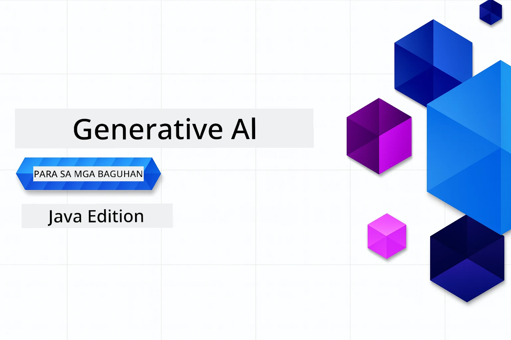

# Generative AI para sa mga Baguhan - Java Edition
[](https://discord.gg/nTYy5BXMWG)



**Oras ng Pakikibahagi**: Ang buong workshop ay maaaring matapos online nang hindi na kailangang mag-setup locally. Ang pag-setup ng environment ay tumatagal ng 2 minuto, habang ang pag-explore sa mga sample ay nangangailangan ng 1-3 oras depende sa lalim ng pag-explore.

> **Mabilis na Simula**

1. I-fork ang repository na ito sa iyong GitHub account
2. I-click ang **Code** → tab na **Codespaces** → **...** → **New with options...**
3. Gamitin ang mga default – pipiliin nito ang Development container na ginawa para sa kursong ito
4. I-click ang **Create codespace**
5. Maghintay ng humigit-kumulang 2 minuto para maging handa ang environment
6. Direktang pumunta sa [Ang unang halimbawa](./02-SetupDevEnvironment/README.md#step-2-create-a-github-personal-access-token)

## Suporta sa Maramihang Wika

### Sinusuportahan sa pamamagitan ng GitHub Action (Automatiko at Palaging Napapanahon)

<!-- CO-OP TRANSLATOR LANGUAGES TABLE START -->
[Arabic](../ar/README.md) | [Bengali](../bn/README.md) | [Bulgarian](../bg/README.md) | [Burmese (Myanmar)](../my/README.md) | [Chinese (Simplified)](../zh-CN/README.md) | [Chinese (Traditional, Hong Kong)](../zh-HK/README.md) | [Chinese (Traditional, Macau)](../zh-MO/README.md) | [Chinese (Traditional, Taiwan)](../zh-TW/README.md) | [Croatian](../hr/README.md) | [Czech](../cs/README.md) | [Danish](../da/README.md) | [Dutch](../nl/README.md) | [Estonian](../et/README.md) | [Finnish](../fi/README.md) | [French](../fr/README.md) | [German](../de/README.md) | [Greek](../el/README.md) | [Hebrew](../he/README.md) | [Hindi](../hi/README.md) | [Hungarian](../hu/README.md) | [Indonesian](../id/README.md) | [Italian](../it/README.md) | [Japanese](../ja/README.md) | [Kannada](../kn/README.md) | [Korean](../ko/README.md) | [Lithuanian](../lt/README.md) | [Malay](../ms/README.md) | [Malayalam](../ml/README.md) | [Marathi](../mr/README.md) | [Nepali](../ne/README.md) | [Nigerian Pidgin](../pcm/README.md) | [Norwegian](../no/README.md) | [Persian (Farsi)](../fa/README.md) | [Polish](../pl/README.md) | [Portuguese (Brazil)](../pt-BR/README.md) | [Portuguese (Portugal)](../pt-PT/README.md) | [Punjabi (Gurmukhi)](../pa/README.md) | [Romanian](../ro/README.md) | [Russian](../ru/README.md) | [Serbian (Cyrillic)](../sr/README.md) | [Slovak](../sk/README.md) | [Slovenian](../sl/README.md) | [Spanish](../es/README.md) | [Swahili](../sw/README.md) | [Swedish](../sv/README.md) | [Tagalog (Filipino)](./README.md) | [Tamil](../ta/README.md) | [Telugu](../te/README.md) | [Thai](../th/README.md) | [Turkish](../tr/README.md) | [Ukrainian](../uk/README.md) | [Urdu](../ur/README.md) | [Vietnamese](../vi/README.md)

> **Mas Gusto Mo Bang I-clone Nang Local?**
>
> Kasama sa repository na ito ang mahigit 50+ na pagsasalin ng wika na nagpapalaki nang malaki sa laki ng pag-download. Para mag-clone nang walang mga pagsasalin, gamitin ang sparse checkout:
>
> **Bash / macOS / Linux:**
> ```bash
> git clone --filter=blob:none --sparse https://github.com/microsoft/Generative-AI-for-beginners-java.git
> cd Generative-AI-for-beginners-java
> git sparse-checkout set --no-cone '/*' '!translations' '!translated_images'
> ```
>
> **CMD (Windows):**
> ```cmd
> git clone --filter=blob:none --sparse https://github.com/microsoft/Generative-AI-for-beginners-java.git
> cd Generative-AI-for-beginners-java
> git sparse-checkout set --no-cone "/*" "!translations" "!translated_images"
> ```
>
> Bibigyan ka nito ng lahat ng kailangan mo para matapos ang kurso na may mas mabilis na pag-download.
<!-- CO-OP TRANSLATOR LANGUAGES TABLE END -->

## Istruktura ng Kurso at Landas ng Pagkatuto

### **Kabanata 1: Panimula sa Generative AI**
- **Mga Pangunahing Konsepto**: Pag-unawa sa Malalaking Modelo ng Wika, mga token, embeddings, at mga kakayahan ng AI
- **Java AI Ecosystem**: Pangkalahatang-ideya ng Spring AI at OpenAI SDKs
- **Model Context Protocol**: Panimula sa MCP at ang papel nito sa komunikasyon ng AI agent
- **Praktikal na Aplikasyon**: Mga totoong sitwasyon kabilang ang chatbots at paggawa ng nilalaman
- **[→ Simulan ang Kabanata 1](./01-IntroToGenAI/README.md)**

### **Kabanata 2: Setup ng Development Environment**
- **Multi-Provider Configuration**: Pag-setup ng GitHub Models, Azure OpenAI, at OpenAI Java SDK integrations
- **Spring Boot + Spring AI**: Pinakamahuhusay na kasanayan para sa pagbuo ng enterprise AI applications
- **GitHub Models**: Libreng access sa AI model para sa prototyping at pag-aaral (hindi kailangan ng credit card)
- **Mga Kasangkapan sa Pag-develop**: Pag-configure ng Docker containers, VS Code, at GitHub Codespaces
- **[→ Simulan ang Kabanata 2](./02-SetupDevEnvironment/README.md)**

### **Kabanata 3: Mga Pangunahing Teknik sa Generative AI**
- **Prompt Engineering**: Mga teknik para sa pinakamainam na tugon ng AI model
- **Embeddings at Vector Operations**: Pagpapatupad ng semantic search at similarity matching
- **Retrieval-Augmented Generation (RAG)**: Pagsasama ng AI sa iyong sariling mga pinagkukunan ng data
- **Function Calling**: Pinalalawak ang kakayahan ng AI gamit ang custom na mga kasangkapan at plugins
- **[→ Simulan ang Kabanata 3](./03-CoreGenerativeAITechniques/README.md)**

### **Kabanata 4: Praktikal na Aplikasyon at Mga Proyekto**
- **Pet Story Generator** (`petstory/`): Malikhaing paggawa ng nilalaman gamit ang GitHub Models
- **Foundry Local Demo** (`foundrylocal/`): Lokal na integrasyon ng AI model gamit ang OpenAI Java SDK
- **MCP Calculator Service** (`calculator/`): Pangunahing implementasyon ng Model Context Protocol gamit ang Spring AI
- **[→ Simulan ang Kabanata 4](./04-PracticalSamples/README.md)**

### **Kabanata 5: Responsable na Pagbuo ng AI**
- **GitHub Models Safety**: Subukan ang built-in na content filtering at safety mechanisms (hard blocks at soft refusals)
- **Responsible AI Demo**: Hands-on na halimbawa na nagpapakita kung paano gumagana ang mga makabagong sistema ng AI safety sa praktika
- **Pinakamagandang Kasanayan**: Mahahalagang gabay para sa etikal na pagbuo at deployment ng AI
- **[→ Simulan ang Kabanata 5](./05-ResponsibleGenAI/README.md)**

## Karagdagang Mga Mapagkukunan

<!-- CO-OP TRANSLATOR OTHER COURSES START -->
### LangChain
[](https://aka.ms/langchain4j-for-beginners)
[](https://aka.ms/langchainjs-for-beginners?WT.mc_id=m365-94501-dwahlin)
[](https://github.com/microsoft/langchain-for-beginners?WT.mc_id=m365-94501-dwahlin)
---

### Azure / Edge / MCP / Agents
[](https://github.com/microsoft/AZD-for-beginners?WT.mc_id=academic-105485-koreyst)
[](https://github.com/microsoft/edgeai-for-beginners?WT.mc_id=academic-105485-koreyst)
[](https://github.com/microsoft/mcp-for-beginners?WT.mc_id=academic-105485-koreyst)
[](https://github.com/microsoft/ai-agents-for-beginners?WT.mc_id=academic-105485-koreyst)

---
 
### Generative AI Series
[](https://github.com/microsoft/generative-ai-for-beginners?WT.mc_id=academic-105485-koreyst)
[-9333EA?style=for-the-badge&labelColor=E5E7EB&color=9333EA)](https://github.com/microsoft/Generative-AI-for-beginners-dotnet?WT.mc_id=academic-105485-koreyst)
[-C084FC?style=for-the-badge&labelColor=E5E7EB&color=C084FC)](https://github.com/microsoft/generative-ai-for-beginners-java?WT.mc_id=academic-105485-koreyst)
[-E879F9?style=for-the-badge&labelColor=E5E7EB&color=E879F9)](https://github.com/microsoft/generative-ai-with-javascript?WT.mc_id=academic-105485-koreyst)

---
 
### Pangunahing Pagkatuto
[](https://aka.ms/ml-beginners?WT.mc_id=academic-105485-koreyst)
[](https://aka.ms/datascience-beginners?WT.mc_id=academic-105485-koreyst)
[](https://aka.ms/ai-beginners?WT.mc_id=academic-105485-koreyst)
[](https://github.com/microsoft/Security-101?WT.mc_id=academic-96948-sayoung)

[](https://aka.ms/webdev-beginners?WT.mc_id=academic-105485-koreyst)
[](https://aka.ms/iot-beginners?WT.mc_id=academic-105485-koreyst)
[](https://github.com/microsoft/xr-development-for-beginners?WT.mc_id=academic-105485-koreyst)

---
 
### Copilot Series
[](https://aka.ms/GitHubCopilotAI?WT.mc_id=academic-105485-koreyst)
[](https://github.com/microsoft/mastering-github-copilot-for-dotnet-csharp-developers?WT.mc_id=academic-105485-koreyst)
[](https://github.com/microsoft/CopilotAdventures?WT.mc_id=academic-105485-koreyst)
<!-- CO-OP TRANSLATOR OTHER COURSES END -->

## Pagkuha ng Tulong

Kung ikaw ay nahihirapan o may mga tanong tungkol sa paggawa ng mga AI app. Sumali sa mga kapwa nag-aaral at mga bihasang developer sa mga talakayan tungkol sa MCP. Isang sumusuportang komunidad kung saan malugod ang mga tanong at malaya ang pagbabahagi ng kaalaman.

[](https://discord.gg/nTYy5BXMWG)

Kung mayroon kang puna tungkol sa produkto o mga error habang nagbuo, bisitahin:

[](https://aka.ms/foundry/forum)

---

<!-- CO-OP TRANSLATOR DISCLAIMER START -->
**Paunawa**:  
Ang dokumentong ito ay isinalin gamit ang AI na serbisyo ng pagsasalin na [Co-op Translator](https://github.com/Azure/co-op-translator). Bagamat nagsusumikap kaming maging tumpak, pakatandaan na ang mga awtomatikong pagsasalin ay maaaring maglaman ng mga pagkakamali o hindi eksaktong salin. Ang orihinal na dokumento sa orihinal nitong wika ang dapat ituring na pangunahing sanggunian. Para sa mga mahahalagang impormasyon, ipinapayo ang propesyonal na pagsasalin ng tao. Hindi kami mananagot sa anumang hindi pagkakaunawaan o maling interpretasyon na maaaring magmula sa paggamit ng pagsasaling ito.
<!-- CO-OP TRANSLATOR DISCLAIMER END -->