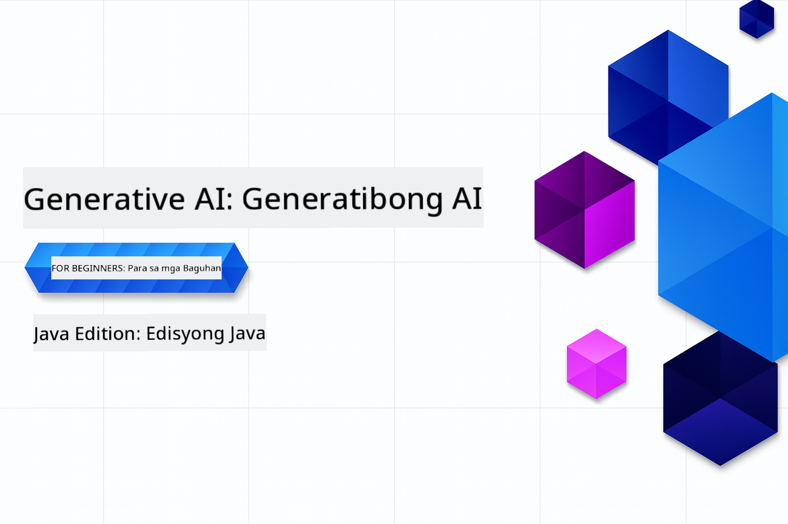

<!--
CO_OP_TRANSLATOR_METADATA:
{
  "original_hash": "0f080f1f2a635610b5f6eff5a58a9590",
  "translation_date": "2025-07-25T07:52:45+00:00",
  "source_file": "README.md",
  "language_code": "tl"
}
-->
# Generative AI para sa mga Baguhan - Java Edition

> **NOTE: Mabilisang Simula**: Ang buong kurso ay maaaring gawin online - Walang kinakailangang lokal na setup!
1. I-fork ang repository na ito sa iyong GitHub account
2. I-click ang **Code** → **Codespaces** tab → **...** → **New with options...**
3. Gamitin ang default settings – ito ang pipili ng Development container na ginawa para sa kursong ito
4. I-click ang **Create codespace**
5. Maghintay ng ~2 minuto para maging handa ang environment
6. Tumungo agad sa [Paglikha ng iyong GitHub Models Token](./02-SetupDevEnvironment/README.md#step-2-create-a-github-personal-access-token)

## Suporta sa Maraming Wika

### Sinusuportahan sa pamamagitan ng GitHub Action (Awtomatiko at Laging Napapanahon)

[French](../fr/README.md) | [Spanish](../es/README.md) | [German](../de/README.md) | [Russian](../ru/README.md) | [Arabic](../ar/README.md) | [Persian (Farsi)](../fa/README.md) | [Urdu](../ur/README.md) | [Chinese (Simplified)](../zh/README.md) | [Chinese (Traditional, Macau)](../mo/README.md) | [Chinese (Traditional, Hong Kong)](../hk/README.md) | [Chinese (Traditional, Taiwan)](../tw/README.md) | [Japanese](../ja/README.md) | [Korean](../ko/README.md) | [Hindi](../hi/README.md) | [Bengali](../bn/README.md) | [Marathi](../mr/README.md) | [Nepali](../ne/README.md) | [Punjabi (Gurmukhi)](../pa/README.md) | [Portuguese (Portugal)](../pt/README.md) | [Portuguese (Brazil)](../br/README.md) | [Italian](../it/README.md) | [Polish](../pl/README.md) | [Turkish](../tr/README.md) | [Greek](../el/README.md) | [Thai](../th/README.md) | [Swedish](../sv/README.md) | [Danish](../da/README.md) | [Norwegian](../no/README.md) | [Finnish](../fi/README.md) | [Dutch](../nl/README.md) | [Hebrew](../he/README.md) | [Vietnamese](../vi/README.md) | [Indonesian](../id/README.md) | [Malay](../ms/README.md) | [Tagalog (Filipino)](./README.md) | [Swahili](../sw/README.md) | [Hungarian](../hu/README.md) | [Czech](../cs/README.md) | [Slovak](../sk/README.md) | [Romanian](../ro/README.md) | [Bulgarian](../bg/README.md) | [Serbian (Cyrillic)](../sr/README.md) | [Croatian](../hr/README.md) | [Slovenian](../sl/README.md) | [Ukrainian](../uk/README.md) | [Burmese (Myanmar)](../my/README.md)

## Estruktura ng Kurso at Landas ng Pagkatuto

**Oras ng Pagsasagawa**: Ang pag-setup ng environment ay tumatagal ng 2 minuto, habang ang mga halimbawa ay nangangailangan ng 1-3 oras depende sa lalim ng pag-aaral. Ang buong workshop ay maaaring kumpletuhin online nang walang lokal na setup.

### **Kabanata 1: Panimula sa Generative AI**
- **Pangunahing Konsepto**: Pag-unawa sa Large Language Models, tokens, embeddings, at kakayahan ng AI
- **Java AI Ecosystem**: Pangkalahatang-ideya ng Spring AI at OpenAI SDKs
- **Model Context Protocol**: Panimula sa MCP at ang papel nito sa komunikasyon ng AI agent
- **Praktikal na Aplikasyon**: Mga totoong halimbawa tulad ng chatbots at content generation
- **[→ Simulan ang Kabanata 1](./01-IntroToGenAI/README.md)**

### **Kabanata 2: Pag-setup ng Development Environment**
- **Multi-Provider Configuration**: Pag-setup ng GitHub Models, Azure OpenAI, at OpenAI Java SDK integrations
- **Spring Boot + Spring AI**: Mga pinakamahusay na kasanayan para sa enterprise AI application development
- **GitHub Models**: Libreng access sa AI models para sa prototyping at pag-aaral (walang kinakailangang credit card)
- **Mga Kasangkapan sa Pag-develop**: Docker containers, VS Code, at GitHub Codespaces configuration
- **[→ Simulan ang Kabanata 2](./02-SetupDevEnvironment/README.md)**

### **Kabanata 3: Mga Pangunahing Teknik sa Generative AI**
- **Prompt Engineering**: Mga teknik para sa pinakamainam na tugon ng AI model
- **Embeddings at Vector Operations**: Pagsasagawa ng semantic search at similarity matching
- **Retrieval-Augmented Generation (RAG)**: Pagsasama ng AI sa sarili mong data sources
- **Function Calling**: Pagpapalawak ng kakayahan ng AI gamit ang custom tools at plugins
- **[→ Simulan ang Kabanata 3](./03-CoreGenerativeAITechniques/README.md)**

### **Kabanata 4: Praktikal na Aplikasyon at Mga Proyekto**
- **Pet Story Generator** (`petstory/`): Paglikha ng malikhaing nilalaman gamit ang GitHub Models
- **Foundry Local Demo** (`foundrylocal/`): Lokal na integrasyon ng AI model gamit ang OpenAI Java SDK
- **MCP Calculator Service** (`mcp/calculator/`): Pangunahing implementasyon ng Model Context Protocol gamit ang Spring AI
- **[→ Simulan ang Kabanata 4](./04-PracticalSamples/README.md)**

### **Kabanata 5: Responsableng Pag-develop ng AI**
- **GitHub Models Safety**: Subukan ang built-in na content filtering at safety mechanisms
- **Responsible AI Demo**: Hands-on na halimbawa kung paano gumagana ang AI safety filters sa praktika
- **Mga Pinakamahusay na Kasanayan**: Mahahalagang gabay para sa etikal na pag-develop at deployment ng AI
- **[→ Simulan ang Kabanata 5](./05-ResponsibleGenAI/README.md)**

## Karagdagang Mga Mapagkukunan 

- [AI Agents For Beginners](https://github.com/microsoft/ai-agents-for-beginners)
- [Generative AI for Beginners using .NET](https://github.com/microsoft/Generative-AI-for-beginners-dotnet)
- [Generative AI for Beginners using JavaScript](https://github.com/microsoft/generative-ai-with-javascript)
- [Generative AI for Beginners](https://github.com/microsoft/generative-ai-for-beginners)
- [ML for Beginners](https://aka.ms/ml-beginners)
- [Data Science for Beginners](https://aka.ms/datascience-beginners)
- [AI for Beginners](https://aka.ms/ai-beginners)
- [Cybersecurity for Beginners](https://github.com/microsoft/Security-101)
- [Web Dev for Beginners](https://aka.ms/webdev-beginners)
- [IoT for Beginners](https://aka.ms/iot-beginners)
- [XR Development for Beginners](https://github.com/microsoft/xr-development-for-beginners)
- [Mastering GitHub Copilot for AI Paired Programming](https://aka.ms/GitHubCopilotAI)
- [Mastering GitHub Copilot for C#/.NET Developers](https://github.com/microsoft/mastering-github-copilot-for-dotnet-csharp-developers)
- [Choose Your Own Copilot Adventure](https://github.com/microsoft/CopilotAdventures)
- [RAG Chat App with Azure AI Services](https://github.com/Azure-Samples/azure-search-openai-demo-java)

**Paunawa**:  
Ang dokumentong ito ay isinalin gamit ang AI translation service na [Co-op Translator](https://github.com/Azure/co-op-translator). Bagama't sinisikap naming maging tumpak, pakitandaan na ang mga awtomatikong pagsasalin ay maaaring maglaman ng mga pagkakamali o hindi pagkakatugma. Ang orihinal na dokumento sa kanyang katutubong wika ang dapat ituring na opisyal na pinagmulan. Para sa mahalagang impormasyon, inirerekomenda ang propesyonal na pagsasalin ng tao. Hindi kami mananagot sa anumang hindi pagkakaunawaan o maling interpretasyon na maaaring magmula sa paggamit ng pagsasaling ito.