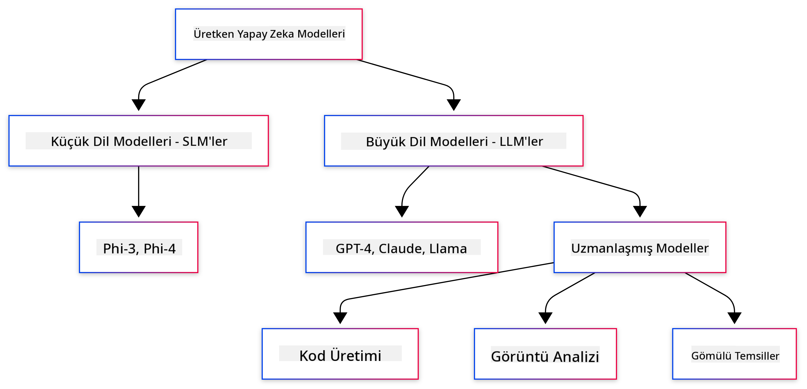

<!--
CO_OP_TRANSLATOR_METADATA:
{
  "original_hash": "006866db93a268a8769bb55f2e324291",
  "translation_date": "2025-07-28T10:46:39+00:00",
  "source_file": "01-IntroToGenAI/README.md",
  "language_code": "tr"
}
-->
# Generatif Yapay Zeka'ya Giriş - Java Sürümü

## Öğrenecekleriniz

- **Generatif Yapay Zeka temelleri**, LLM'ler, prompt mühendisliği, tokenlar, gömme (embedding) ve vektör veritabanları dahil
- **Java için Yapay Zeka geliştirme araçlarını karşılaştırma**, Azure OpenAI SDK, Spring AI ve OpenAI Java SDK dahil
- **Model Bağlam Protokolü'nü (MCP)** ve yapay zeka ajanlarının iletişimindeki rolünü keşfetme

## İçindekiler

- [Giriş](../../../01-IntroToGenAI)
- [Generatif Yapay Zeka kavramlarına hızlı bir bakış](../../../01-IntroToGenAI)
- [Prompt mühendisliği incelemesi](../../../01-IntroToGenAI)
- [Tokenlar, gömme ve ajanlar](../../../01-IntroToGenAI)
- [Java için Yapay Zeka Geliştirme Araçları ve Kütüphaneleri](../../../01-IntroToGenAI)
  - [OpenAI Java SDK](../../../01-IntroToGenAI)
  - [Spring AI](../../../01-IntroToGenAI)
  - [Azure OpenAI Java SDK](../../../01-IntroToGenAI)
- [Özet](../../../01-IntroToGenAI)
- [Sonraki Adımlar](../../../01-IntroToGenAI)

## Giriş

Generatif Yapay Zeka'ya Giriş - Java Sürümü'nün ilk bölümüne hoş geldiniz! Bu temel ders, generatif yapay zekanın ana kavramlarını ve bunlarla Java kullanarak nasıl çalışacağınızı tanıtıyor. Büyük Dil Modelleri (LLM'ler), tokenlar, gömme ve yapay zeka ajanları gibi yapay zeka uygulamalarının temel yapı taşlarını öğreneceksiniz. Ayrıca, bu kurs boyunca kullanacağınız temel Java araçlarını da keşfedeceğiz.

### Generatif Yapay Zeka kavramlarına hızlı bir bakış

Generatif yapay zeka, verilerden öğrenilen desenler ve ilişkiler temelinde yeni içerik (metin, görsel veya kod gibi) oluşturan bir yapay zeka türüdür. Generatif yapay zeka modelleri, insan benzeri yanıtlar üretebilir, bağlamı anlayabilir ve bazen insan yapımı gibi görünen içerikler oluşturabilir.

Java ile yapay zeka uygulamaları geliştirirken, **generatif yapay zeka modelleri** ile içerik oluşturacaksınız. Generatif yapay zeka modellerinin bazı yetenekleri şunlardır:

- **Metin Üretimi**: Sohbet botları, içerik ve metin tamamlama için insan benzeri metinler oluşturma.
- **Görsel Üretimi ve Analizi**: Gerçekçi görseller oluşturma, fotoğrafları iyileştirme ve nesneleri algılama.
- **Kod Üretimi**: Kod parçacıkları veya betikler yazma.

Farklı görevler için optimize edilmiş belirli model türleri vardır. Örneğin, hem **Küçük Dil Modelleri (SLM'ler)** hem de **Büyük Dil Modelleri (LLM'ler)** metin üretimi yapabilir, ancak LLM'ler genellikle karmaşık görevlerde daha iyi performans sunar. Görsel ile ilgili görevler için ise özel görsel modeller veya çok modlu modeller kullanılır.

Tabii ki, bu modellerin yanıtları her zaman mükemmel değildir. Modellerin "halüsinasyon" yaparak otoriter bir şekilde yanlış bilgi ürettiğini duymuş olabilirsiniz. Ancak, modellere net talimatlar ve bağlam sağlayarak daha iyi yanıtlar üretmelerine yardımcı olabilirsiniz. İşte burada **prompt mühendisliği** devreye girer.

#### Prompt mühendisliği incelemesi

Prompt mühendisliği, yapay zeka modellerini istenen çıktılara yönlendirmek için etkili girdiler tasarlama pratiğidir. Şunları içerir:

- **Açıklık**: Talimatları net ve anlaşılır hale getirme.
- **Bağlam**: Gerekli arka plan bilgisini sağlama.
- **Kısıtlamalar**: Herhangi bir sınırlama veya format belirtme.

Prompt mühendisliği için bazı en iyi uygulamalar şunlardır: prompt tasarımı, net talimatlar, görevlerin parçalanması, tek örnekli ve az örnekli öğrenme, ve prompt ayarlama. Belirli bir kullanım durumu için en iyi sonucu bulmak adına farklı promptları test etmek önemlidir.

Uygulama geliştirirken, farklı prompt türleriyle çalışacaksınız:
- **Sistem promptları**: Modelin davranışı için temel kuralları ve bağlamı belirler.
- **Kullanıcı promptları**: Uygulama kullanıcılarınızdan gelen giriş verileri.
- **Asistan promptları**: Sistem ve kullanıcı promptlarına dayalı olarak modelin yanıtları.

> **Daha fazla bilgi edinin**: Generatif Yapay Zeka için Başlangıç Kursu'nun [Prompt Mühendisliği bölümü](https://github.com/microsoft/generative-ai-for-beginners/tree/main/04-prompt-engineering-fundamentals) hakkında daha fazla bilgi edinin.

#### Tokenlar, gömme ve ajanlar

Generatif yapay zeka modelleriyle çalışırken **tokenlar**, **gömme**, **ajanlar** ve **Model Bağlam Protokolü (MCP)** gibi terimlerle karşılaşacaksınız. İşte bu kavramların ayrıntılı bir incelemesi:

- **Tokenlar**: Tokenlar, bir modeldeki en küçük metin birimidir. Kelimeler, karakterler veya alt kelimeler olabilir. Tokenlar, metin verilerini modelin anlayabileceği bir formata dönüştürmek için kullanılır. Örneğin, "The quick brown fox jumped over the lazy dog" cümlesi, kullanılan tokenizasyon stratejisine bağlı olarak ["The", " quick", " brown", " fox", " jumped", " over", " the", " lazy", " dog"] veya ["The", " qu", "ick", " br", "own", " fox", " jump", "ed", " over", " the", " la", "zy", " dog"] şeklinde tokenlara ayrılabilir.

Tokenizasyon, metni bu daha küçük birimlere ayırma sürecidir. Bu önemlidir çünkü modeller ham metin yerine tokenlarla çalışır. Bir prompttaki token sayısı, modelin yanıt uzunluğunu ve kalitesini etkiler; çünkü modellerin bağlam penceresi için token sınırları vardır (örneğin, GPT-4'ün toplam bağlamı için 128K token, giriş ve çıkış dahil).

  Java'da, OpenAI SDK gibi kütüphaneleri kullanarak tokenizasyonu otomatik olarak gerçekleştirebilirsiniz.

- **Gömme (Embeddings)**: Gömme, tokenların anlamsal anlamını yakalayan vektör temsilleridir. Bunlar, modellerin kelimeler arasındaki ilişkileri anlamasına ve bağlamsal olarak uygun yanıtlar oluşturmasına olanak tanıyan sayısal temsillerdir (genellikle kayan noktalı sayı dizileri). Benzer kelimeler benzer gömme değerlerine sahiptir, bu da modelin eş anlamlılar ve anlamsal ilişkiler gibi kavramları anlamasını sağlar.

  Java'da, OpenAI SDK veya gömme oluşturmayı destekleyen diğer kütüphaneleri kullanarak gömme oluşturabilirsiniz. Bu gömmeler, anlamsal arama gibi görevler için gereklidir; burada, tam metin eşleşmeleri yerine anlam temelinde benzer içerik bulmak istersiniz.

- **Vektör veritabanları**: Vektör veritabanları, gömmeler için optimize edilmiş özel depolama sistemleridir. Anlamsal benzerlik temelinde verimli bir şekilde arama yapmayı sağlar ve Retrieval-Augmented Generation (RAG) desenlerinde, büyük veri kümelerinden anlamlı bilgiler bulmak için kritik öneme sahiptir.

> **Not**: Bu kursta vektör veritabanlarını ele almayacağız, ancak gerçek dünya uygulamalarında yaygın olarak kullanıldıkları için bahsetmeye değer buluyoruz.

- **Ajanlar ve MCP**: Modeller, araçlar ve harici sistemlerle otonom olarak etkileşimde bulunan yapay zeka bileşenleridir. Model Bağlam Protokolü (MCP), ajanların harici veri kaynaklarına ve araçlara güvenli bir şekilde erişmesi için standart bir yol sağlar. Daha fazla bilgi için [MCP for Beginners](https://github.com/microsoft/mcp-for-beginners) kursumuza göz atın.

Java yapay zeka uygulamalarında, metin işleme için tokenlar, anlamsal arama ve RAG için gömme, veri geri alımı için vektör veritabanları ve araç kullanan akıllı sistemler oluşturmak için MCP ile ajanlar kullanacaksınız.

### Java için Yapay Zeka Geliştirme Araçları ve Kütüphaneleri

Java, yapay zeka geliştirme için mükemmel araçlar sunar. Bu kurs boyunca keşfedeceğimiz üç ana kütüphane vardır: OpenAI Java SDK, Azure OpenAI SDK ve Spring AI.

İşte her bölümde hangi SDK'nın kullanıldığını gösteren hızlı bir referans tablosu:

| Bölüm | Örnek | SDK |
|-------|-------|-----|
| 02-GeliştirmeOrtamınıKur | github-models | OpenAI Java SDK |
| 02-GeliştirmeOrtamınıKur | basic-chat-azure | Spring AI Azure OpenAI |
| 03-GeneratifYapayZekaTeknikleri | örnekler | Azure OpenAI SDK |
| 04-PratikÖrnekler | petstory | OpenAI Java SDK |
| 04-PratikÖrnekler | foundrylocal | OpenAI Java SDK |
| 04-PratikÖrnekler | calculator | Spring AI MCP SDK + LangChain4j |

**SDK Dokümantasyon Bağlantıları:**
- [Azure OpenAI Java SDK](https://github.com/Azure/azure-sdk-for-java/tree/azure-ai-openai_1.0.0-beta.16/sdk/openai/azure-ai-openai)
- [Spring AI](https://docs.spring.io/spring-ai/reference/)
- [OpenAI Java SDK](https://github.com/openai/openai-java)
- [LangChain4j](https://docs.langchain4j.dev/)

#### OpenAI Java SDK

OpenAI SDK, OpenAI API için resmi Java kütüphanesidir. OpenAI'nin modelleriyle etkileşim için basit ve tutarlı bir arayüz sağlar, bu da yapay zeka yeteneklerini Java uygulamalarına entegre etmeyi kolaylaştırır. Bölüm 2'deki GitHub Modelleri örneği, Bölüm 4'teki Pet Story uygulaması ve Foundry Local örneği, OpenAI SDK yaklaşımını göstermektedir.

#### Spring AI

Spring AI, farklı yapay zeka sağlayıcıları arasında tutarlı bir soyutlama katmanı sağlayarak Spring uygulamalarına yapay zeka yetenekleri getiren kapsamlı bir çerçevedir. Spring ekosistemiyle sorunsuz bir şekilde entegre olur ve yapay zeka yeteneklerine ihtiyaç duyan kurumsal Java uygulamaları için ideal bir seçimdir.

Spring AI'nin gücü, Spring ekosistemiyle sorunsuz entegrasyonunda yatar ve bağımlılık enjeksiyonu, yapılandırma yönetimi ve test çerçeveleri gibi tanıdık Spring desenleriyle üretime hazır yapay zeka uygulamaları oluşturmayı kolaylaştırır. Bölüm 2 ve 4'te, hem OpenAI hem de Model Bağlam Protokolü (MCP) Spring AI kütüphanelerinden yararlanan uygulamalar oluşturacaksınız.

##### Model Bağlam Protokolü (MCP)

[Model Bağlam Protokolü (MCP)](https://modelcontextprotocol.io/), yapay zeka uygulamalarının harici veri kaynakları ve araçlarla güvenli bir şekilde etkileşim kurmasını sağlayan yeni bir standarttır. MCP, yapay zeka modellerinin bağlamsal bilgilere erişmesi ve uygulamalarınızda eylemler gerçekleştirmesi için standart bir yol sağlar.

Bölüm 4'te, Spring AI ile Model Bağlam Protokolü'nün temellerini gösteren basit bir MCP hesap makinesi hizmeti oluşturacaksınız. Bu, temel araç entegrasyonları ve hizmet mimarileri oluşturmayı gösterecektir.

#### Azure OpenAI Java SDK

Azure OpenAI Java istemci kütüphanesi, OpenAI'nin REST API'lerinin bir adaptasyonu olup, Azure SDK ekosistemiyle uyumlu bir arayüz sağlar. Bölüm 3'te, sohbet uygulamaları, işlev çağrısı ve RAG (Retrieval-Augmented Generation) desenleri dahil olmak üzere Azure OpenAI SDK kullanarak uygulamalar oluşturacaksınız.

> Not: Azure OpenAI SDK, özellikler açısından OpenAI Java SDK'nın gerisinde kalmaktadır, bu nedenle gelecekteki projeler için OpenAI Java SDK'yı kullanmayı düşünün.

## Özet

**Tebrikler!** Başarıyla:

- **Generatif Yapay Zeka temellerini öğrendiniz**, LLM'ler, prompt mühendisliği, tokenlar, gömme ve vektör veritabanları dahil
- **Java için Yapay Zeka geliştirme araçlarını karşılaştırdınız**, Azure OpenAI SDK, Spring AI ve OpenAI Java SDK dahil
- **Model Bağlam Protokolü'nü keşfettiniz** ve yapay zeka ajanlarının iletişimindeki rolünü öğrendiniz

## Sonraki Adımlar

[2. Bölüm: Geliştirme Ortamını Kurma](../02-SetupDevEnvironment/README.md)

**Feragatname**:  
Bu belge, AI çeviri hizmeti [Co-op Translator](https://github.com/Azure/co-op-translator) kullanılarak çevrilmiştir. Doğruluk için çaba göstersek de, otomatik çevirilerin hata veya yanlışlık içerebileceğini lütfen unutmayın. Belgenin orijinal dili, yetkili kaynak olarak kabul edilmelidir. Kritik bilgiler için profesyonel insan çevirisi önerilir. Bu çevirinin kullanımından kaynaklanan yanlış anlamalar veya yanlış yorumlamalar için sorumluluk kabul etmiyoruz.