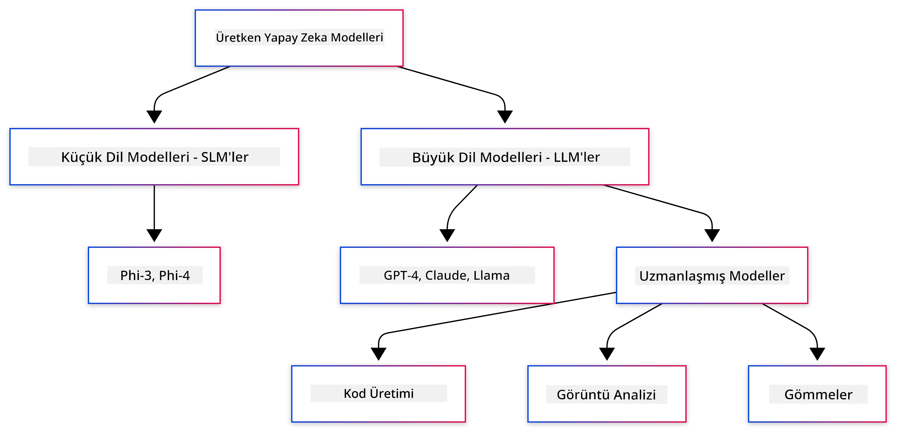
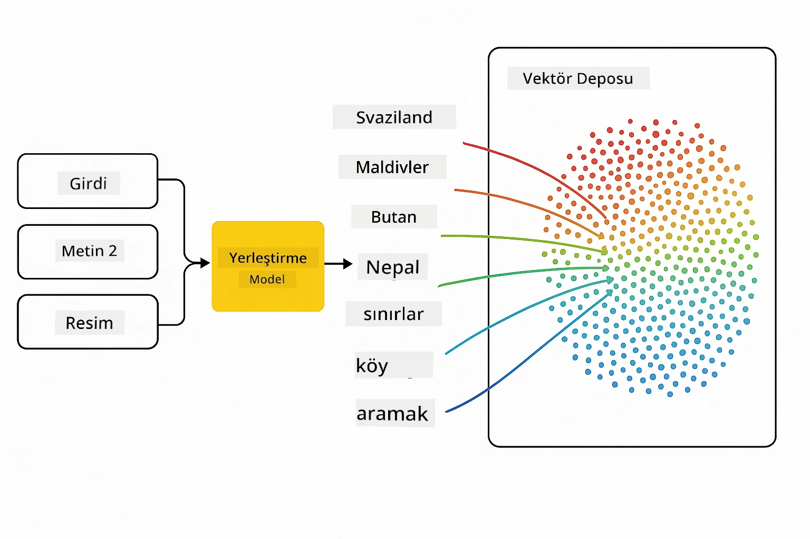
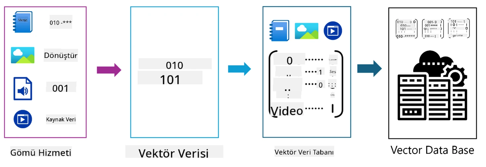
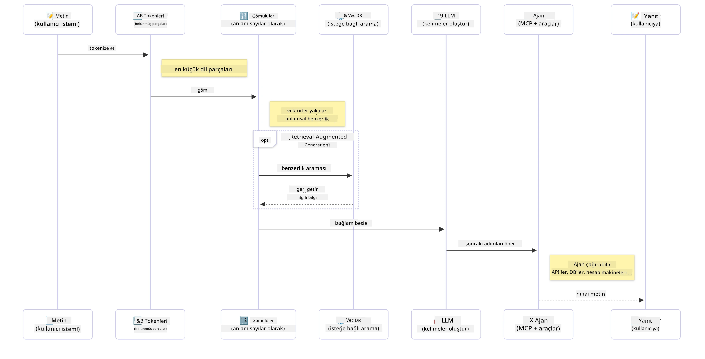

# Java Sürümü - Üretken Yapay Zekaya Giriş

## Öğrenecekleriniz

- **Üretken yapay zeka temelleri**, LLM'ler, istem mühendisliği, tokenlar, gömüler ve vektör veritabanları dahil
- **Java yapay zeka geliştirme araçlarını karşılaştırma**, Azure OpenAI SDK, Spring AI ve OpenAI Java SDK dahil
- **Model Context Protocol'ü keşfetme** ve yapay zeka ajanlarının iletişimindeki rolü

## İçindekiler

- [Giriş](../../../01-IntroToGenAI)
- [Üretken yapay zeka kavramlarına hızlı bir bakış](../../../01-IntroToGenAI)
- [İstem mühendisliği incelemesi](../../../01-IntroToGenAI)
- [Tokenlar, gömüler ve ajanlar](../../../01-IntroToGenAI)
- [Java için Yapay Zeka Geliştirme Araçları ve Kütüphaneleri](../../../01-IntroToGenAI)
  - [OpenAI Java SDK](../../../01-IntroToGenAI)
  - [Spring AI](../../../01-IntroToGenAI)
  - [Azure OpenAI Java SDK](../../../01-IntroToGenAI)
- [Özet](../../../01-IntroToGenAI)
- [Sonraki Adımlar](../../../01-IntroToGenAI)

## Giriş

Üretken Yapay Zeka için Başlangıç - Java Sürümü'nün ilk bölümüne hoş geldiniz! Bu temel ders, üretken yapay zekanın ana kavramlarını ve Java kullanarak bunlarla nasıl çalışacağınızı tanıtır. Büyük Dil Modelleri (LLM'ler), tokenlar, gömüler ve yapay zeka ajanları gibi yapay zeka uygulamalarının temel yapı taşlarını öğreneceksiniz. Ayrıca, bu kurs boyunca kullanacağınız temel Java araçlarını da keşfedeceğiz.

### Üretken yapay zeka kavramlarına hızlı bir bakış

Üretken yapay zeka, veri üzerinden öğrenilen desenler ve ilişkiler temelinde yeni içerik (metin, görüntü veya kod gibi) oluşturan bir yapay zeka türüdür. Üretken yapay zeka modelleri, insan benzeri yanıtlar oluşturabilir, bağlamı anlayabilir ve bazen insan benzeri görünen içerikler bile üretebilir.

Java yapay zeka uygulamalarınızı geliştirirken, **üretken yapay zeka modelleri** ile içerik oluşturacaksınız. Üretken yapay zeka modellerinin bazı yetenekleri şunlardır:

- **Metin Üretimi**: Sohbet botları, içerik ve metin tamamlama için insan benzeri metinler oluşturma.
- **Görüntü Üretimi ve Analizi**: Gerçekçi görüntüler oluşturma, fotoğrafları iyileştirme ve nesneleri algılama.
- **Kod Üretimi**: Kod parçacıkları veya betikler yazma.

Farklı görevler için optimize edilmiş belirli model türleri vardır. Örneğin, hem **Küçük Dil Modelleri (SLM'ler)** hem de **Büyük Dil Modelleri (LLM'ler)** metin üretimini ele alabilir, ancak LLM'ler genellikle karmaşık görevler için daha iyi performans sunar. Görüntüyle ilgili görevler için özel görsel modeller veya çok modlu modeller kullanırsınız.

Tabii ki, bu modellerin yanıtları her zaman mükemmel değildir. Muhtemelen modellerin "halüsinasyon görmesi" veya otoriter bir şekilde yanlış bilgi üretmesi hakkında bir şeyler duymuşsunuzdur. Ancak, modele net talimatlar ve bağlam sağlayarak daha iyi yanıtlar oluşturmasına yardımcı olabilirsiniz. İşte burada **istem mühendisliği** devreye girer.

#### İstem mühendisliği incelemesi

İstem mühendisliği, yapay zeka modellerini istenen çıktılara yönlendirmek için etkili girdiler tasarlama uygulamasıdır. Şunları içerir:

- **Açıklık**: Talimatları net ve anlaşılır hale getirme.
- **Bağlam**: Gerekli arka plan bilgilerini sağlama.
- **Kısıtlamalar**: Herhangi bir sınırlama veya format belirtme.

İstem mühendisliği için en iyi uygulamalar arasında istem tasarımı, net talimatlar, görev ayrımı, tek örnekli ve az örnekli öğrenme ve istem ayarlama yer alır. Belirli kullanım durumunuz için en iyi çalışanı bulmak adına farklı istemleri test etmek önemlidir.

Uygulamalar geliştirirken farklı istem türleriyle çalışacaksınız:
- **Sistem istemleri**: Modelin davranışı için temel kuralları ve bağlamı belirler
- **Kullanıcı istemleri**: Uygulama kullanıcılarınızdan gelen giriş verileri
- **Asistan istemleri**: Sistem ve kullanıcı istemlerine dayalı olarak modelin yanıtları

> **Daha fazla bilgi edinin**: Üretken Yapay Zeka için Başlangıç kursunun [İstem Mühendisliği bölümü](https://github.com/microsoft/generative-ai-for-beginners/tree/main/04-prompt-engineering-fundamentals) hakkında daha fazla bilgi edinin.

#### Tokenlar, gömüler ve ajanlar

Üretken yapay zeka modelleriyle çalışırken **tokenlar**, **gömüler**, **ajanlar** ve **Model Context Protocol (MCP)** gibi terimlerle karşılaşacaksınız. İşte bu kavramların ayrıntılı bir özeti:

- **Tokenlar**: Tokenlar, bir modeldeki metnin en küçük birimidir. Kelimeler, karakterler veya alt kelimeler olabilir. Tokenlar, metin verilerini modelin anlayabileceği bir formatta temsil etmek için kullanılır. Örneğin, "The quick brown fox jumped over the lazy dog" cümlesi, kullanılan tokenizasyon stratejisine bağlı olarak ["The", " quick", " brown", " fox", " jumped", " over", " the", " lazy", " dog"] veya ["The", " qu", "ick", " br", "own", " fox", " jump", "ed", " over", " the", " la", "zy", " dog"] şeklinde tokenlara ayrılabilir.

Tokenizasyon, metni bu küçük birimlere ayırma sürecidir. Bu önemlidir çünkü modeller ham metin yerine tokenlar üzerinde çalışır. Bir istemdeki token sayısı, modelin yanıt uzunluğunu ve kalitesini etkiler, çünkü modellerin bağlam penceresi için token sınırları vardır (örneğin, GPT-4o'nun toplam bağlamı için 128K token, giriş ve çıkış dahil).

  Java'da, OpenAI SDK gibi kütüphaneleri kullanarak tokenizasyonu otomatik olarak yapabilir ve yapay zeka modellerine istek gönderirken bu işlemi gerçekleştirebilirsiniz.

- **Gömüler**: Gömüler, tokenların anlamsal anlamını yakalayan vektör temsilleridir. Bunlar, kelimeler arasındaki ilişkileri anlamalarına ve bağlamsal olarak uygun yanıtlar oluşturmalarına olanak tanıyan sayısal temsillerdir (genellikle kayan noktalı sayı dizileri). Benzer kelimeler benzer gömülere sahiptir, bu da modelin eş anlamlılar ve anlamsal ilişkiler gibi kavramları anlamasını sağlar.

  Java'da, OpenAI SDK veya gömü oluşturmayı destekleyen diğer kütüphaneler kullanarak gömüler oluşturabilirsiniz. Bu gömüler, anlamsal arama gibi görevler için önemlidir; burada, tam metin eşleşmeleri yerine anlam temelinde benzer içerik bulmak istersiniz.

- **Vektör veritabanları**: Vektör veritabanları, gömüler için optimize edilmiş özel depolama sistemleridir. Anlamsal benzerlik temelinde büyük veri kümelerinden ilgili bilgileri bulmanız gereken Retrieval-Augmented Generation (RAG) desenleri için verimli benzerlik araması sağlarlar.

> **Not**: Bu kursta vektör veritabanlarını ele almayacağız, ancak gerçek dünya uygulamalarında yaygın olarak kullanıldıkları için bahsetmeye değer olduklarını düşünüyoruz.

- **Ajanlar ve MCP**: Modeller, araçlar ve harici sistemlerle otonom olarak etkileşimde bulunan yapay zeka bileşenleridir. Model Context Protocol (MCP), ajanların harici veri kaynaklarına ve araçlara güvenli bir şekilde erişmesi için standart bir yol sağlar. Daha fazla bilgi için [MCP for Beginners](https://github.com/microsoft/mcp-for-beginners) kursumuza göz atın.

Java yapay zeka uygulamalarında, metin işleme için tokenları, anlamsal arama ve RAG için gömüleri, veri alımı için vektör veritabanlarını ve harici araçları kullanan akıllı sistemler oluşturmak için MCP ile ajanları kullanacaksınız.

### Java için Yapay Zeka Geliştirme Araçları ve Kütüphaneleri

Java, yapay zeka geliştirme için mükemmel araçlar sunar. Bu kurs boyunca keşfedeceğimiz üç ana kütüphane vardır - OpenAI Java SDK, Azure OpenAI SDK ve Spring AI.

İşte her bölümdeki örneklerde hangi SDK'nın kullanıldığını gösteren hızlı bir referans tablosu:

| Bölüm | Örnek | SDK |
|-------|-------|-----|
| 02-SetupDevEnvironment | github-models | OpenAI Java SDK |
| 02-SetupDevEnvironment | basic-chat-azure | Spring AI Azure OpenAI |
| 03-CoreGenerativeAITechniques | examples | Azure OpenAI SDK |
| 04-PracticalSamples | petstory | OpenAI Java SDK |
| 04-PracticalSamples | foundrylocal | OpenAI Java SDK |
| 04-PracticalSamples | calculator | Spring AI MCP SDK + LangChain4j |

**SDK Dokümantasyon Bağlantıları:**
- [Azure OpenAI Java SDK](https://github.com/Azure/azure-sdk-for-java/tree/azure-ai-openai_1.0.0-beta.16/sdk/openai/azure-ai-openai)
- [Spring AI](https://docs.spring.io/spring-ai/reference/)
- [OpenAI Java SDK](https://github.com/openai/openai-java)
- [LangChain4j](https://docs.langchain4j.dev/)

#### OpenAI Java SDK

OpenAI SDK, OpenAI API için resmi Java kütüphanesidir. OpenAI'nin modelleriyle etkileşim için basit ve tutarlı bir arayüz sağlar, Java uygulamalarına yapay zeka yeteneklerini entegre etmeyi kolaylaştırır. Bölüm 2'nin GitHub Modelleri örneği, Bölüm 4'ün Pet Hikayesi uygulaması ve Foundry Local örneği OpenAI SDK yaklaşımını gösterir.

#### Spring AI

Spring AI, Spring uygulamalarına yapay zeka yetenekleri kazandıran kapsamlı bir çerçevedir ve farklı yapay zeka sağlayıcıları arasında tutarlı bir soyutlama katmanı sağlar. Spring ekosistemiyle sorunsuz bir şekilde entegre olur, yapay zeka yeteneklerine ihtiyaç duyan kurumsal Java uygulamaları için ideal bir seçimdir.

Spring AI'nın gücü, Spring ekosistemiyle sorunsuz entegrasyonunda yatar ve bağımlılık enjeksiyonu, yapılandırma yönetimi ve test çerçeveleri gibi tanıdık Spring desenleriyle üretime hazır yapay zeka uygulamaları oluşturmayı kolaylaştırır. Bölüm 2 ve 4'te, hem OpenAI hem de Model Context Protocol (MCP) Spring AI kütüphanelerinden yararlanan uygulamalar oluşturmak için Spring AI kullanacaksınız.

##### Model Context Protocol (MCP)

[Model Context Protocol (MCP)](https://modelcontextprotocol.io/), yapay zeka uygulamalarının harici veri kaynakları ve araçlarla güvenli bir şekilde etkileşimde bulunmasını sağlayan yeni bir standarttır. MCP, yapay zeka modellerinin bağlamsal bilgilere erişmesi ve uygulamalarınızda eylemler gerçekleştirmesi için standart bir yol sağlar.

Bölüm 4'te, Spring AI ile Model Context Protocol'ün temellerini gösteren basit bir MCP hesap makinesi hizmeti oluşturacak ve temel araç entegrasyonları ve hizmet mimarilerini nasıl oluşturacağınızı göstereceksiniz.

#### Azure OpenAI Java SDK

Azure OpenAI Java istemci kütüphanesi, OpenAI'nin REST API'lerinin bir adaptasyonudur ve Azure SDK ekosisteminin geri kalanıyla entegrasyon sağlayan idiyomatik bir arayüz sunar. Bölüm 3'te, Azure OpenAI SDK kullanarak sohbet uygulamaları, işlev çağrıları ve RAG (Retrieval-Augmented Generation) desenleri dahil uygulamalar oluşturacaksınız.

> Not: Azure OpenAI SDK, özellikler açısından OpenAI Java SDK'nın gerisinde kalıyor, bu nedenle gelecekteki projeler için OpenAI Java SDK'yı kullanmayı düşünün.

## Özet

Temelleri tamamladık! Artık şunları anlıyorsunuz:

- Üretken yapay zekanın temel kavramları - LLM'lerden istem mühendisliğine, tokenlardan gömülere ve vektör veritabanlarına kadar
- Java yapay zeka geliştirme için araç seçenekleriniz: Azure OpenAI SDK, Spring AI ve OpenAI Java SDK
- Model Context Protocol'ün ne olduğu ve yapay zeka ajanlarının harici araçlarla çalışmasını nasıl sağladığı

## Sonraki Adımlar

[2. Bölüm: Geliştirme Ortamını Ayarlama](../02-SetupDevEnvironment/README.md)

**Feragatname**:  
Bu belge, AI çeviri hizmeti [Co-op Translator](https://github.com/Azure/co-op-translator) kullanılarak çevrilmiştir. Doğruluk için çaba göstersek de, otomatik çevirilerin hata veya yanlışlıklar içerebileceğini lütfen unutmayın. Belgenin orijinal dili, yetkili kaynak olarak kabul edilmelidir. Kritik bilgiler için profesyonel insan çevirisi önerilir. Bu çevirinin kullanımından kaynaklanan yanlış anlamalar veya yanlış yorumlamalardan sorumlu değiliz.