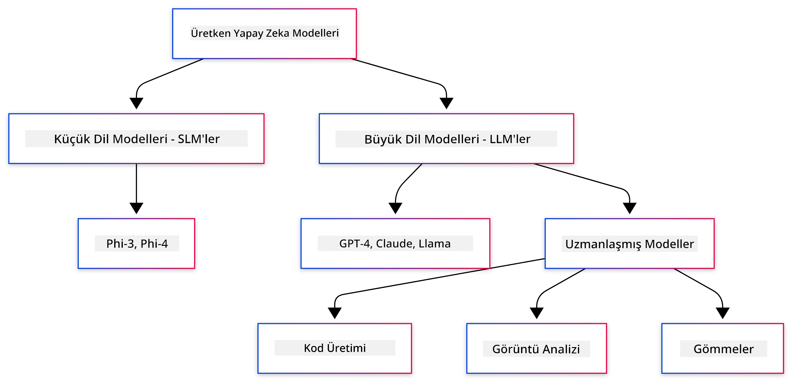
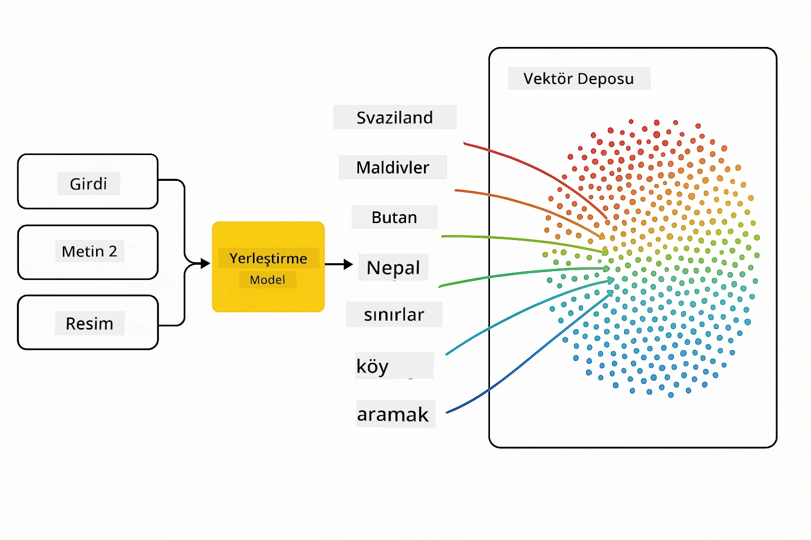
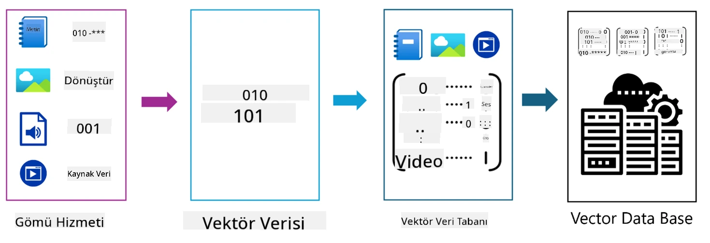
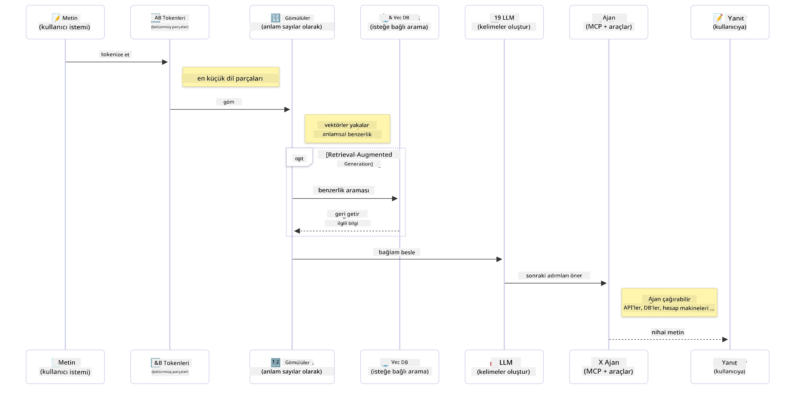

# Generatif Yapay Zekaya Giriş - Java Sürümü

> **Video**: [Bu dersin video genel bakışını YouTube'da izleyin.](https://www.youtube.com/watch?v=XH46tGp_eSw) Yukarıdaki küçük resim görüntüsüne de tıklayabilirsiniz.

## Öğrenecekleriniz

- LLM'ler, prompt mühendisliği, tokenlar, gömme (embedding) ve vektör veritabanları dahil **Generatif Yapay Zeka temelleri**
- Azure OpenAI SDK, Spring AI ve OpenAI Java SDK gibi **Java AI geliştirme araçlarını karşılaştırma**
- AI ajan iletişiminde rolü olan **Model Context Protocol**ü keşfetme

## İçindekiler

- [Giriş](#giriş)
- [Generatif Yapay Zeka kavramlarına hızlı bir genel bakış](#generatif-yapay-zeka-kavramlarına-hızlı-bir-genel-bakış)
- [Prompt mühendisliği incelemesi](#prompt-mühendisliği-incelemesi)
- [Tokenlar, gömme işlemleri ve ajanlar](#tokenlar-gömme-işlemleri-ve-ajanlar)
- [Java için AI Geliştirme Araçları ve Kütüphaneler](#java-için-ai-geliştirme-araçları-ve-kütüphaneler)
  - [OpenAI Java SDK](#openai-java-sdk)
  - [Spring AI](#spring-ai)
  - [Azure OpenAI Java SDK](#azure-openai-java-sdk)
- [Özet](#özet)
- [Sonraki Adımlar](#sonraki-adımlar)

## Giriş

Başlangıç Seviyesi Generatif Yapay Zeka - Java Sürümü’nün ilk bölümüne hoş geldiniz! Bu temel ders, size generatif yapay zekanın ana kavramlarını ve Java kullanarak bunlarla nasıl çalışılacağını tanıtıyor. Büyük Dil Modelleri (LLM’ler), tokenlar, gömme işlemleri ve AI ajanları dahil olmak üzere AI uygulamalarının temel yapı taşlarını öğreneceksiniz. Ayrıca, bu kurs boyunca kullanacağınız ana Java araçlarını da keşfedeceğiz.

### Generatif Yapay Zeka kavramlarına hızlı bir genel bakış

Generatif Yapay Zeka, veriyle öğrenilen örüntü ve ilişkilerden yola çıkarak metin, görüntü veya kod gibi yeni içerikler oluşturan bir yapay zeka türüdür. Generatif AI modelleri, insan benzeri yanıtlar oluşturabilir, bağlamı anlayabilir ve bazen insan benzeri görünen içerik yaratabilir.

Java yapay zeka uygulamalarınızı geliştirirken, içerik oluşturmak için **generatif AI modelleri**yle çalışacaksınız. Bazı generatif AI modeli yetenekleri şunlardır:

- **Metin Üretimi**: Sohbet robotları, içerik üretimi ve metin tamamlama için insan benzeri metinler oluşturma.
- **Görüntü Oluşturma ve Analizi**: Gerçekçi görüntüler üretme, fotoğrafları iyileştirme ve nesne algılama.
- **Kod Üretimi**: Kod parçacıkları veya betikler yazma.

Farklı görevler için optimize edilmiş özel model türleri vardır. Örneğin, hem **Küçük Dil Modelleri (SLM’ler)** hem de **Büyük Dil Modelleri (LLM’ler)** metin üretimini işleyebilir; ancak karmaşık görevlerde LLM genellikle daha iyi performans sunar. Görüntüyle ilgili görevlerde, özel görüş modelleri veya çok modlu modeller kullanılır.

Elbette, bu modellerin yanıtları her zaman mükemmel değildir. Modellerin "halüsinasyon" yapabildiğini veya otoriter bir şekilde yanlış bilgi üretebildiğini duymuşsunuzdur. Ancak, onlara net talimatlar ve bağlam sunarak daha iyi yanıtlar üretmelerine yardımcı olabilirsiniz. İşte burada **prompt mühendisliği** devreye girer.

#### Prompt mühendisliği incelemesi

Prompt mühendisliği, AI modellerini istenen çıktılara yönlendirmek için etkili girdiler tasarlama uygulamasıdır. Şunları içerir:

- **Açıklık**: Talimatların net ve belirsiz olmaması.
- **Bağlam**: Gerekli arka plan bilgisinin sağlanması.
- **Kısıtlamalar**: Herhangi bir sınırlama veya formatın belirtilmesi.

Prompt mühendisliğinde iyi uygulamalar arasında prompt tasarımı, net talimatlar, görevlerin parçalara bölünmesi, bir defalık ve birkaç defalık öğrenme ile prompt ayarlama vardır. Belirli kullanım durumunuz için en iyi olanı bulmak adına farklı promptları test etmek önemlidir.

Uygulama geliştirirken farklı prompt türleriyle çalışırsınız:
- **Sistem promptları**: Modelin davranışı için temel kuralları ve bağlamı belirler
- **Kullanıcı promptları**: Uygulama kullanıcılarınızdan gelen giriş verileri
- **Asistan promptları**: Sistem ve kullanıcı promptlarına dayalı model yanıtları

> **Daha fazlasını öğrenin**: [Prompt Mühendisliği bölümünde daha fazla bilgi edinin](https://github.com/microsoft/generative-ai-for-beginners/tree/main/04-prompt-engineering-fundamentals)

#### Tokenlar, gömme işlemleri ve ajanlar

Generatif AI modelleriyle çalışırken **tokenlar**, **gömme işlemleri**, **ajanlar** ve **Model Context Protocol (MCP)** gibi terimlerle karşılaşacaksınız. İşte bu kavramların detaylı genel görünümü:

- **Tokenlar**: Tokenlar, bir modeldeki en küçük metin birimidir. Kelimeler, karakterler veya alt kelimeler olabilirler. Tokenlar, metin verilerini modelin anlayabileceği bir formata dönüştürmek için kullanılır. Örneğin, "The quick brown fox jumped over the lazy dog" cümlesi tokenizasyon stratejisine bağlı olarak ["The", " quick", " brown", " fox", " jumped", " over", " the", " lazy", " dog"] veya ["The", " qu", "ick", " br", "own", " fox", " jump", "ed", " over", " the", " la", "zy", " dog"] olarak ayrılabilir.

Tokenizasyon, metni bu daha küçük parçalara bölme işlemidir. Bu süreç önemlidir çünkü modeller ham metin yerine tokenlarla çalışır. Bir promptdaki token sayısı, modelin yanıtının uzunluğunu ve kalitesini etkiler; zira modellerin bağlam penceresi için bir token limiti vardır (örneğin, GPT-4o’nun toplam bağlam penceresinde 128K token; girdi ve çıktı dahil).

  Java’da, OpenAI SDK gibi kütüphanelerle AI modellere istek gönderirken tokenizasyon otomatik olarak yapılabilir.

- **Gömme İşlemleri (Embeddings)**: Gömme işlemleri, tokenların anlamsal anlamını yakalayan vektör temsilidir. Bunlar genellikle ondalık sayı dizileri (float dizileri) şeklindedir ve modellerin kelimeler arasındaki ilişkileri anlamasına ve bağlama uygun yanıtlar üretmesine olanak tanır. Benzer kelimeler benzer gömme değerlerine sahiptir, bu sayede model eşanlamlılar ve anlamsal ilişkiler gibi kavramları anlayabilir.

  Java’da, OpenAI SDK veya gömme oluşturmayı destekleyen diğer kütüphaneler kullanılarak gömme işlemleri oluşturulabilir. Bu gömmeler, tam metin yerine anlam temelli benzer içerik aramak için kullanılan anlamsal arama gibi görevler için önemlidir.

- **Vektör Veritabanları**: Vektör veritabanları, gömme işlemlerini depolamak ve yönetmek için optimize edilmiş özel depolama sistemleridir. Anlamsal eşleştirme temelinde benzer içerik bulmayı sağlayarak Veriye Dayalı Üretim (Retrieval-Augmented Generation - RAG) gibi desenlerde kritik öneme sahiptir.

> **Not**: Bu kursta Vektör veritabanlarına değinilmeyecek fakat gerçek dünyadaki uygulamalarda yaygın kullanımı nedeniyle bahsetmeye değer buluyoruz.

- **Ajanlar ve MCP**: Modeller, araçlar ve dış sistemlerle otonom olarak etkileşim kuran AI bileşenleridir. Model Context Protocol (MCP), ajanların dış veri kaynaklarına ve araçlara güvenli bir şekilde erişmesini sağlayan standartlaştırılmış bir yöntem sunar. Daha fazla bilgi için [MCP Başlangıç Kursu](https://github.com/microsoft/mcp-for-beginners)na bakabilirsiniz.

Java AI uygulamalarında, metin işleme için tokenlar, anlamsal arama ve RAG için gömme işlemleri, veri alımı için vektör veritabanları ve zeki araç kullanan sistemler kurmak için MCP ile ajanlar kullanırsınız.

### Java için AI Geliştirme Araçları ve Kütüphaneler

Java, AI geliştirme için mükemmel araçlar sunar. Bu kurs boyunca keşfedeceğimiz üç ana kütüphane vardır - OpenAI Java SDK, Azure OpenAI SDK ve Spring AI.

Her bölümün örneklerinde kullanılan SDK'ları gösteren hızlı referans tablosu:

| Bölüm | Örnek | SDK |
|---------|--------|-----|
| 02-SetupDevEnvironment | github-models | OpenAI Java SDK |
| 02-SetupDevEnvironment | basic-chat-azure | Spring AI Azure OpenAI |
| 03-CoreGenerativeAITechniques | examples | Azure OpenAI SDK |
| 04-PracticalSamples | petstory | OpenAI Java SDK |
| 04-PracticalSamples | foundrylocal | OpenAI Java SDK |
| 04-PracticalSamples | calculator | Spring AI MCP SDK + LangChain4j |

**SDK Dokümantasyon Bağlantıları:**
- [Azure OpenAI Java SDK](https://github.com/Azure/azure-sdk-for-java/tree/azure-ai-openai_1.0.0-beta.16/sdk/openai/azure-ai-openai)
- [Spring AI](https://docs.spring.io/spring-ai/reference/)
- [OpenAI Java SDK](https://github.com/openai/openai-java)
- [LangChain4j](https://docs.langchain4j.dev/)

#### OpenAI Java SDK

OpenAI SDK, OpenAI API için resmi Java kitaplığıdır. OpenAI modelleriyle etkileşim için basit ve tutarlı bir arayüz sunar, böylece AI yeteneklerini Java uygulamalarına entegre etmek kolaylaşır. Bölüm 2’deki GitHub Modelleri örneği, Bölüm 4’teki Pet Story uygulaması ve Foundry Local örneği OpenAI SDK yaklaşımını gösterir.

#### Spring AI

Spring AI, Spring uygulamalarına AI özellikleri getiren kapsamlı bir çerçevedir ve farklı AI sağlayıcıları arasında tutarlı soyutlama katmanı sağlar. Spring ekosistemiyle sorunsuzca bütünleşir ve AI yetenekleri gereken kurumsal Java uygulamaları için ideal seçimdir.

Spring AI’nin gücü, Spring ekosistemine entegrasyonundaki akıcılıktır; bağımlılık enjeksiyonu, konfigürasyon yönetimi ve test çerçeveleri gibi tanıdık Spring kalıpları ile üretime hazır AI uygulamaları geliştirmek kolaydır. Bölüm 2 ve 4’te OpenAI ile Model Context Protocol (MCP) Spring AI kütüphanelerini kullanan uygulamalar oluşturacaksınız.

##### Model Context Protocol (MCP)

[Model Context Protocol (MCP)](https://modelcontextprotocol.io/), AI uygulamalarının dış veri kaynakları ve araçlarla güvenli bir şekilde etkileşim kurmasını sağlayan gelişmekte olan bir standarttır. MCP, AI modellerinin bağlamsal bilgiye erişmesi ve uygulamalarınızda eylemler gerçekleştirmesi için standart bir yol sunar.

Bölüm 4’te, Model Context Protocolün temel prensiplerini Spring AI ile gösteren basit bir MCP hesap makinesi servisi inşa edeceksiniz; böylece temel araç entegrasyonları ve servis mimarileri oluşturmayı göreceksiniz.

#### Azure OpenAI Java SDK

Azure OpenAI Java istemci kitaplığı, OpenAI’nın REST API'lerinin uyarlanmış hali olup, Azure SDK ekosistemiyle uyumlu, doğal bir arabirim sağlar. Bölüm 3’te sohbet uygulamaları, fonksiyon çağırma ve RAG (Retrieval-Augmented Generation) desenleri gibi uygulamalar kuracaksınız.

> Not: Azure OpenAI SDK, özellikler açısından OpenAI Java SDK’nın gerisindedir; bu nedenle gelecekteki projeleriniz için OpenAI Java SDK’yı kullanmayı düşünebilirsiniz.

## Özet

Temelleri tamamladınız! Artık şunları anlıyorsunuz:

- Generatif yapay zekanın temel kavramları - LLM’lerden prompt mühendisliği, tokenlar, gömmeler ve vektör veritabanlarına kadar
- Java AI geliştirme için araç seti seçenekleriniz: Azure OpenAI SDK, Spring AI ve OpenAI Java SDK
- Model Context Protocolün ne olduğu ve AI ajanlarının dış araçlarla nasıl çalışmasını sağladığı

## Sonraki Adımlar

[Bölüm 2: Geliştirme Ortamının Kurulumu](../02-SetupDevEnvironment/README.md)

---

<!-- CO-OP TRANSLATOR DISCLAIMER START -->
**Feragatname**:  
Bu belge, AI çeviri servisi [Co-op Translator](https://github.com/Azure/co-op-translator) kullanılarak çevrilmiştir. Doğruluk için çabalasak da, otomatik çevirilerin hatalar veya yanlışlıklar içerebileceğini lütfen unutmayın. Orijinal belge, kendi dilinde yetkili kaynak olarak kabul edilmelidir. Kritik bilgiler için profesyonel insan çevirisi önerilir. Bu çevirinin kullanımından kaynaklanan herhangi bir yanlış anlama veya yorum farklılığından sorumlu değiliz.
<!-- CO-OP TRANSLATOR DISCLAIMER END -->