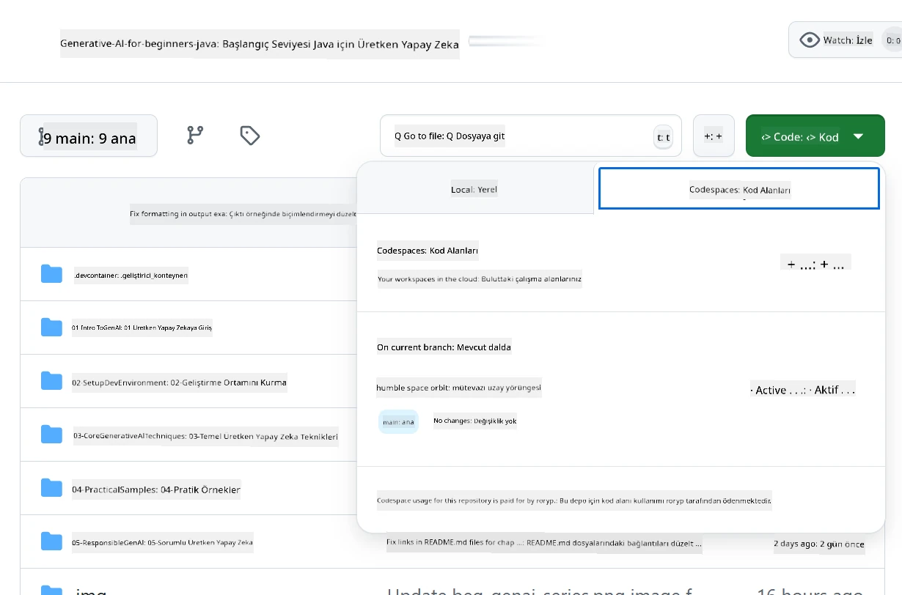
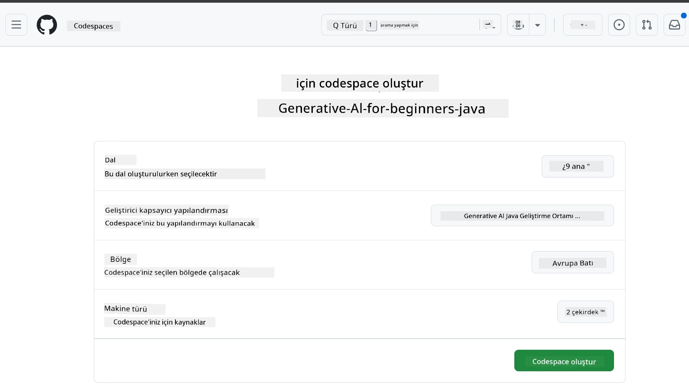
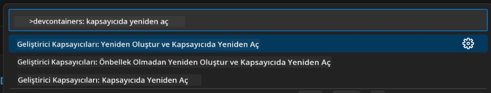
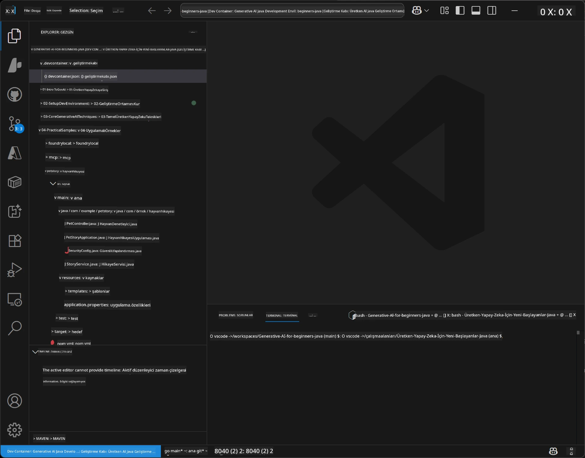
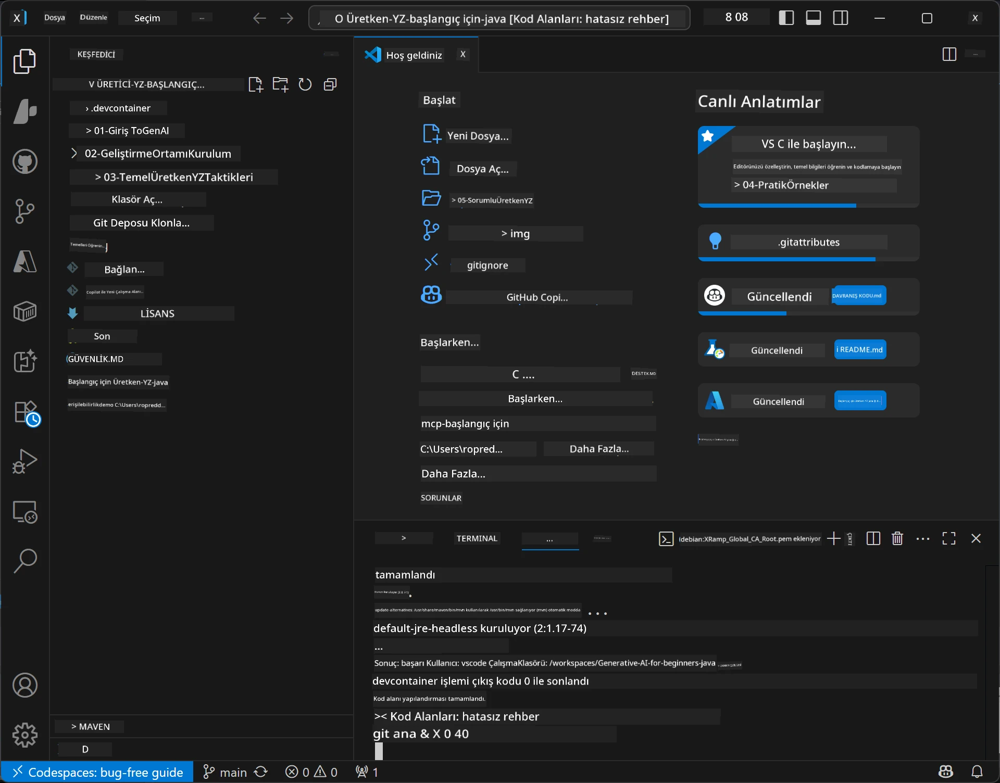

# Java için Üretken AI Geliştirme Ortamını Kurma

> **Hızlı Başlangıç**: Bulutta 2 dakikada kodlamaya başlayın - Atla [GitHub Codespaces Kurulumu](../../../02-SetupDevEnvironment) - yerel kurulum gerekmez ve github modellerini kullanır!

> **Azure OpenAI ile ilgileniyor musunuz?**, yeni bir Azure OpenAI kaynağı oluşturma adımlarını içeren [Azure OpenAI Kurulum Kılavuzumuza](getting-started-azure-openai.md) bakın.

## Öğrenecekleriniz

- AI uygulamaları için Java geliştirme ortamı kurma
- Tercih ettiğiniz geliştirme ortamını seçme ve yapılandırma (öncelikli olarak Codespaces ile bulut, yerel geliştirme kapsayıcısı veya tam yerel kurulum)
- GitHub Modellerine bağlanarak kurulumunuzu test etme

## İçindekiler

- [Öğrenecekleriniz](../../../02-SetupDevEnvironment)
- [Giriş](../../../02-SetupDevEnvironment)
- [Adım 1: Geliştirme Ortamınızı Kurun](../../../02-SetupDevEnvironment)
  - [Seçenek A: GitHub Codespaces (Önerilen)](../../../02-SetupDevEnvironment)
  - [Seçenek B: Yerel Geliştirme Kapsayıcısı](../../../02-SetupDevEnvironment)
  - [Seçenek C: Var Olan Yerel Kurulumunuzu Kullanın](../../../02-SetupDevEnvironment)
- [Adım 2: GitHub Kişisel Erişim Tokenı Oluşturun](../../../02-SetupDevEnvironment)
- [Adım 3: Kurulumunuzu Test Edin](../../../02-SetupDevEnvironment)
- [Sorun Giderme](../../../02-SetupDevEnvironment)
- [Özet](../../../02-SetupDevEnvironment)
- [Sonraki Adımlar](../../../02-SetupDevEnvironment)

## Giriş

Bu bölüm, geliştirme ortamınızın kurulmasına rehberlik edecektir. Birincil örnek olarak **GitHub Modellerini** kullanacağız çünkü ücretsizdir, sadece bir GitHub hesabıyla kolayca kurulabilir, kredi kartı gerektirmez ve deneyler için birden çok modele erişim sağlar.

**Yerel kurulum gerekmez!** Tam bir geliştirme ortamı sağlayan GitHub Codespaces ile tarayıcınızdan hemen kodlamaya başlayabilirsiniz.


Bu kurs için [**GitHub Modelleri**](https://github.com/marketplace?type=models) kullanmanızı öneriyoruz çünkü:
- Başlamak için **ücretsiz**
- Sadece bir GitHub hesabı ile **kolay** kurulum
- **Kredi kartı gerektirmez**
- Deney için **birden fazla model** mevcut

> **Not**: Bu eğitimde kullanılan GitHub Modellerinin ücretsiz sınırları şunlardır:
> - Dakikada 15 istek (günde 150)
> - İstek başına yaklaşık 8.000 kelime giriş, 4.000 kelime çıkış
> - 5 eşzamanlı istek
> 
> Üretim ortamı için Azure AI Foundry Modellerine Azure hesabınızla yükseltin. Kodunuzun değişmesi gerekmez. [Azure AI Foundry belgelerine](https://learn.microsoft.com/azure/ai-foundry/foundry-models/how-to/quickstart-github-models) bakın.


## Adım 1: Geliştirme Ortamınızı Kurun

<a name="quick-start-cloud"></a>

Kurulum süresini en aza indirmek ve bu Java için Üretken AI kursu için gerekli tüm araçları sağlamak amacıyla önceden yapılandırılmış bir geliştirme kapsayıcısı oluşturduk. Tercih ettiğiniz geliştirme yaklaşımını seçin:

### Ortam Kurulum Seçenekleri:

#### Seçenek A: GitHub Codespaces (Önerilen)

**Yerel kurulum gerektirmeden 2 dakikada kodlamaya başlayın!**

1. Bu depoyu GitHub hesabınıza fork edin
   > **Not**: Temel konfigürasyonu değiştirmek isterseniz, lütfen [Dev Container Yapılandırmasına](../../../.devcontainer/devcontainer.json) bakın
2. **Code** → **Codespaces** sekmesine tıklayın → **...** → **Yeni seçeneklerle...** seçeneği
3. Varsayılanları kullanın – bu, bu kurs için oluşturulmuş özel geliştirme kapsayıcısı **Generative AI Java Development Environment** yapılandırmasını seçecektir
4. **Codespace oluştur** butonuna tıklayın
5. Ortamın hazır olması için yaklaşık 2 dakika bekleyin
6. [Adım 2: GitHub Tokenı Oluştur](../../../02-SetupDevEnvironment) bölümüne geçin







> **Codespaces Avantajları**:
> - Yerel kurulum gerekmez
> - Tarayıcısı olan her cihazda çalışır
> - Tüm araçlar ve bağımlılıklar önceden yapılandırılmıştır
> - Kişisel hesaplar için ayda 60 saat ücretsiz
> - Tüm öğrenciler için tutarlı geliştirme ortamı

#### Seçenek B: Yerel Geliştirme Kapsayıcısı

**Docker ile yerel geliştirmeyi tercih eden geliştiriciler için**

1. Bu depoyu fork edip yerel makinenize klonlayın
   > **Not**: Temel konfigürasyonu değiştirmek isterseniz, lütfen [Dev Container Yapılandırmasına](../../../.devcontainer/devcontainer.json) bakın
2. [Docker Desktop](https://www.docker.com/products/docker-desktop/) ve [VS Code](https://code.visualstudio.com/) yükleyin
3. VS Code’a [Dev Containers uzantısını](https://marketplace.visualstudio.com/items?itemName=ms-vscode-remote.remote-containers) kurun
4. Depo klasörünü VS Code’da açın
5. İstendiğinde, **Kapsayıcıda Yeniden Aç** seçeneğine tıklayın (veya `Ctrl+Shift+P` → "Dev Containers: Reopen in Container" komutunu kullanın)
6. Kapsayıcının oluşturulmasını ve başlamasını bekleyin
7. [Adım 2: GitHub Tokenı Oluştur](../../../02-SetupDevEnvironment) bölümüne geçin





#### Seçenek C: Var Olan Yerel Kurulumunuzu Kullanın

**Mevcut Java ortamı olan geliştiriciler için**

Önkoşullar:
- [Java 21+](https://www.oracle.com/java/technologies/javase/jdk21-archive-downloads.html) 
- [Maven 3.9+](https://maven.apache.org/download.cgi)
- [VS Code](https://code.visualstudio.com) veya tercih ettiğiniz IDE

Adımlar:
1. Bu depoyu yerel makinenize klonlayın
2. Projeyi IDE'nizde açın
3. [Adım 2: GitHub Tokenı Oluştur](../../../02-SetupDevEnvironment) bölümüne geçin

> **Profesyonel İpucu**: Düşük özellikli bir makineniz varsa ama yerelde VS Code kullanmak istiyorsanız, GitHub Codespaces’i kullunun! Yerel VS Code'unuzu bulut barındırılan Codespace’e bağlayarak en iyisini elde edebilirsiniz.




## Adım 2: GitHub Kişisel Erişim Tokenı Oluşturun

1. [GitHub Ayarları](https://github.com/settings/profile) sayfasına gidin ve profil menünüzden **Ayarlar** seçeneğini seçin.
2. Sol kenar çubuğunda **Geliştirici ayarları** (genellikle en altta) tıklayın.
3. **Kişisel erişim tokenları** altında **Ayrıntılı yetkilendirme tokenları**na tıklayın (veya bu doğrudan [bağlantıyı](https://github.com/settings/personal-access-tokens) kullanın).
4. **Yeni token oluştur** butonuna tıklayın.
5. "Token adı"na açıklayıcı bir isim girin (örn. `GenAI-Java-Course-Token`).
6. Bir son kullanma tarihi belirleyin (güvenlik için önerilen: 7 gün).
7. "Kaynak sahibi" olarak kullanıcı hesabınızı seçin.
8. "Depo erişimi" altında, GitHub Modelleriyle kullanmak istediğiniz depoları seçin (veya gerekirse "Tüm depolar").
9. "Hesap izinleri" altında **Modeller**i bulun ve **Salt okunur** olarak ayarlayın.
10. **Token oluştur** butonuna tıklayın.
11. **Tokenı hemen kopyalayın ve kaydedin** – tekrar gösterilmeyecektir!

> **Güvenlik İpucu**: Erişim tokenlarınızda minimum gerekli kapsamı ve en kısa pratik geçerlilik süresini kullanın.

## Adım 3: Kurulumunuzu GitHub Modelleri Örneğiyle Test Edin

Geliştirme ortamınız hazır olduğunda, GitHub Modelleri entegrasyonunu [`02-SetupDevEnvironment/examples/github-models`](../../../02-SetupDevEnvironment/examples/github-models) altındaki örnek uygulamamızla test edelim.

1. Geliştirme ortamınızda terminali açın.
2. GitHub Modelleri örnek dizinine gidin:
   ```bash
   cd 02-SetupDevEnvironment/examples/github-models
   ```
3. GitHub tokenınızı çevresel değişken olarak ayarlayın:
   ```bash
   # macOS/Linux
   export GITHUB_TOKEN=your_token_here
   
   # Windows (Komut İstemi)
   set GITHUB_TOKEN=your_token_here
   
   # Windows (PowerShell)
   $env:GITHUB_TOKEN="your_token_here"
   ```

4. Uygulamayı çalıştırın:
   ```bash
   mvn compile exec:java -Dexec.mainClass="com.example.githubmodels.App"
   ```

Şu şekilde bir çıktı görmelisiniz:
```text
Using model: gpt-4.1-nano
Sending request to GitHub Models...
Response: Hello World!
```

### Örnek Kodu Anlamak

İlk olarak, az önce çalıştırdığımız şeyi anlayalım. `examples/github-models` altındaki örnek, GitHub Modellerine bağlanmak için OpenAI Java SDK’sını kullanır:

**Bu kod ne yapar:**
- Kişisel erişim tokenınızla GitHub Modellerine **bağlanır**
- AI modele basit bir "Merhaba Dünya!" mesajı **gönderir**
- AI yanıtını **alır** ve gösterir
- Kurulumunuzun doğru çalıştığını **doğrular**

**Ana Bağımlılık** (`pom.xml` içinde):
```xml
<dependency>
    <groupId>com.openai</groupId>
    <artifactId>openai-java</artifactId>
    <version>2.12.0</version>
</dependency>
```

**Ana Kod** (`App.java`):
```java
// OpenAI Java SDK kullanarak GitHub Modellerine bağlan
OpenAIClient client = OpenAIOkHttpClient.builder()
    .apiKey(pat)
    .baseUrl("https://models.inference.ai.azure.com")
    .build();

// Sohbet tamamlama isteği oluştur
ChatCompletionCreateParams params = ChatCompletionCreateParams.builder()
    .model(modelId)
    .addSystemMessage("You are a concise assistant.")
    .addUserMessage("Say Hello World!")
    .build();

// Yapay zeka yanıtını al
ChatCompletion response = client.chat().completions().create(params);
System.out.println("Response: " + response.choices().get(0).message().content().orElse("No response content"));
```

## Özet

Harika! Artık her şey hazır:

- AI model erişimi için uygun izinlerle bir GitHub Kişisel Erişim Tokenı oluşturdunuz
- Java geliştirme ortamınızı çalıştırdınız (Codespaces, geliştirme kapsayıcıları veya yerel fark etmez)
- OpenAI Java SDK ile ücretsiz olarak GitHub Modellerine bağlandınız
- AI modelleri ile iletişim kuran basit bir örnekle her şeyin çalıştığını test ettiniz

## Sonraki Adımlar

[Bölüm 3: Temel Üretken AI Teknikleri](../03-CoreGenerativeAITechniques/README.md)

## Sorun Giderme

Sorun mu yaşıyorsunuz? İşte yaygın problemler ve çözümleri:

- **Token çalışmıyor mu?** 
  - Tokenı eksiksiz ve boşluksuz kopyaladığınızdan emin olun
  - Tokenın doğru şekilde çevresel değişken olarak ayarlandığını doğrulayın
  - Tokenınızın izinlerinin doğru olduğunu kontrol edin (Modeller: Salt okunur)

- **Maven bulunamadı mı?** 
  - Eğer dev container/Codespaces kullanıyorsanız, Maven önceden kurulmuş olmalı
  - Yerel kurulumda Java 21+ ve Maven 3.9+ yüklü olduğundan emin olun
  - Kurulumu doğrulamak için `mvn --version` komutunu deneyin

- **Bağlantı sorunları mı?** 
  - İnternet bağlantınızı kontrol edin
  - GitHub'ın ağınızdan erişilebilir olduğundan emin olun
  - GitHub Modelleri uç noktasını engelleyen bir güvenlik duvarı olmadığından emin olun

- **Geliştirme kapsayıcısı başlamıyor mu?** 
  - Docker Desktop'ın çalıştığını doğrulayın (yerel geliştirme için)
  - Kapsayıcıyı yeniden oluşturmayı deneyin: `Ctrl+Shift+P` → "Dev Containers: Rebuild Container"

- **Uygulama derleme hataları mı var?**
  - Doğru dizinde olduğunuzdan emin olun: `02-SetupDevEnvironment/examples/github-models`
  - Temizleyip yeniden derlemeyi deneyin: `mvn clean compile`

> **Yardıma mı ihtiyacınız var?**: Hala sorun mu yaşıyorsunuz? Depoya bir issue açın, size yardımcı olalım.

---

<!-- CO-OP TRANSLATOR DISCLAIMER START -->
**Feragatname**:
Bu belge, AI çeviri hizmeti [Co-op Translator](https://github.com/Azure/co-op-translator) kullanılarak çevrilmiştir. Doğruluk için çaba göstersek de, otomatik çevirilerin hatalar veya yanlışlıklar içerebileceğini lütfen unutmayın. Orijinal belge, ana dilinde yetkili kaynak olarak kabul edilmelidir. Kritik bilgiler için profesyonel insan çevirisi önerilir. Bu çevirinin kullanılması sonucunda oluşabilecek yanlış anlamalar veya yorum hatalarından sorumlu değiliz.
<!-- CO-OP TRANSLATOR DISCLAIMER END -->