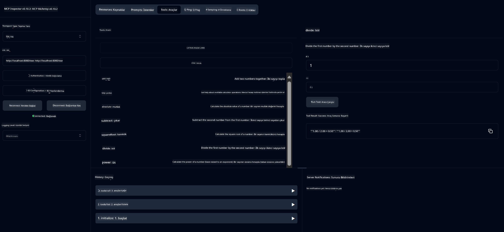

<!--
CO_OP_TRANSLATOR_METADATA:
{
  "original_hash": "7bf9a4a832911269a8bd0decb97ff36c",
  "translation_date": "2025-07-21T18:25:15+00:00",
  "source_file": "04-PracticalSamples/mcp/calculator/README.md",
  "language_code": "tr"
}
-->
# Temel Hesap Makinesi MCP Servisi

>**Not**: Bu bölüm, tamamlanmış örnekleri çalıştırmayı adım adım anlatan bir [**Eğitim**](./TUTORIAL.md) içermektedir.

**Model Context Protocol (MCP)** ile ilk uygulamalı deneyiminize hoş geldiniz! Önceki bölümlerde üretken yapay zeka temellerini öğrendiniz ve geliştirme ortamınızı kurdunuz. Şimdi pratik bir şeyler inşa etme zamanı.

Bu hesap makinesi servisi, AI modellerinin MCP kullanarak harici araçlarla güvenli bir şekilde nasıl etkileşim kurabileceğini göstermektedir. AI modelinin bazen güvenilmez olan matematik yeteneklerine güvenmek yerine, doğru hesaplamalar için özel hizmetleri çağırabileceği sağlam bir sistemin nasıl oluşturulacağını göstereceğiz.

## İçindekiler

- [Neler Öğreneceksiniz](../../../../../04-PracticalSamples/mcp/calculator)
- [Ön Koşullar](../../../../../04-PracticalSamples/mcp/calculator)
- [Anahtar Kavramlar](../../../../../04-PracticalSamples/mcp/calculator)
- [Hızlı Başlangıç](../../../../../04-PracticalSamples/mcp/calculator)
- [Mevcut Hesap Makinesi İşlemleri](../../../../../04-PracticalSamples/mcp/calculator)
- [Test İstemcileri](../../../../../04-PracticalSamples/mcp/calculator)
  - [1. Doğrudan MCP İstemcisi (SDKClient)](../../../../../04-PracticalSamples/mcp/calculator)
  - [2. AI Destekli İstemci (LangChain4jClient)](../../../../../04-PracticalSamples/mcp/calculator)
- [MCP Inspector (Web Arayüzü)](../../../../../04-PracticalSamples/mcp/calculator)
  - [Adım Adım Talimatlar](../../../../../04-PracticalSamples/mcp/calculator)

## Neler Öğreneceksiniz

Bu örnek üzerinde çalışarak şunları anlayacaksınız:
- Spring Boot kullanarak MCP uyumlu hizmetlerin nasıl oluşturulacağı
- Doğrudan protokol iletişimi ile AI destekli etkileşim arasındaki fark
- AI modellerinin harici araçları ne zaman ve nasıl kullanacağına nasıl karar verdiği
- Araç destekli AI uygulamaları oluşturmak için en iyi uygulamalar

MCP kavramlarını öğrenen ve ilk AI araç entegrasyonunu oluşturmak isteyen yeni başlayanlar için mükemmel!

## Ön Koşullar

- Java 21+
- Maven 3.6+
- **GitHub Token**: AI destekli istemci için gereklidir. Henüz ayarlamadıysanız, talimatlar için [Bölüm 2: Geliştirme ortamınızı kurma](../../../02-SetupDevEnvironment/README.md) bölümüne bakın.

## Anahtar Kavramlar

**Model Context Protocol (MCP)**, AI uygulamalarının harici araçlara güvenli bir şekilde bağlanması için standart bir yöntemdir. Bunu, AI modellerinin hesap makinemiz gibi harici hizmetleri kullanmasına olanak tanıyan bir "köprü" olarak düşünebilirsiniz. AI modelinin matematiği kendisinin yapmaya çalışması (ki bu güvenilmez olabilir) yerine, doğru sonuçlar almak için hesap makinesi hizmetimizi çağırabilir. MCP, bu iletişimin güvenli ve tutarlı bir şekilde gerçekleşmesini sağlar.

**Server-Sent Events (SSE)**, sunucu ile istemciler arasında gerçek zamanlı iletişim sağlar. Geleneksel HTTP isteklerinde olduğu gibi bir yanıt beklemek yerine, SSE sunucunun istemciye sürekli güncellemeler göndermesine olanak tanır. Bu, yanıtların akış halinde olduğu veya işlem için zaman aldığı AI uygulamaları için mükemmeldir.

**AI Araçları ve Fonksiyon Çağrısı**, AI modellerinin kullanıcı isteklerine göre harici fonksiyonları (örneğin hesap makinesi işlemleri) otomatik olarak seçip kullanmasına olanak tanır. "15 + 27 nedir?" diye sorduğunuzda, AI modeli toplama istediğinizi anlar, `add` aracımızı doğru parametrelerle (15, 27) çağırır ve sonucu doğal bir dilde döndürür. AI, her aracı ne zaman ve nasıl kullanacağını bilen akıllı bir koordinatör gibi davranır.

## Hızlı Başlangıç

### 1. Hesap makinesi uygulaması dizinine gidin
```bash
cd Generative-AI-for-beginners-java/04-PracticalSamples/mcp/calculator
```

### 2. Derleyin ve Çalıştırın
```bash
mvn clean install -DskipTests
java -jar target/calculator-server-0.0.1-SNAPSHOT.jar
```

### 3. İstemcilerle Test Edin
- **SDKClient**: Doğrudan MCP protokol etkileşimi
- **LangChain4jClient**: AI destekli doğal dil etkileşimi (GitHub token gerektirir)

## Mevcut Hesap Makinesi İşlemleri

- `add(a, b)`, `subtract(a, b)`, `multiply(a, b)`, `divide(a, b)`
- `power(base, exponent)`, `squareRoot(number)`, `absolute(number)`
- `modulus(a, b)`, `help()`

## Test İstemcileri

### 1. Doğrudan MCP İstemcisi (SDKClient)
Ham MCP protokol iletişimini test eder. Çalıştırmak için:
```bash
mvn test-compile exec:java -Dexec.mainClass="com.microsoft.mcp.sample.client.SDKClient" -Dexec.classpathScope=test
```

### 2. AI Destekli İstemci (LangChain4jClient)
GitHub Modelleri ile doğal dil etkileşimini gösterir. GitHub token gerektirir (bkz. [Ön Koşullar](../../../../../04-PracticalSamples/mcp/calculator)).

**Çalıştır:**
```bash
mvn test-compile exec:java -Dexec.mainClass="com.microsoft.mcp.sample.client.LangChain4jClient" -Dexec.classpathScope=test
```

## MCP Inspector (Web Arayüzü)

MCP Inspector, kod yazmadan MCP servisinizi test etmek için görsel bir web arayüzü sağlar. MCP'nin nasıl çalıştığını anlamak isteyen yeni başlayanlar için mükemmeldir!

### Adım Adım Talimatlar:

1. **Hesap makinesi sunucusunu başlatın** (henüz çalışmıyorsa):
   ```bash
   java -jar target/calculator-server-0.0.1-SNAPSHOT.jar
   ```

2. **MCP Inspector'ı yükleyin ve çalıştırın** yeni bir terminalde:
   ```bash
   npx @modelcontextprotocol/inspector
   ```

3. **Web arayüzünü açın**:
   - "Inspector running at http://localhost:6274" gibi bir mesaj arayın
   - Bu URL'yi web tarayıcınızda açın

4. **Hesap makinesi servisinize bağlanın**:
   - Web arayüzünde, taşıma türünü "SSE" olarak ayarlayın
   - URL'yi şu şekilde ayarlayın: `http://localhost:8080/sse`
   - "Connect" düğmesine tıklayın

5. **Mevcut araçları keşfedin**:
   - "List Tools" düğmesine tıklayarak tüm hesap makinesi işlemlerini görün
   - `add`, `subtract`, `multiply` gibi fonksiyonları göreceksiniz

6. **Bir hesap makinesi işlemini test edin**:
   - Bir araç seçin (ör. "add")
   - Parametreleri girin (ör. `a: 15`, `b: 27`)
   - "Run Tool" düğmesine tıklayın
   - MCP servisi tarafından döndürülen sonucu görün!

Bu görsel yaklaşım, kendi istemcilerinizi oluşturmadan önce MCP iletişiminin nasıl çalıştığını anlamanıza yardımcı olur.



---
**Referans:** [MCP Server Boot Starter Belgeleri](https://docs.spring.io/spring-ai/reference/api/mcp/mcp-server-boot-starter-docs.html)

**Feragatname**:  
Bu belge, AI çeviri hizmeti [Co-op Translator](https://github.com/Azure/co-op-translator) kullanılarak çevrilmiştir. Doğruluk için çaba göstersek de, otomatik çevirilerin hata veya yanlışlıklar içerebileceğini lütfen unutmayın. Belgenin orijinal dilindeki hali, yetkili kaynak olarak kabul edilmelidir. Kritik bilgiler için profesyonel insan çevirisi önerilir. Bu çevirinin kullanımından kaynaklanan yanlış anlamalar veya yanlış yorumlamalar için sorumluluk kabul etmiyoruz.