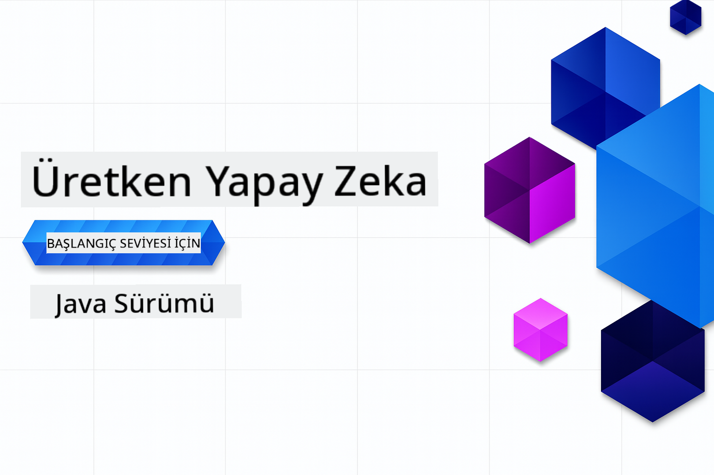

<!--
CO_OP_TRANSLATOR_METADATA:
{
  "original_hash": "459109e7c925f3a7b94440ad61c596a0",
  "translation_date": "2026-01-05T09:18:17+00:00",
  "source_file": "README.md",
  "language_code": "tr"
}
-->
# Yeni Başlayanlar için Üretken Yapay Zeka - Java Sürümü
[](https://discord.gg/nTYy5BXMWG)



**Zaman Taahhüdü**: Tüm atölye online olarak yerel kuruluma gerek olmadan tamamlanabilir. Ortam kurulumu 2 dakika sürer, örnekleri keşfetmek ise keşif derinliğine bağlı olarak 1-3 saat arası zaman alır.

> **Hızlı Başlangıç**

1. Bu depo yerel GitHub hesabınıza fork edin
2. **Code** → **Codespaces** sekmesi → **...** → **New with options...** tıklayın
3. Varsayılanları kullanın – bu kursta oluşturulan Geliştirme konteynerini seçecektir
4. **Create codespace** tıklayın
5. Ortamın hazır olması için yaklaşık 2 dakika bekleyin
6. Doğrudan [İlk örneğe](./02-SetupDevEnvironment/README.md#step-2-create-a-github-personal-access-token) atlayın

> **Yerelde Klonlamayı mı Tercih Ediyorsunuz?**
>
> Bu depo, indirme boyutunu önemli ölçüde artıran 50'den fazla dil çevirisi içerir. Çeviriler olmadan klonlamak için sparse checkout kullanın:
> ```bash
> git clone --filter=blob:none --sparse https://github.com/microsoft/Generative-AI-for-beginners-java.git
> cd Generative-AI-for-beginners-java
> git sparse-checkout set --no-cone '/*' '!translations' '!translated_images'
> ```
> Bu, kursu tamamlamak için ihtiyacınız olan her şeyi çok daha hızlı bir indirme ile sunar.


## Çok Dilli Destek

### GitHub Action ile Desteklenir (Otomatik ve Her Zaman Güncel)

<!-- CO-OP TRANSLATOR LANGUAGES TABLE START -->
[Arapça](../ar/README.md) | [Bengalce](../bn/README.md) | [Bulgarca](../bg/README.md) | [Burmaca (Myanmar)](../my/README.md) | [Çince (Basitleştirilmiş)](../zh/README.md) | [Çince (Geleneksel, Hong Kong)](../hk/README.md) | [Çince (Geleneksel, Macau)](../mo/README.md) | [Çince (Geleneksel, Tayvan)](../tw/README.md) | [Hırvatça](../hr/README.md) | [Çekçe](../cs/README.md) | [Danca](../da/README.md) | [Flemenkçe](../nl/README.md) | [Estonca](../et/README.md) | [Fince](../fi/README.md) | [Fransızca](../fr/README.md) | [Almanca](../de/README.md) | [Yunanca](../el/README.md) | [İbranice](../he/README.md) | [Hintçe](../hi/README.md) | [Macarca](../hu/README.md) | [Endonezce](../id/README.md) | [İtalyanca](../it/README.md) | [Japonca](../ja/README.md) | [Kannada](../kn/README.md) | [Korece](../ko/README.md) | [Litvanca](../lt/README.md) | [Malayca](../ms/README.md) | [Malayalamca](../ml/README.md) | [Marathi](../mr/README.md) | [Nepalce](../ne/README.md) | [Nijerya Pidgin](../pcm/README.md) | [Norveççe](../no/README.md) | [Farsça (Persian)](../fa/README.md) | [Lehçe](../pl/README.md) | [Portekizce (Brezilya)](../br/README.md) | [Portekizce (Portekiz)](../pt/README.md) | [Pencapça (Gurmukhi)](../pa/README.md) | [Romence](../ro/README.md) | [Rusça](../ru/README.md) | [Sırpça (Kiril)](../sr/README.md) | [Slovakça](../sk/README.md) | [Slovence](../sl/README.md) | [İspanyolca](../es/README.md) | [Svahili](../sw/README.md) | [İsveççe](../sv/README.md) | [Tagalogca (Filipinler)](../tl/README.md) | [Tamilce](../ta/README.md) | [Telugu](../te/README.md) | [Tayca](../th/README.md) | [Türkçe](./README.md) | [Ukraynaca](../uk/README.md) | [Urduca](../ur/README.md) | [Vietnamca](../vi/README.md)

> **Yerelde Klonlamayı mı Tercih Ediyorsunuz?**

> Bu depo, indirme boyutunu önemli ölçüde artıran 50'den fazla dil çevirisi içerir. Çeviriler olmadan klonlamak için sparse checkout kullanın:
> ```bash
> git clone --filter=blob:none --sparse https://github.com/microsoft/Generative-AI-for-beginners-java.git
> cd Generative-AI-for-beginners-java
> git sparse-checkout set --no-cone '/*' '!translations' '!translated_images'
> ```
> Bu, kursu tamamlamak için ihtiyacınız olan her şeyi çok daha hızlı bir indirme ile sunar.
<!-- CO-OP TRANSLATOR LANGUAGES TABLE END -->

## Kurs Yapısı & Öğrenme Yolu

### **Bölüm 1: Üretken Yapay Zekaya Giriş**
- **Temel Kavramlar**: Büyük Dil Modelleri, tokenlar, gömme (embedding) yapıları ve yapay zeka yeteneklerinin anlaşılması
- **Java AI Ekosistemi**: Spring AI ve OpenAI SDK'larının genel bakışı
- **Model Context Protocol**: MCP'ye giriş ve AI ajan iletişimindeki rolü
- **Pratik Uygulamalar**: Sohbet botları ve içerik oluşturma gibi gerçek dünya senaryoları
- **[→ Bölüm 1'i Başlat](./01-IntroToGenAI/README.md)**

### **Bölüm 2: Geliştirme Ortamının Kurulması**
- **Çoklu Sağlayıcı Yapılandırması**: GitHub Modelleri, Azure OpenAI ve OpenAI Java SDK entegrasyonlarının kurulması
- **Spring Boot + Spring AI**: Kurumsal AI uygulama geliştirme için en iyi uygulamalar
- **GitHub Modelleri**: Prototip oluşturma ve öğrenme için ücretsiz AI model erişimi (kredi kartı gerektirmez)
- **Geliştirme Araçları**: Docker konteynerleri, VS Code ve GitHub Codespaces yapılandırması
- **[→ Bölüm 2'yi Başlat](./02-SetupDevEnvironment/README.md)**

### **Bölüm 3: Temel Üretken AI Teknikleri**
- **Prompt Mühendisliği**: AI modelinden en iyi yanıtları almak için teknikler
- **Embedding ve Vektör Operasyonları**: Anlamsal arama ve benzerlik eşleştirme uygulamaları
- **Retrieval-Augmented Generation (RAG)**: AI'yı kendi veri kaynaklarınızla birleştirme
- **Fonksiyon Çağrısı**: AI yeteneklerini özel araçlar ve eklentilerle genişletme
- **[→ Bölüm 3'ü Başlat](./03-CoreGenerativeAITechniques/README.md)**

### **Bölüm 4: Pratik Uygulamalar & Projeler**
- **Pet Story Generator** (`petstory/`): GitHub Modelleri ile yaratıcı içerik oluşturma
- **Foundry Local Demo** (`foundrylocal/`): OpenAI Java SDK ile yerel AI model entegrasyonu
- **MCP Calculator Service** (`calculator/`): Spring AI ile temel Model Context Protocol uygulaması
- **[→ Bölüm 4'ü Başlat](./04-PracticalSamples/README.md)**

### **Bölüm 5: Sorumlu AI Geliştirme**
- **GitHub Modelleri Güvenliği**: Yerleşik içerik filtreleme ve güvenlik mekanizmalarının (sert engeller ve yumuşak reddetmeler) testi
- **Sorumlu AI Demosu**: Modern AI güvenlik sistemlerinin pratik örneği
- **En İyi Uygulamalar**: Etik AI geliştirme ve dağıtımı için temel rehber İlkeleri
- **[→ Bölüm 5'i Başlat](./05-ResponsibleGenAI/README.md)**

## Ek Kaynaklar

<!-- CO-OP TRANSLATOR OTHER COURSES START -->
### LangChain
[](https://aka.ms/langchain4j-for-beginners)
[](https://aka.ms/langchainjs-for-beginners?WT.mc_id=m365-94501-dwahlin)

---

### Azure / Edge / MCP / Ajanlar
[](https://github.com/microsoft/AZD-for-beginners?WT.mc_id=academic-105485-koreyst)
[](https://github.com/microsoft/edgeai-for-beginners?WT.mc_id=academic-105485-koreyst)
[](https://github.com/microsoft/mcp-for-beginners?WT.mc_id=academic-105485-koreyst)
[](https://github.com/microsoft/ai-agents-for-beginners?WT.mc_id=academic-105485-koreyst)

---
 
### Üretken AI Serisi
[](https://github.com/microsoft/generative-ai-for-beginners?WT.mc_id=academic-105485-koreyst)
[-9333EA?style=for-the-badge&labelColor=E5E7EB&color=9333EA)](https://github.com/microsoft/Generative-AI-for-beginners-dotnet?WT.mc_id=academic-105485-koreyst)
[-C084FC?style=for-the-badge&labelColor=E5E7EB&color=C084FC)](https://github.com/microsoft/generative-ai-for-beginners-java?WT.mc_id=academic-105485-koreyst)
[-E879F9?style=for-the-badge&labelColor=E5E7EB&color=E879F9)](https://github.com/microsoft/generative-ai-with-javascript?WT.mc_id=academic-105485-koreyst)

---
 
### Temel Öğrenme
[](https://aka.ms/ml-beginners?WT.mc_id=academic-105485-koreyst)
[](https://aka.ms/datascience-beginners?WT.mc_id=academic-105485-koreyst)
[](https://aka.ms/ai-beginners?WT.mc_id=academic-105485-koreyst)
[](https://github.com/microsoft/Security-101?WT.mc_id=academic-96948-sayoung)
[](https://aka.ms/webdev-beginners?WT.mc_id=academic-105485-koreyst)
[](https://aka.ms/iot-beginners?WT.mc_id=academic-105485-koreyst)
[](https://github.com/microsoft/xr-development-for-beginners?WT.mc_id=academic-105485-koreyst)

---
 
### Copilot Serisi
[](https://aka.ms/GitHubCopilotAI?WT.mc_id=academic-105485-koreyst)
[](https://github.com/microsoft/mastering-github-copilot-for-dotnet-csharp-developers?WT.mc_id=academic-105485-koreyst)
[](https://github.com/microsoft/CopilotAdventures?WT.mc_id=academic-105485-koreyst)
<!-- CO-OP TRANSLATOR OTHER COURSES END -->

## Yardım Alma

Yapay zeka uygulamaları geliştirme konusunda takılırsanız veya sorularınız olursa, MCP hakkında tartışmalara katılın. Bu, soruların memnuniyetle karşılandığı ve bilginin özgürce paylaşıldığı destekleyici bir topluluktur.

[](https://discord.gg/nTYy5BXMWG)

Ürün geri bildiriminiz veya geliştirme sırasında karşılaştığınız hatalar için şurayı ziyaret edin:

[](https://aka.ms/foundry/forum)

---

<!-- CO-OP TRANSLATOR DISCLAIMER START -->
**Feragatname**:  
Bu belge, AI çeviri servisi [Co-op Translator](https://github.com/Azure/co-op-translator) kullanılarak çevrilmiştir. Doğruluk için çaba gösterilse de, otomatik çevirilerin hatalar veya yanlışlıklar içerebileceğini lütfen unutmayınız. Orijinal belge, kendi dilinde yetkili kaynak olarak kabul edilmelidir. Kritik bilgiler için profesyonel insan çevirisi önerilir. Bu çevirinin kullanımı sonucu ortaya çıkabilecek herhangi bir yanlış anlama veya yanlış yorumdan sorumlu değiliz.
<!-- CO-OP TRANSLATOR DISCLAIMER END -->