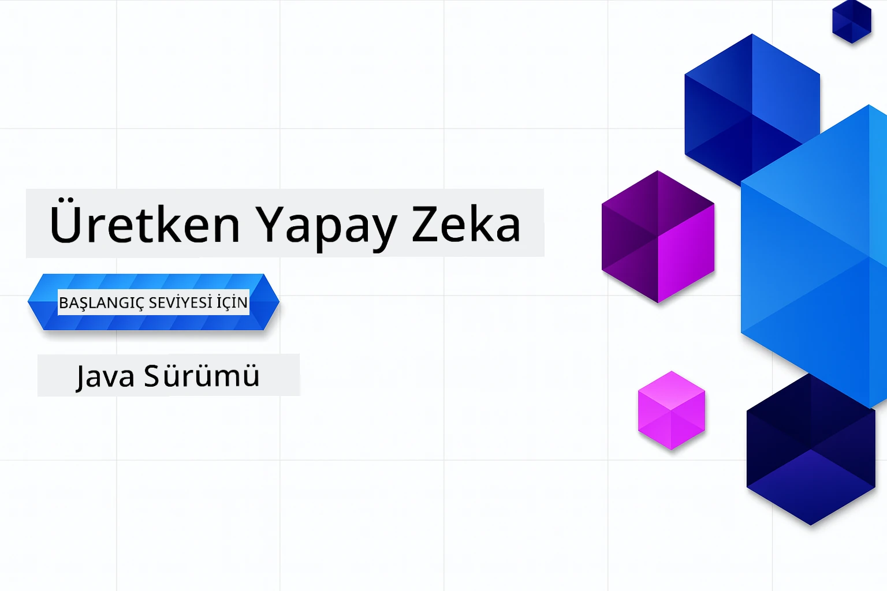

# Yeni Başlayanlar için Üretken Yapay Zeka - Java Sürümü
[](https://discord.gg/nTYy5BXMWG)



**Zaman Taahhüdü**: Tüm atölye çevrimiçi tamamlanabilir, yerel kurulum gerekmez. Ortam kurulumu 2 dakika alır, örnekleri keşfetmek ise keşfetme derinliğine bağlı olarak 1-3 saat sürer.

> **Hızlı Başlangıç**

1. Bu depoyu GitHub hesabınıza çatallayın
2. **Code** → **Codespaces** sekmesine tıklayın → **...** → **New with options...** seçeneğine tıklayın
3. Varsayılanları kullanın – bu, bu kurs için oluşturulmuş Geliştirme konteynerini seçer
4. **Create codespace** butonuna tıklayın
5. Ortamın hazır olması için yaklaşık 2 dakika bekleyin
6. Doğrudan [İlk örneğe](./02-SetupDevEnvironment/README.md#step-2-create-a-github-personal-access-token) atlayın

> **Yerelde Kopyalamayı mı Tercih Ediyorsunuz?**
>
> Bu depo 50'den fazla dil çevirisi içerir, bu da indirme boyutunu önemli ölçüde artırır. Çeviriler olmadan klonlamak için sparse checkout kullanın:
> ```bash
> git clone --filter=blob:none --sparse https://github.com/microsoft/Generative-AI-for-beginners-java.git
> cd Generative-AI-for-beginners-java
> git sparse-checkout set --no-cone '/*' '!translations' '!translated_images'
> ```
> Bu, kursu tamamlamak için ihtiyacınız olan her şeyi çok daha hızlı bir indirme ile sağlar.


## Çok Dilli Destek

### GitHub Action ile Desteklenmektedir (Otomatik ve Her Zaman Güncel)

<!-- CO-OP TRANSLATOR LANGUAGES TABLE START -->
[Arapça](../ar/README.md) | [Bengalce](../bn/README.md) | [Bulgarca](../bg/README.md) | [Birmanca (Myanmar)](../my/README.md) | [Çince (Basitleştirilmiş)](../zh-CN/README.md) | [Çince (Geleneksel, Hong Kong)](../zh-HK/README.md) | [Çince (Geleneksel, Macau)](../zh-MO/README.md) | [Çince (Geleneksel, Tayvan)](../zh-TW/README.md) | [Hırvatça](../hr/README.md) | [Çekçe](../cs/README.md) | [Danca](../da/README.md) | [Flemenkçe](../nl/README.md) | [Estonca](../et/README.md) | [Fince](../fi/README.md) | [Fransızca](../fr/README.md) | [Almanca](../de/README.md) | [Yunanca](../el/README.md) | [İbranice](../he/README.md) | [Hintçe](../hi/README.md) | [Macarca](../hu/README.md) | [Endonezce](../id/README.md) | [İtalyanca](../it/README.md) | [Japonca](../ja/README.md) | [Kannada](../kn/README.md) | [Korece](../ko/README.md) | [Litvanca](../lt/README.md) | [Malayca](../ms/README.md) | [Malayalamca](../ml/README.md) | [Marathi](../mr/README.md) | [Nepalce](../ne/README.md) | [Nijerya Pidgin](../pcm/README.md) | [Norveççe](../no/README.md) | [Farsça](../fa/README.md) | [Lehçe](../pl/README.md) | [Portekizce (Brezilya)](../pt-BR/README.md) | [Portekizce (Portekiz)](../pt-PT/README.md) | [Punjabca (Gurmukhi)](../pa/README.md) | [Rumence](../ro/README.md) | [Rusça](../ru/README.md) | [Sırpça (Kiril)](../sr/README.md) | [Slovakça](../sk/README.md) | [Slovence](../sl/README.md) | [İspanyolca](../es/README.md) | [Svahili](../sw/README.md) | [İsveççe](../sv/README.md) | [Tagalogca (Filipince)](../tl/README.md) | [Tamilce](../ta/README.md) | [Telugu](../te/README.md) | [Tayca](../th/README.md) | [Türkçe](./README.md) | [Ukraynaca](../uk/README.md) | [Urduca](../ur/README.md) | [Vietnamca](../vi/README.md)

> **Yerelde Kopyalamayı mı Tercih Ediyorsunuz?**

> Bu depo 50'den fazla dil çevirisi içerir, bu da indirme boyutunu önemli ölçüde artırır. Çeviriler olmadan klonlamak için sparse checkout kullanın:
> ```bash
> git clone --filter=blob:none --sparse https://github.com/microsoft/Generative-AI-for-beginners-java.git
> cd Generative-AI-for-beginners-java
> git sparse-checkout set --no-cone '/*' '!translations' '!translated_images'
> ```
> Bu, kursu tamamlamak için ihtiyacınız olan her şeyi çok daha hızlı bir indirme ile sağlar.
<!-- CO-OP TRANSLATOR LANGUAGES TABLE END -->

## Kurs Yapısı ve Öğrenme Yolu

### **Bölüm 1: Üretken Yapay Zekaya Giriş**
- **Temel Kavramlar**: Büyük Dil Modelleri, tokenlar, gömme işlemleri ve yapay zeka yeteneklerinin anlaşılması
- **Java AI Ekosistemi**: Spring AI ve OpenAI SDK'larının genel bakışı
- **Model Bağlam Protokolü**: MCP'ye giriş ve yapay zeka ajanları arasındaki iletişimdeki rolü
- **Pratik Uygulamalar**: Sohbet botları ve içerik üretimi dahil gerçek dünya senaryoları
- **[→ Bölüm 1’e Başla](./01-IntroToGenAI/README.md)**

### **Bölüm 2: Geliştirme Ortamı Kurulumu**
- **Çoklu Sağlayıcı Konfigürasyonu**: GitHub Modelleri, Azure OpenAI ve OpenAI Java SDK entegrasyonlarının kurulumu
- **Spring Boot + Spring AI**: Kurumsal yapay zeka uygulama geliştirme için en iyi uygulamalar
- **GitHub Modelleri**: Prototipleme ve öğrenme için ücretsiz yapay zeka modeli erişimi (kredi kartı gerektirmez)
- **Geliştirme Araçları**: Docker konteynerleri, VS Code ve GitHub Codespaces ayarları
- **[→ Bölüm 2’ye Başla](./02-SetupDevEnvironment/README.md)**

### **Bölüm 3: Temel Üretken Yapay Zeka Teknikleri**
- **Prompt Mühendisliği**: Yapay zeka modelinden optimal cevaplar almak için teknikler
- **Gömme İşlemleri & Vektör Operasyonları**: Anlamsal arama ve benzerlik eşleştirme uygulaması
- **Retrieval-Augmented Generation (RAG)**: Yapay zekayı kendi veri kaynaklarınızla birleştirme
- **Fonksiyon Çağrıları**: Yapay zeka yeteneklerini özel araçlar ve eklentiler ile genişletme
- **[→ Bölüm 3’e Başla](./03-CoreGenerativeAITechniques/README.md)**

### **Bölüm 4: Pratik Uygulamalar ve Projeler**
- **Evcil Hayvan Hikaye Üreticisi** (`petstory/`): GitHub Modelleri ile yaratıcı içerik üretimi
- **Foundry Yerel Demo** (`foundrylocal/`): OpenAI Java SDK ile yerel yapay zeka modeli entegrasyonu
- **MCP Hesaplayıcı Servisi** (`calculator/`): Spring AI ile temel Model Bağlam Protokolü uygulaması
- **[→ Bölüm 4’e Başla](./04-PracticalSamples/README.md)**

### **Bölüm 5: Sorumlu Yapay Zeka Geliştirme**
- **GitHub Modelleri Güvenliği**: Yerleşik içerik filtresi ve güvenlik mekanizmalarının testi (katı engellemeler ve nazik reddetmeler)
- **Sorumlu Yapay Zeka Demo**: Modern yapay zeka güvenlik sistemlerinin pratikte nasıl çalıştığını gösteren uygulamalı örnek
- **En İyi Uygulamalar**: Etik yapay zeka geliştirme ve dağıtım için temel yönergeler
- **[→ Bölüm 5’e Başla](./05-ResponsibleGenAI/README.md)**

## Ek Kaynaklar

<!-- CO-OP TRANSLATOR OTHER COURSES START -->
### LangChain
[](https://aka.ms/langchain4j-for-beginners)
[](https://aka.ms/langchainjs-for-beginners?WT.mc_id=m365-94501-dwahlin)

---

### Azure / Edge / MCP / Ajanlar
[](https://github.com/microsoft/AZD-for-beginners?WT.mc_id=academic-105485-koreyst)
[](https://github.com/microsoft/edgeai-for-beginners?WT.mc_id=academic-105485-koreyst)
[](https://github.com/microsoft/mcp-for-beginners?WT.mc_id=academic-105485-koreyst)
[](https://github.com/microsoft/ai-agents-for-beginners?WT.mc_id=academic-105485-koreyst)

---
 
### Üretken Yapay Zeka Serisi
[](https://github.com/microsoft/generative-ai-for-beginners?WT.mc_id=academic-105485-koreyst)
[-9333EA?style=for-the-badge&labelColor=E5E7EB&color=9333EA)](https://github.com/microsoft/Generative-AI-for-beginners-dotnet?WT.mc_id=academic-105485-koreyst)
[-C084FC?style=for-the-badge&labelColor=E5E7EB&color=C084FC)](https://github.com/microsoft/generative-ai-for-beginners-java?WT.mc_id=academic-105485-koreyst)
[-E879F9?style=for-the-badge&labelColor=E5E7EB&color=E879F9)](https://github.com/microsoft/generative-ai-with-javascript?WT.mc_id=academic-105485-koreyst)

---
 
### Temel Öğrenme
[](https://aka.ms/ml-beginners?WT.mc_id=academic-105485-koreyst)
[](https://aka.ms/datascience-beginners?WT.mc_id=academic-105485-koreyst)
[](https://aka.ms/ai-beginners?WT.mc_id=academic-105485-koreyst)
[](https://github.com/microsoft/Security-101?WT.mc_id=academic-96948-sayoung)

[](https://aka.ms/webdev-beginners?WT.mc_id=academic-105485-koreyst)
[](https://aka.ms/iot-beginners?WT.mc_id=academic-105485-koreyst)
[](https://github.com/microsoft/xr-development-for-beginners?WT.mc_id=academic-105485-koreyst)

---
 
### Copilot Serisi
[](https://aka.ms/GitHubCopilotAI?WT.mc_id=academic-105485-koreyst)
[](https://github.com/microsoft/mastering-github-copilot-for-dotnet-csharp-developers?WT.mc_id=academic-105485-koreyst)
[](https://github.com/microsoft/CopilotAdventures?WT.mc_id=academic-105485-koreyst)
<!-- CO-OP TRANSLATOR OTHER COURSES END -->

## Yardım Alma

Eğer takılırsanız veya AI uygulamaları geliştirme hakkında herhangi bir sorunuz olursa, diğer öğrenenler ve deneyimli geliştiricilerle MCP üzerine tartışmalara katılın. Burada sorular hoş karşılanır ve bilgi özgürce paylaşılır, destekleyici bir topluluktur.

[](https://discord.gg/nTYy5BXMWG)

Eğer ürünle ilgili geri bildirimde bulunmak veya geliştirme sırasında hatalarla karşılaşırsanız, ziyaret edin:

[](https://aka.ms/foundry/forum)

---

<!-- CO-OP TRANSLATOR DISCLAIMER START -->
**Feragatname**:
Bu belge, AI çeviri hizmeti [Co-op Translator](https://github.com/Azure/co-op-translator) kullanılarak çevrilmiştir. Doğruluk için çaba göstersek de, otomatik çevirilerin hatalar veya yanlışlıklar içerebileceğini lütfen unutmayın. Orijinal belge, kendi dilinde yetkili kaynak olarak kabul edilmelidir. Kritik bilgiler için profesyonel insan çevirisi önerilir. Bu çevirinin kullanımı sonucunda oluşabilecek herhangi bir yanlış anlama veya yanlış yorumdan sorumlu tutulamayız.
<!-- CO-OP TRANSLATOR DISCLAIMER END -->