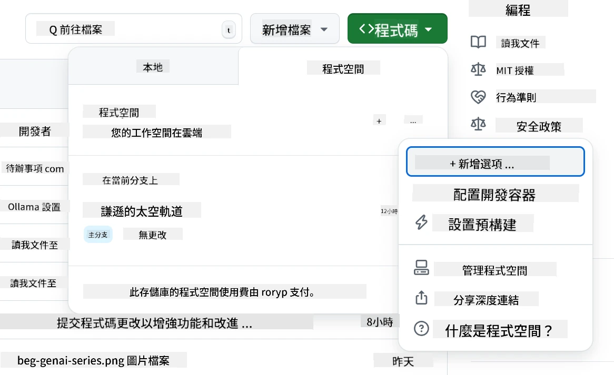
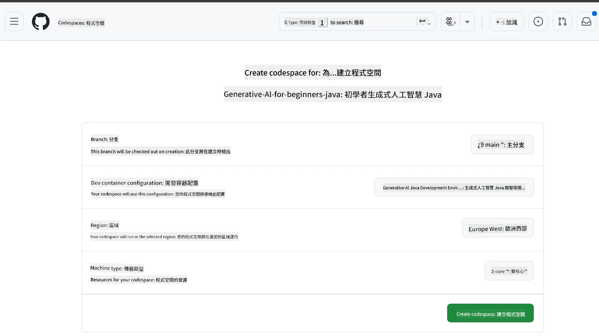
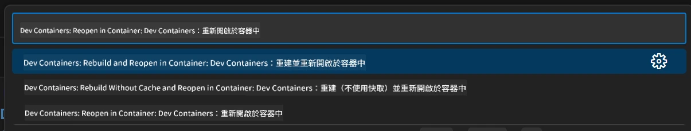
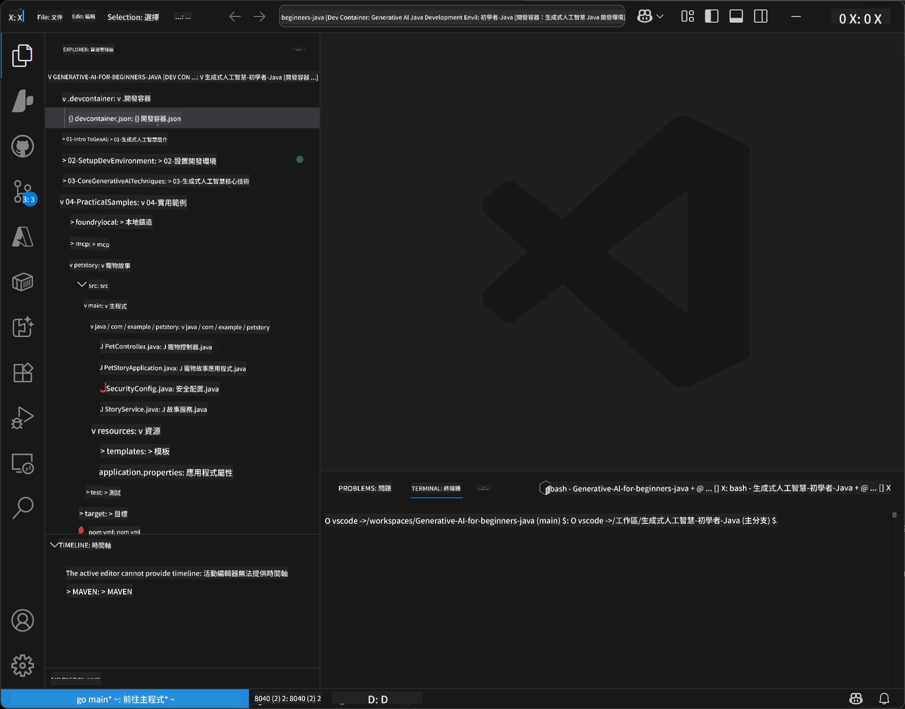
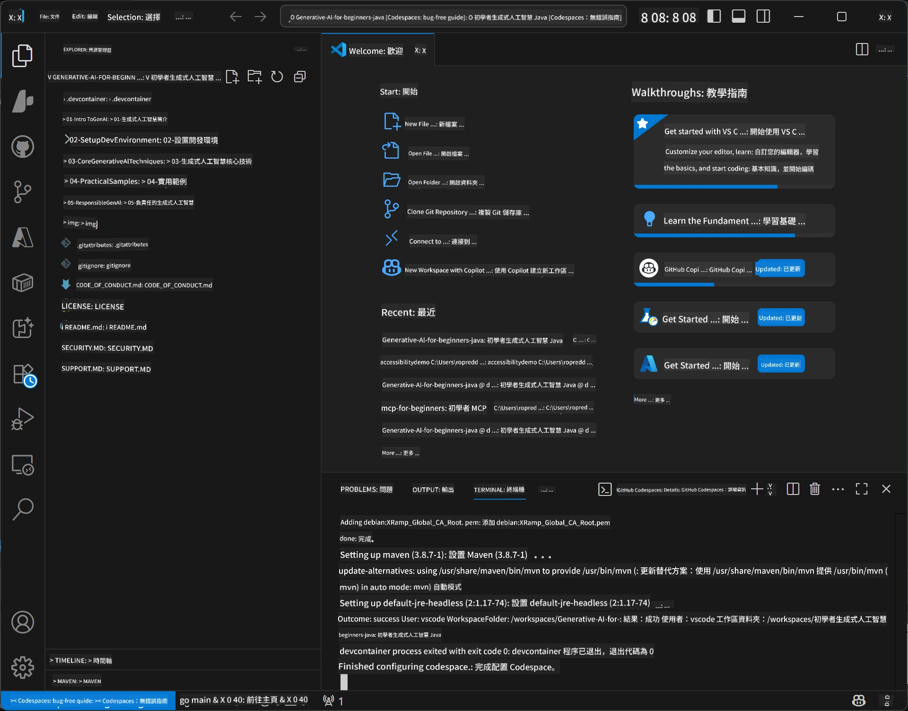

<!--
CO_OP_TRANSLATOR_METADATA:
{
  "original_hash": "96a30d42b9751a3d4e4b20e28d29d459",
  "translation_date": "2026-01-28T04:45:30+00:00",
  "source_file": "02-SetupDevEnvironment/README.md",
  "language_code": "tw"
}
-->
# 為 Java 設定生成式 AI 的開發環境

> **快速開始**：2 分鐘內在雲端編寫程式碼 - 跳至 [GitHub Codespaces 設定](../../../02-SetupDevEnvironment) - 不需本機安裝且使用 GitHub 模型！

> **對 Azure OpenAI 有興趣嗎？**，請參閱我們的 [Azure OpenAI 設定指南](getting-started-azure-openai.md)，內含建立新的 Azure OpenAI 資源步驟。

## 你將學到什麼

- 為 AI 應用設定 Java 開發環境
- 選擇並設定你偏好的開發環境（雲端優先的 Codespaces、本地開發容器或完整本地安裝）
- 透過連接 GitHub 模型來測試你的設定

## 目錄

- [你將學到什麼](../../../02-SetupDevEnvironment)
- [介紹](../../../02-SetupDevEnvironment)
- [步驟 1：設定你的開發環境](../../../02-SetupDevEnvironment)
  - [選項 A：GitHub Codespaces（推薦）](../../../02-SetupDevEnvironment)
  - [選項 B：本地開發容器](../../../02-SetupDevEnvironment)
  - [選項 C：使用你現有的本地安裝](../../../02-SetupDevEnvironment)
- [步驟 2：建立 GitHub 個人存取權杖](../../../02-SetupDevEnvironment)
- [步驟 3：使用 GitHub 模型範例測試你的設定](../../../02-SetupDevEnvironment)
- [疑難排解](../../../02-SetupDevEnvironment)
- [摘要](../../../02-SetupDevEnvironment)
- [下一步](../../../02-SetupDevEnvironment)

## 介紹

本章將指導你完成開發環境的設定。我們將以 **GitHub 模型** 作為主要範例，因為它免費、只需一個 GitHub 帳戶即可輕鬆設置，不需信用卡，且提供多種模型可用來實驗。

**不需本地安裝！** 你可以立即使用 GitHub Codespaces 在瀏覽器中啟動完整開發環境開始編程。


我們建議本課程使用 [**GitHub Models**](https://github.com/marketplace?type=models)，因為它：
- **免費** 開始使用
- 只需一個 GitHub 帳戶即可 **輕鬆設置**
- 不需 **信用卡**
- 有多種模型可供試驗

> **注意**：本訓練中使用的 GitHub 模型有以下免費限制：
> - 每分鐘 15 次請求（每日 150 次）
> - 每次請求約 8,000 字輸入，約 4,000 字輸出
> - 同時可發送 5 個請求
> 
> 若要用於生產環境，請使用你的 Azure 帳戶升級至 Azure AI Foundry 模型。程式碼無需更動。詳見 [Azure AI Foundry 文件](https://learn.microsoft.com/azure/ai-foundry/foundry-models/how-to/quickstart-github-models)。

## 步驟 1：設定你的開發環境

<a name="quick-start-cloud"></a>

我們已建立預先設定好的開發容器，減少設定時間並確保你擁有本課程所需的所有工具。請選擇你偏好的開發方式：

### 環境設定選項：

#### 選項 A：GitHub Codespaces（推薦）

**2 分鐘內開始編碼 - 不需本地安裝！**

1. 將本儲存庫 fork 到你的 GitHub 帳號  
   > **注意**：若要編輯基本配置，請參閱 [開發容器配置](../../../.devcontainer/devcontainer.json)
2. 點選 **Code** → **Codespaces** 標籤 → **...** → **New with options...**
3. 使用預設值—這將選擇本課程自訂開發容器配置：**Generative AI Java Development Environment**
4. 點選 **Create codespace**
5. 等待約 2 分鐘，環境就緒
6. 執行至 [步驟 2：建立 GitHub 存取權杖](../../../02-SetupDevEnvironment)







> **Codespaces 的優點**：
> - 不需本地安裝
> - 任何有瀏覽器的裝置皆可使用
> - 預先配置所有工具與相依套件
> - 個人帳號每月免費 60 小時
> - 為所有學員提供一致的環境

#### 選項 B：本地開發容器

**適合偏好以 Docker 本地開發者**

1. 將本儲存庫 fork 並 clone 至你的本機  
   > **注意**：若要編輯基本配置，請參閱 [開發容器配置](../../../.devcontainer/devcontainer.json)
2. 安裝 [Docker Desktop](https://www.docker.com/products/docker-desktop/) 和 [VS Code](https://code.visualstudio.com/)
3. 在 VS Code 安裝 [Dev Containers 擴充功能](https://marketplace.visualstudio.com/items?itemName=ms-vscode-remote.remote-containers)
4. 在 VS Code 打開儲存庫資料夾
5. 出現提示時，點選 **Reopen in Container**（或使用 `Ctrl+Shift+P` → "Dev Containers: Reopen in Container"）
6. 等待容器建置並啟動完成
7. 執行至 [步驟 2：建立 GitHub 存取權杖](../../../02-SetupDevEnvironment)





#### 選項 C：使用你現有的本地安裝

**適合已有 Java 環境的開發者**

先決條件：
- [Java 21+](https://www.oracle.com/java/technologies/javase/jdk21-archive-downloads.html)
- [Maven 3.9+](https://maven.apache.org/download.cgi)
- [VS Code](https://code.visualstudio.com) 或你偏好的 IDE

步驟：
1. 將本儲存庫 clone 至本機
2. 在 IDE 中開啟專案
3. 執行至 [步驟 2：建立 GitHub 存取權杖](../../../02-SetupDevEnvironment)

> **小提示**：若你的裝置規格較低但想使用本地 VS Code，建議採用 GitHub Codespaces！你可以將本地 VS Code 連接到雲端 Codespace，享受兩者優點。



## 步驟 2：建立 GitHub 個人存取權杖

1. 前往 [GitHub 設定頁](https://github.com/settings/profile)，在個人資料選單中選擇 **Settings**。
2. 在左側邊欄點選 **Developer settings**（通常在最下方）。
3. 在 **Personal access tokens** 區塊點選 **Fine-grained tokens**（或使用此直接 [連結](https://github.com/settings/personal-access-tokens)）。
4. 點選 **Generate new token**。
5. 在「Token name」欄位填寫描述名稱（例如 `GenAI-Java-Course-Token`）。
6. 設定過期時間（建議設定 7 天，以符合安全最佳實踐）。
7. 在「Resource owner」選擇你的使用者帳號。
8. 在「Repository access」選擇你想用於 GitHub 模型的儲存庫（或選「All repositories」）。
9. 在「Account permissions」中找到 **Models** 權限，設定為 **Read-only**。
10. 點選 **Generate token**。
11. **請立即複製並保存你的權杖** — 之後將無法再次查看！

> **安全提示**：為存取權杖使用最低必要的範圍及最短可行的過期時間。

## 步驟 3：使用 GitHub 模型範例測試你的設定

當開發環境準備好後，讓我們用 [`02-SetupDevEnvironment/examples/github-models`](../../../02-SetupDevEnvironment/examples/github-models) 的範例應用程式測試 GitHub 模型整合。

1. 在你的開發環境中開啟終端機。
2. 切換到 GitHub 模型範例資料夾：
   ```bash
   cd 02-SetupDevEnvironment/examples/github-models
   ```
3. 將你的 GitHub 權杖設為環境變數：
   ```bash
   # macOS/Linux
   export GITHUB_TOKEN=your_token_here
   
   # Windows（命令提示字元）
   set GITHUB_TOKEN=your_token_here
   
   # Windows（PowerShell）
   $env:GITHUB_TOKEN="your_token_here"
   ```

4. 執行應用程式：
   ```bash
   mvn compile exec:java -Dexec.mainClass="com.example.githubmodels.App"
   ```

你將看到類似以下的輸出：
```text
Using model: gpt-4.1-nano
Sending request to GitHub Models...
Response: Hello World!
```

### 理解範例程式碼

首先，來了解我們執行了什麼。`examples/github-models` 下的範例使用 OpenAI Java SDK 連接到 GitHub 模型：

**此程式碼的功能：**
- **使用你的個人存取權杖**連接到 GitHub 模型
- **傳送**簡單的「Say Hello World!」訊息給 AI 模型
- **接收**並顯示 AI 回應
- **驗證**你的設定是否正確

**關鍵相依套件**（在 `pom.xml` 中）：
```xml
<dependency>
    <groupId>com.openai</groupId>
    <artifactId>openai-java</artifactId>
    <version>2.12.0</version>
</dependency>
```

**主要程式碼**（`App.java`）：
```java
// 使用 OpenAI Java SDK 連接到 GitHub 模型
OpenAIClient client = OpenAIOkHttpClient.builder()
    .apiKey(pat)
    .baseUrl("https://models.inference.ai.azure.com")
    .build();

// 建立聊天回應請求
ChatCompletionCreateParams params = ChatCompletionCreateParams.builder()
    .model(modelId)
    .addSystemMessage("You are a concise assistant.")
    .addUserMessage("Say Hello World!")
    .build();

// 取得 AI 回應
ChatCompletion response = client.chat().completions().create(params);
System.out.println("Response: " + response.choices().get(0).message().content().orElse("No response content"));
```

## 摘要

太好了！你現在已完成所有設定：

- 建立了具備 AI 模型存取權限的 GitHub 個人存取權杖
- 啟動你的 Java 開發環境（無論是 Codespaces、開發容器或本地環境）
- 使用 OpenAI Java SDK 免費連接 GitHub 模型進行 AI 開發
- 透過簡單範例測試一切功能正常，成功與 AI 模型互動

## 下一步

[第 3 章：核心生成式 AI 技術](../03-CoreGenerativeAITechniques/README.md)

## 疑難排解

遇到問題嗎？以下列出常見問題與解決方案：

- **權杖無法使用？**  
  - 確認完整複製權杖，無多餘空白  
  - 確認權杖正確設定為環境變數  
  - 檢查權杖權限是否設定為 Models: Read-only

- **找不到 Maven？**  
  - 使用開發容器或 Codespaces 時，Maven 應已預裝  
  - 本地安裝請確保已安裝 Java 21+ 與 Maven 3.9+  
  - 用 `mvn --version` 確認安裝狀態

- **連線問題？**  
  - 檢查網路連線狀態  
  - 確認網路可連接 GitHub  
  - 確保防火牆未阻擋 GitHub 模型端點

- **開發容器無法啟動？**  
  - 確認 Docker Desktop 正在執行（本地開發）  
  - 嘗試重建容器：`Ctrl+Shift+P` → "Dev Containers: Rebuild Container"

- **應用程式編譯錯誤？**  
  - 確認目錄是否為：`02-SetupDevEnvironment/examples/github-models`  
  - 嘗試清理並重新編譯：`mvn clean compile`

> **需要幫助嗎？**：若問題持續，請在儲存庫開啟 Issue，我們將協助你。

---

<!-- CO-OP TRANSLATOR DISCLAIMER START -->
**免責聲明**：  
本文件由 AI 翻譯服務 [Co-op Translator](https://github.com/Azure/co-op-translator) 進行翻譯。雖然我們力求準確，但請注意，自動翻譯可能包含錯誤或不準確之處。原始文件的母語版本應被視為權威來源。對於重要資訊，建議使用專業人工翻譯。我們不對因使用本翻譯而導致的任何誤解或誤釋負責。
<!-- CO-OP TRANSLATOR DISCLAIMER END -->