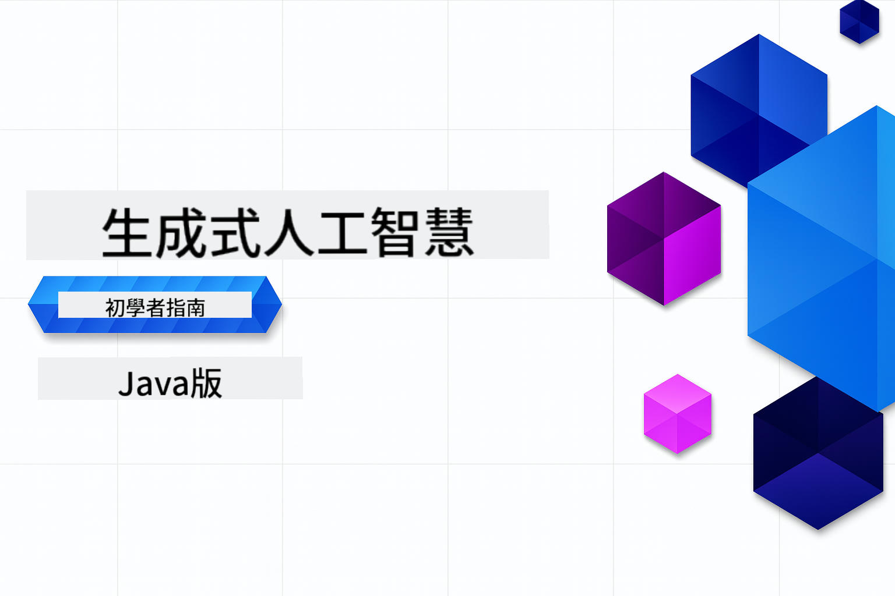

<!--
CO_OP_TRANSLATOR_METADATA:
{
  "original_hash": "459109e7c925f3a7b94440ad61c596a0",
  "translation_date": "2026-01-05T08:59:55+00:00",
  "source_file": "README.md",
  "language_code": "tw"
}
-->
# 生成式 AI 初學者指南 - Java 版
[](https://discord.gg/nTYy5BXMWG)



**時間投入**：整個工作坊可在線完成，無需本機設定。環境設定需 2 分鐘，探索範例需 1-3 小時，視探索深度而定。

> **快速開始**

1. 將此程式庫分叉到您的 GitHub 帳戶
2. 點選 **Code** → **Codespaces** 標籤 → **...** → **New with options...**
3. 使用預設值 – 這將選擇為本課程建立的開發容器
4. 點選 **Create codespace**
5. 等待約 2 分鐘，環境即準備就緒
6. 直接跳至 [第一個範例](./02-SetupDevEnvironment/README.md#step-2-create-a-github-personal-access-token)

> **偏好本機複製？**
>
> 本程式庫包含超過 50 種語言翻譯，會大幅增加下載大小。若要不含翻譯的複製，請使用稀疏結帳：
> ```bash
> git clone --filter=blob:none --sparse https://github.com/microsoft/Generative-AI-for-beginners-java.git
> cd Generative-AI-for-beginners-java
> git sparse-checkout set --no-cone '/*' '!translations' '!translated_images'
> ```
> 這樣可以更快速下載，且包含完成課程所需的一切。


## 多語言支援

### 透過 GitHub Action 支援（自動且持續更新）

<!-- CO-OP TRANSLATOR LANGUAGES TABLE START -->
[阿拉伯語](../ar/README.md) | [孟加拉語](../bn/README.md) | [保加利亞語](../bg/README.md) | [緬甸語](../my/README.md) | [中文（簡體）](../zh/README.md) | [中文（繁體，香港）](../hk/README.md) | [中文（繁體，澳門）](../mo/README.md) | [中文（繁體，台灣）](./README.md) | [克羅埃西亞語](../hr/README.md) | [捷克語](../cs/README.md) | [丹麥語](../da/README.md) | [荷蘭語](../nl/README.md) | [愛沙尼亞語](../et/README.md) | [芬蘭語](../fi/README.md) | [法語](../fr/README.md) | [德語](../de/README.md) | [希臘語](../el/README.md) | [希伯來語](../he/README.md) | [印地語](../hi/README.md) | [匈牙利語](../hu/README.md) | [印尼語](../id/README.md) | [義大利語](../it/README.md) | [日語](../ja/README.md) | [坎那達語](../kn/README.md) | [韓語](../ko/README.md) | [立陶宛語](../lt/README.md) | [馬來語](../ms/README.md) | [馬拉雅拉姆語](../ml/README.md) | [馬拉地語](../mr/README.md) | [尼泊爾語](../ne/README.md) | [奈及利亞皮欽語](../pcm/README.md) | [挪威語](../no/README.md) | [波斯語（法爾西語）](../fa/README.md) | [波蘭語](../pl/README.md) | [葡萄牙語（巴西）](../br/README.md) | [葡萄牙語（葡萄牙）](../pt/README.md) | [旁遮普語（古魯穆奇）](../pa/README.md) | [羅馬尼亞語](../ro/README.md) | [俄語](../ru/README.md) | [塞爾維亞語（西里爾字母）](../sr/README.md) | [斯洛伐克語](../sk/README.md) | [斯洛維尼亞語](../sl/README.md) | [西班牙語](../es/README.md) | [斯瓦希里語](../sw/README.md) | [瑞典語](../sv/README.md) | [他加祿語（菲律賓語）](../tl/README.md) | [泰米爾語](../ta/README.md) | [泰盧固語](../te/README.md) | [泰語](../th/README.md) | [土耳其語](../tr/README.md) | [烏克蘭語](../uk/README.md) | [烏爾都語](../ur/README.md) | [越南語](../vi/README.md)

> **偏好本機複製？**

> 本程式庫包含超過 50 種語言翻譯，會大幅增加下載大小。若要不含翻譯的複製，請使用稀疏結帳：
> ```bash
> git clone --filter=blob:none --sparse https://github.com/microsoft/Generative-AI-for-beginners-java.git
> cd Generative-AI-for-beginners-java
> git sparse-checkout set --no-cone '/*' '!translations' '!translated_images'
> ```
> 這樣可以更快速下載，且包含完成課程所需的一切。
<!-- CO-OP TRANSLATOR LANGUAGES TABLE END -->

## 課程結構與學習路徑

### **第一章：生成式 AI 簡介**
- **核心概念**：認識大型語言模型、詞元、嵌入向量與 AI 能力
- **Java AI 生態系統**：Spring AI 與 OpenAI SDK 簡介
- **模型上下文協議**：介紹 MCP 及其在 AI 代理間通訊的角色
- **實務應用**：包含聊天機器人與內容生成的真實案例
- **[→ 開始第一章](./01-IntroToGenAI/README.md)**

### **第二章：開發環境建置**
- **多平台配置**：設定 GitHub Models、Azure OpenAI 及 OpenAI Java SDK 整合
- **Spring Boot + Spring AI**：企業 AI 應用程式開發最佳實務
- **GitHub Models**：免費 AI 模型供原型與學習（無需信用卡）
- **開發工具**：Docker 容器、VS Code 與 GitHub Codespaces 設定
- **[→ 開始第二章](./02-SetupDevEnvironment/README.md)**

### **第三章：生成式 AI 核心技術**
- **提示工程**：最佳化 AI 模型回應的技巧
- **嵌入向量與向量運算**：實作語意搜尋與相似度匹配
- **檢索增強生成（RAG）**：將 AI 與您的資料來源結合
- **函式呼叫**：透過自訂工具與外掛擴充 AI 功能
- **[→ 開始第三章](./03-CoreGenerativeAITechniques/README.md)**

### **第四章：實務應用與專案**
- **寵物故事產生器**（`petstory/`）：利用 GitHub Models 產生創意內容
- **Foundry 本地示範**（`foundrylocal/`）：本地 AI 模型整合 OpenAI Java SDK
- **MCP 計算服務**（`calculator/`）：使用 Spring AI 實作基本模型上下文協議
- **[→ 開始第四章](./04-PracticalSamples/README.md)**

### **第五章：負責任的 AI 開發**
- **GitHub Models 安全性**：測試內建內容過濾與安全機制（硬阻擋與軟拒絕）
- **負責任 AI 示範**：動手範例展示現代 AI 安全系統如何運作
- **最佳實務**：道德 AI 開發與部署之基本指南
- **[→ 開始第五章](./05-ResponsibleGenAI/README.md)**

## 額外資源

<!-- CO-OP TRANSLATOR OTHER COURSES START -->
### LangChain
[](https://aka.ms/langchain4j-for-beginners)
[](https://aka.ms/langchainjs-for-beginners?WT.mc_id=m365-94501-dwahlin)

---

### Azure / Edge / MCP / Agents
[](https://github.com/microsoft/AZD-for-beginners?WT.mc_id=academic-105485-koreyst)
[](https://github.com/microsoft/edgeai-for-beginners?WT.mc_id=academic-105485-koreyst)
[](https://github.com/microsoft/mcp-for-beginners?WT.mc_id=academic-105485-koreyst)
[](https://github.com/microsoft/ai-agents-for-beginners?WT.mc_id=academic-105485-koreyst)

---
 
### 生成式 AI 系列
[](https://github.com/microsoft/generative-ai-for-beginners?WT.mc_id=academic-105485-koreyst)
[-9333EA?style=for-the-badge&labelColor=E5E7EB&color=9333EA)](https://github.com/microsoft/Generative-AI-for-beginners-dotnet?WT.mc_id=academic-105485-koreyst)
[-C084FC?style=for-the-badge&labelColor=E5E7EB&color=C084FC)](https://github.com/microsoft/generative-ai-for-beginners-java?WT.mc_id=academic-105485-koreyst)
[-E879F9?style=for-the-badge&labelColor=E5E7EB&color=E879F9)](https://github.com/microsoft/generative-ai-with-javascript?WT.mc_id=academic-105485-koreyst)

---
 
### 核心學習資源
[](https://aka.ms/ml-beginners?WT.mc_id=academic-105485-koreyst)
[](https://aka.ms/datascience-beginners?WT.mc_id=academic-105485-koreyst)
[](https://aka.ms/ai-beginners?WT.mc_id=academic-105485-koreyst)
[](https://github.com/microsoft/Security-101?WT.mc_id=academic-96948-sayoung)
[](https://aka.ms/webdev-beginners?WT.mc_id=academic-105485-koreyst)
[](https://aka.ms/iot-beginners?WT.mc_id=academic-105485-koreyst)
[](https://github.com/microsoft/xr-development-for-beginners?WT.mc_id=academic-105485-koreyst)

---
 
### Copilot 系列
[](https://aka.ms/GitHubCopilotAI?WT.mc_id=academic-105485-koreyst)
[](https://github.com/microsoft/mastering-github-copilot-for-dotnet-csharp-developers?WT.mc_id=academic-105485-koreyst)
[](https://github.com/microsoft/CopilotAdventures?WT.mc_id=academic-105485-koreyst)
<!-- CO-OP TRANSLATOR OTHER COURSES END -->

## 尋求協助

如果您遇到困難或對建立 AI 應用程式有任何問題，歡迎加入其他學習者與經驗豐富的開發人員，一同討論 MCP。這是一個支持性的社群，問題歡迎提出，知識自由分享。

[](https://discord.gg/nTYy5BXMWG)

如果您在建構過程中有產品反饋或錯誤，請造訪：

[](https://aka.ms/foundry/forum)

---

<!-- CO-OP TRANSLATOR DISCLAIMER START -->
**免責聲明**：  
本文件係使用 AI 翻譯服務 [Co-op Translator](https://github.com/Azure/co-op-translator) 進行翻譯。雖然我們致力於確保翻譯的準確性，但請注意自動翻譯結果可能包含錯誤或不準確之處。原始文件的母語版本應視為權威來源。對於關鍵資訊，建議採用專業人工翻譯。我們不對因使用本翻譯內容而產生的任何誤解或錯誤詮釋負責。
<!-- CO-OP TRANSLATOR DISCLAIMER END -->