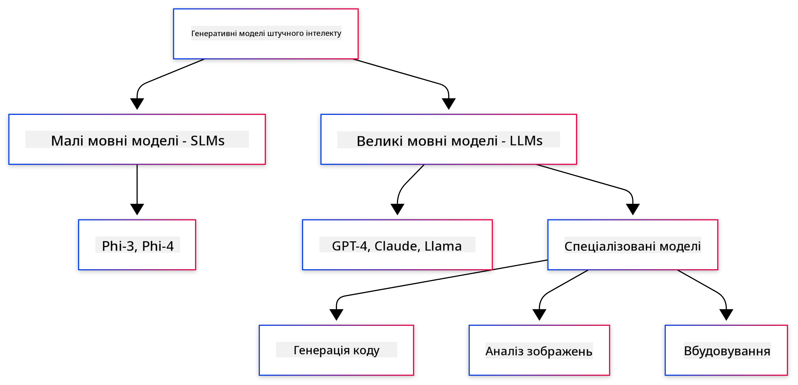
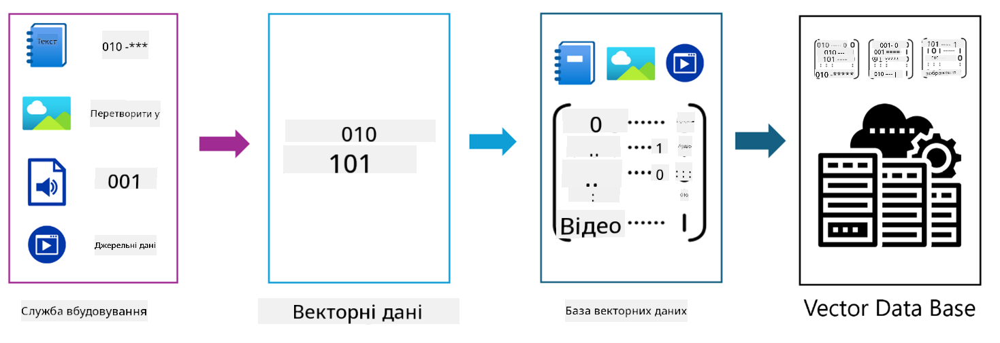
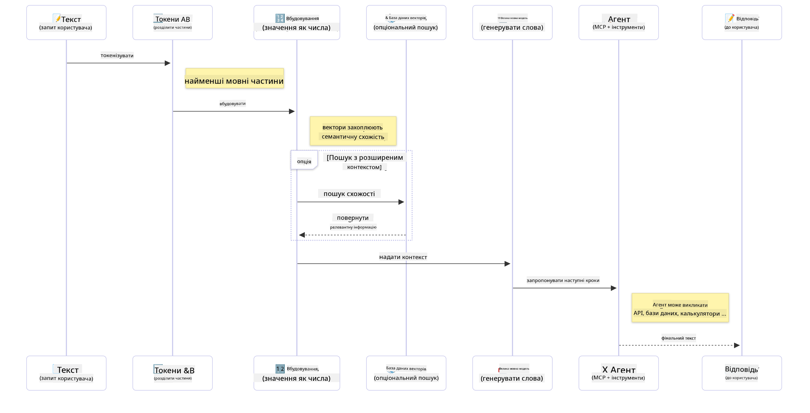

<!--
CO_OP_TRANSLATOR_METADATA:
{
  "original_hash": "75bfb080ca725e8a9aa9c80cae25fba1",
  "translation_date": "2025-07-29T10:32:15+00:00",
  "source_file": "01-IntroToGenAI/README.md",
  "language_code": "uk"
}
-->
# Вступ до Генеративного AI - Java Edition

## Що ви дізнаєтесь

- **Основи генеративного AI**, включаючи LLM, інженерію запитів, токени, вбудовування та векторні бази даних
- **Порівняння інструментів розробки AI для Java**, таких як Azure OpenAI SDK, Spring AI та OpenAI Java SDK
- **Ознайомлення з протоколом Model Context Protocol** та його роллю у комунікації AI-агентів

## Зміст

- [Вступ](../../../01-IntroToGenAI)
- [Коротке оновлення концепцій генеративного AI](../../../01-IntroToGenAI)
- [Огляд інженерії запитів](../../../01-IntroToGenAI)
- [Токени, вбудовування та агенти](../../../01-IntroToGenAI)
- [Інструменти та бібліотеки для розробки AI на Java](../../../01-IntroToGenAI)
  - [OpenAI Java SDK](../../../01-IntroToGenAI)
  - [Spring AI](../../../01-IntroToGenAI)
  - [Azure OpenAI Java SDK](../../../01-IntroToGenAI)
- [Підсумок](../../../01-IntroToGenAI)
- [Наступні кроки](../../../01-IntroToGenAI)

## Вступ

Ласкаво просимо до першого розділу курсу "Генеративний AI для початківців - Java Edition"! Цей базовий урок знайомить вас із ключовими концепціями генеративного AI та тим, як працювати з ними за допомогою Java. Ви дізнаєтесь про основні складові AI-додатків, включаючи великі мовні моделі (LLM), токени, вбудовування та AI-агенти. Ми також розглянемо основні інструменти для Java, які ви будете використовувати протягом цього курсу.

### Коротке оновлення концепцій генеративного AI

Генеративний AI — це тип штучного інтелекту, який створює новий контент, такий як текст, зображення або код, на основі шаблонів і взаємозв’язків, вивчених із даних. Моделі генеративного AI можуть генерувати відповіді, схожі на людські, розуміти контекст і навіть створювати контент, який здається людським.

Розробляючи Java-додатки з AI, ви будете працювати з **генеративними AI-моделями** для створення контенту. Деякі можливості генеративних AI-моделей включають:

- **Генерація тексту**: Створення тексту, схожого на людський, для чат-ботів, контенту та завершення тексту.
- **Генерація та аналіз зображень**: Створення реалістичних зображень, покращення фотографій та виявлення об’єктів.
- **Генерація коду**: Написання фрагментів коду або скриптів.

Існують специфічні типи моделей, оптимізовані для різних завдань. Наприклад, як **малі мовні моделі (SLM)**, так і **великі мовні моделі (LLM)** можуть виконувати генерацію тексту, причому LLM зазвичай забезпечують кращу продуктивність для складних завдань. Для завдань, пов’язаних із зображеннями, використовуються спеціалізовані моделі для роботи з візуальними даними або мультимодальні моделі.

Звісно, відповіді цих моделей не завжди ідеальні. Ви, мабуть, чули про те, як моделі "галюцинують" або генерують неправильну інформацію в авторитетній манері. Але ви можете допомогти моделі створювати кращі відповіді, надаючи їй чіткі інструкції та контекст. Тут вступає в гру **інженерія запитів**.

#### Огляд інженерії запитів

Інженерія запитів — це практика створення ефективних запитів, які спрямовують AI-моделі до бажаних результатів. Вона включає:

- **Чіткість**: Формулювання інструкцій зрозуміло та однозначно.
- **Контекст**: Надання необхідної інформації для розуміння завдання.
- **Обмеження**: Визначення будь-яких обмежень або форматів.

Деякі найкращі практики інженерії запитів включають дизайн запитів, чіткі інструкції, розбиття завдань, навчання на одному або кількох прикладах та налаштування запитів. Тестування різних запитів є важливим для пошуку найкращого підходу для вашого конкретного випадку.

Розробляючи додатки, ви будете працювати з різними типами запитів:
- **Системні запити**: Встановлюють базові правила та контекст для поведінки моделі.
- **Користувацькі запити**: Дані, які вводять користувачі вашого додатка.
- **Запити асистента**: Відповіді моделі на основі системних і користувацьких запитів.

> **Дізнайтеся більше**: Дізнайтеся більше про інженерію запитів у [розділі "Інженерія запитів" курсу GenAI для початківців](https://github.com/microsoft/generative-ai-for-beginners/tree/main/04-prompt-engineering-fundamentals)

#### Токени, вбудовування та агенти

Працюючи з генеративними AI-моделями, ви зустрінете такі терміни, як **токени**, **вбудовування**, **агенти** та **Model Context Protocol (MCP)**. Ось детальний огляд цих концепцій:

- **Токени**: Токени — це найменші одиниці тексту в моделі. Вони можуть бути словами, символами або підсловами. Токени використовуються для представлення текстових даних у форматі, який модель може зрозуміти. Наприклад, речення "The quick brown fox jumped over the lazy dog" може бути токенізоване як ["The", " quick", " brown", " fox", " jumped", " over", " the", " lazy", " dog"] або ["The", " qu", "ick", " br", "own", " fox", " jump", "ed", " over", " the", " la", "zy", " dog"] залежно від стратегії токенізації.

Токенізація — це процес розбиття тексту на ці менші одиниці. Це важливо, оскільки моделі працюють із токенами, а не з необробленим текстом. Кількість токенів у запиті впливає на довжину та якість відповіді моделі, оскільки моделі мають обмеження на кількість токенів у контекстному вікні (наприклад, 128K токенів для загального контексту GPT-4o, включаючи введення та виведення).

  У Java ви можете використовувати бібліотеки, такі як OpenAI SDK, для автоматичного оброблення токенізації під час надсилання запитів до AI-моделей.

- **Вбудовування**: Вбудовування — це векторні представлення токенів, які передають семантичне значення. Це числові представлення (зазвичай масиви чисел із плаваючою точкою), які дозволяють моделям розуміти взаємозв’язки між словами та генерувати контекстуально релевантні відповіді. Схожі слова мають схожі вбудовування, що дозволяє моделі розуміти такі поняття, як синоніми та семантичні взаємозв’язки.

  У Java ви можете створювати вбудовування за допомогою OpenAI SDK або інших бібліотек, які підтримують генерацію вбудовувань. Ці вбудовування є важливими для завдань, таких як семантичний пошук, де потрібно знайти схожий контент на основі значення, а не точного текстового збігу.

- **Векторні бази даних**: Векторні бази даних — це спеціалізовані системи зберігання, оптимізовані для вбудовувань. Вони забезпечують ефективний пошук за схожістю та є ключовими для шаблонів генерації з доповненням пошуку (RAG), де потрібно знайти релевантну інформацію з великих наборів даних на основі семантичної схожості, а не точних збігів.

> **Примітка**: У цьому курсі ми не будемо детально розглядати векторні бази даних, але вважаємо, що вони заслуговують на згадку, оскільки часто використовуються в реальних додатках.

- **Агенти та MCP**: AI-компоненти, які автономно взаємодіють із моделями, інструментами та зовнішніми системами. Протокол Model Context Protocol (MCP) забезпечує стандартизований спосіб для агентів безпечно отримувати доступ до зовнішніх джерел даних та інструментів. Дізнайтеся більше у нашому [курсі MCP для початківців](https://github.com/microsoft/mcp-for-beginners).

У Java-додатках з AI ви будете використовувати токени для обробки тексту, вбудовування для семантичного пошуку та RAG, векторні бази даних для отримання даних, а також агентів із MCP для створення інтелектуальних систем, що використовують інструменти.

### Інструменти та бібліотеки для розробки AI на Java

Java пропонує чудові інструменти для розробки AI. Є три основні бібліотеки, які ми розглянемо протягом цього курсу: OpenAI Java SDK, Azure OpenAI SDK та Spring AI.

Ось коротка таблиця, яка показує, який SDK використовується в прикладах кожного розділу:

| Розділ | Приклад | SDK |
|---------|--------|-----|
| 02-SetupDevEnvironment | github-models | OpenAI Java SDK |
| 02-SetupDevEnvironment | basic-chat-azure | Spring AI Azure OpenAI |
| 03-CoreGenerativeAITechniques | examples | Azure OpenAI SDK |
| 04-PracticalSamples | petstory | OpenAI Java SDK |
| 04-PracticalSamples | foundrylocal | OpenAI Java SDK |
| 04-PracticalSamples | calculator | Spring AI MCP SDK + LangChain4j |

**Посилання на документацію SDK:**
- [Azure OpenAI Java SDK](https://github.com/Azure/azure-sdk-for-java/tree/azure-ai-openai_1.0.0-beta.16/sdk/openai/azure-ai-openai)
- [Spring AI](https://docs.spring.io/spring-ai/reference/)
- [OpenAI Java SDK](https://github.com/openai/openai-java)
- [LangChain4j](https://docs.langchain4j.dev/)

#### OpenAI Java SDK

OpenAI SDK — це офіційна Java-бібліотека для API OpenAI. Вона забезпечує простий і послідовний інтерфейс для взаємодії з моделями OpenAI, що робить інтеграцію AI-можливостей у Java-додатки легкою. Приклад "GitHub Models" у розділі 2, додаток "Pet Story" у розділі 4 та приклад "Foundry Local" демонструють підхід OpenAI SDK.

#### Spring AI

Spring AI — це комплексний фреймворк, який додає AI-можливості до Spring-додатків, забезпечуючи послідовний рівень абстракції для різних AI-постачальників. Він інтегрується з екосистемою Spring, що робить його ідеальним вибором для корпоративних Java-додатків, які потребують AI-можливостей.

Сила Spring AI полягає в його безшовній інтеграції з екосистемою Spring, що дозволяє легко створювати готові до виробництва AI-додатки з використанням знайомих шаблонів Spring, таких як впровадження залежностей, управління конфігурацією та тестувальні фреймворки. Ви будете використовувати Spring AI у розділах 2 та 4 для створення додатків, які використовують як OpenAI, так і бібліотеки Model Context Protocol (MCP) Spring AI.

##### Протокол Model Context Protocol (MCP)

[Model Context Protocol (MCP)](https://modelcontextprotocol.io/) — це новий стандарт, який дозволяє AI-додаткам безпечно взаємодіяти із зовнішніми джерелами даних та інструментами. MCP забезпечує стандартизований спосіб для AI-моделей отримувати контекстну інформацію та виконувати дії у ваших додатках.

У розділі 4 ви створите простий сервіс калькулятора MCP, який демонструє основи протоколу Model Context Protocol із Spring AI, показуючи, як створювати базові інтеграції інструментів та архітектури сервісів.

#### Azure OpenAI Java SDK

Клієнтська бібліотека Azure OpenAI для Java — це адаптація REST API OpenAI, яка забезпечує ідіоматичний інтерфейс та інтеграцію з рештою екосистеми Azure SDK. У розділі 3 ви створите додатки, використовуючи Azure OpenAI SDK, включаючи чат-додатки, виклик функцій та шаблони генерації з доповненням пошуку (RAG).

> Примітка: Azure OpenAI SDK відстає від OpenAI Java SDK за функціональністю, тому для майбутніх проєктів рекомендується використовувати OpenAI Java SDK.

## Підсумок

На цьому завершуємо основи! Тепер ви розумієте:

- Основні концепції генеративного AI — від LLM та інженерії запитів до токенів, вбудовувань та векторних баз даних
- Варіанти інструментів для розробки AI на Java: Azure OpenAI SDK, Spring AI та OpenAI Java SDK
- Що таке протокол Model Context Protocol і як він дозволяє AI-агентам працювати із зовнішніми інструментами

## Наступні кроки

[Розділ 2: Налаштування середовища розробки](../02-SetupDevEnvironment/README.md)

**Відмова від відповідальності**:  
Цей документ було перекладено за допомогою сервісу автоматичного перекладу [Co-op Translator](https://github.com/Azure/co-op-translator). Хоча ми прагнемо до точності, звертаємо вашу увагу, що автоматичні переклади можуть містити помилки або неточності. Оригінальний документ мовою оригіналу слід вважати авторитетним джерелом. Для критично важливої інформації рекомендується професійний людський переклад. Ми не несемо відповідальності за будь-які непорозуміння або неправильні тлумачення, що виникли внаслідок використання цього перекладу.